<!--yml
category: 游戏
date: 2023-09-17 14:54:11
-->

# 基于OpenCV的跳一跳外挂实现原理_wx5aae83353cec4的技术博客_51CTO博客

> 来源：[https://blog.51cto.com/u_13657808/5976845](https://blog.51cto.com/u_13657808/5976845)

最近，微信跳一跳小游戏迅速走红并且在朋友圈刷屏，游戏的规则很简单，就是控制一个小矮子再各个墩子上跳来跳去。由于游戏比较简单，一时间大家都玩起来了，这也带动了一些作弊的产生。Android和iOS的小程序都可以刷分，如果想要刷分，可以参考下面这个开源项目：​[​Python刷分​](https://zhuanlan.zhihu.com/p/32452473)​。


今天要给大家讲的是如何使用OpenCV来给Android小程序刷分。

其实，刷分的思路都是一致的：通过Android手机的ADB来截取屏幕，然后通过对截图进行分析，算出来玩家与下一个落脚点的距离，然后通过距离算出来需要按压多长时间的屏幕，之后再通过发送ADB指令来模拟按下屏幕达到自动刷分的目的。也就是说，这个外挂的核心就是取得玩家与下一个落脚点的距离，有了距离之后，一切都好说了。

## OpenCV简介

OpenCV熟悉编程的人一定知道，是一个著名的开源计算机视觉库，实现了图像处理和计算机视觉方面的很多通用算法。要想在Python上运行OpenCV只需要使用pip安装就好，在Terminal中执行pip install opencv-python即可。OpenCV的官网地址为：​[​https://opencv.org/​](https://opencv.org/)​。

使用OpenCV时一般是用于分析图片灰度图，因为我这里需要画框划线进行标记，所以为了方便就直接读RGB彩图了，这样因为一个像素三个通道所以会慢一点，之后投入使用直接分析灰度图就好。

## 实践

下面就来看看如何使用OpenCV来完成Android的跳一跳如何刷分吧。

### 1，玩家位置识别

首先需要做的就是识别玩家的位置，玩家的形状不变，是一个紫色的棋子，那么可以使用OpenCV带有的图像模板匹配来找出玩家的位置。首先来一个图片，如下：

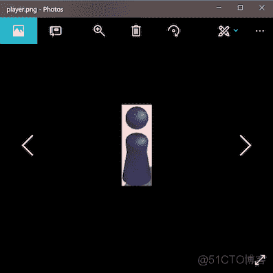

然后就可以使用Python读取了，对于游戏场景，我们使用下图为例，名字为1.png。

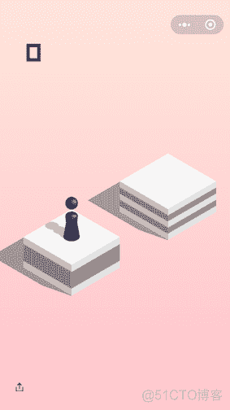

#### 1.1图像模板匹配

在OpenCV中调用matchTemplate函数即可实现模板匹配。

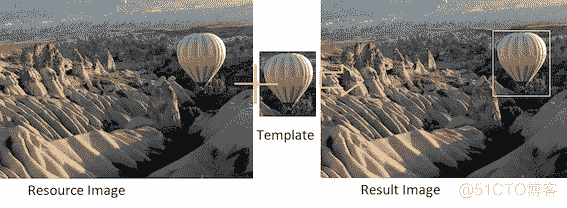

相关的代码如下：

```
import cv2 as cv

img = cv.imread("1.png")
player_template = cv.imread('player.png')
player = cv.matchTemplate(img, player_template, cv.TM_CCOEFF_NORMED)

min_val, max_val, min_loc, max_loc = cv.minMaxLoc(player)
```

通过调用上面的代码即可进行模板匹配，最后一行的max_loc则是匹配出来的位置，因为玩家是一个宽度50高度150像素的图形（在我的iPhone 6s上）。所以再添加以下代码来框出玩家位置。并且画出了玩家的点。

```
corner_loc = (max_loc[0] + 50, max_loc[1] + 150)
player_spot = (max_loc[0] + 25, max_loc[1] + 150)
cv.circle(img, player_spot, 10, (0, 255, 255), -1)
cv.rectangle(img, max_loc, corner_loc, (0, 0, 255), 5)
cv.namedWindow('img', cv.WINDOW_KEEPRATIO)
cv.imshow("img", img)
cv.waitKey(0)
```

之后再运行，这时会打开一张片，可以看见玩家的位置已经被识别出来了。

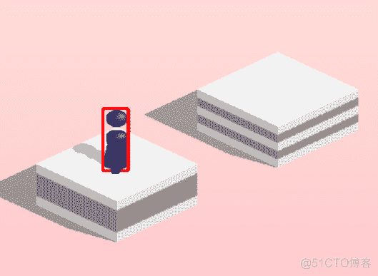

### 2，落脚点识别

接下来就要识别落脚点了，但是蹲蹲千变万化，有方形的，有圆形的。所以刚才的模板识别就用不上了，即使使用的话成功率也很低，这个时候就需要用到边缘检测了。

#### 2.1 Canny边缘检测

OpenCV带有Canny算法的实现来帮助我们得到图形的边缘。在做边缘检测之前首先需要对图片进行高斯模糊处理，高斯模糊主要作用就是去除噪声。因为噪声也集中于高频信号，很容易被识别为边缘。高斯模糊可以降低伪边缘的识别。但是由于图像边缘信息也是高频信号，高斯模糊的半径选择很重要，过大的半径很容易让一些弱边缘检测不到。

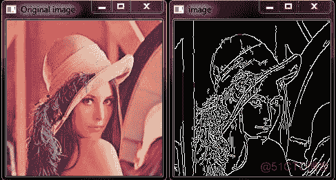

例如，下面是示例代码：

```
img_blur = cv.GaussianBlur(img, (5, 5), 0) #高斯模糊
canny_img = cv.Canny(img_blur, 1, 10) #边缘检测
cv.namedWindow('img', cv.WINDOW_KEEPRATIO)
cv.imshow("img", canny_img)
```

然后图片就会被边缘识别，这个图是灰度图，每一个像素是 0-255之间任意一个值，黑色为0白色为255。

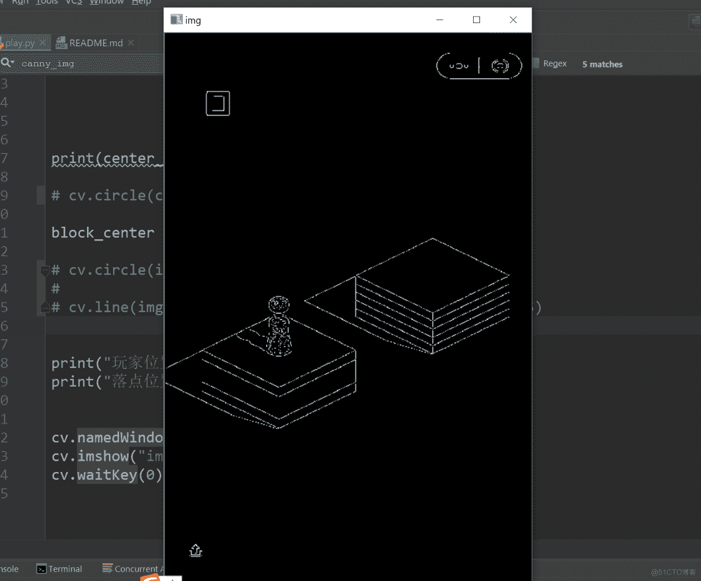

#### 2.2图片切片

其实现在我们已经可以开始分析边缘来找到下一个落脚点了，但是图片中边缘实在是太多，可以通过裁切图片来，首先要知道，下一个落脚点肯定是在整个界面的上1/2。也就是说，图片的下半段可以不要，而且，上面的记分牌也没有任何用处。

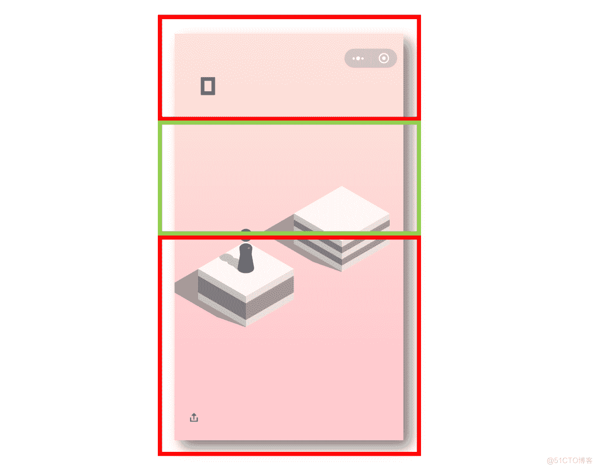

执行以下代码来切除上面的300像素的高度加下半部分图片：

```
height, width = canny_img.shape
crop_img = canny_img[300:int(height/2), 0:width]
cv.namedWindow('img', cv.WINDOW_KEEPRATIO)
cv.imshow("img", crop_img)
```

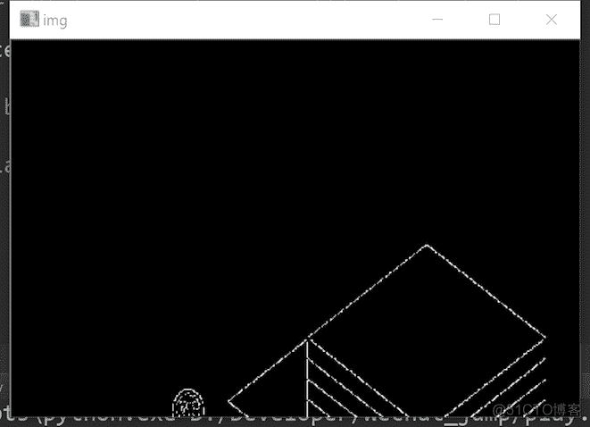

#### 2.3消除玩家图片

但是有一点还是很烦，上图的左下角还有一部分玩家的头部，有时候如果玩家需要向左上角跳，这个头的存在可能会造成一定的干扰，所以需要写代码消除它，因为我们已经知道了玩家的坐标了，所以把那个范围的像素全设成0就好了。

```
for y in range(max_loc[1], max_loc[1]+150):
    for x in range(max_loc[0], max_loc[0]+50):
        canny_img[y][x] = 0
```

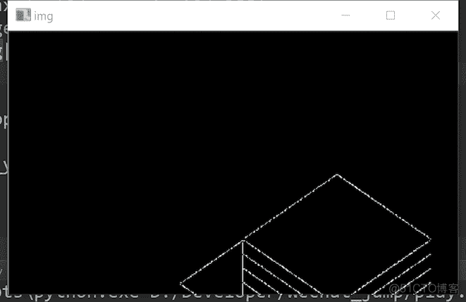

#### 2.4落脚点判断

现在只剩下敦敦的边缘了，现在需要得到他的中心点，仔细观察这个图形，发现他是一个菱形，并且有两个点是很容易通过遍历像素点然后分析得到的。

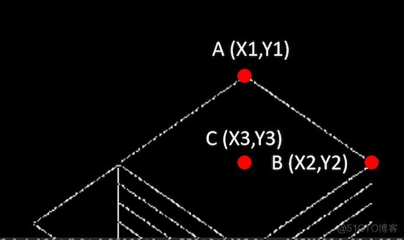

A点B点是很容易得到的，通过由上到下，由左到右遍历全部像素，A点应该是便利顺序的像素中第一个值为255的点，B点是便利顺序中第一次横坐标最大的点。得到了A,B点的坐标，整个形状的中点 （X3， Y3）其实就是 （X1，Y2）。

可以通过如下代码来判断中心点：

```
crop_h, crop_w = crop_img.shape
center_x, center_y = 0, 0

max_x = 0

for y in range(crop_h):
    for x in range(crop_w):
        if crop_img[y, x] == 255:
            if center_x == 0:
                center_x = x
            if x > max_x:
                center_y = y
                max_x = x

cv.circle(crop_img, (center_x, center_y), 10, 255, -1)

cv.namedWindow('img', cv.WINDOW_KEEPRATIO)
cv.imshow("img", crop_img)
cv.waitKey(0)
```

执行上面的代码，发现程序已经标出了中心点：

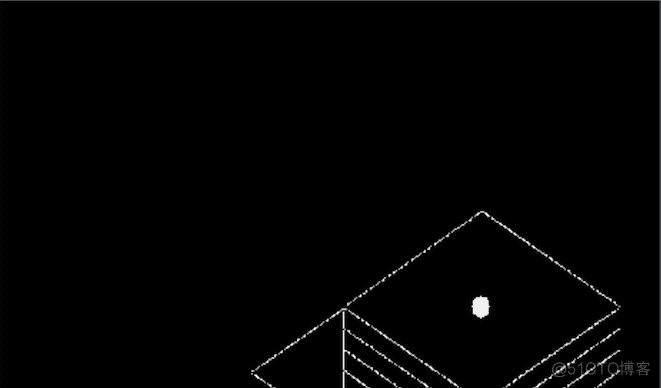

### 运行效果

好了，看一下运行的效果吧。

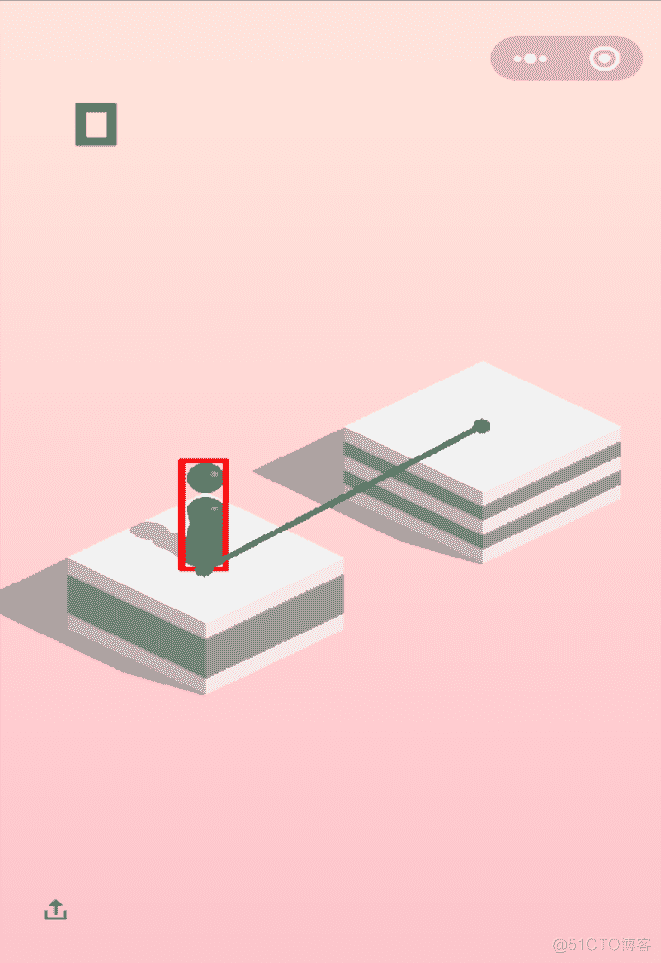

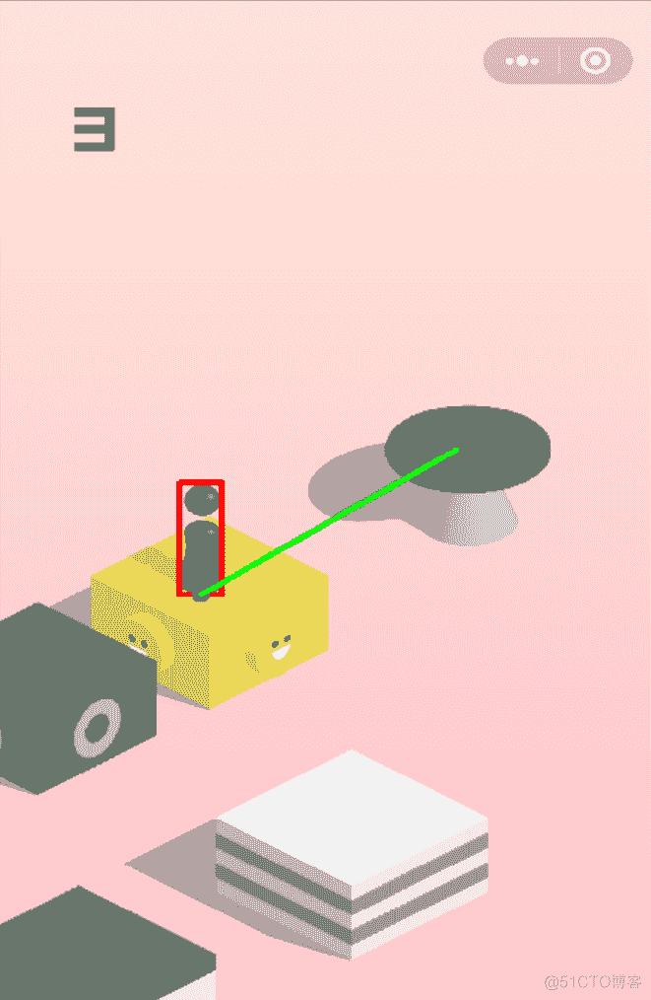

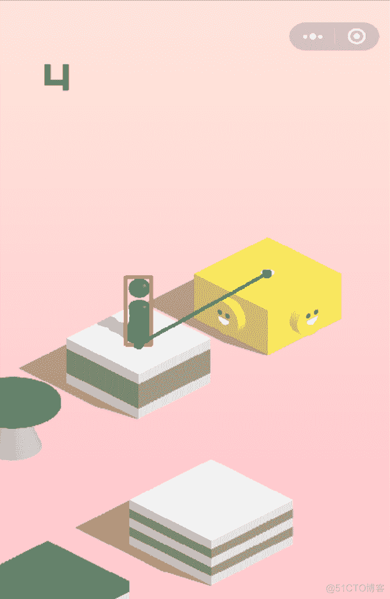

其实，细心的读者可以发现，图片的中心并非处于绝对的中心位置，大家可以在源码的基础上修改参数的值。