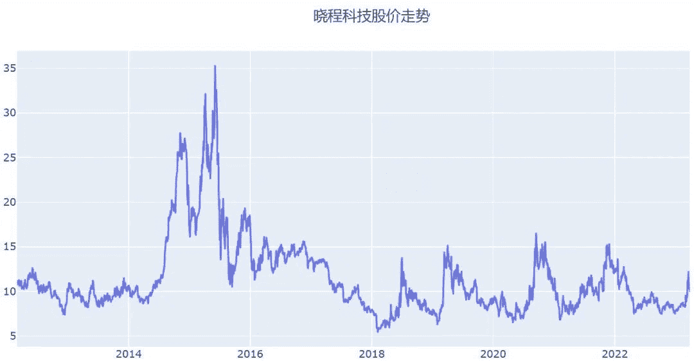
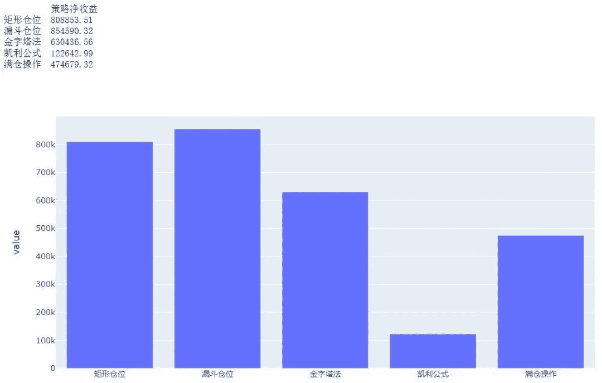
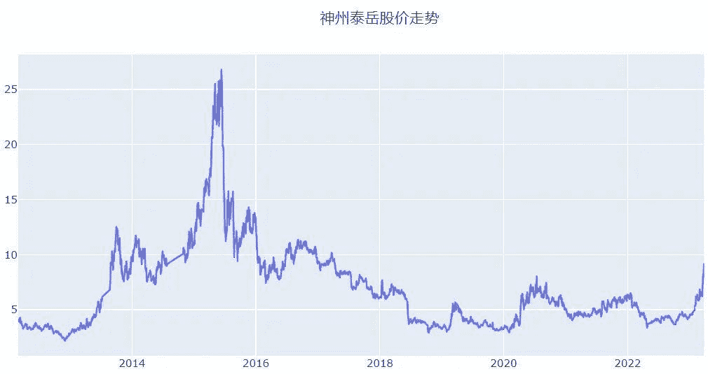
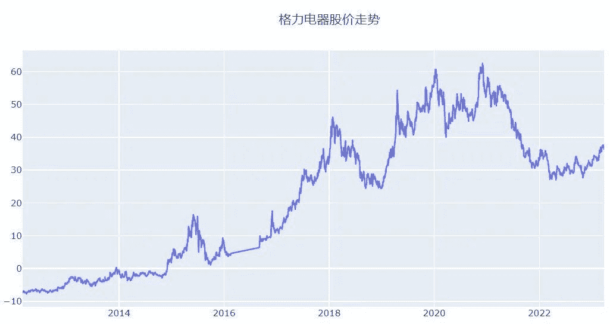
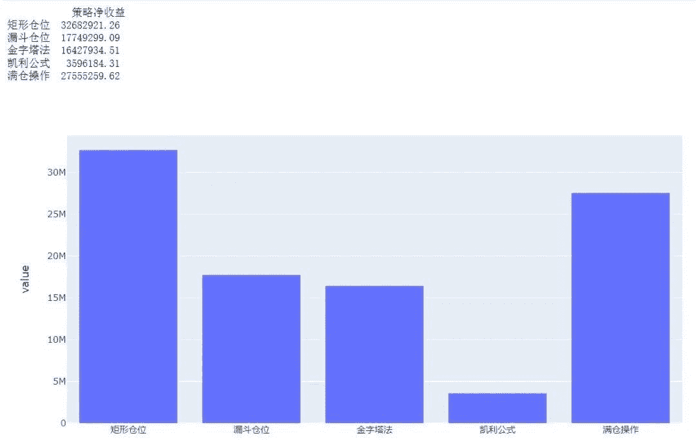
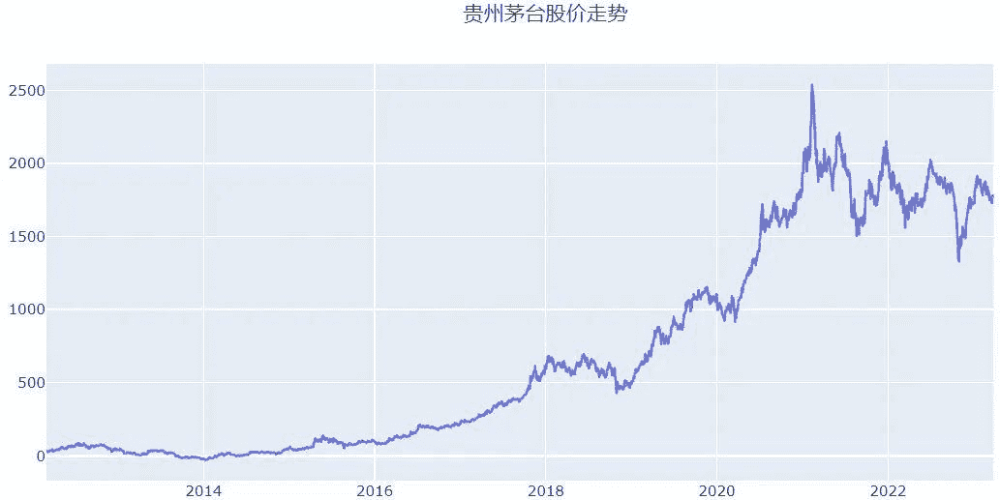

<!--yml
category: 交易
date: 2023-09-17 20:09:50
-->

# 基于backtrader的仓位管理量化回测 - 知乎

> 来源：[https://zhuanlan.zhihu.com/p/626772961](https://zhuanlan.zhihu.com/p/626772961)

## **常用的仓位管理方法**

仓位管理方法是交易策略中的关键组成部分，用于确定在特定交易中应投入的资金数量。以下是一些常见的仓位管理方法：

**固定金额法**。在这种方法中，每次交易投入固定金额的资金。这种方法简单易行，但可能不够灵活，无法根据市场情况和交易者的风险承受能力进行调整。

**固定比例法**。每次交易投入账户总资金的固定百分比。这种方法使得随着账户价值的增长或减少，交易仓位大小也会相应调整。

**凯利公式。**凯利公式在仓位管理上很有名气，根据交易胜率和赔率比来确定每次交易的最佳仓位。通过使用凯利公式，交易者可以在最大化期望收益的同时控制风险。

**矩形仓位管理法。**将仓位等分，每一份仓位都是同等金额，如三等分、五等分或十等分。这种方法适合震荡市场，可以降低成本并分摊风险。

**漏斗形仓位管理法。**将仓位由少及多依次分成几份，如10%、15%、20%、25%和30%。这种方法适合长时间的下跌行情，在下跌初期先用较小仓位建仓，随着市场的进一步下探再逐步提升加仓力度。

**金字塔仓位管理法。**与漏斗形仓位管理法相反，这种方法是在建仓时资金量投入较大，后面的加仓比例逐渐缩小。适合确定的上涨行情，在已经形成上升趋势的时候介入，顺势而为获得利润。

**波动率调整法。**根据市场波动率来调整仓位。在波动率较高的市场中，交易者可能会减少仓位以降低风险；在波动率较低的市场中，可能会增加仓位以提高收益。

**ATR（平均真实波动范围）仓位管理**。使用ATR指标来调整交易仓位。当ATR较高时，交易者可能减少仓位以降低风险；当ATR较低时，可能会增加仓位。

## **如何选择合适的仓位管理方法？**

每种仓位管理方法都有其优缺点。交易者应根据自己的交易目标、风险承受能力和市场状况来选择最适合自己的仓位管理方法。不同的交易策略可能在不同的市场环境下表现出不同的特点。在选择仓位管理方法时，应首先**分析你的交易策略，了解它在不同市场情况下的表现**。

**评估风险承受能力**。你的风险承受能力决定了你在交易中愿意承担多大的风险。根据你的风险承受能力，选择一个合适的仓位管理方法，以平衡收益与风险。

**考虑市场环境**。不同的市场环境可能需要不同的仓位管理方法。在震荡市场中，矩形仓位管理法可能较为合适；在上升趋势中，金字塔仓位管理法可能更适用；在下跌行情中，漏斗形仓位管理法可能表现更佳。

**考虑资金规模。**在选择仓位管理方法时，还需要考虑你的账户资金规模。对于较小规模的资金，固定金额法或固定比例法可能较为合适；对于较大规模的资金，波动率调整法或ATR仓位管理可能更为适用。

**进行回测**。在实际应用仓位管理方法之前，进行历史数据回测以评估策略在不同市场环境下的表现。回测可以帮助你找到最适合你的仓位管理方法，并识别可能存在的问题。

下面基于backtrader对几种常用的仓位管理方法进行量化回测和对比分析。

## **backtrader回测结果分析**

下面使用qstock获取交易数据，基于backtrader回测框架，使用最简单的双均线交易策略，分别以晓程科技、神州泰岳、格力电器和贵州茅台为标的进行量化回测，简单比较不同仓位管理下的收益情况。知识星球会员可在Python金融量化知识星球上获取完整代码。

backtrader初始资金设置为1000万，主要是为了方便贵州茅台和格力电器的回测，后复权价格比较大，资金少的话回测结果无法正常体现。首先来看下晓程科技，个股基本面比较差，属于投机性个股，波动非常大。基于双均线交易策略在回测期间可获得正向收益，其中漏斗型仓位管理方法相比其他方法收益最大。

神州泰岳股价走势与晓程科技有点类似，均属于创业板的投机性个股，近期以chatgpt概念兴起的人工智能和游戏概念一直火爆带动该股短期暴涨。回测结果显示，该股采用凯利公式法进行仓位管理表现最好。

格力电器和贵州茅台均属于价值投资股，从股价走势来看，二者均经历长期的上涨趋势。回测结果显示，格力电器和贵州茅台采用矩形仓位管理比其他方法收益更高。

从上述回测结果可见，没有一种仓位管理方法能够在所有情况下都表现出色。其中矩形仓位管理方法在几种样本回测中表现均较好，凯利公式只有对于神州泰岳这样的个股才表现优异。在A股市场中，个人散户在量化投资方面的仓位管理需要明确自己的投资目标和风险承受能力，选择合适的仓位管理方法并进行资金分散（当然资金太少的话仓位管理的意义不是很大）。同时，遵循市场趋势进行适时调整，严格执行止损策略，定期评估策略表现。