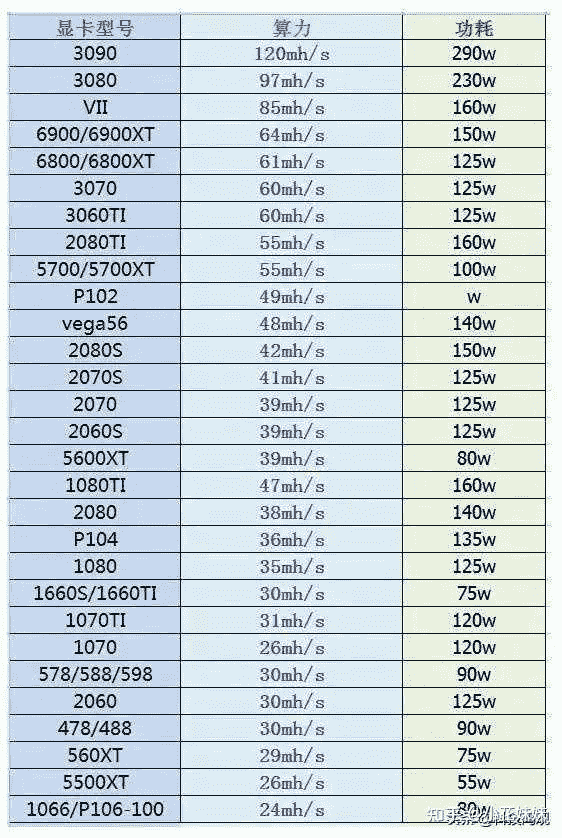

<!--yml
category: 挖矿
date: 2022-06-26 00:00:00
-->

# 如今矿场已经拆除了，为啥带锁的显卡还居高不下呢？

> 原文：[https://www.zhihu.com/question/472895208/answer/2054982055](https://www.zhihu.com/question/472895208/answer/2054982055)

 目前的价格来说，**未锁算力显卡的二手价格已经远超锁算力显卡全新价格**。市场正在朝着比较健康的方向发展。

但是关键点就是锁算力显卡针对ETH的哈希值只锁了一半。这就值得品味一下了。以目前的价格**举例说明：**

3060锁算力显卡价格：2999元，算力为24左右，目前的ETH单价为0.5元左右。也就是锁算力显卡每天挖矿收入12元，电费1元。回本周期大约是2999/11=272天

对于大部分未锁算力显卡的回本周期，大约也维持在200-250天左右。

那么为什么现在锁算力显卡又涨价了呢？因为3060“破解了又没完全破解”

3060破解后算力大约维持在36左右，并没有达到完全破解的48算力。回本周期3999/18=222天。**所以虽然绕的云里雾绕，但是价格基本上符合市场规律。**

**其他型号的显卡你们就根据算力价格自己算回本周期吧。**

个人推荐比较具有性价比的是3060TI和3070TI

然而，最近不甘心的矿工又研究出了一个可以绕过低哈希算力让锁算力显卡也能挖矿的新币，目前还没有什么大量算力涌入，所以锁算力显卡后续怎么发展谁也不好说。

**挖 矿 专 场**丨[挖矿教程](https://zhuanlan.zhihu.com/p/355955385)丨 [笔本挖矿](https://zhuanlan.zhihu.com/p/360451565)丨[挖矿毁显卡吗](https://zhuanlan.zhihu.com/p/358944242)丨[矿卡也质保](https://zhuanlan.zhihu.com/p/386391253)丨

**锁 算 专 场**丨[锁算卡挖矿](https://zhuanlan.zhihu.com/p/398651881)丨[RVN和ERGO教程](https://zhuanlan.zhihu.com/p/402971584)丨[锁算卡挑选](https://zhuanlan.zhihu.com/p/374342633)丨[挖矿知识点合集](https://www.zhihu.com/question/461044682/answer/1994951468)

**笔记本专场**丨[满血版笔记本怎么挑](https://zhuanlan.zhihu.com/p/374748213)丨[买3060还是70本](https://www.zhihu.com/question/447817962/answer/1909204347)丨[蛟龙7测评](https://zhuanlan.zhihu.com/p/369226521)丨