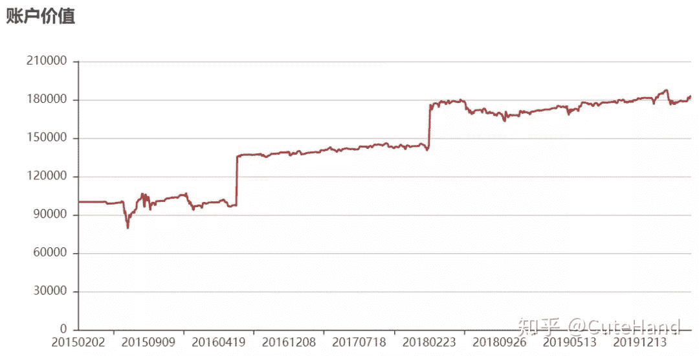
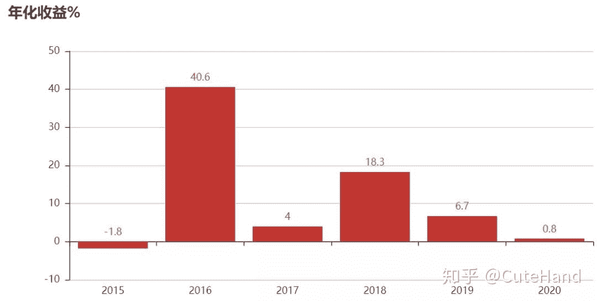
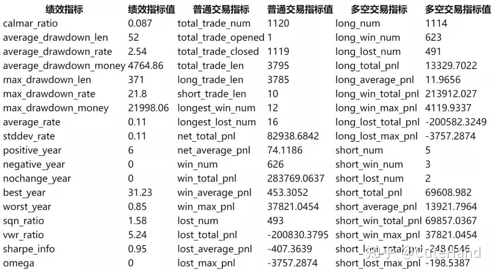

<!--yml
category: 交易
date: 2023-09-17 20:11:04
-->

# 如何用backtrader对股票组合进行量化回测？ - 知乎

> 来源：[https://zhuanlan.zhihu.com/p/144390882](https://zhuanlan.zhihu.com/p/144390882)

**01引言**

backtrader是功能非常强大的量化回测框架之一，得到欧洲很多银行、基金等金融机构的青睐，并应用于实盘交易中。公众号Python金融量化针对backtrader的入门和应用已连续发布了四篇推文：《[【手把手教你】入门量化回测最强神器backtrader（一）](https://link.zhihu.com/?target=http%3A//mp.weixin.qq.com/s%3F__biz%3DMzUyMDk1MDY2MQ%3D%3D%26mid%3D2247484803%26idx%3D1%26sn%3D59502204fb39d150c98e9951a1614ec0%26chksm%3Df9e3c369ce944a7f9f8e83a7fc4aa9b1450ec98a41eefffda3158f75f824af88117f85be69ca%26scene%3D21%23wechat_redirect)》、《[【手把手教你】入门量化回测最强神器backtrader（二）](https://link.zhihu.com/?target=http%3A//mp.weixin.qq.com/s%3F__biz%3DMzUyMDk1MDY2MQ%3D%3D%26mid%3D2247484807%26idx%3D1%26sn%3D6eac4a86ee0e0f2ec06f5dfb4c9192a2%26chksm%3Df9e3c36dce944a7b67986f0b8adef4b0fc02bdcb6d88bdd33662ef9c2e713262dc60477523fe%26scene%3D21%23wechat_redirect)》、《[【手把手教你】入门量化回测最强神器backtrader（三）](https://link.zhihu.com/?target=http%3A//mp.weixin.qq.com/s%3F__biz%3DMzUyMDk1MDY2MQ%3D%3D%26mid%3D2247484821%26idx%3D1%26sn%3D21df9cef8351529ac9712fc0c61dc5df%26chksm%3Df9e3c37fce944a69b193aac92f21f3c214b7454881a90edf111627637ac5f21942775171b92d%26scene%3D21%23wechat_redirect)》和《[backtrader如何加载股票因子数据？以换手率、市盈率为例进行回测【附Python代码】](https://link.zhihu.com/?target=http%3A//mp.weixin.qq.com/s%3F__biz%3DMzUyMDk1MDY2MQ%3D%3D%26mid%3D2247484832%26idx%3D1%26sn%3D9d282abb397a4459c7b2a372d635cfb8%26chksm%3Df9e3c34ace944a5c85070e7289812ca8b87c4003f190da336a2f831c74de263b1d65d54c46e5%26scene%3D21%23wechat_redirect)》**，**分别介绍了backtrader整个框架的组成部分、回测系统的运行，策略模块交易日志的编写、策略参数的寻优，Analyzers模块的分析、策略业绩评价指标可视化分析以及扩张数据加载模块对市盈率因子进行回测等。上述文章有一个共同点是回测实例均以个股为交易标的，那么如何对股票组合进行回测呢？本文将**重点介绍如何加载多只股票数据，并构建交易组合进行量化回测**。

**02 股票组合回测实例**

**数据获取**

第一步是数据获取和加载，A股数据个人一般使用tushare来获取，由于对多只股频繁获取容易出现接口报错，因此个人在本地搭建了一个股票数据库（关于数据库搭建请参照：《[【手把手教你】Python面向对象编程入门及股票数据管理应用实例](https://link.zhihu.com/?target=http%3A//mp.weixin.qq.com/s%3F__biz%3DMzUyMDk1MDY2MQ%3D%3D%26mid%3D2247484675%26idx%3D1%26sn%3D358adcd9df64874df7cdff3433a16d0e%26chksm%3Df9e3c3e9ce944affec7937788b02c4af4cbc90c5eb42c22cd0d5d9a3b125c9d22cc0e8e5cf43%26scene%3D21%23wechat_redirect)》）。注意，下面导入的update_sql和base是自己写的本地脚本，使用自己数据运行时请将其注释掉。

```
import backtrader as bt
import pandas as pd
#以下引入脚本是个人的数据库文件，导入其他数据请注释掉
from update_sql import update_sql
#更新数据库
update_sql(table_name='daily_data')

from base import sql_engine,ts_pro
pro=ts_pro()
engine = sql_engine()
def get_data(code):
    sql=f"select * from daily_data where trade_date>'20150201' and ts_code='{code}'"
    data=pd.read_sql(sql,engine)
    data=data.sort_values('trade_date')
    #前复权
    data['adjclose']=(data.close*data.adj_factor/data.adj_factor.iloc[-1]).values
    data['adjvol']=(data.vol*data.adj_factor/data.adj_factor.iloc[-1]).values
    data['adjopen']=(data.open*data.adj_factor/data.adj_factor.iloc[-1]).values
    data['adjhigh']=(data.high*data.adj_factor/data.adj_factor.iloc[-1]).values
    data['adjlow']=(data.low*data.adj_factor/data.adj_factor.iloc[-1]).values

    data=data[['trade_date','adjopen','adjhigh','adjlow','adjclose','adjvol']]
    n1=['open','high','low','close','volume']
    n2=['adjopen','adjhigh','adjlow','adjclose','adjvol']
    data.rename(columns=dict(zip(n2,n1)),inplace=True)
    data.index=pd.to_datetime(data.trade_date)
    data=data.sort_index()
    data['openinterest']=0
    data['datetime']=data.index
    data=data[['datetime','open','high','low','close','volume']]
    return data

如果不会搭建数据库，也可以使用tushare pro直接在线获取数据，并转化为backtrader能接受的数据格式。

import tushare as ts
#tushare pro需到官网注册并获取token才能用
token='输入你的token'
pro=ts.pro_api(token)def get_data2(code,date='20150101'):
    data=ts.pro_bar(ts_code=code, adj='qfq', start_date=date)
    data.index=pd.to_datetime(data.trade_date)
    data=data.sort_index()
    data['volume']=data.vol
    data['openinterest']=0
    data['datetime']=pd.to_datetime(data.trade_date)
    data=data[['datetime','open','high','low','close','volume','openinterest']]
    data=data.fillna(0)
    return data

由于A股全市场有三千多只股票，如果对所有股票进行遍历构建交易策略，
Python循环起来会非常慢。为了节省时间，下面先对市场个股进行一次筛选，
根据个人偏好，通过条件设置过滤掉大部分股票。

def get_code_list(date='20150202'):
    #默认2010年开始回测
    dd=pro.daily_basic(trade_date=date)
    x1=dd.close<100
    #流通市值低于300亿大于50亿
    x2=dd.circ_mv>500000
    x3=dd.circ_mv<3000000
    #市盈率低于80
    x4=dd.pe_ttm<80
    #股息率大于2%
    x5=dd.dv_ttm>3
    x=x1&x2&x3&x4&x5
    stock_list=dd[x].ts_code.values
    return stock_list

通过价格、市值、市盈率和股息率指标的设置，选择了24只个股进行量化回测。
len(get_code_list())

24
```

## **策略编写**

下面以一个简单的“动量+趋势跟踪”策略作为示例。策略思路为：计算24只股票过去30日的收益率并进行排序，选择前10只股票加入选股池（动量），逐日滚动计算和判断：如果选股池中某只个股满足股价位于20均线以上且没有持仓时买入（以20日均线为生命线跟踪趋势）；如果某只个股已持仓但判断不在选股池中或股价位于20均线以下则卖出。每次交易根据十只个股平均持仓（注意：最多交易10只个股）。

```
class MyStrategy(bt.Strategy):
    # 策略参数
    params = dict(
        period=20,  # 均线周期
        look_back_days=30,
        printlog=False
    )

    def __init__(self):
        self.mas = dict()
        #遍历所有股票,计算20日均线
        for data in self.datas:
            self.mas[data._name] = bt.ind.SMA(data.close, period=self.p.period) 

    def next(self):
        #计算截面收益率
        rate_list=[]
        for data in self.datas:
            if len(data)>self.p.look_back_days:
                p0=data.close[0]
                pn=data.close[-self.p.look_back_days]
                rate=(p0-pn)/pn
                rate_list.append([data._name,rate])

        #股票池   
        long_list=[]
        sorted_rate=sorted(rate_list,key=lambda x:x[1],reverse=True)
        long_list=[i[0] for i in sorted_rate[:10]]

        # 得到当前的账户价值
        total_value = self.broker.getvalue()
        p_value = total_value*0.9/10
        for data in self.datas:
            #获取仓位
            pos = self.getposition(data).size
            if not pos and data._name in long_list and \
              self.mas[data._name][0]>data.close[0]:
                size=int(p_value/100/data.close[0])*100
                self.buy(data = data, size = size) 

            if pos!=0 and data._name not in long_list or \
              self.mas[data._name][0]<data.close[0]:
                self.close(data = data)                        

    def log(self, txt, dt=None,doprint=False):
        if self.params.printlog or doprint:
            dt = dt or self.datas[0].datetime.date(0)
            print(f'{dt.isoformat()},{txt}')

    #记录交易执行情况（可省略，默认不输出结果）
    def notify_order(self, order):
        # 如果order为submitted/accepted,返回空
        if order.status in [order.Submitted, order.Accepted]:
            return
        # 如果order为buy/sell executed,报告价格结果
        if order.status in [order.Completed]: 
            if order.isbuy():
                self.log(f'买入:\n价格:{order.executed.price:.2f},\
                成本:{order.executed.value:.2f},\
                手续费:{order.executed.comm:.2f}')

                self.buyprice = order.executed.price
                self.buycomm = order.executed.comm
            else:
                self.log(f'卖出:\n价格：{order.executed.price:.2f},\
                成本: {order.executed.value:.2f},\
                手续费{order.executed.comm:.2f}')

            self.bar_executed = len(self) 

        # 如果指令取消/交易失败, 报告结果
        elif order.status in [order.Canceled, order.Margin, order.Rejected]:
            self.log('交易失败')
        self.order = None

    #记录交易收益情况（可省略，默认不输出结果）
    def notify_trade(self,trade):
        if not trade.isclosed:
            return
        self.log(f'策略收益：\n毛收益 {trade.pnl:.2f}, 净收益 {trade.pnlcomm:.2f}') 
```

**数据加载和回测系统设置**

写一个循环遍历24只个股数据并加载到回测系统中，将初始本金设置为10万元，手续费为千分之一，回测结束打印出交易日记。

#加载数据

cerebro = bt.Cerebro()
for s in get_code_list():
feed = bt.feeds.PandasData(dataname = get_data(s))
cerebro.adddata(feed, name = s)

#回测设置
startcash=100000.0
cerebro.broker.setcash(startcash)
# 设置佣金为千分之一
cerebro.broker.setcommission(commission=0.001)
# 添加策略
cerebro.addstrategy(MyStrategy,printlog=True)
cerebro.run()
#获取回测结束后的总资金
portvalue = cerebro.broker.getvalue()
pnl = portvalue - startcash
#打印结果
print(f'总资金: {round(portvalue,2)}')
print(f'净收益: {round(pnl,2)}')

输出结果：

```
2015-04-27,买入:
价格:14.54,成本:8724.53, 手续费:8.72
2015-04-27,买入:
价格:22.34,成本:8934.14, 手续费:8.93
2015-04-28,卖出:
价格：23.06,成本: 8934.14, 手续费9.22
2015-04-28,策略收益：
毛收益 287.97, 净收益 269.82
......
2020-05-26,策略收益：
毛收益 624.00, 净收益 591.71
2020-05-26,策略收益：
毛收益 570.00, 净收益 537.05
2020-05-26,策略收益：
毛收益 40.00, 净收益 7.37
2020-05-26,策略收益：
毛收益 561.00, 净收益 527.87
2020-05-27,买入:
价格:20.00,成本:16000.00,手续费:16.00
总资金: 182914.68
净收益: 82914.68 
```

策略回测结果可视化

cerebro = bt.Cerebro()

for s in get_code_list():
feed = bt.feeds.PandasData(dataname = get_data(s))
cerebro.adddata(feed, name = s)
#回测设置
startcash=100000.0
cerebro.broker.setcash(startcash)
# 设置佣金为千分之一
cerebro.broker.setcommission(commission=0.001)
# 添加策略
cerebro.addstrategy(MyStrategy)

注意，plot_result是自己写的对回测结果进行可视化的脚本文件，代码比较长，此处省略，完整代码分享在“**金融量化**”**知识星球**中（**文末**）。

bt.plot_result(cerebro)



**03结语**

本文着重介绍了如何使用backtrader进行股票组合量化回测，回测实例仅供参考，不构成任何交易建议。文中构建的“动量+趋势跟踪”策略，并没有对相关参数进行优化，而且股票组合的选股范围较小（待选股票只有24只，而每次交易组合不超过10只），不同交易周期、不同标的参数阈值设置可能存在较大差异。从回测结果的评价指标来看，该策略并不是很理想，年化收益只有11%，最大回撤21%，夏普比率只有0.95。当然，本文的目的不在于结果而是过程。总之，**兄弟我先抛块砖，有玉的尽管砸过来**。

**参考资料：**

1\. backtrader官方文档和安装包原生代码

[https://www.backtrader.com/docu/](https://link.zhihu.com/?target=https%3A//www.backtrader.com/docu/)

2\. 知乎：《【干货】backtrader单因子回测框架--以上证50为例》，作者：云金杞。

**关于Python金融量化**

专注于分享Python在金融量化领域的应用。加入知识星球，可以免费获取量化投资视频资料、量化金融相关PDF资料、公众号文章Python完整源码、量化投资前沿分析框架，与博主直接交流、结识圈内朋友等。