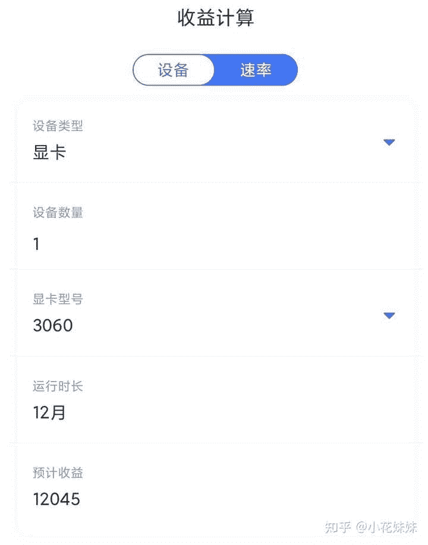

<!--yml
category: 挖矿
date: 2022-06-26 00:00:00
-->

# 如何看待RTX 3060被破解？

> 原文：[https://www.zhihu.com/question/448654710/answer/1784424743](https://www.zhihu.com/question/448654710/answer/1784424743)

 只能说，让买到3060的人又被**黄牛**了一波。

目前3060的算力基本在40-50之间。挖以太坊的收益基本上可以达到每天30元左右

30系显卡的车，至今我是一直没坐上。目前一直用着自己的2070，稳定运行了两个月。

超频设置核显–150，显存+800，确实是比3060的算力差一些，具体差距可以看一下这里。有大部分显卡的收益总结表。

[以太坊，让十年老电脑依旧可以回血教程](https://zhuanlan.zhihu.com/p/355955385)

* * *

3060的破解，并不是完全形式上的破解。对于个体户使用者，兼顾着游戏和每个月报销个房租钱，是完全可以的。

对于那种一台电脑上8块显卡的矿机，3060的算力会只有两块完全展现，这对于矿老板来说是没有性价比的，所以3060的溢价一定会有所限制。

个人认为，4000左右的价格就可以考虑3060入手。

溢价不多，而且个把月就可以挖回溢价，比较有性价比。

多一千的溢价，就要多挖一个月回本。基本可以这么计算。

**挖矿专场**丨[锁算力卡挖矿](https://zhuanlan.zhihu.com/p/399409039)丨[未锁卡挖矿教程](https://zhuanlan.zhihu.com/p/355955385)丨[笔记本挖矿](https://zhuanlan.zhihu.com/p/360451565)丨[锁算显卡怎么挑](https://zhuanlan.zhihu.com/p/374342633)丨[挖矿毁显卡吗](https://zhuanlan.zhihu.com/p/358944242)丨

**猴山专场**丨[猴山解密3080TI](https://zhuanlan.zhihu.com/p/379179943)丨[猴山解密3070TI](https://zhuanlan.zhihu.com/p/379428935)丨[买70TI还是80TI](https://zhuanlan.zhihu.com/p/379846007)丨[猴山冲4K](https://zhuanlan.zhihu.com/p/380129626)丨

**笔记本专场**丨[满血版笔记本怎么挑](https://zhuanlan.zhihu.com/p/374748213)丨[买3060还是70本](https://www.zhihu.com/question/447817962/answer/1909204347)丨[3050本评价](https://www.zhihu.com/question/462045112/answer/1913547325)丨[蛟龙7测评](https://zhuanlan.zhihu.com/p/369226521)丨