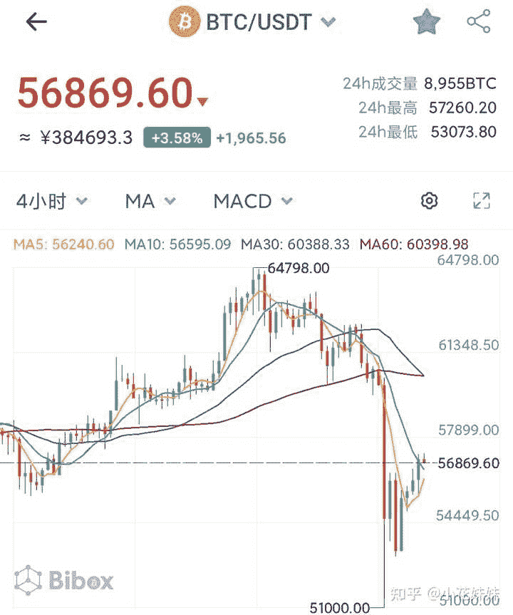

<!--yml
category: 挖矿
date: 2022-06-26 00:00:00
-->

# 如何看待比特币 4 月 18 日暴跌？是否意味着击鼓传花的游戏已经结束？

> 原文：[https://www.zhihu.com/question/455237775/answer/1842976815](https://www.zhihu.com/question/455237775/answer/1842976815)

 如果你想表达，矿潮是否结束？那么很可惜，不会的。

随着龙头大哥比特币的波动，确实导致了ETH的下跌。但是以目前的显卡收益来说仍旧是不错的额外收入。

真正的矿潮结束，是真正的跌到挖矿的收益入不敷出达不到电费，这个时候才会有大批的显卡退场。

正常的单卡，一般的电费大约是每天3-5元左右，币价什么时候能跌到这种程度才算是真正矿难的来临。

而对于炒币的玩家，不加杠杆的情况下，也就是等于两个股市的跌停。完全是可以接受的波动。这就是最典型的，风险与收益并存。

至于最近更火爆的狗狗币。一万块钱就能变成几百万，简直是比买彩票都刺激。对于资本家来说，这么好玩的游戏怎么可能这么轻易地结束？

**挖矿专场**丨[锁算力卡挖矿](https://zhuanlan.zhihu.com/p/399409039)丨[未锁卡挖矿教程](https://zhuanlan.zhihu.com/p/355955385)丨[笔记本挖矿](https://zhuanlan.zhihu.com/p/360451565)丨[锁算显卡怎么挑](https://zhuanlan.zhihu.com/p/374342633)丨[挖矿毁显卡吗](https://zhuanlan.zhihu.com/p/358944242)丨

**猴山专场**丨[猴山解密3080TI](https://zhuanlan.zhihu.com/p/379179943)丨[猴山解密3070TI](https://zhuanlan.zhihu.com/p/379428935)丨[买70TI还是80TI](https://zhuanlan.zhihu.com/p/379846007)丨[猴山冲4K](https://zhuanlan.zhihu.com/p/380129626)丨

**笔记本专场**丨[满血版笔记本怎么挑](https://zhuanlan.zhihu.com/p/374748213)丨[买3060还是70本](https://www.zhihu.com/question/447817962/answer/1909204347)丨[3050本评价](https://www.zhihu.com/question/462045112/answer/1913547325)丨[蛟龙7测评](https://zhuanlan.zhihu.com/p/369226521)丨