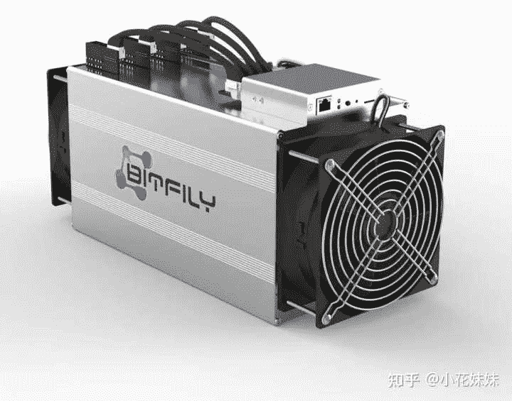
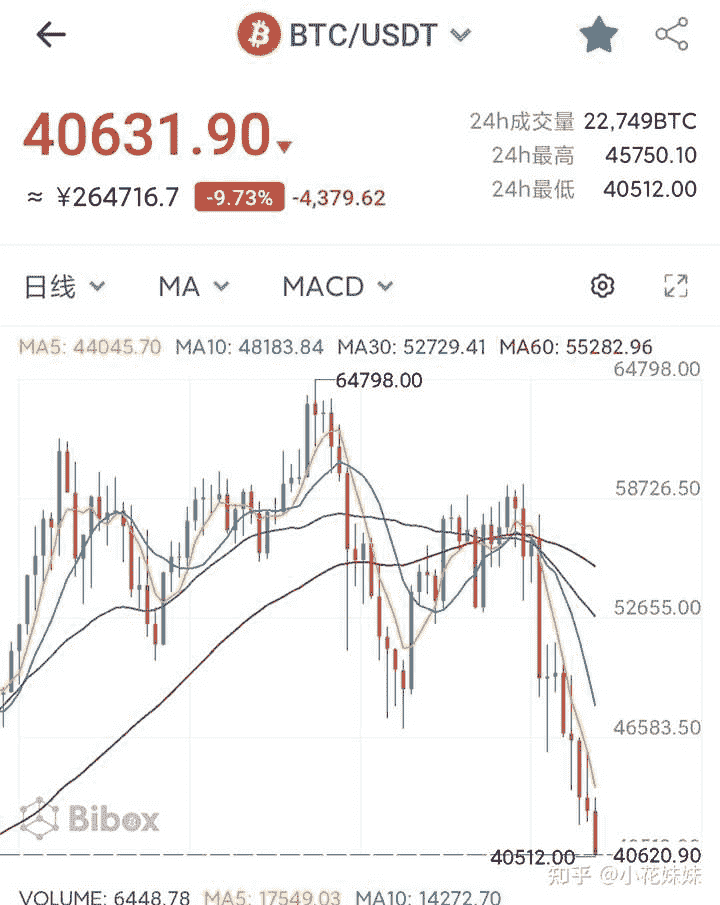
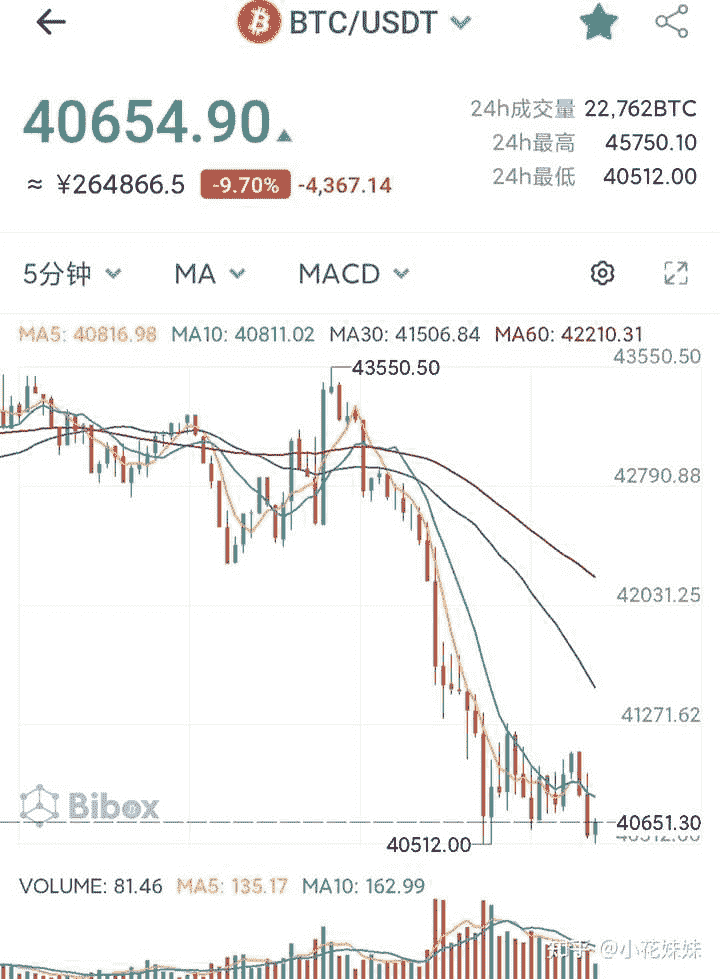
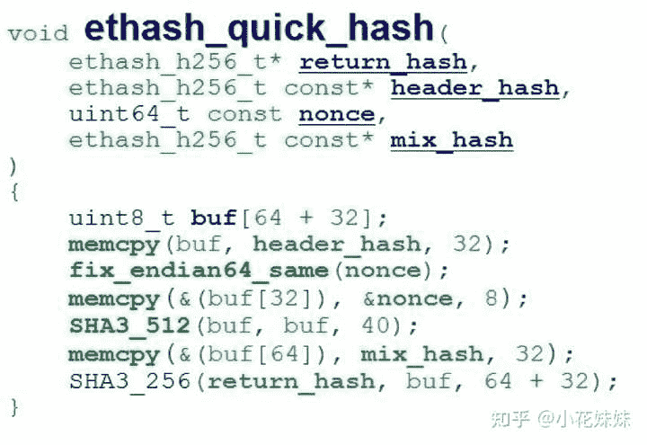
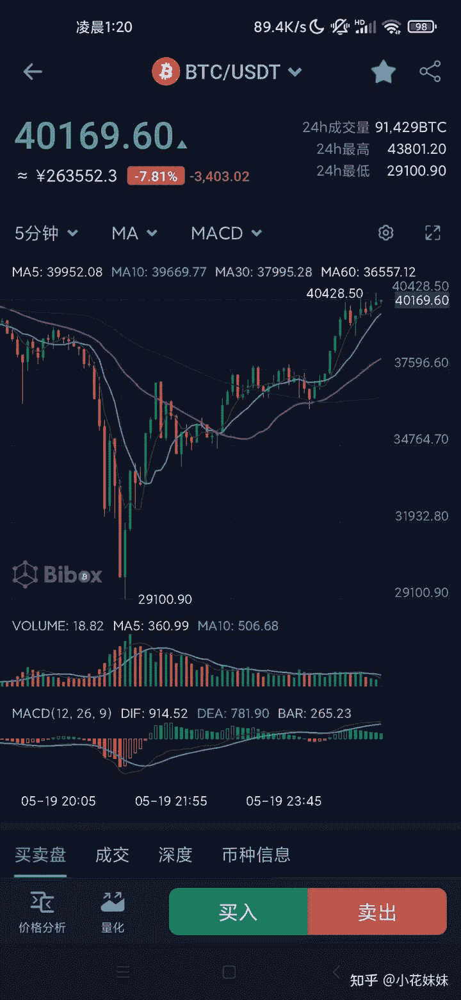

<!--yml
category: 挖矿
date: 2022-06-26 00:00:00
-->

# 如何看待比特币再度跌破4万5?

> 原文：[https://www.zhihu.com/question/459874779/answer/1894209516](https://www.zhihu.com/question/459874779/answer/1894209516)

 目前已经从2.9万开始逆转回温。

关注这个问题的人基本分为如下几类。

**1、货币持有人 2、挖矿散户或者老板 3、看热闹的非持有人**

我们针对比特币目前最近的涨跌来分析一下近况。

## 什么是比特币

首先，我们要了解。为什么毛毛狗狗的虚拟货币有那么多，为什么独有BTC那么出名。比特币最初的概念最初由中本聪在2008年11月1日提出，并于2009年1月3日正式诞生。发展至今币价一度突破近6.5万美金一枚，可以说是资本界的奇观。借由比特币挖矿，萌生了一批靠着BTC挖矿而谋生的“矿老板”

### 比特币矿潮

BTC的挖矿也经历了很多的阶段，由最初的**CPU**挖矿到**GPU**挖矿，到如今的**专业矿机**和**矿池**挖矿。

这也是为什么几年前的矿潮造成的矿渣显卡，基本上可以从“黄屁股”的表现来判断是否为“矿卡”因为BTC引起的矿潮，主要是超频显卡核心GPU来获取算力，高温和高强度的使用GPU核心，会造成显卡核心发黄。

而如今的市场，因为BTC专业矿机的诞生，显卡挖BTC的方式基本已经被诶淘汰，目前一张顶级的游戏显卡的算力，可能抵不上专业矿机的千分之一。

### 比特币的特殊意义

为什么在众多猫狗的货币当中，唯独比特币的涨跌牵动着新闻界和大众的心，当然首当其冲的原因是贵。一枚30多万的价格并不是寻常百姓可以接受的价格。基本上约等于三四线城市的半套房子，或者一线城市的部分首付价格了。

但是论涨跌幅度，猫猫狗狗的虚拟货币百倍千倍的涨的有很多，为什么大家却独爱BTC？因为他代表着虚拟货币的趋势。BTC涨了，猫猫狗狗不一定涨，但是如果BTC跌了，那么超过八成甚至九成的虚拟货币都会跌，所以对于大部分的虚拟货币来说，他代表着趋势，代表着很重要的参考意义。而且他还具有一个很重要的属性：**稳定**

这个稳定并不是传统意义上的**涨跌稳定**，而是代表着不会归零的“稳定”。猫猫狗狗的涨跌，确实印证了币圈的一句话“币圈一天，人间一年”但是如果持有他们，就会面临很严重的归零风险。某音经常刷到很多买了杂货币的人就卸载软件等几年后再看的人，他们最大的风险就是面临“归零”而BTC对于这方面的可能性，可以说是无限趋近于零。既然坐上了老大哥的位置，自然是躲在众多杂货币的后方稳居帝王之位。

这也是为什么BTC涨跌幅度并不大，十几个百分点就可以铺满某音的原因。因为他背后代表着所有虚拟货币的趋势，表面上BTC是涨跌10%，背后是杂货币几倍几百倍的浮动。

### 比特币最近的趋势

我们首先来看日线，从几周前突破到6.5W美金以后，有一波大的下调，又在几天的波动以后跌倒了目前的4W美金左右。总体来说，如果估计到了6.5左右是巅峰价格以后买跌，那么这个预判是可以让你小有收入的。而且可以观察一下红线，基本上跌幅冲击量都是比较大的。所以很有可能是小庄集中冲击市场，造成跌势，然后在一波绿线拉高。到如今4W左右的价格，我认为只能说是中间价格，后期庄家拉高或者继续砸盘的可能性我认为基本上达到了对半的概率。

再来看看5分钟的线就基本明确了，集中砸盘的趋势非常明显，想抄底的散户和小庄虽然略有势头，但是在大庄面前基本形不成什么规模，以长红线为主，造成了今天的4.3左右跌落到4W左右。

### 影响波动的因素

最近的特斯拉对于BTC和杂货币的影响大家应该也知道，马斯克的一句“虚拟货币就是骗局”造成了当日的虚拟货币大动荡，再后续又出现了特斯拉暂停BTC交易，并且宣称特斯拉没有出售任何BTC的宣言。是真是假有待考证。但是以目前的形势来说，暗中操盘稳步出售BTC的可能性并不小。但是从另一方面考虑，缺少了特斯拉这一大庄的操盘，市场可能会更加稳定。

## BTC对于挖矿的影响

BTC对于目前来说显卡挖矿的市场，影响是非常间接性的。对于矿工收入影响程度的简单公式为

**BTC<ETH<市场交易量**

也就是直接性影响目前显卡挖矿收益的是虚拟货币的交易量。市场波动大-交易量大-矿工收入增加，所以对于个体户和显卡矿老板来说，币价并不是决定性的因素，市场波动的大小才是。

### ETH的矿潮不是BTC矿潮

从前面的公式我们可以了解到，ETH的影响是大约BTC的（挖矿）因为在目前BTC的矿潮已经被专业矿机的老板们独揽，BTC的矿潮已经上升到几千万或者几个亿的标准，我们这种体量基本上属于看个乐呵。显卡涨价，全民“被黄牛”的主要元凶，是ETH的币价上涨，一度涨到了2.5W人民币一枚。

由于ETH另辟蹊径的算法：ethash算法，目前来说ETH的挖矿主要是运用显存的频率高低来进行挖矿。导致了目前只要拥有5GB以上显存的显卡，都可以在ETH的矿池当中占有一席之地 。也就造成了今日的矿潮和全民挖矿。

而且，因为是显存挖矿，在超频的时候会限制GPU和功耗以减少耗电量和发热。导致了如今矿潮的二手卡不会出现“黄屁股”的明显特征。也就是说目前的显卡是无法区分是否是矿卡的。

具体可以参考一下这里

而矿工的收入，基本上可以套用出币量*ETH的币价来结算收益，波动量大会导致出币量大，而币价的高低取决于ETH，所以BTC对于矿工的影响有两个层面

**BTC波动大，导致市场交易量大，导致矿工出币多。**

**BTC币价高，导致ETH跟随上涨，导致矿工币价高。**

所以这也是矿工同样关注BTC走势的原因。

### BTC的意义是什么

很多人留言说过，耗费那么多的电力资源去获取BTC，对于社会的意义是什么？

对于电力方面，直接说结论：不存在浪费的问题。有需要就会产出，大量的电力消耗会增加电厂的收入。

[国家发的电用不完的，会储存起来吗，还是浪费了？](https://link.zhihu.com/?target=https%3A//www.sohu.com/a/331285008_752692)

我认为：没有必要把个人层面的行为上升到社会层面。对于个人而言，存在即合理，能养家糊口的方法都是正义。

社会层面：西方国家甚至想通过虚拟货币来造成我们的经济影响，我们这边也出台了各种的反制措施。同样也挡不住想再BTC里面捞一把的韭菜们往里冲。

所以，我认为BTC最大的意义就是管好自己的资金和心态，**谨慎投资，少碰杠杆**。

### BTC的未来

对于什么是矿难，我个人的理解为的临界点是：显卡的日收益不足以支撑电费

目前的显卡来说，单卡日消费电量大约为5-8度左右，也就是电费基本5块钱管饱。5-6卡矿机自行计算。可以使用小米智能插座统计。

以目前的市场来开，单卡日收益不足3-5元的日子还需要不少的时间，当然这个临界点仅针对于个体户和单卡用户。在这之前就一定会出现老板级别大量千张卡批量出售的盛况。在这个临界点之前，BTC会一直保持着被广大硬件玩家和群众关注的状态，我们俗称为**热点**。

成为热点，就会不断的有韭菜入场。至于后期涨跌，就看各位看官的法眼如何了。

更新一波，这是大机构出手了，触底2.9太刺激了

**挖矿专场**丨[锁算力卡挖矿](https://zhuanlan.zhihu.com/p/399409039)丨[未锁卡挖矿教程](https://zhuanlan.zhihu.com/p/355955385)丨[笔记本挖矿](https://zhuanlan.zhihu.com/p/360451565)丨[锁算显卡怎么挑](https://zhuanlan.zhihu.com/p/374342633)丨[挖矿毁显卡吗](https://zhuanlan.zhihu.com/p/358944242)丨

**猴山专场**丨[猴山解密3080TI](https://zhuanlan.zhihu.com/p/379179943)丨[猴山解密3070TI](https://zhuanlan.zhihu.com/p/379428935)丨[买70TI还是80TI](https://zhuanlan.zhihu.com/p/379846007)丨[猴山冲4K](https://zhuanlan.zhihu.com/p/380129626)丨

**笔记本专场**丨[满血版笔记本怎么挑](https://zhuanlan.zhihu.com/p/374748213)丨[买3060还是70本](https://www.zhihu.com/question/447817962/answer/1909204347)丨[3050本评价](https://www.zhihu.com/question/462045112/answer/1913547325)丨[蛟龙7测评](https://zhuanlan.zhihu.com/p/369226521)丨