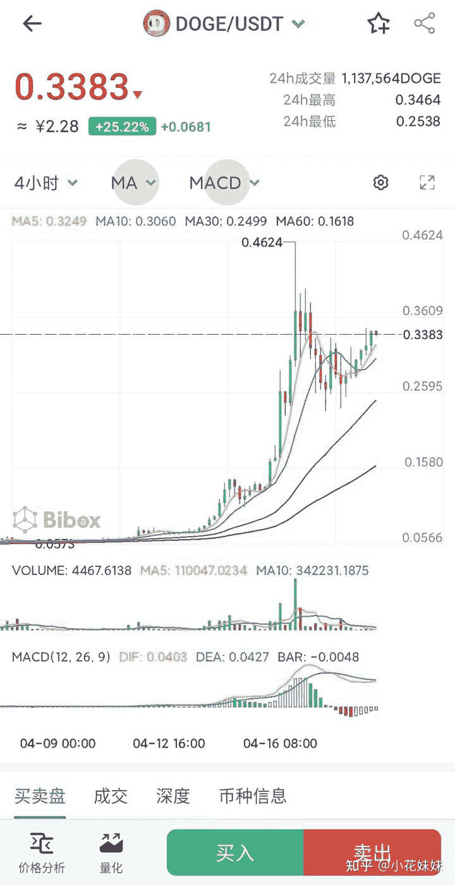

<!--yml
category: 挖矿
date: 2022-06-26 00:00:00
-->

# 如何看待狗狗币涨势迅猛？它能否成为马斯克眼中的「人民的货币」？

> 原文：[https://www.zhihu.com/question/455097352/answer/1842963247](https://www.zhihu.com/question/455097352/answer/1842963247)

 首先，这种极其不稳定的货币是不可能成为人民通用货币的。

从最初的2分钱到目前的几块钱一枚，几十倍的资产翻倍，资本家的游戏已经玩出了极致。

给人一种财务自由就在身边的错觉。

确实，如果你梭哈一波狗狗币，动动手指一万变几百万，谁又能说不心动。

知乎搜一搜“千倍币”就知道了，多少人做着一波暴富的梦想。

但是同样，伴随而来的就是风险。

虚拟货币的归零，暴跌不过也是庄家点几下手机的事情。对于他们来说是游戏，对你来说就可能是万劫不复的深渊。

这种货币，因为其极其不稳定的因素，是不具有社会流通性的。

如果想购买虚拟货币，那么你需要电子钱包和交易所。复杂的操作很难成为社会主流。

**挖矿专场**丨[锁算力卡挖矿](https://zhuanlan.zhihu.com/p/399409039)丨[未锁卡挖矿教程](https://zhuanlan.zhihu.com/p/355955385)丨[笔记本挖矿](https://zhuanlan.zhihu.com/p/360451565)丨[锁算显卡怎么挑](https://zhuanlan.zhihu.com/p/374342633)丨[挖矿毁显卡吗](https://zhuanlan.zhihu.com/p/358944242)丨

**猴山专场**丨[猴山解密3080TI](https://zhuanlan.zhihu.com/p/379179943)丨[猴山解密3070TI](https://zhuanlan.zhihu.com/p/379428935)丨[买70TI还是80TI](https://zhuanlan.zhihu.com/p/379846007)丨[猴山冲4K](https://zhuanlan.zhihu.com/p/380129626)丨

**笔记本专场**丨[满血版笔记本怎么挑](https://zhuanlan.zhihu.com/p/374748213)丨[买3060还是70本](https://www.zhihu.com/question/447817962/answer/1909204347)丨[3050本评价](https://www.zhihu.com/question/462045112/answer/1913547325)丨[蛟龙7测评](https://zhuanlan.zhihu.com/p/369226521)丨