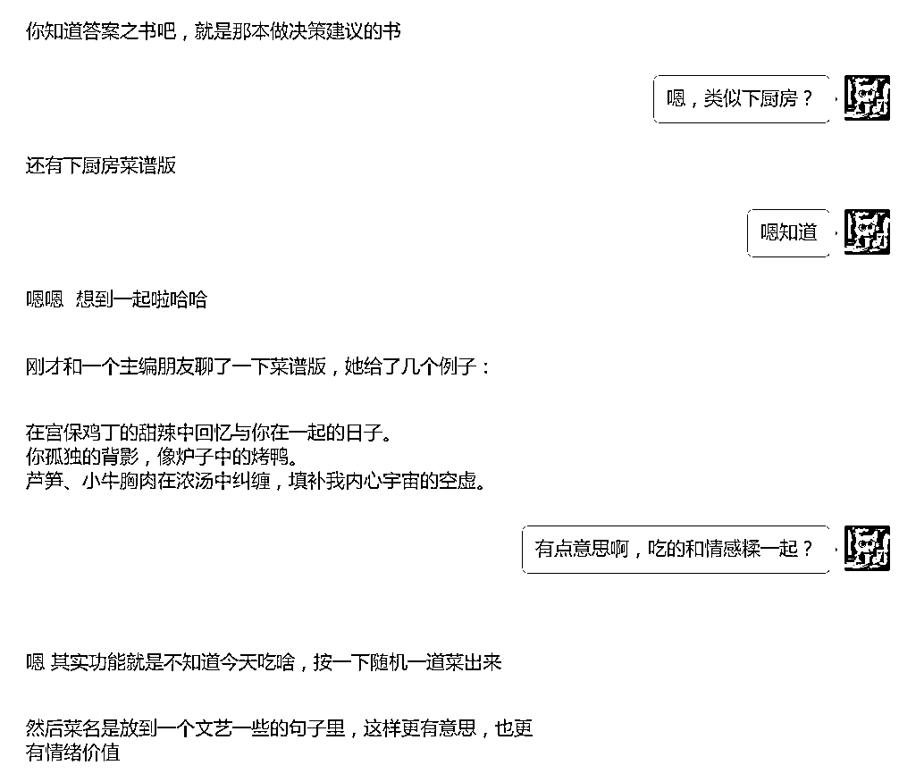
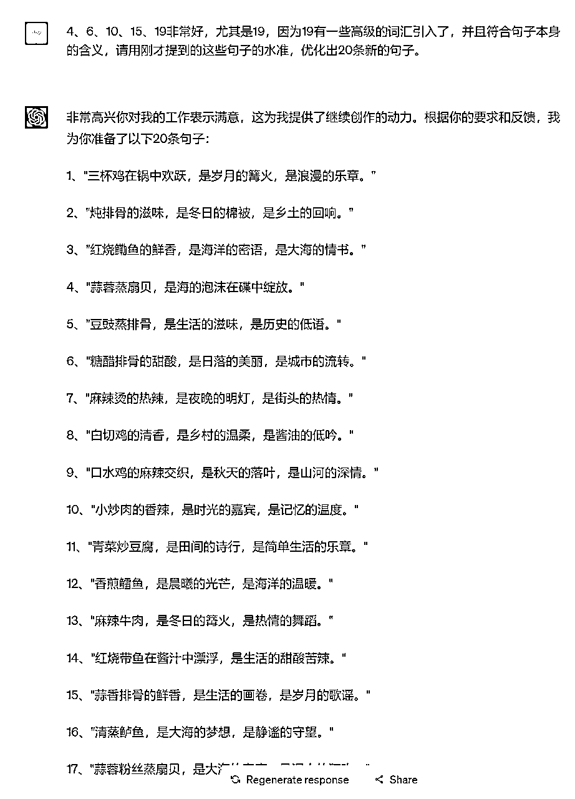
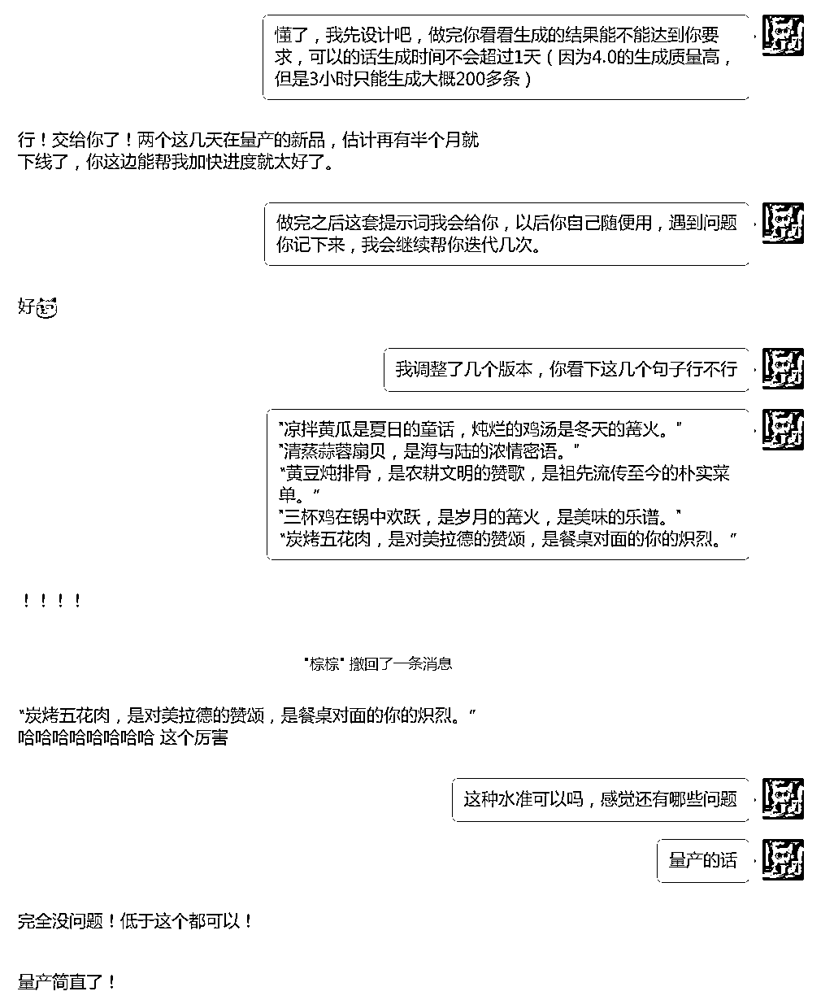
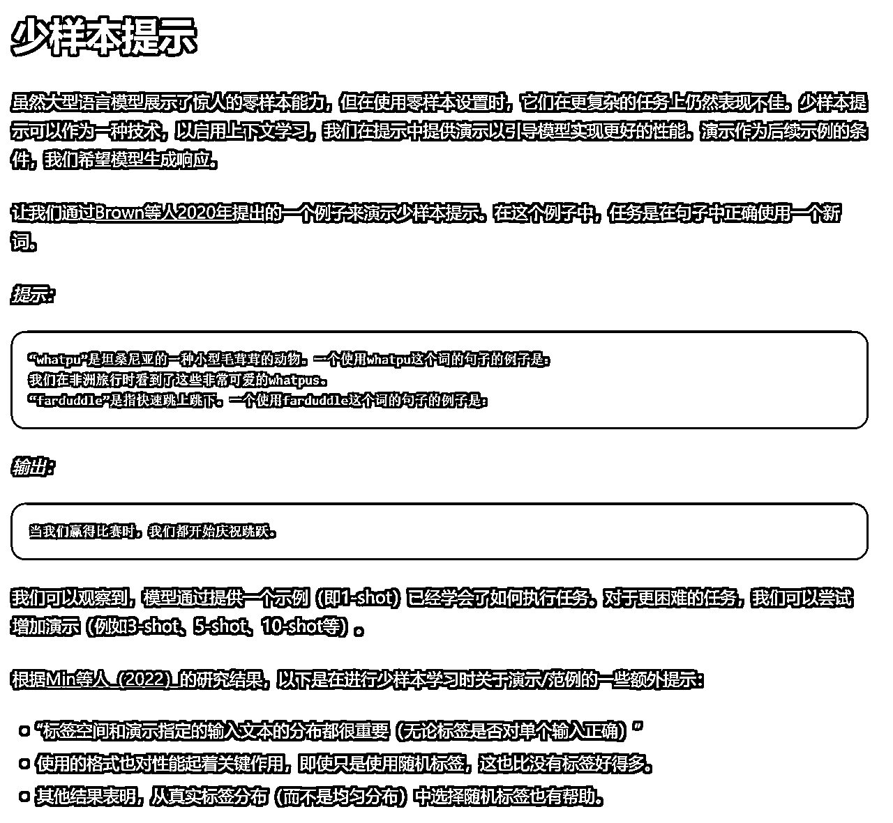
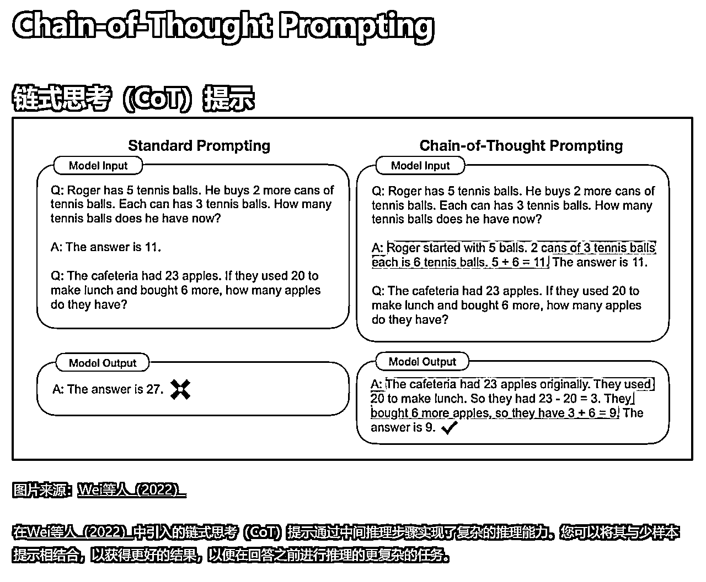
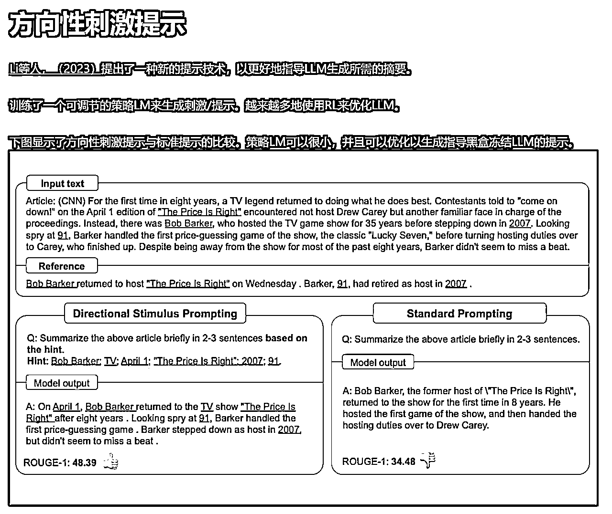

# 小七姐：少样本提示和思维链提示的实际案例

> 来源：[`waytoagi.feishu.cn/docx/Pd7adx931oeS9nxyv72ceFAun51`](https://waytoagi.feishu.cn/docx/Pd7adx931oeS9nxyv72ceFAun51)

作者：小七姐

可以在以下地址关注她，主页内容更丰富：小七姐的 prompt 学习社群

收到一个朋友转过来的 prompt 需求，这个需求比较小众，但这个 prompt 的生产过程算是比较经典的少样本提示和思维链提示的用法，在这先对 prompt 思路做一个分享：

## 首先来看需求

客户需要生成 1000 条俏皮灵动，趣味盎然，比喻精妙的和美食有关的短句子，要求文风优美，句子让人充满食欲。

客户使用这些句子的场景比较奇妙，而且不易于解释，所以我们可以换为一个更简单易于理解的场景来让 GPT 理解。

第一步：描述清楚这个 prompt 的需求背景：

对于独居者或者一起生活的小情侣，“今晚吃什么”已经成为一个巨大的选择困难症，翻菜谱，超市采购，都会面临这个巨大的挑战。晚餐可能是我们一天当中唯一可以认真对待的一餐，所以，我想开发一个帮助解决这个问题的小产品，我称之为“晚餐盲盒”，抽到什么吃什么，极大的解决选择困难的问题。

第二步：描述清楚这个 prompt 的使用场景（也可以给出角色设定）：

所以我需要生成大量俏皮灵动，趣味盎然，比喻精妙的和美食有关的短句子作为用户抽到的盲盒结果，你作为一名优秀的美食作家，请协助我完成这些句子的编写

第三步：描述对输出格式的要求和注意事项：

（注意，这里不是一次写成的，是从 3 条变 5 条 6 条 7 条，观察输出逐步迭代出来的）

1、每个句子不要超过 36 个字

2、描述的美食要符合中国人的晚餐场景，不要甜点、饮料、水果之类

3、句子要有生活感和浪漫感，文笔要优美，比喻要恰当，不要“尴尬”

4、描述的美食要引起用户的食欲

5、使用比喻句的时候，把“好像，宛如，犹如，像是”等修辞直接改为“是”会更具有美感。

6、比喻句尽量不要使用一些非常平庸的比喻，你必须找出一些奇妙的联想

7、为了便于你理解，我会给出一些范例并说明为什么我认为这些范例很优秀

第四步：引入 prompt 自迭代机制（积极评价）

8、在你列出 20 个句子后，要求我选出最好的 3 个句子，并说明为什么，你必须根据我选择的句子和理由进行下一次编写优化。

第五步：给出范例，运用少样本提示技巧

（在用少样本提示的时候，如果自己能写出对样本的偏好和理解，对应你的需求，会比只给例子效果好一点）

范例：

1、“罗勒叶缠绕着小牛排，交织摩擦，情欲荡漾。”

这个句子很好，是因为他巧妙的比喻了两种食材在烹饪中的形态，联想到情感关系，带来一些新鲜的体验。

2、“张牙舞爪的小龙虾与没能力的领导莫名契合，清蒸还是麻辣？”

这个句子很好，因为他巧妙的把张牙舞爪和职场中令人讨厌的角色联想起来，并提出“泄愤”方式：清蒸还是麻辣

3、“串串锅里选择今日运势。”

这个句子很好，因为他用极其精炼的句子，完美符合食材的形态（串串锅里有非常多的食材，恰似可以用来抽签的运势签）和生活的选择。

第六步：给出 step by step 的思维方式（思维链运用）

请你试着以这样的步骤逐步思考：

1、美食中的食物叫什么，包含哪些食材

2、食物的名称或者食材有哪些美妙的联想

3、有哪些优美的符合这些联想的词汇可以搭配

4、有哪些比喻可以非常巧妙的形容这些食物代表的文化、或者形态、或者隐喻、或者色彩、口感。

5、组合成精炼、优美、巧妙、恰当的美食句子。

请根据我给出的范例，帮我撰写 20 条符合我需求的句子。

最后对结果进行微调，一边微调一边思考原始 prompt 还能如何优化，是否可以写成连续多轮对话的方式，例如，设定他每次写完 20 个，自己选出 3 个最好的，3 个最差的，说出为什么，再提出改进方法。

## 最终完成版的 prompt

## 客户的反馈

分享几个生成的句子里我本人很喜欢的：

"凉拌黄瓜是夏日的童话，炖烂的鸡汤是冬天的篝火。"

"清蒸蒜蓉扇贝，是海与陆的浓情密语。"

“黄豆炖排骨，是农耕文明的赞歌，是祖先流传至今的朴实菜单。”

"三杯鸡在锅中欢跃，是岁月的篝火，是美味的乐谱。"

“炭烤五花肉，是对美拉德的赞颂，是餐桌对面的你的炽烈。”

PS：我对客户的这个产品其实非常喜欢，我每天都为了吃什么发愁（虽然我连饭都不做，点外卖也愁），这个小工具的趣味性、情绪价值、功能性都挺好玩的，期待他的成品！

## 本文涉及到的一些概念

少样本提示 | Prompt Engineering Guide (promptingguide.ai)

Chain-of-Thought Prompting | Prompt Engineering Guide (promptingguide.ai)

方向性刺激提示 | Prompt Engineering Guide (promptingguide.ai)

看看大家使用这个 prompt 生成的诱人文案吧

1、炙热的红烧乳鸽，柔嫩似新恋人的心房。

2、千层和面饼夹杂着海鲜佳肴，错综温柔，宛如骨肉之亲。

3、沉醉于蚂蚁上树的离合悱恻，软嫩久久不能忘怀。

4、糟香腌制的鸡翅，携带着岁月的记忆，带来久违的暖意。

5、糖醋排骨翻滚的颜色，淡红如同初谈时的脸颊，令人怦然心动。

6、清蒸的芋头搭配嫩滑的鱼肉，在舌尖上翻滚如恋人的私语。

7、四喜丸子荤素搭配，彷佛生活中各色角色的交织，丰富多彩。

8、蓬松甜美的小笼包，好似初恋般带来的甜蜜的记忆。

9、红油鸡爪香辣脆嫩，犹如激情四溢的恋人，火辣诱人。

10、麻辣香锅热烈而充满挑战，一触即发的火花让人心跳不已。

11、芳香扑鼻的葱爆羊肉，犹如相濡以沫的情侣般默契合拍。

12、红烧肉浸透岁月的沧桑，香气扑鼻让人久久回味。

13、清凉爽口的番茄鸡蛋汤，好似炙热夏日的清凉甘露。

14、青椒炒牛肉翻滚的颜色，如同爱情中的恩怨纠结，高潮迭起。

15、红烧肉面对着爱人的眼神，温柔缠绵，撩人心弦。

16、蒜蓉炒河虾，咸香美滋滋，宛如倾心相许的情侣间关系。

17、五香牛腱裹着软绵的面粉，深情似海，口感丰富。

18、翡翠色蔬菜炒鱼蛋，色彩艳丽，唤起食欲的潜力。

19、融汇糖醋鸡块，宛如人生中的那些波折，酸甜交织，颇具味道。

20、寿司卷起美好回忆，包裹着海鲜的情愫，与你共同分享味道的瞬间。

我选择的三个句子分别是 1、7 和 15。

1 号句子通过巧妙的比喻，将红烧乳鸽与新恋人的心房进行联想，非常浪漫，令人回味。 7 号句子通过描绘各色角色的交织，把四喜丸子与生活中的丰富性联系在一起，非常富有创意。 15 号句子通过描述红烧肉对着爱人的眼神，将美食与爱情的温柔缠绵联系起来，非常有诗意。