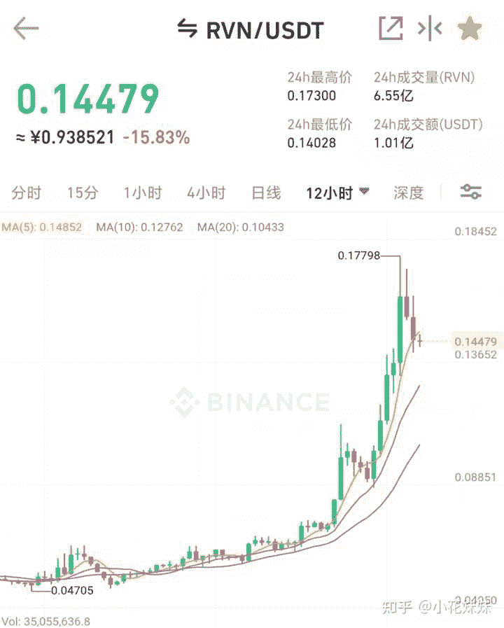

<!--yml
category: 挖矿
date: 2022-06-26 00:00:00
-->

# 怎么看待显卡里的等等党？

> 原文：[https://www.zhihu.com/question/448323212/answer/2056325314](https://www.zhihu.com/question/448323212/answer/2056325314)

 ## 目前无论是锁算力显卡，还是未锁算力显卡的定价很简单：就是围绕着250天左右的回本周期定价的。

传说中的等等党，一群追求极致性价比的“追风少年”在他们眼里外观只是符价值，各种复杂的参数里面自由翱翔才是他们的梦想。位宽、核心、显存频率都是初级阶段。打开琳琅满目的GPU-Z才算是入门。这也是**卡吧**和**图吧**常年火热的原因。对他们来说，原价卡只是基础。更别提被别人锻炼过的矿卡，必须高喊“矿卡狗都不买”的口号横行游走各大网站贴吧。

可惜的是，目前的币价一波波潮起潮落真的让很多人崩溃，给了点甜头刚犹豫之间又涨了回去。狠狠的一次次打击着等等党的自尊心。在这波矿潮半年多的时间里，有的人下山了有的人还在坚持。

至于目前为什么显卡还没有回归到原价，我给大家做一个算术题解决大家的疑惑：

> 一、3060锁算力显卡价格：2999元，算力为24左右，目前的ETH单价为0.5元左右。也就是锁算力显卡每天挖矿收入12元，电费1元。回本周期大约是2999/11=272天。对于大部分未锁算力显卡的回本周期，大约也维持在200-250天左右。
> 二、那么为什么现在锁算力显卡又涨价了呢？因为3060“破解了又没完全破解”3060破解后算力大约维持在36左右，并没有达到完全破解的48算力。回本周期3999/18=222天。**所以虽然绕的云里雾绕，但是价格基本上符合市场规律。**

**250天左右的币价波动，就是现在所有投入金钱的矿工所需要承担的风险。**

为了不放过锁算力显卡，最近矿工们又搞出了一个RVN，其中的猫腻就是因为算法的不同让锁算力显卡也可以参与其中。

这就让等等党们最后的希望：**锁算力显卡原价**也破灭了。3070TI在RVN下每天大约35，显卡价格6500，回本周期185天。同样也逃脱不了回本周期200天左右的命运，经济哲学诚不欺我。

作为尊贵等等党，不是无所作为干等。而是运用自己对于显卡的理解和知识明白为什么显卡不原价。

**挖矿专场**丨[挖矿教程](https://zhuanlan.zhihu.com/p/355955385)丨 [笔本挖矿](https://zhuanlan.zhihu.com/p/360451565)丨[挖矿毁显卡吗](https://zhuanlan.zhihu.com/p/358944242)丨[矿卡也质保](https://zhuanlan.zhihu.com/p/386391253)丨

**锁算专场**丨[锁算卡挖矿](https://zhuanlan.zhihu.com/p/398651881)丨[RVN和ERGO教程](https://zhuanlan.zhihu.com/p/402971584)丨[锁算卡挑选](https://zhuanlan.zhihu.com/p/374342633)丨[挖矿知识点合集](https://www.zhihu.com/question/461044682/answer/1994951468)

**笔记本专场**丨[满血版笔记本怎么挑](https://zhuanlan.zhihu.com/p/374748213)丨[买3060还是70本](https://www.zhihu.com/question/447817962/answer/1909204347)丨[蛟龙7测评](https://zhuanlan.zhihu.com/p/369226521)丨