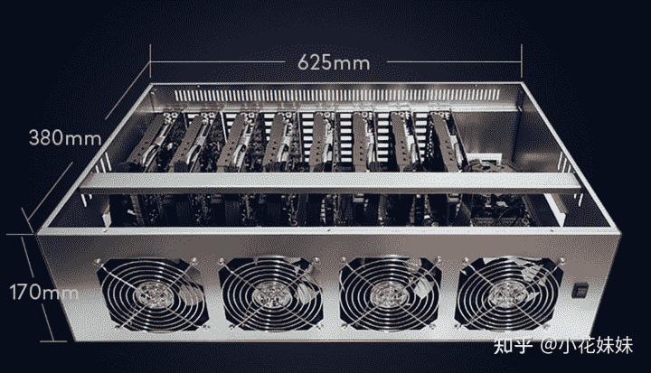
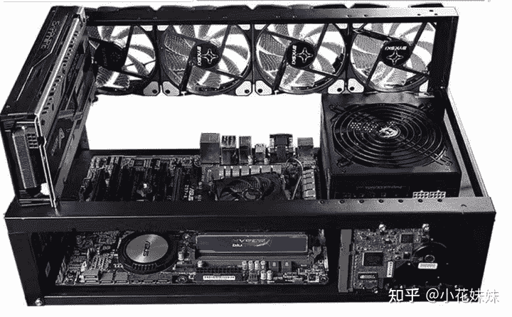
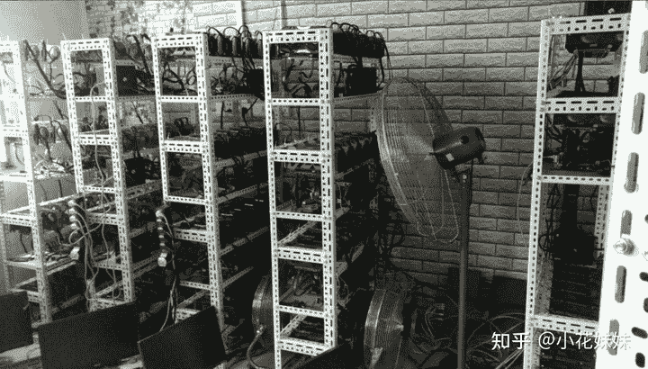
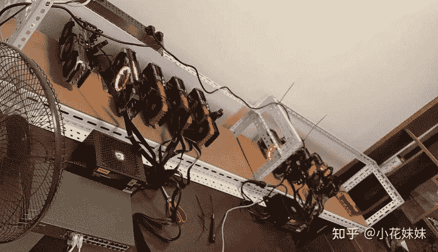
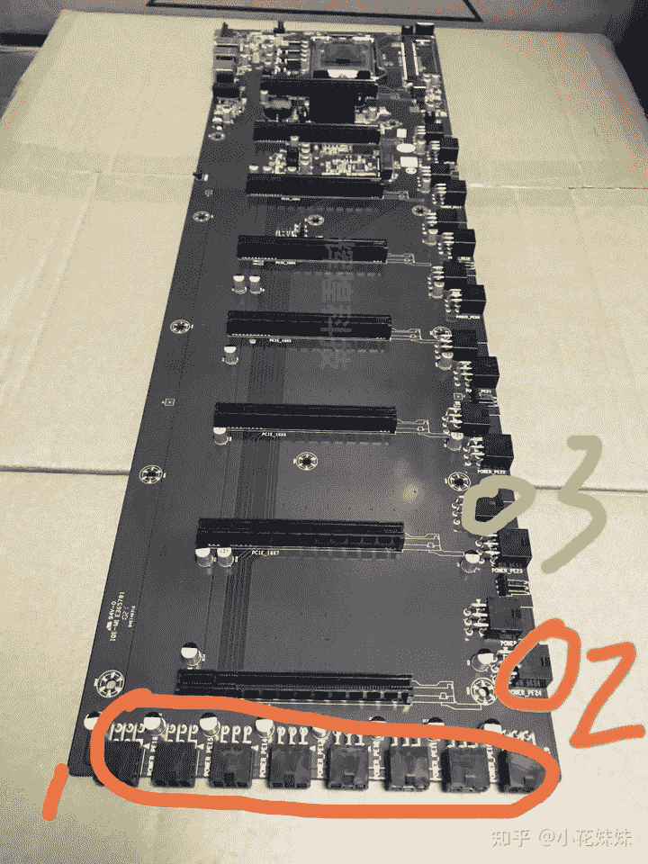
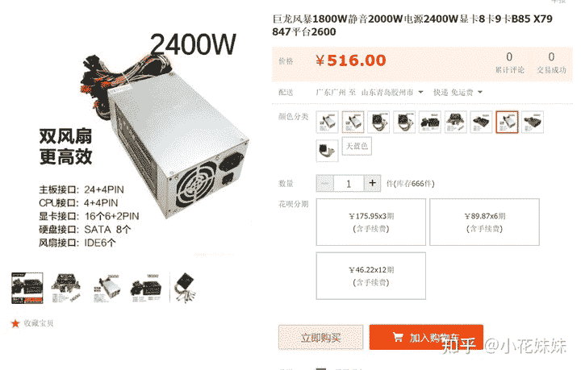
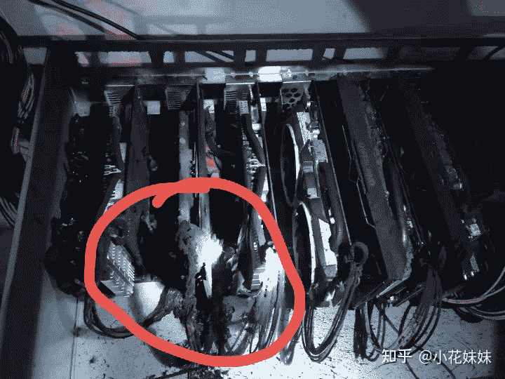
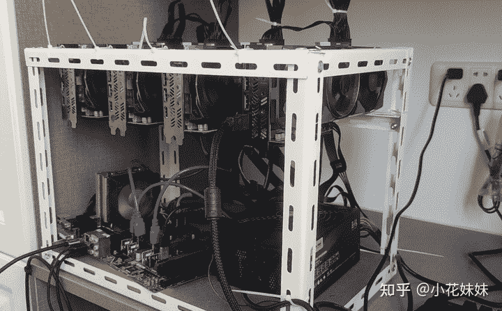
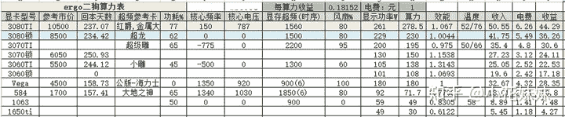

<!--yml
category: 挖矿
date: 2022-06-26 00:00:00
-->

# 手把手教你组建显卡矿机方案教程

> 原文：[https://zhuanlan.zhihu.com/p/410470347](https://zhuanlan.zhihu.com/p/410470347)

## 一、总结各种方案的优缺点

### 1、昂达8卡直插平台（铁盒子）

散热系数：★★★

噪音系数：★★★★★

安全系数：★★★★★

点评：方便搬运，不容易误碰风扇造成断叶，节省空间。但是因为需要6000转以上的暴力风扇形成风道散热，所以噪音方面非常的扰民。不适合家里挖矿的选手，适合租房子和场地的矿老。

### 2、开放式平台（搭配转接线）

散热系数：★★★★★

噪音系数：★★

安全系数：★★

点评：因为是开放式平台，所以散热方面基本没有太大的压力。但是同样也容易造成落灰等问题。大部分初期挖矿的玩家都是拆掉自己拥有的主板，借用转接线多接几张显卡。所以这种低成本的改造适合大部分拥有主机，想加卡的家庭挖矿玩家。

### 3、低成本开放平台

散热系数：★★★★★★

噪音系数：★★★

安全系数：★★★

点评：拥有超高的自由对，对于家里有单独空置房间的选手可以自由发挥。并且放在中间或者较高的位置可以防止孩子宠物误碰风扇。减少了断叶和落灰的风险。主板的选择也可以选择更大的12卡主板。并且每张显卡的间距可以自由调整，可以完美解决散热问题，从此妈妈再也不担心我把家烧了。

## 二、方案解析

1、8卡铁盒

作为所有矿老板的统一选择，得到了市场的认可。但是因为其散热性比较差的原因，8卡平台基本会选择3070TI一下的低散热量显卡，如果是8张3080TI级别的显卡基本可以原地爆炸。

主板方面的主流选择是B75或者B85的8卡主板，其差距主要在于CPU的性能。（挖矿要啥CPU性能，你在教我做事？）

怎么接供电：为了方便矿老们组建矿机，这款主板设立了独特的供电线方案。简单的说有两种方法：

> 1、把位置**1**的8个6PIN接满，然后从2的位置使用6pin转2个8pin的供电线给显卡供电。
> 2、把位置**3**的8个6PIN接满，然后从2的位置使用6pin转2个8pin的供电线给显卡供电。

这样的设计让显卡的供电线不会因为长度的长短不一而凌乱不堪。

DDR3内存、CPU、散热风扇、SATA硬盘等就略过了，只讲重点。

风扇的选择：这种闷罐机箱要选择5000转起步的风扇才能有效的形成风道。一般的普通机箱风扇是完全达不到散热效果的，所以噪音奇大无比。而相对于开放式机箱，散热压力并没有那么大，所以可以选择静音风扇。

### 电源

电源是矿机配置中差价最大的，大功率的电源并且有品质保证的目前只有长城巨龙电源。价格也是相当的感人。

而一般的整体平台出售，一般会为了让价格更有竞争力，而选择杂牌巨龙风暴电源，此巨龙非彼巨龙。对比一下价格也就知道其中的差距了，2400W的功率不到长城巨龙的一半。

个人保持的建议是：**省什么都不要省电源。不然很容易被一锅端。**

### 开放式平台方案

也是我自己选择的方案。家里把老爷子看优酷用的台式机拆了，用速桥转接线接了4张显卡就开工了。

主板是使用的Z170+i7 6700的配置，并不是专业挖矿的主板，相信很多小伙伴也可以拆了自己家里的台式机加入挖矿的行列。但是需要注意的是电源问题，目前30系列显卡基本上2张就能把750W左右的电源吃满了，所以一步到位还是上长城巨龙2000W吧。毕竟挖RVN的时候太吃功耗。

### 显卡延长线

显卡延长线有两种，一种是PCIE16X直接延长，一种是PCIE 1X转16X的速桥。

上面的是速桥，下面的是延长线。

对于我们挖矿来说，速桥是足够我们挖矿使用的，而且可以让主板1X的PCIE接口利用起来，也单独接一张显卡。一般一张ATX的大主板是拥有2个16X插口和2个1X插口的，所以可以接4张显卡挖矿。速桥需要额外的SATA供电，一般的电源都拥有足够的接口给速桥供电。

以下是简单的预计收益，各位耐心的看官笑纳。

**挖矿专场**丨[挖矿教程](https://zhuanlan.zhihu.com/p/355955385)丨 [笔本挖矿](https://zhuanlan.zhihu.com/p/360451565)丨[挖矿毁显卡吗](https://zhuanlan.zhihu.com/p/358944242)丨[矿卡也质保](https://zhuanlan.zhihu.com/p/386391253)丨[自造矿机教程](https://zhuanlan.zhihu.com/p/410470347)

**锁算专场**丨[锁算卡挖矿](https://zhuanlan.zhihu.com/p/398651881)丨[RVN和ERGO教程](https://zhuanlan.zhihu.com/p/402971584)丨[锁算卡挑选](https://zhuanlan.zhihu.com/p/374342633)丨[挖矿知识点合集](https://www.zhihu.com/question/461044682/answer/1994951468)

**笔记本专场**丨[满血版笔记本怎么挑](https://zhuanlan.zhihu.com/p/374748213)丨[买3060还是70本](https://www.zhihu.com/question/447817962/answer/1909204347)丨[蛟龙7测评](https://zhuanlan.zhihu.com/p/369226521)丨