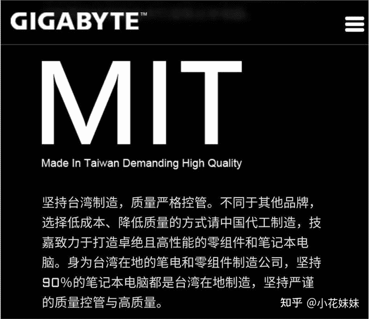
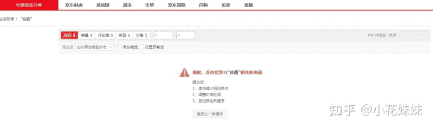
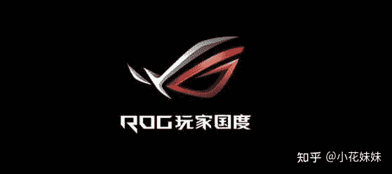
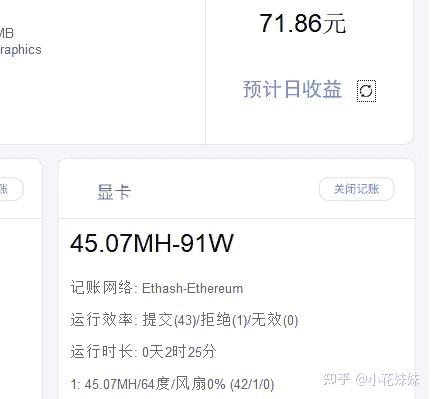
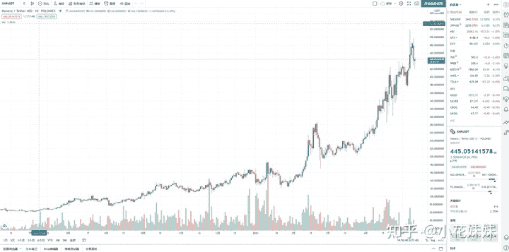
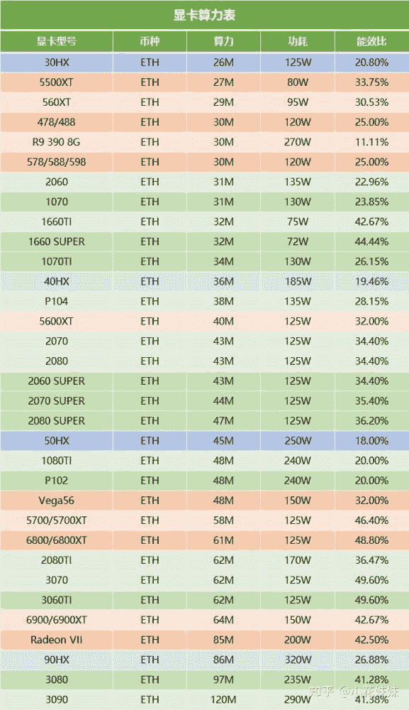

<!--yml
category: 挖矿
date: 2022-06-26 00:00:00
-->

# 技嘉最新全部下架大事件：挖矿、选卡我们该何去何从？

> 原文：[https://zhuanlan.zhihu.com/p/371398017](https://zhuanlan.zhihu.com/p/371398017)

## 技嘉不会被请出市场，只要够便宜，总会有人买。

显卡专用包

最近，技嘉官方微博公布了一张图片，上面从品质方面进行评判：**坚持台湾品质。**

这一波操作我愣是没看懂

**挑战国人底线的前车之鉴，这样的的惨痛教训还不够多吗？**

这引起了多方面硬件商和新闻界的轩然大波。表面上来看，字面的理解就是台湾制造就是好的，中国代工就是降低品质。如此用意的区别了台湾和代工制造，用意大家自然也是心知肚明。

目前来说，技嘉所有商品已经在各大厂商下架，目前已经搜不到了。

作为电子数码产品，或者说游戏界，我认为一直可以喊着和奥运会一样的口号：**竞技无国界。**这种凭借着自己品牌拥有影响力来吹风造势的行为实在是伤透了竞技玩家和DIY玩家的心。目前的带头大哥：华硕ROG、微星、技嘉。这一波操作真的是能让华硕ROG和微星笑醒。

从品质上来说，技嘉确实可以在硬件市场占据一席之地。但是这种不稳定的操作真的让后续再选择硬件的玩家在考虑技嘉的时候忌惮三分。可能今天买了技嘉的显卡，明天技嘉再发个公告可能厂家都没了，质保都成了问题。所以品牌的选择，近期甚至几年之内，我们都需要谨慎考虑了。

而目前的显卡定价基本上都以算力为基准定价，什么做工？算力即是**正义**。

**贵几百上华硕，性价比上七彩虹基本成为目前圈里的定律。**

笔记本方面，圈内比较流行的就是**130W满功耗**的机械革命，性价比之选基本上独此一家。如果比较有品牌观念，那么同样具有性价比的就是联想的R9000P，都是130W满血版的笔记本，基本都可以维持到60度和45以上的算力。

最新动态：技嘉已经发公告。

> 致歉声明书
> 日前我司官网发布的部分文字内容与事实严重不符，系公司内部管理不善所致，对此给大家带来的不适我司致以诚挚的歉意，同时也感谢广大玩家用户对我司的关注。技嘉产品业务包括板卡、笔记本电脑、电脑周边配件等，生产线遍布中国大陆，产能占比高于90%。技嘉深以中国生产的品质为荣, 中国生产协助技嘉为全球消费者打造优秀产品和优质体验，产品品质多年来经受住了市场和消费者的检验。技嘉在中国大陆开展业务已有20多年，对于此次的不当言论会深刻检讨并进行整改动作以符合国家原则。技嘉将加强内部管理和培训，确保所有员工都意识到问题并给予重视。
> 技嘉科技2021年5月11

* * *

这个时间的发生，恰好如今的ETH已经马上本着2.6万RMB涨势而去，一改前日的低迷。目前的算力比是**1.51元/M/天**。比特币一直维持5.5W左右。

这里可能大家不理解，我来解释一下。比如你拥有一块3060的显卡，那么你的算力应该在48M左右。所以你的日收益大约是48*1.51元。

算力和温度大家也可以参考一下目前我自用的**机械革命蛟龙7，**也就是上面链接推荐的17.3寸的那一款。

通过我自己的截图，也基本可以验证这个算法71.86/45.07=1.59元/M/天。而图中使用的软件是，针对**单卡**和**个体户**的懒癌神器。

使用教程可以参考如下链接。

目前来说，ETH的全网算力和难度都是在不断增加的。也就是说虽然你每天产出的币量减少，但是单价比较高。所以就本人观点，如今的矿潮还可以再持续一波。当然，**谨慎**是我永远的建议。

我认为最好的心态永远是：

## 设备自用。通过手法来提高设备的性价比。

很多新手，或者DIY玩家并不知道自己的显卡处于什么水平 。以下这张图已经是比较全的型号了，可以拿去比较和计算。

很多人私信我推荐什么型号的显卡。

这里基本讲的都是针对单卡或个体普通用户。从图中可以看出，3060TI和3070算力上是一样的，但是实际体验来说，3070的功耗明显大于3060TI。

所以对于个体游戏玩家来说，我更推荐购买3070，因为性能更强。而且个体玩家注重的游戏体验优先度肯定是大于电费的，当然差距也非常有限，可能一天的电费差距不到一元钱。至于品牌，肯定就不多说了，必须整上我们的国产之光。

**总结：**手中握有技嘉的玩家们也无须担心。通过和技嘉各大代理商的沟通表示，这种情况既然已经发生，销量等问题在所难免的有所损伤。但是绝对不会导致售后质量的降低。相信如今快速发展的今天，着装已经成就了李宁，硬件圈一定也会出现我们引以为傲的国产品牌。

**相关阅读**

[挖矿教程](https://zhuanlan.zhihu.com/p/355955385)丨[挖矿毁显卡吗](https://zhuanlan.zhihu.com/p/358944242)丨[笔记本挖矿](https://zhuanlan.zhihu.com/p/360451565)丨[如何识别矿卡](https://zhuanlan.zhihu.com/p/378074608)丨[超频设置](https://zhuanlan.zhihu.com/p/366535305)丨[技嘉事件](https://zhuanlan.zhihu.com/p/371398017)丨[矿难了吗](https://zhuanlan.zhihu.com/p/375027179)丨

**618专场**

[306070差距](https://www.zhihu.com/question/447817962/answer/1909204347)丨[满血版笔记本](https://zhuanlan.zhihu.com/p/374748213)丨[小米11 VS Mate40](https://zhuanlan.zhihu.com/p/374601975)丨[锁算力显卡](https://zhuanlan.zhihu.com/p/374342633)丨[养车专场](https://zhuanlan.zhihu.com/p/374702239)丨