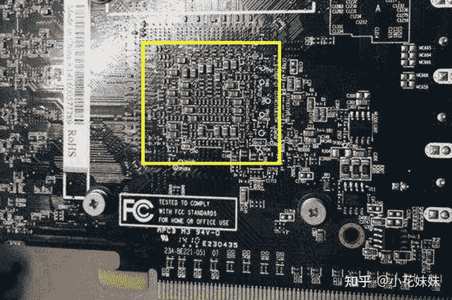
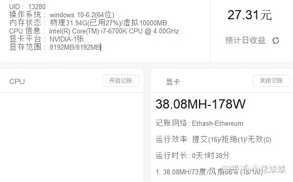
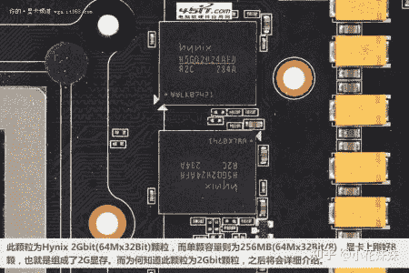
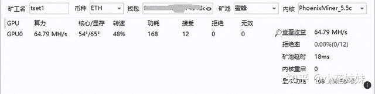
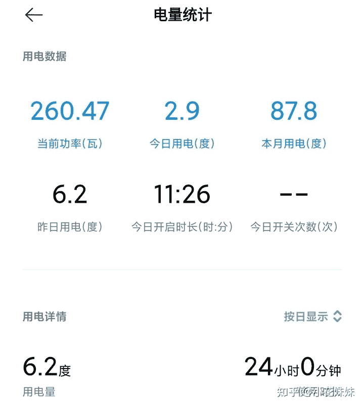

<!--yml
category: 挖矿
date: 2022-06-26 00:00:00
-->

# 挖矿到底会不会损耗显卡解惑

> 原文：[https://zhuanlan.zhihu.com/p/358944242](https://zhuanlan.zhihu.com/p/358944242)

## 温度都不超60度，损耗还不如你玩3A大作。

怎么挖矿的教程，前一篇文章我们已经进行了详细的介绍。

具体教程链接在这里，包括**显卡预计收益和回本周期都有统计。**

本篇文章，主要是解决大部分人对于挖矿的首要顾虑：**显卡损耗**

**先上结论：不会**

如今的挖矿概念和以前的挖矿概念，其实是**不同**的。

* * *

以前的矿潮，主要是我们龙头大哥：**比特币** 引起的。

挖他需要的是我们的核心频率，也就是GPU。为了营造更高的利益，大部分的矿老板会对核心频率进行超频，造成核心超负荷超温的长时间工作，也就造成了以前矿卡都会出现的问题：**黄屁股**。主要造成的原因就是高温。

这是我们区分**矿卡**和**自用卡**的主要区别手段，也是显卡损耗的主要元凶。

* * *

而如今的矿潮和以往不同，带头的大哥是**以太坊**。

因为算法的不同，使用的软件也不相同。

举例说明，比如这款就是**专门挖以太坊**的。

他的界面比较简单，基本上可以做到“一键操作”，没有复杂的矿池等问题

截图来自[哈希宝](https://link.zhihu.com/?target=http%3A//app.hxbao.com/reg/invite/O14BJF6q)

以太坊的算法，使用的不是我们的核心频率，而是显存频率。类似于我们的**内存频率。**

相对于核心频率，是不太需要的。而核心是我们的功耗和发热大户，所以挖以太坊的时候，超频设置是超频显存频率，而限制核心频率。

常年挖矿的超频设置，一般会把核心频率的功耗限制到总功率的60%左右，对于载荷而言，它的工作强度甚至比不上你玩**3A大作**和**网游**的强度。

目前满血版的笔记本可以做到一天接近30。

## 温度方面

核心温度方面，更是不用担心。因为限制了大部分的核心功率，显卡的温度大部分都维持在60度左右，甚至有动手能力强的人，可以压低不到40度

如果实在是不放心，处理办法也很多，首先可以添加显卡的散热片。

或者是上显卡的散热风扇。都是不错的选择，为你的显卡保驾护航。

### 用电方面

我就直接上一张图了。主机24小时用电量，显卡2070。截图来自小米插座

## 硬件残值

很多人认为，挖矿会影响自己出二手的价格。

其实对于挖以太坊，只能说是保护自己的应有利益。因为以太坊的特殊性，导致了显卡不会“黄屁股” 目前的市场没有有效的办法辨别显卡是否是挖过矿的矿卡。如今又是全民挖矿的矿潮，二手市场谁是谁非，没有人能说清楚。

最保险的观点就是20和30系显卡，只要二手都按**矿卡**处理。

这也就导致了20和30系显卡的持有者被强行“上车”，没有人在乎你挖，或者不挖。

所以通过你手中的卡， 回一回血。其实是在保护你二手出货时候的利益。

**挖矿专场**丨[锁算力卡挖矿](https://zhuanlan.zhihu.com/p/399409039)丨[未锁卡挖矿教程](https://zhuanlan.zhihu.com/p/355955385)丨[笔记本挖矿](https://zhuanlan.zhihu.com/p/360451565)丨[锁算显卡怎么挑](https://zhuanlan.zhihu.com/p/374342633)丨[挖矿毁显卡吗](https://zhuanlan.zhihu.com/p/358944242)丨

**猴山专场**丨[猴山解密3080TI](https://zhuanlan.zhihu.com/p/379179943)丨[猴山解密3070TI](https://zhuanlan.zhihu.com/p/379428935)丨[买70TI还是80TI](https://zhuanlan.zhihu.com/p/379846007)丨[猴山冲4K](https://zhuanlan.zhihu.com/p/380129626)丨

**笔记本专场**丨[满血版笔记本怎么挑](https://zhuanlan.zhihu.com/p/374748213)丨[买3060还是70本](https://www.zhihu.com/question/447817962/answer/1909204347)丨[3050本评价](https://www.zhihu.com/question/462045112/answer/1913547325)丨[蛟龙7测评](https://zhuanlan.zhihu.com/p/369226521)丨