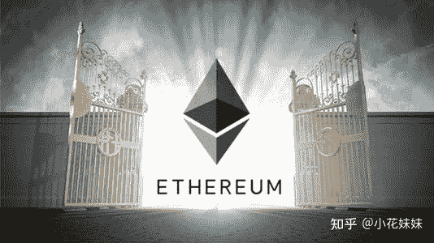

<!--yml
category: 挖矿
date: 2022-06-26 00:00:00
-->

# 挖矿真的能赚钱吗？

> 原文：[https://www.zhihu.com/question/389515687/answer/1772774027](https://www.zhihu.com/question/389515687/answer/1772774027)

 以目前来说的币价是完全可以的，比特币和以太坊是目前的两个主里军。这两种数字货币因为算法的不同，需要的硬件也是不同的。

比特币主要需求的是核显能力。目前十几万的。专业矿机有几T的算力，是日常家用显卡无法比拟的能力。比特币已经将挖矿的门槛提升到了常人无法入门的级别。

而以太坊另辟蹊径，找到了另外一条属于自己的路。通过显存的读取频率来限定你的挖矿算力。

以目前的硬件水平，内存频率不会有质的突破，所以可以让以太坊在一个平稳稳定的状态下长时间发展。而且为了减少发热和功耗，超频设置里面都是减少核显频率，超显存的频率，这也算是稳定了硬件的寿命。而且降低了挖矿的门槛。不管是什么样的显卡，基本上都可以试一试水。不过最低还是4G内存以上的显卡比较有优势。

目前最影响以太坊发展的，还是货币传输的矿工费，俗称就是手续费。不知道解决了这个问题以后以太坊会不会迎来新的春天。

**挖矿专场**丨[锁算力卡挖矿](https://zhuanlan.zhihu.com/p/399409039)丨[未锁卡挖矿教程](https://zhuanlan.zhihu.com/p/355955385)丨[笔记本挖矿](https://zhuanlan.zhihu.com/p/360451565)丨[锁算显卡怎么挑](https://zhuanlan.zhihu.com/p/374342633)丨[挖矿毁显卡吗](https://zhuanlan.zhihu.com/p/358944242)丨

**猴山专场**丨[猴山解密3080TI](https://zhuanlan.zhihu.com/p/379179943)丨[猴山解密3070TI](https://zhuanlan.zhihu.com/p/379428935)丨[买70TI还是80TI](https://zhuanlan.zhihu.com/p/379846007)丨[猴山冲4K](https://zhuanlan.zhihu.com/p/380129626)丨

**笔记本专场**丨[满血版笔记本怎么挑](https://zhuanlan.zhihu.com/p/374748213)丨[买3060还是70本](https://www.zhihu.com/question/447817962/answer/1909204347)丨[3050本评价](https://www.zhihu.com/question/462045112/answer/1913547325)丨[蛟龙7测评](https://zhuanlan.zhihu.com/p/369226521)丨