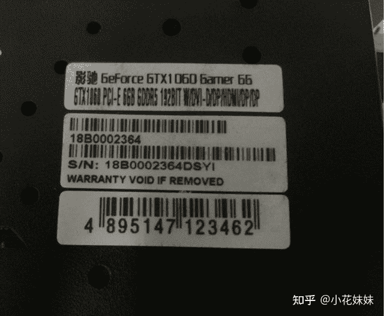
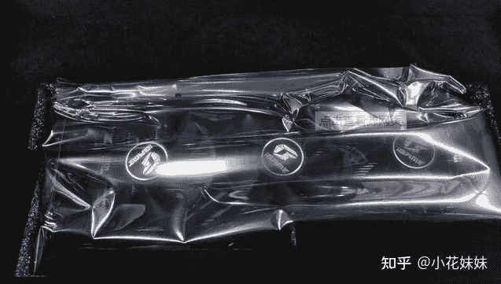
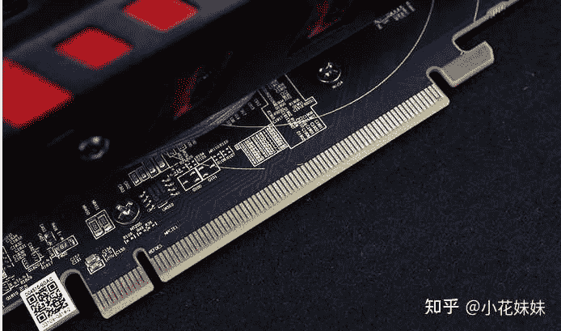

<!--yml
category: 挖矿
date: 2022-06-26 00:00:00
-->

# 挖过矿的显卡，有没有可能翻新成新显卡卖？

> 原文：[https://www.zhihu.com/question/446786332/answer/1891354366](https://www.zhihu.com/question/446786332/answer/1891354366)

 不是有没有可能，是基本上百分之百。主要问题是你想不想折腾。新卡出售，基本分为两种：**有箱说，原包装**和**无箱说，成色全新。**

## **有箱说未拆封**

先说第一种，作为全新未拆封的显卡，必须满足的条件有以下几项。

第一，首先是显卡的SN码和外包装盒子上的SN码一致。作为我们购买显卡的外行人来说，其实那不过是一张贴纸，包括显卡背部和外包装上的SN码贴纸，下一点功夫都是可以重新印刷贴上的。只要制作好了贴纸，那么你只需要一个吹风机就可以完美的进行重新粘贴的操作。

如果没有盒子，那么某鱼搜一下几十块钱一个包你满意。

同样全新显卡的标志，就是“**静电袋**”对于自由封装机器的人来说，成本同样不是很高。所以作为外包装方面的全新来说，都是有手法去想办法伪装的。我们新买的显卡，并没有对比区分是否为原厂的包装，所以走心的老板出显卡的时候，确实是有实力批量伪造的。

唯一可以真正的区分是否是使用过的显卡的方式，就是观察“金手指”但是这种方式并不是很明显，操作小心的金手指并不会留下明显的伤痕。而且金手指同样可以通过手段翻新。

所以单从外包装未拆封来区分是否是全新显卡，并不是非常明智的选择。

## 无箱说的成色全新显卡

这种显卡基本上我们拥有的显卡，在精洗之后都是可以打到的成色。而且丧心病狂的“水洗显卡”并不是那么的没有道理。我们都知道，电子元件不能水洗，但其实这句话是有条件的。满足条件以后，我们可以用水洗出全新的成色，并不是没有可能。

那就是在通电之前必须要充分的**晾干**，并且最好用不含水垢的**蒸馏水**清洗。水只有在通电的情况下才会对电子元件造成损害，尤其是水被电离以后形成的铁锈和水垢会造成短路。所以只要胆大心细，就没有什么不可能。只要风扇没有异响，没有意外磕碰。那么成色好的显卡是非常容易通过精洗的手法造就的。

## 那么我们是否要彻底放弃二手卡呢？

我觉得非常没有必要，首先目前的挖矿市场主要还是ETH也就是以太坊。

它的运算主要是靠显存。在超频的过程中会超显存，限制功耗和核心频率，所以不会造成“黄屁股”。也就是目前没有什么有效的手段区分矿卡的原因。而哪怕显存损坏，以目前的30系列显卡来看，基本上都持有2年甚至以上的保修，所以基本上无须担心。哪怕是没有保修的显卡，通过重新焊接显存维修，基本上也就是5-10天白挖的情况。并没有连本带利亏到没法翻身的地步。更有甚者把1050TI的**4G**魔改成**8G**加入挖矿行列的神人。

所以我认为，既然选择了二手。可以拓宽选择的范围，并不一定非要选择稍微便宜一些的某鱼二手全新卡。猫腻太多，社会太复杂。可以更偏向于带有质保，可以个人送保的品牌。

技嘉已经陨落，七彩虹能不能抓住机会给予我们玩家一个完美的答卷，登上硬件三巨头的宝座，就看运营怎么操作了。

**挖矿专场**丨[锁算力卡挖矿](https://zhuanlan.zhihu.com/p/399409039)丨[未锁卡挖矿教程](https://zhuanlan.zhihu.com/p/355955385)丨[笔记本挖矿](https://zhuanlan.zhihu.com/p/360451565)丨[锁算显卡怎么挑](https://zhuanlan.zhihu.com/p/374342633)丨[挖矿毁显卡吗](https://zhuanlan.zhihu.com/p/358944242)丨

**猴山专场**丨[猴山解密3080TI](https://zhuanlan.zhihu.com/p/379179943)丨[猴山解密3070TI](https://zhuanlan.zhihu.com/p/379428935)丨[买70TI还是80TI](https://zhuanlan.zhihu.com/p/379846007)丨[猴山冲4K](https://zhuanlan.zhihu.com/p/380129626)丨

**笔记本专场**丨[满血版笔记本怎么挑](https://zhuanlan.zhihu.com/p/374748213)丨[买3060还是70本](https://www.zhihu.com/question/447817962/answer/1909204347)丨[3050本评价](https://www.zhihu.com/question/462045112/answer/1913547325)丨[蛟龙7测评](https://zhuanlan.zhihu.com/p/369226521)丨