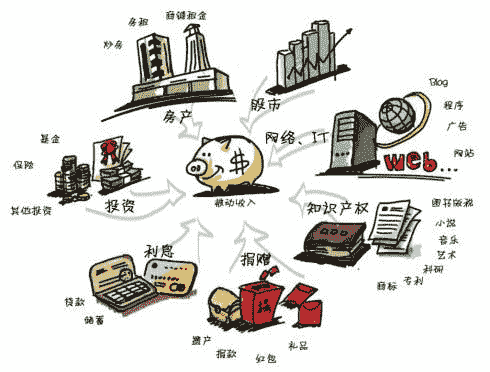

<!--yml
category: 未分类
date: 2022-06-26 00:00:00
-->

# 数字游民(Digital Nomad)榜样 - 年入百万美金的网络被动收入布道师Pat Flynn（含被动收入模式详解）

> 原文：[https://jarodise.com/patflynn](https://jarodise.com/patflynn)

本期数字游民榜样介绍的这位人物自己不是数字游民（至少他自己认为不是），但是却被全世界无数数字游民(Digital Nomad)奉为导师，他就是SmartPassiveIncome的创始人Pat Flynn，在步入正题之前，我想先解释一个概念，什么是被动收入（Passive Income）：

> 被动收入是一种只要付出一点努力进行维护，就能定期获得的收入。 --维基百科

上面这张图很清晰地为被动收入进行了分类，被动收入是相对主动收入而言的，举个例子，小王每天去上班，月底发工资，这个工资就是就是主动收入，小王工作了10年攒够了钱买了套房子，把房子租出去每个月收租，这个租金就是被动收入。被动收入是不是只有收房租这一种呢？当然不是，小王的钱如果没有买房子，而是买了股票，那股票涨了以后赚的钱也是被动收入。小王如果在上班之余写了一本书，这本书出版后销售产生的版税也算是被动收入。我们平时做的大部分工作都是trade your time for money，赚的是主动收入，你停止劳动的那一刻，钱也有没有了，而被动收入则是先工作，然后在之后慢慢地躺着享受劳动成果。

其实“被动收入”这个概念在红极一时的《富爸爸穷爸爸》中曾经提被到过，但是富爸爸主要推广的被动收入方式是进行房地产投资，以钱成钱，需要一定的原始积累。而互联网的飞速发展让个人内容营销与草根创业变成了可能，基于内容的互联网创业进而变成了一个非常重要的赚取被动收入的手段，而且并不需要大量的初始启动资金，它更需要的是创业者的idea和执行力，其实之前的几期数字游民榜样中介绍过好几个这类案例，而我们今天要介绍的这位Pat Flynn则是互联网被动收入领域的大咖Guru级别人物，他不但自己每年轻松入账百万美金的被动收入，还通过自己的播客和网站指导成千上万的数字游民进行互联网创业，通过赚取被动收入解放自己并打造属于自己的数字游民生活方式。

Pat 上大学的时候就喜欢平时没事儿写写博客记录下生活琐事儿，大学毕业后他顺利拿到一份建筑公司的offer，因为工作需求他必须参加LEED(Leadership in Energy and Environmental Design)资格认证考试，由于考试涉及很多烦杂的知识点，需要大量的整理和记忆，Pat索性做了一个Wordpress网站，把自己整理出来的考点放在上面，一来方便自己复习，二来可以跟别的同事一起分享。2008年3月，Pat最终顺利通过了考试，可曾想，几个月后，席卷全球的金融危机来袭，Pat失业了。

屋漏偏逢连夜雨，恰巧此时他又刚刚结婚不久，老婆怀孕，孩子即将诞生。这可急坏了他。天无绝人之路，失业在家这段时间，Pat开始收听一些网上的互联网创业播客，并从中受到启发，接下来他给这个自己做的LEED考试网站安装了统计工具，出乎他意料的是，虽然网站已经好久没有更新过，每天仍然有上千人访问，Pat发现由于他总结的知识点非常到位详细，这个网站在LEED考试圈已经很火，而且很多页面在Google上面排名很高。在一些粉丝的建议下，Pat把网站的内容重新包装，做了一本电子书放在自己网站上面卖，靠这本书，Pat一年之内入账20万美金，由于是电子书，Pat不用担心出版，印刷，发货等琐事儿，只要有人买书，钱就会自动打到他的Paypal账户上，而这正就是所谓的被动收入。

尝到了甜头的Pat决定再做一个网站，分享自己赚取被动收入的经验，[SmartPassiveIncome.com](http://SmartPassiveIncome.com) 诞生了。Pat不但在这个网站详细记录自己通过尝试各种互联网被动收入的产生的结果，并且毫无保留地将自己每个月通过互联网赚取的被动收入放在网站右上角非常显眼的位置，并且会出具一份详细报告，告诉大家这些钱他是通过何种渠道赚到的。

打开一份Pat的最新收入报告，我们可以看到，他最大的收入来源是一篇教别人如何在4分钟内在Bluehost（美国著名虚拟主机提供商）上搭建自己私人博客的文章，单单这一项每个月就能为他贡献5万美金左右的收入，很多朋友不理解，一篇文章怎么能如此赚钱。这里Jarod需要给大家解释下Affiliate Marketing的概念，网上都把它翻译成网络联盟营销，我觉得翻成口碑返利营销也许更容易被人理解，简单举个例子，你周末要出去郊游，想买一双登山鞋，你知道你们公司的小王是个户外运动专家，于是你问他去哪买比较好，小王告诉你刚好他朋友开了家店，里面的鞋很不错，去这个店提他的名字还有折扣，出于对小王的信任，你去了这家店，选好一双鞋，结账时候，你跟店家说：“您认识小王吗？我们是同事，他告诉我来您的店里买鞋。”店家听到你是小王介绍来的，痛快地给你打了九折，你走后，店家给小王发了个100元的微信红包以示感谢。这就是Affiliate Marketing的最基本模式，只不过，搬到互联网上，这一过程被数字化与自动化了。 Pat Flynn写了这篇很简单易懂的搭建博客的攻略，由于在搜索引擎上排名很高，因此点击量很大，大家看完这篇教程以后都想跃跃欲试的搭建自己的博客，可是用哪家的虚拟主机呢？Pat在文章的最下面会告诉你，Bluehost的主机很不错哦，稳定，快速而且价格合理，他自己的博客就是在Bluehost上建的，而且你通过点击他的专用链接进入Bluehost购买主机，还能享受5美元立减的优惠，这等好事儿你当然不能错过，于是你十分乐意地通过Pat的链接买了Bluehost的主机，因为这个链接中有Pat专属的Affiliate ID，所以当你从Bluehost购买的时候他们就会自动按照协议给Pat提供佣金，他每个月50000美元的被动收入就是这么来的，这一过程是自动的，他不需要做任何事情，这就是被动收入的美好之处。

从Pat Flynn的收入报告上我们可以看出Affiliate Marketing是他最主要的收入来源，除此之外，他最开始做的那个帮别人通过LEED考试的网站依然在运行，8年过去了，这个网站每个月依然能够售出2000美元左右的电子书，要知道单单是这一项就高于很多普通人一个月的薪水。

此外Pat还有一个网站 - [Foodtruckr.com](http://Foodtruckr.com)，这个网站是专门教人如何从零开始做一门快餐车买卖的，网站靠买电子书教程和Google Adsense每个月可以为他带来近1000美元的收入。上面提到LEED考试网站和Smart Passive Income网站都是Pat自己擅长做的事情。而这个快餐车则是他从未涉足的行业，这个故事告诉我们：通过细心地钻研和合理地自我营销，任何人都可以在一定时间内在互联网上成为某一方面的专家，树立意见领袖的地位，当大家都把你当expert看的时候，就会产生信任，也会心甘情愿地买你卖的东西或者你推荐的东西，这就是所谓的niche marketing，选好一个自己感兴趣或者删除的垂直细分领域或者话题，建一个网站或者自媒体，不断的发布优质内容，久而久之你就会被大家公认为这方面的专家，之后想要赚钱就是水到渠成的事情了。

按照相同的思路Pat还制作了另外一个网站，[SecurityGuardTrainingHQ.com](http://SecurityGuardTrainingHQ.com)，这是一个介绍保安培训信息的网站，你可能会想，这都能赚钱？！没错，就是这么个不起眼的网站每个月会通过Google Adsense给Pat带来近2000美金的被动收入。与上面的FoodTruckr一样同样是一个Pat本人从未涉足的领域，但是依靠不断的努力提供优质内容和进行搜索引擎优化，这个网站在Google上面排名很高，只要有人搜索保安培训信息，就一定能找到他这个网站。其实这个网站源于Pat跟朋友一个竞赛，他跟一个朋友约定，看谁能从0开始把一个niche网站推到Google排名的首位，Pat在一年之内就做到了，他在自己的SmartPassiveIncome网站上详细记录了这一过程（niche duel），感兴趣的朋友不妨去读一下，很有意思，也很有启发性。

俗话说狡兔三窟，Pat赚取被动收入的方式也不仅仅是上面提到这几种，再看Pat的收入报告，他还通过制作手机应用，Wordpress插件赚钱，此外他主持的SmartPassiveIncome Podcast是互联网上听众最多的播客节目之一，很多公司选择为他提供商业赞助，光是这笔赞助也是一笔不菲的收入。

我在之前的数字游民扫盲贴中提到了几种互联网创业的模式，有主动收入也有被动收入，而我本人是更倾向于赚取被动收入的，因为被动收入能赋予你更大的自由，难道这不就是我们想要成为一个数字游民的初衷吗？举个例子，一个英文很好的人，想要通过教英语成为一名数字游民，他可以通过在网上与别人连线的方式教别人英语，按小时收费，也可以埋头做一套英语学习教程然后放到网上卖。前者简单，来钱快，但是一旦哪天不教了，钱也没有了。后者则要费很大精力，而且需要花很长时间树立威信才能最终说服别人购买，但一旦产生了收入，是被动收入。虽然这两者选择都可以赋予你地域不受限（location independence），但是我个人认为后者才是数字游民生活方式的优选打开方式，你觉得呢?

以上就是Pat Flynn的励志故事以及我本人对于互联网内容创业与被动收入的理解，如果你对这个话题感兴趣并且想继续深入了解，不妨访问Pat Flynn的网站[SmartPassiveIncome.com](http://SmartPassiveIncome.com)或者收听他的Smart Passive Income Podcast吧，相信你一定会有所收获！

**本文系Jarod Zhang原创，如需转载请联系作者授权。坚持原创不易，你的打赏和转发是我继续创作的最大动力。**

数字游民部落致力于推广目前在全世界日益流行的数字游民（Digital Nomad）生活方式，和Lifestyle Design的方法和理念。

数字游民知识星球是目前华文圈最权威的数字游民（Digital Nomad）生活方式设计主题社群，最大的数字游民/远程办公/环球旅行中文资源库，云集环球旅行，远程办公，自由职业等各路达人大V。 

数字游民部落官网：[JARODISE.COM](http://JARODISE.COM)

微信公众号：数字游民部落