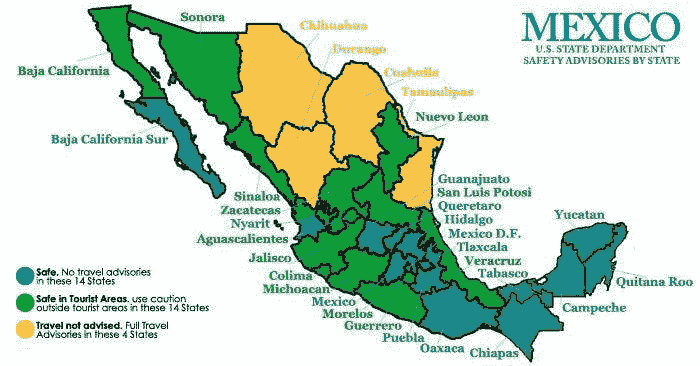
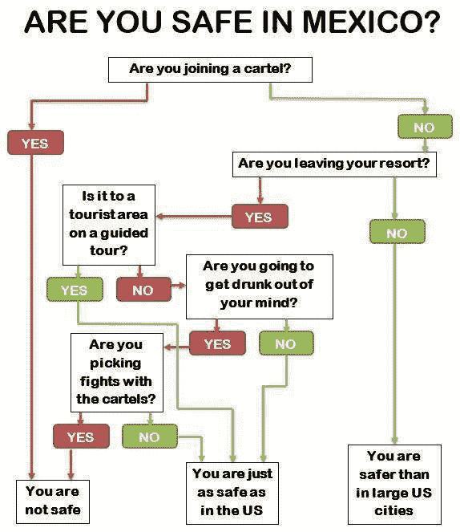
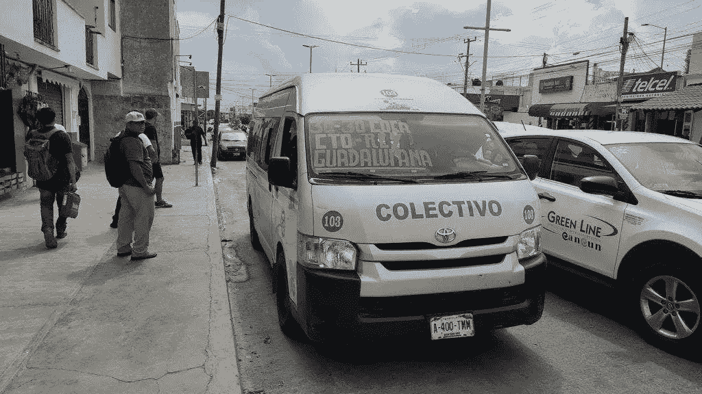
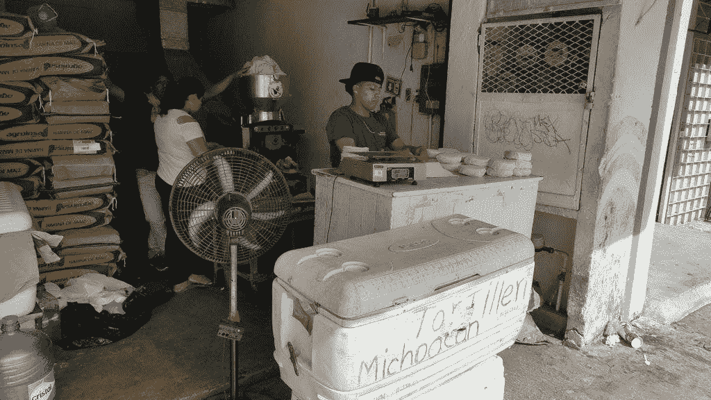
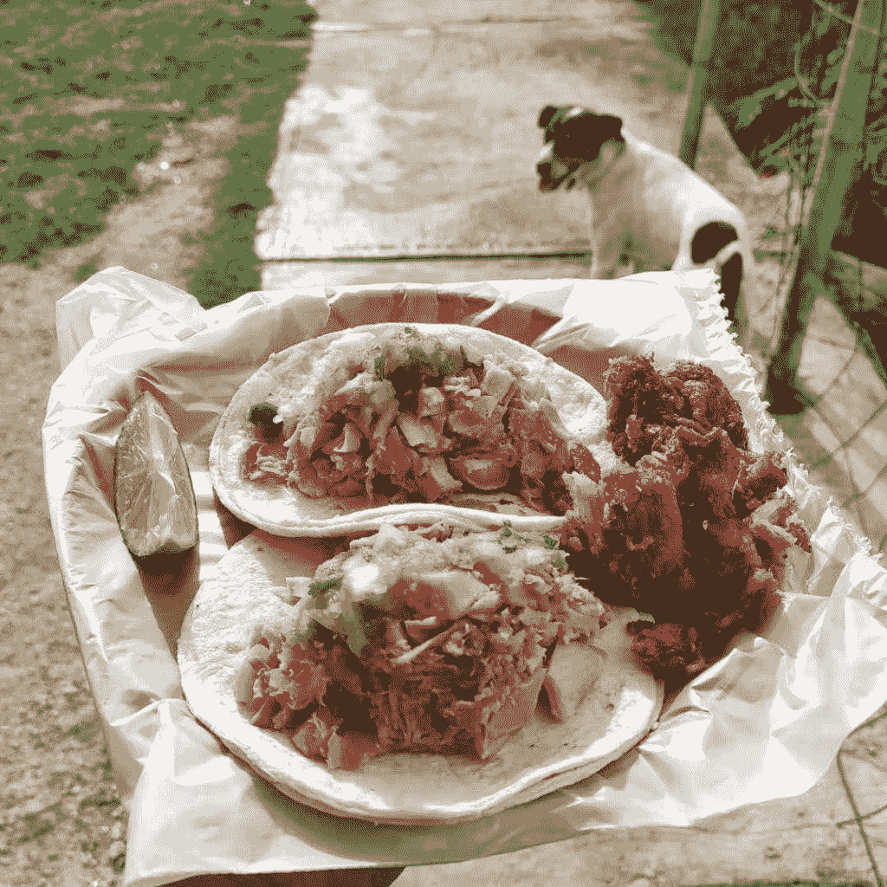

<!--yml
category: 未分类
date: 2022-06-26 00:00:00
-->

# 数字游民终极城市指南：墨西哥Playa Del Carmen

> 原文：[https://jarodise.com/the-ultimate-playa-del-carmen-guide-for-digital-nomads](https://jarodise.com/the-ultimate-playa-del-carmen-guide-for-digital-nomads)

在到达墨西哥之前，拉美一直是我这些年世界旅行地图上的一块空白，和一些资深旅行者聊天时候，每到拉美的部分我就只有听的份儿，于是我在2019年初我就暗下定决心，要在2020年到来之前打卡拉美，并借此机会捡起自己之前一直没能学会的西班牙语。

今年9月份，我和太太离开波兰，经法兰克福直达坎昆，登陆墨西哥，随后便来到了我们本次拉美游民体验之行的第一个目的地Playa Del Carmen（中文名卡门海滩，以下简称Playa)。

从9月中旬到达，到11月中旬离开，我们在Playa生活了两个多月。以下你将读到就是我们在这两个月的所见所闻所感，你也可以把它当成一份Playa Del Carmen的数字游民/慢旅行指南。

## 墨西哥是否安全？

在进入正题之前，我想我非常有必要先回答一下上面这个问题。我发现当我在社交媒体分享有关墨西哥的内容的时候，有关墨西哥安全方面的问题是很多朋友最关心的话题。

**首先，我觉得这个问题不应该这么问，你应该问：**“墨西哥某某地方是否安全？”**

众所周知，墨西哥是个国土面积相当辽阔的国家，网络上，影视作品中对墨西哥凶残的毒枭的报道刻画给墨西哥整个国家扣上了一个“危险”的帽子，殊不知其实墨西哥的毒品网络和毒枭活动范围其实只存在于少数的几个州。

上面这张墨西哥旅行安全建议图来自美国State Department，从这张图我们不难看出，深绿色（Safe），浅绿色（Safe in Tourist Areas）的州占到了绝大多数，只有少数几个和美国接壤的州处于黄色的不安全地带。

因此，网上也有人制作出了这样一份有关墨西哥旅行安全状况的流程图：

换句话说，**只要你不去上面地图上那些黄色的州，不与毒品网络有任何交集，同时多用一点common sense，那么墨西哥其实跟世界上绝大多数旅行目的地一样安全，不用多虑。**

我在Playa Del Carmen的Expats群体中听到过一些恐怖故事，例如酒吧/渡轮被炸，乘坐出租车被司机持枪抢劫，但是也仅仅是别人口中的传言而已。在Playa的两个月，我没有遇到过哪怕一次不安全的状况，即便我们经常晚上出门在街上行走。

## Getting In

我们这次从欧洲过来乘坐的是德国Condor航空从法兰克福到墨西哥坎昆的直飞航班，这也是我能找到的从波兰到墨西哥性价比最高，最不折腾的一个选择。机票价格差不多折合人民币3000元/人。Condor虽然是廉价航空，但是有免费的行李托运，飞机上还管免费的饮品和两顿饭，总体来讲体验还不错。

之前咨询了几个在朋友，都说墨西哥的边检很水，盖章秒过，再加上我本身有美签和申根签双重加持，所以这次我也没有提前准备任何返程/离境机票。结果，就真的遇到一个“认真负责”且脸色非常难看的边检工作人员，不但问我要机票订单，酒店订单，还询问了职业，收入，而且拿着我护照上的美签摸摸索索了半天，好像她能鉴定真伪似的。

最后，虽然有惊无险地获得了墨西哥半年有效的入境戳，不过还是要在这里也算给大伙提个醒，**不管你计划来墨西哥待多久，最好都象征性地准备一份酒店订单和离境机票订单，能免费取消那种即可，因为不论你计划在墨西哥呆多久，边检都会大概率给你180天的有效入境戳，这样可以最大限度避免类似“意外”情况的发生。**

从坎昆到我们的Playa Del Carmen有空调大巴（ADO），单程车票大概80元人民币一张，1个小时左右，即可从坎昆机场直达Playa市中心。

# 租房

我们的Airbnb只订了4晚，因此到达后的头三天最主要的任务就是租房。通常来讲，一个数字游民到达一个陌生的城市寻找房源主要有3个渠道：1.Airbnb 2.当地资源（中介或者房东直租） 3.Facebook

Airbnb的优势在于，租期灵活，有平台担保，而且无需缴纳押金。在来Playa之前，我们已经在Airbnb上做过一轮搜寻，说实话，并没有发现太多满意的房源，或者更准确地说，没有在我们的预算范围（2000-3000元）内找到合适的选项。

我们订的第一个临时Airbnb位于市中心北面一个叫做Luis Donaldo Colosio的区域（简称Colosio），也是我们一开始计划租房的一个区域，但是后来实地考察发现，如果没有合适的代步工具，住在这里可能并不是特别方便。这个故事也告诉我们，租房时候实地考察是非常重要的，除非有非常靠谱的信息源，否则不推荐在没有实地考察的情况下就在网络上签订租约。

另外，通过头两天的实地考察我们发现，离开游客聚集区域，这里绝大部分的普通人居然都不怎么会讲英语。我原以为这样一个旅游业发达，而且紧靠着美国佛州的地方怎么着英语普及率也比泰国好一点，结果却并不是这样的。也是因为这个原因，我们租房的进展并不顺利。

之后我们把注意力转到了Facebook，通过在“Digital Nomads Playa Del Carmen Cancun Tulum”这个小组发帖求助，我们找到了几个潜在的房源，而且还认识了一个已经在这里居住很久的波兰“老乡”。这里需要顺便提一句，Playa Del Carmen可能是目前拉丁美洲范围内热度仅次于哥伦比亚Medellin的数字游民热点城市。这面的DN脸书小组不但人气很旺，而且初步感觉大家都很友善，愿意帮助初来乍到的新人。

FB除了小组外，还有一个Marketplace功能是我以前不怎么经常使用的，它有点像内置在FB里面的一个58同城，会把所有当地的小组内相关分类信息发掘出来，用分类广告的模式重新排列，这样一来就避免了去各个小组里面顺着时间线看信息的麻烦。也正是借助这个功能，让我在短时间内又找到了两个比较靠谱的房源，并最终租到了一套较为满意的公寓。租金3000人民币一个月，这大概是Playa市中心Studio公寓的平均价格。

如果再次回到Playa，我会把租房的范围限定在Calle 12 - Calle 48，Avienda 20 - Avienda 45（如下方地图红框所示）这个区域内，因为这里既不会太贵，而且可以吃饭购物娱乐基本都可以步行搞定，是整个城市最为核心且安全舒适的区域。

当然，如果你计划租车或者不介意乘坐当地公交系统，或者在烈日下骑自行车，那么住在离中心区域稍远的地方也是可行的，而且房租成本会大幅下降。

## Getting Around

在Playa生活的两个多月，我们绝大多数时间都是用双脚丈量整个城市，除了白天比较热这个不可抗因素外，Playa总体来讲还是个非常适合步行的城市。

如果你觉得步行太慢太累，骑自行车也是个不错的选择。相对于国内，墨西哥的自行车价格并不便宜，即便是二手车价格也很少低于人民币500元，新车通常在800元以上，而且听闻这里的自行车盗窃极为猖獗，因此我们最终还是打消了购买自行车的念头。不过其实还有另外一个选择 - 共享单车，当地有一家叫做BiciPlaya的本土创业公司，在城市一些主要街道你常常可以看到这些绿色带停车桩的自行车，租金也还算比较公道，500比索(折合人民币不到200）就能骑一年。但是考虑到停车桩式共享单车某些时候无法顺利还车的糟糕体验，加上我们在Playa呆的时间并没有那么长，最后还是没敢贸然尝试。

如果距离大于2公里，我们偶尔也会使用当地的公共交通系统，在Playa的公交主要有两种形式一种是比较大的巴士“Tusca”，单程票一律5比索，司机就是售票员，并且提供找零。坊间传闻Playa的Busca总共有6条线路，不过直到离开Playa的那一天我也没有彻底搞清楚这个公交系统是如何运转的，可以肯定的是，在Playa的几条主干道上，例如30th Ave和Ave CTM，肯定会有Tusca途经。只不过，这面的公交站牌没有任何站点线路信息，你需要仔细观察车辆前挡风玻璃上印着的各种地名，如果有你要去的目的地，果断上车就好了。

Playa的另外一种公交是一种叫做Colectivo的面包小巴网络，Colectivo的线路比上面提到的Busca更为复杂，覆盖的范围也更广，你甚至可以乘坐Colectio前往周边的诸如Tulum和坎昆等城市，或者途中的一些著名旅游景点。Colectivo的票价是按路途长度计算的，比Busca略贵，而且随叫随停，要比Busca更为灵活机动。

最后，有时候我们还是不可避免地需要用到出租车，由于当地的出租车司机行会成功地阻止了网约车（Uber）的入侵，因此所有的游客在他们眼中都是待宰的羔羊一般存在。这里的所有出租车都没有里程表，所以上车之前一定要议好价格，虽然网上有Playa政府制定的官方指导价格表，但是基本上除非你的西班牙语十分流利，基本可以不用指望司机会认真执行。另外，根据当地新闻报道，很多出租车司机都跟毒品网络有或多或少的联系，因此如果你要在晚上乘坐出租车去人少的地方，一定要多多提防。

## 美食

作为一个不折不扣的吃货，每到一个新的城市，探索当地美食都是我的首要任务。在Playa两个月吃下来，我的主要感受有两点：

1.此墨餐非彼墨餐，在这里吃到的墨西哥菜跟我之前在世界其它地方吃到的墨西哥菜不大一样，特别是没有我想象中那么辣，真正辣的是自己酌情添加的各种酱料（salsa），特别是含有habanero辣椒的salsa。 

2.**绝大部分墨西哥菜用一句话总结就是：****玉米小饼（tortilla)卷一切。**食材直接放玉米饼上叫做taco，食材放在油炸变脆的玉米饼上叫做tostada，食材包在玉米饼里放油锅里炸熟叫empanada，食材加上奶酪包在玉米饼里煎熟叫做quesadilla。。。各种用玉米饼作为主食搭配其它食材做成的食物几乎占据了这里菜单的80%，基本上所有的餐厅都会免费赠送玉米饼，而街头卖玉米饼的Tortilleria跟我们国内买馒头面条的主食厨房一样常见。

接下来我就分享几个我自己经常光顾的私藏食肆，供大伙参考品鉴：

**1.Tacos De Carnitas El Tío**，一家我在Playa两个月中光顾了无数次的路边摊，也是我在墨西哥迄今为止吃到过的最美味的Taco。他家的特色是“Taco de Carnitas”，整头猪腌好后，放一口大铁锅里炸到烂熟，然后你想要哪个部位的肉，老板就会麻溜地给你切好一大团放在玉米饼上，配上自家秘制的红绿两种salsa和青柠汁，好吃到流泪。人民币7块5一个，两个就能吃饱。五星推荐！

**2.Loncheria Doña Mary。**这是一家晚上6点开业营业到凌晨，颇受当地人欢迎的深夜食堂。主打特色是鸡杂汤和鸡肉Tostada，炸脆的玉米饼上先抹一层黑豆泥，然后依次盖上鸡丝，腌洋葱，牛油果和奶酪丝和奶油，最后堆成一个小山，人民币9元一个，两个可以吃到撑。

**3.Pollo Pirata。**这其实是一家主卖外卖烤鸡的连锁快餐店，但是我从没吃过它家的烤鸡，而是经常点他们现做的Quesadilla和Sope, 大号手擀玉米饼中间对夹上满满的奶酪, 两面煎到金黄，最后夹入铁板煎熟的牛排或者扎猪皮，配合四种酱汁，入口满足感爆棚，人民币10元一个，一个就能吃饱。

## 旅游景点与项目

墨西哥尤卡坦半岛东南部，加勒比海之滨的一条狭长海岸沿线地带被称作Riviera Maya，是墨西哥旅游资源最为丰富的地区之一，除了加勒比海岛风情之外，这里还有各种古玛雅考古遗迹，以及全世界最为密集的Cenote（石灰岩天然井）分布。而Playa就正好坐落在Rivera Maya的地理中心，因此是一个非常适合打卡周边旅游资源的据点。

下面我就着重推荐几个给我留下深刻印象的旅游景点供大家参考：

### 1.Punta Esmeralda

Playa市区内最受欢迎的公共海滩之一，除了月牙形的海湾，乳白色的沙滩，高大的棕榈树外，这里还有几个天然泉眼，从而在海滩旁边形成了一汪水质清澈见底的天然泳池，是不可多得的避暑好去处。小贴士，为了避免和大量当地居民和游客一起煮饺子，尽量安排在工作日的早晨去。

### 2.Playa周边的Cenote

这里稍作解释，Cenote是一种地下暗河在地表石灰岩层塌陷后裸露形成的奇特地质构造，也是墨西哥尤卡坦最负盛名的招牌旅游资源之一，据说尤卡坦半岛分布有大大小小6000多个Cenote，密度为世界之最。他们中的绝大多数都隐藏在茂密的热带丛林中，一些品相比较好的，现代交通比较容易到达的被当地人改造成了一个个“收费”天然泳池。我们在Playa的前前后后大概打卡了将近20个Cenote，几个我个人比较推荐的有：Cenote Jardin El Eden，Laguna Kaan Luum，还有Cenote Cristalino。 

### 3.小城Valladolid

一个位于尤卡坦半岛中心位置的小城市，距离Playa一个半小时车程，可乘坐ADO巴士前往。这里不但有五彩斑斓的殖民风格建筑，同时也是打卡周边各种玛雅古迹和Cenote绝佳出发点，距离墨西哥五星级旅游景点Chichen Itza只有不到一个小时的车程。

你也可以租一辆自行车，顺着乡间小路打卡多个形态各异的Cenote。另外，我们还在这里惊喜地找到了一家由一对南京夫妇经营的餐馆/青旅 - Hostal 230，能在这样一个地球的角落吃到正宗的中餐（特别是早餐的油条），我险些感动到流泪。

### 4\. Xcaret Park

这可能是Riviera Maya地区最负盛名的旅游景点，也是墨西哥全境最大的主题游乐园之一。距离Playa只有十几分钟车程，整个公园依海而建，占地超过80公顷，囊括了野生动物，墨西哥民俗，以及自然风光等多重元素，特别值得一提的是每晚7点开始的，超过两个小时的600人大型演出“Xcaret Mexico Espectacular”，堪比一场小型的奥运会开幕式，虽然Xcaret的票价不便宜，差不多要人民币1000块一张，但是我觉得单单是这场演出就值回票价了。感兴趣的朋友可以观看下方我拍摄的视频。

[Xcaret旅拍视频](http://https//www.bilibili.com/video/av71041434)

## 网络与办公

最后，既然是数字游民攻略，自然需要聊聊Playa的网络与办公概况。

墨西哥的手机服务运营主要有Telcel，AT&T和Movistar这三家，4G网络覆盖率依次递减，但是套餐价格都差不太多。预付费电话卡可以非常方便地在随处可见的OXXO便利店买到，甚至无需出示任何ID，日后充值也可以在OXXO进行操作。总体来讲4G网络在城市内的覆盖还是比较好的，但是一出市区外就有可能没有信号，跟我们大天朝没法比。我们一开始买的是Telcel的电话卡，但是不知为何，两部手机都无法激活4G信号，最快的只有H+，去营业厅询问也无解，后来一个月套餐用完后我们换到了AT&T，同样是200比索一个月，3G流量加无限通话和短信，AT&T是有4G的。

Playa的有线网基建也非常不错，我们租的房子使用的是TotalPlay的光纤宽带，下行测速可以达到惊人的300Mbps，说实话，我在欧洲都没有体验过这么快的网速。同时也在这里给大家提个醒，租房时候手机里最好装个Speedtest App，签订租约时候一定要提前对WiFi进行测速。

Playa的联合办公空间（Coworking Space）主要有三家：Selina，Nest，Bunker，其中Nest价格最贵（240美元一个月），办公条件最好，同时Nest也是在社交网络上最为活跃的一家，基本上每周都有各种游民技能分享活动，还会结合公共节假日举办各种主题活动，聚餐等等，而且参加所有这些活动都不需要是Nest的付费会员，因此还是非常厚道的。到Playa后想要迅速渗透进入数字游民的圈子，只要无脑参加Nest举行的各种活动就好了，所有的信息都可以在他们的官方FB Page和Ins账号上看到。

一些游民也会选择在当地的一些咖啡厅办公，根据我的个人体验，Playa绝大多数咖啡厅其实都不太适合作为办公地点，要么太吵，要么不舒适，要么网络不够稳定，如果非要矮子里面拔将军，我会选择星巴克。

## 结语

综上所述，Playa作为一个老牌的墨西哥加勒比海滨度假胜地，借助其完美的地理位置，完备的服务业态，以及丰富的旅游资源，正在成为一个拉丁美洲冉冉升起的数字游民新星城市。特别是在2019年为期一个月的Playapreneur数字游民峰会成功举办后，可以预见未来这里的游民数量会稳步增加，各种服务于游民的业态也会逐步趋于完善。我本人也希望未来有机会能够再回到这里，继续我未完成的尤卡坦探索之旅。

最后，推荐一个我在本次长途旅行过程中用到的旅行保险产品，经过我仔细对比调研，目前国内所有的旅游保险产品最长保险时限都是半年，而且购买保险时本人必须是在国内。因此，这类保险对于那些计划出门半年以上且中途不打算回国，或者已经在国外但是还没有买保险的游民来说就不是特别友好了。

由硅谷知名创业孵化器YC投资孵化的Safetywing就是为了解决这个问题而诞生的公司，这家公司主要提供，针对广大数字游民和长期旅行者的，可以按月购买的旅游保险产品。其产品特色主要在于，保险期限长达一年且上路后依然可以购买，而且综合横向对比下来，其价格也比较厚道（除美国外的所有国家和地区月保费37美元，美国单独定价68美元/月，你懂的）。

中国的数字游民们可以采用出国前先买半年国内旅游保险产品，半年即将到期后购买Safetywing续保的策略来实现一次出国，18个月承保。

对这个产品感兴趣的游民们可以通过以下链接详细了解并购买： **[jarodise.com/safetywing](https://jarodise.com/safetywing)**

**本文系Jarod Zhang原创，如需转载请联系作者授权。坚持原创不易，你的打赏和转发是我继续创作的最大动力。**

数字游民部落致力于推广目前在全世界日益流行的数字游民（Digital Nomad）生活方式，和Lifestyle Design的方法和理念。

数字游民知识星球是目前华文圈最权威的数字游民（Digital Nomad）生活方式设计主题社群，最大的数字游民/远程办公/环球旅行中文资源库，云集环球旅行，远程办公，自由职业等各路达人大V。长按下方二维码加入数字游民知识星球，开启你的生活方式设计之旅。

数字游民部落官网：[JARODISE.COM](http://JARODISE.COM)

微信公众号：数字游民部落