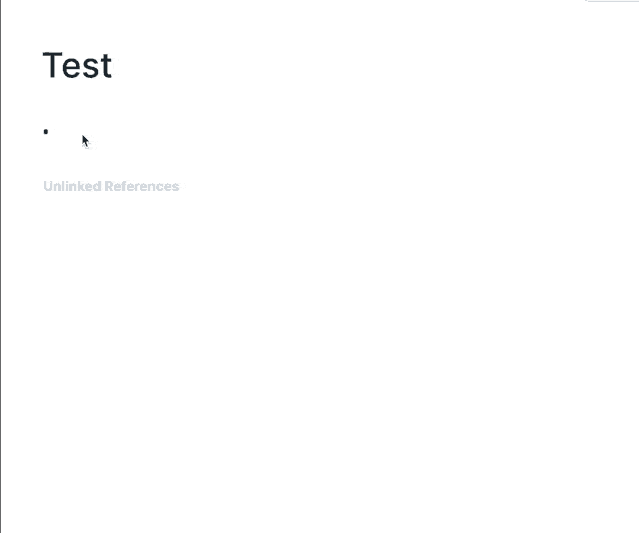
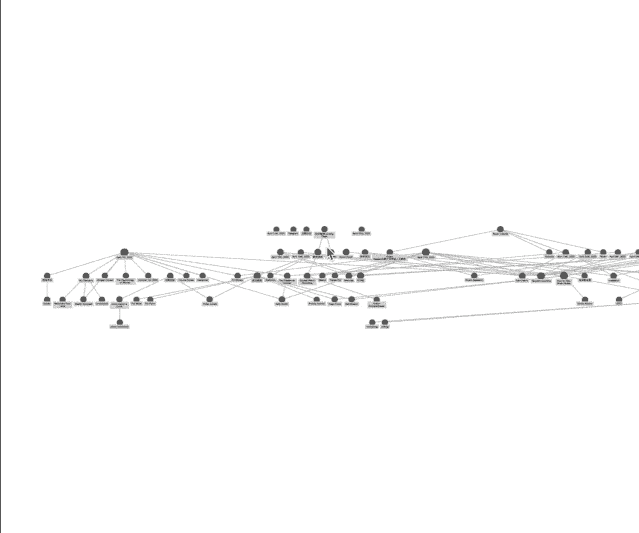

<!--yml
category: 未分类
date: 2022-06-26 00:00:00
-->

# 新型笔记工具Roam Research简介及快速上手教程

> 原文：[https://jarodise.com/a-beginners-guide-to-roam-research](https://jarodise.com/a-beginners-guide-to-roam-research)

最近一段时间，一款叫做**Roam Research**的工具频频出现在我的推特时间线，几个我关注的生产力大V都声嘶力竭地为这个工具站台叫好，这其中有一些曾经是Notion或者Evernote的死忠，现在都已宣布叛变，推特上甚至出现了#RoamCult超话。

那么这个工具到底有什么样的魔力在短时间引起如此大的反响呢？今天我想借这篇文字跟大伙简单探讨一下，同时这也是我本人利用费曼原则记录自己学习使用Roam的过程，希望能够把我近一段时间把玩儿Roam的心得分享出来，帮助感兴趣的朋友们快速发现并上手这款新型笔记工具。

## Roam Research重点特色

目前Roam仍处于Beta测试阶段，注册是完全开放且免费的，注册流程这里就不赘述了。登录到Roam后，第一眼看上去，它神似类Workflowy/Dynalist的大纲笔记工具，并没有任何特别之处，当然，如果只是用它来写缩进式的大纲笔记，完全没有必要。

Roam真正的魔法在于对“双括号”的运用，在Roam中进行写作的时候，任何时候你用双括号括住一个字，一个词或者一句话，Roam都会自动生成一个链接，同时还会生成一个以括号内内容为标题的全新页面，这就是Roam的与众不同的杀手锏:**bi-directional linking**。顾名思义，它是一个双向的链接，不但可以链到它指向的页面，而且当你打开这个页面的时候，所有曾经出现过这个链接的页面也会自动被显示在这个页面的底部。

在Roam中你有三种方法创建双向链接：1.直接在写作时键入“[[”（Roam会自动给你补全后半部分），并将需要创建链接的“关键词”嵌入其中。2.键入"/"调出插入菜单选项，选择"Page Reference", 产生的效果和你直接键入“[[”是一样的。3.如果是已经写好的文字想要后加双向链接节点，则只需要用鼠标拖拽选中你要创建链接的关键词，然后键入“[[”即可。

这个功能看似逻辑非常简单，但是它背后所承载的可能性却一点都不简单。**双向链接像大脑的神经元一样，成为链接Roam中各种笔记的节点，对于写作者来说，这个功能可以让你轻易地盘活自己积累的历史素材和并寻找到素材之间不易被发现的微妙联系，从而激发更多的创作灵感。**同时，这个功能的存在意味着你无须像传统PKM（个人知识管理）工具那样使用文件夹架构对你的素材进行细致严谨的分类整理，只需适时适量地运用双括号标注写作中的节点关键词，你的整个素材库就会被自动链接起来，这种感觉是非常奇妙的。

例如在下面这个动图里大家可以看到，通过我创建的[[数字游民]]这个双向链接，我可以一步步地被引导到与之相关的人名和书籍等已存在的内容。

这时候就不得不提Roam的另外一个杀手锏功能：全局可视化界面(Graph Overview)。我们看到Roam左手边的导航栏其实只有三行，点击中间那个**Graph Overview**即可进入全局可视化界面。这时候你所有之前写作过程中创建的各种节点和它们之间的链接关系都会被一览无余地展现在你的面前。你可以试想一下当你长时间使用Roam进行个人知识管理所能产生的化学反应。

看完上面的介绍，相信大家不难明白为什么这个工具在这么短时间内引发了如此大的轰动效应。正如Roam在其主页所显示，它是**A note-taking tool for networked thought.** 旨在为写作者们提供一个阻力最小的积累素材，链接创意，构建外脑的优雅解决方案。**从某种意义上讲，它应该是目前实践Zettelkasten（卢曼卡片式写作法）最好用的工具**。

## 漂在Roam Research头上的几朵乌云

首先Roam目前正处于免费Beta测试阶段，未来收费是板上钉钉的事情，它的官推上前不久宣布未来价格暂定15美元/月，这个价格对于硅谷的高薪码农来说也许就是一个三明治几杯拿铁的钱，但是对于其它绝大部分用户来说还是有点偏贵了，从官推下面的回复反馈就能明显看出来。当然，我们也不排除在不远的将来，可能有其它拥有类似功能特性的克隆竞品出现，迫使Roam改变这个定价策略。

第二，Roam目前严格来说还是一个One-man Project，它的背后只有创始人Conor White-Sullivan一个人，研发力量略显单薄。而且现在它仅仅是一个网页工具，没有移动端APP，也没有API。另外Roam并非开源，这就让很多人对其稳定性和数据可靠性产生了担心。这个担心其实是非常合理的，因为我最近一段时间已经在推特上看到了一些用户丢失数据或者无法正常导出数据备份的案例。

最后，Roam虽然界面极简，上手容易。但是真要想用好它，难度并不小，很多实用的功能，例如Sidebar唤醒，信息筛选功能都做得略隐秘，对于小白用户并不是很友好。当然这个工具本身一开始面向的目标用户群可能就不是小白用户。

无论如何，我本人目前对Roam的兴趣还是蛮大的，因为它真正做到了与人脑运作方式的同步，为内容的输入和输出流程提供了一种前所未有的体验，让人码起字来有一种文思如泉涌，欲罢不能的感觉。不出意外，我接下来也会继续结合自己的使用体会为大家带来更多Roam Research相关的使用心得。敬请期待。

**本文系Jarod Zhang原创，如需转载请联系作者授权。坚持原创不易，你的打赏和转发是我继续创作的最大动力。**

数字游民部落致力于推广目前在全世界日益流行的数字游民（Digital Nomad）生活方式，和Lifestyle Design的方法和理念。

数字游民知识星球是目前华文圈最权威的数字游民（Digital Nomad）生活方式设计主题社群，最大的数字游民/远程办公/环球旅行中文资源库，云集环球旅行，远程办公，自由职业等各路达人大V。长按下方二维码加入数字游民知识星球，开启你的生活方式设计之旅。

数字游民部落官网：[JARODISE.COM](http://JARODISE.COM)

微信公众号：数字游民部落