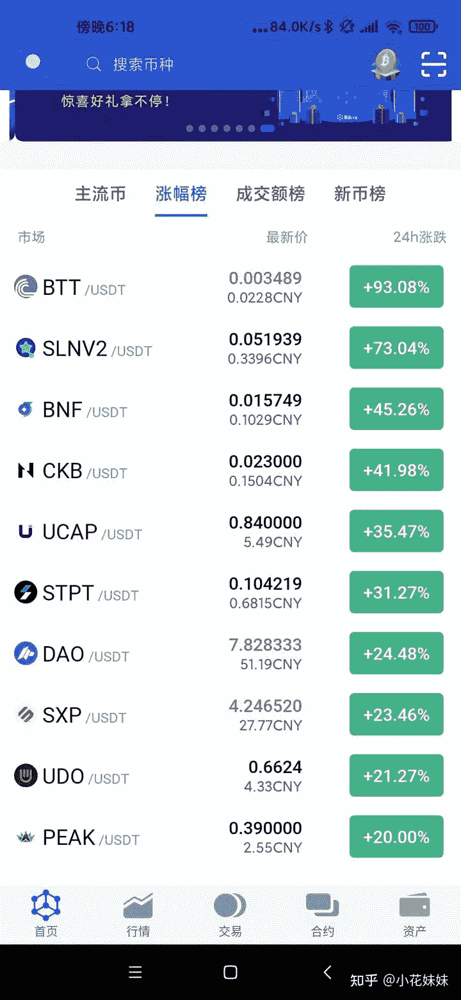

<!--yml
category: 挖矿
date: 2022-06-26 00:00:00
-->

# 新手可以投资比特币吗？

> 原文：[https://www.zhihu.com/question/449664519/answer/1790547140](https://www.zhihu.com/question/449664519/answer/1790547140)

 可以，看个人观点和选择。

炒币会赚会亏，挖矿稳扎稳打。不同的选择会让你走上不同的人生道路，选择在个人。

目前的比特币价格，也可能会让你再赚个几倍几十倍，也会让你几个月或者几年白干。

如果你有现成的显卡，一个月可以报销个房租钱。

作为做过非主流千倍币的梦想的人，这种煎熬我认为一般人真的受不起。

新手可以买点**基金**看看，练练手。股票我认为都对新手不是那么友好。虽然挣不了大钱，但是求稳我认为是第一的，基金让你也亏不了大钱。

目前的经济环境大家也知道，我的建议：谨慎投资，稳扎稳打。

至于挖矿蹭蹭热度这种**稳赚不赔**的买卖，我个人还是推荐的。

**挖矿专场**丨[锁算力卡挖矿](https://zhuanlan.zhihu.com/p/399409039)丨[未锁卡挖矿教程](https://zhuanlan.zhihu.com/p/355955385)丨[笔记本挖矿](https://zhuanlan.zhihu.com/p/360451565)丨[锁算显卡怎么挑](https://zhuanlan.zhihu.com/p/374342633)丨[挖矿毁显卡吗](https://zhuanlan.zhihu.com/p/358944242)丨

**猴山专场**丨[猴山解密3080TI](https://zhuanlan.zhihu.com/p/379179943)丨[猴山解密3070TI](https://zhuanlan.zhihu.com/p/379428935)丨[买70TI还是80TI](https://zhuanlan.zhihu.com/p/379846007)丨[猴山冲4K](https://zhuanlan.zhihu.com/p/380129626)丨

**笔记本专场**丨[满血版笔记本怎么挑](https://zhuanlan.zhihu.com/p/374748213)丨[买3060还是70本](https://www.zhihu.com/question/447817962/answer/1909204347)丨[3050本评价](https://www.zhihu.com/question/462045112/answer/1913547325)丨[蛟龙7测评](https://zhuanlan.zhihu.com/p/369226521)丨