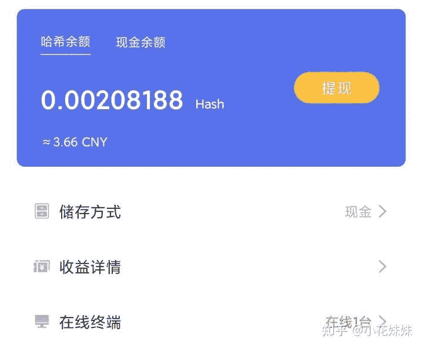
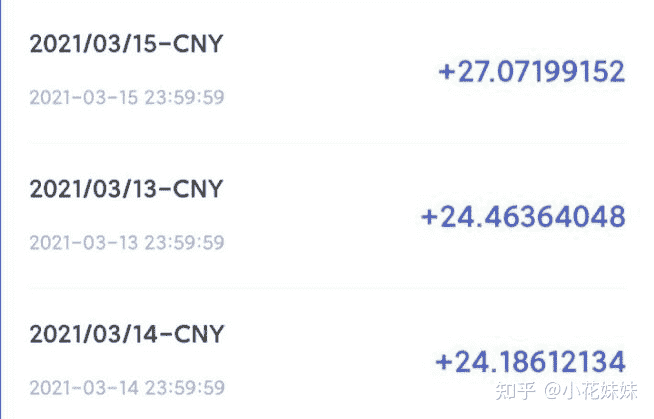

<!--yml
category: 挖矿
date: 2022-06-26 00:00:00
-->

# 是囤币好，还是挖矿好？

> 原文：[https://www.zhihu.com/question/450127787/answer/1822623645](https://www.zhihu.com/question/450127787/answer/1822623645)

 个人建议:散户直接现金存储

说一下矿老板的操作。基本都是拿出一部分币转现金交付电费。另外的币存起来等币价涨跌来让自己的收益最大化。

教程参考

目前选择最多的是3070显卡

或者是3060笔记本

我们作为个人散户，不管怎么操作也就是几十块钱的白差距就不少了。想不费神不费力，还是直接现金存储:**每小时直接现金结算**是最合适的。不容易把自己玩进去。

截图来自[哈希宝](https://link.zhihu.com/?target=http%3A//app.behash.com/reg/invite/O14BJF6q)

**挖矿专场**丨[锁算力卡挖矿](https://zhuanlan.zhihu.com/p/399409039)丨[未锁卡挖矿教程](https://zhuanlan.zhihu.com/p/355955385)丨[笔记本挖矿](https://zhuanlan.zhihu.com/p/360451565)丨[锁算显卡怎么挑](https://zhuanlan.zhihu.com/p/374342633)丨[挖矿毁显卡吗](https://zhuanlan.zhihu.com/p/358944242)丨

**猴山专场**丨[猴山解密3080TI](https://zhuanlan.zhihu.com/p/379179943)丨[猴山解密3070TI](https://zhuanlan.zhihu.com/p/379428935)丨[买70TI还是80TI](https://zhuanlan.zhihu.com/p/379846007)丨[猴山冲4K](https://zhuanlan.zhihu.com/p/380129626)丨

**笔记本专场**丨[满血版笔记本怎么挑](https://zhuanlan.zhihu.com/p/374748213)丨[买3060还是70本](https://www.zhihu.com/question/447817962/answer/1909204347)丨[3050本评价](https://www.zhihu.com/question/462045112/answer/1913547325)丨[蛟龙7测评](https://zhuanlan.zhihu.com/p/369226521)丨