<!--yml
category: 挖矿
date: 2022-06-26 00:00:00
-->

# 显卡教程：无需钱包版(含锁算力显卡)

> 原文：[https://zhuanlan.zhihu.com/p/355955385](https://zhuanlan.zhihu.com/p/355955385)

## **不嘻嘻哈哈，先直接放大招**

本文章为未锁算力版本，锁算力显卡请移步

以下是ETH各个显卡算力和回本周期统计表，统计日期为4月份左右。虽然距离现在的时间比较紧久远，但是可以作为怎么**统计回本周期**的优秀案例。

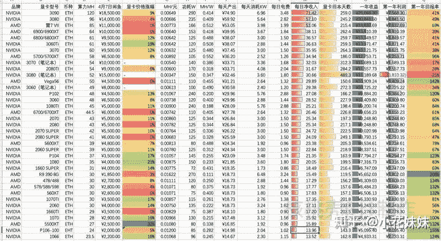

币价的波动大家都知道是比较大的，所以如想直接获取你当前币价显卡的收入，可以点击一下：[这里](https://link.zhihu.com/?target=http%3A//hxbao.com/income)直接输入你的显卡型号和数量就可以直接计算出你显卡的年收入，非常的简单。

## 什么是比特币

因为算法的不同，比特币需要特殊的矿机和低廉的电价才能够盈利。

比特币采用的是 SHA-256的加密算法，在挖矿时候，需要的是算力也就是核显的频率。为了提高算力，比特币经历了 CPU四个阶段包括：**挖矿、GPU 挖矿、FPGA 矿机挖矿**和现在的**ASIC 矿机挖矿。**

**以太坊（ETH）用的是 Ethash 加密算法，在挖矿的过程中，需要读取内存并存储 的DAG 文件。**限制这个方面的，最主要的是显卡的带宽。目前的计算机硬件技术，一直没有什么实质性的突破。所以无论如何提高计算机的效率，内存读取效率仍然不会有很大突破。因此，从某种意义上来说，以太坊的 Ethash 加密算法和比特币的算法是完全两种方式。

**加密的算法不同，导致了比特币和以太坊的挖矿设备和算力规模差距很大。**

用通俗易懂的语言来说，比特币需要的是**核显**频率，而以太坊需要的是**内存**频率。

## 设备现状

伴随而来的，使我们的显卡价格进入了白热化的竞争阶段。尤其是30系的显卡，几近几倍的价格让电脑商也无所适从。

以我们的入门级显卡3060为例。出厂的建议零售价格如下

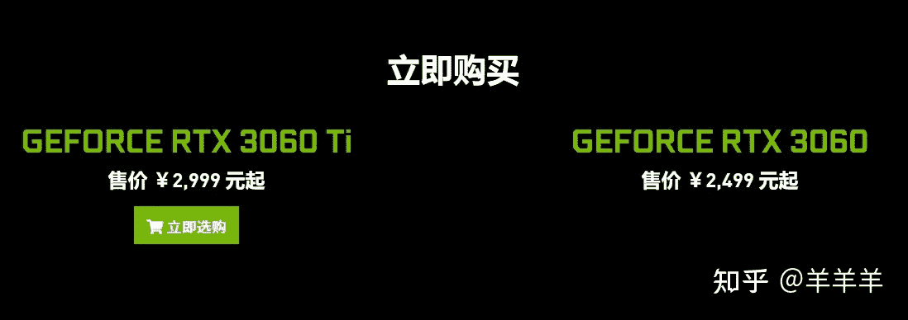

而如今你走入京东或者淘宝，价格基本上翻了接近三倍的溢价。

如此疯狂的溢价之下，逼迫许多大小规模的**散户**已经对笔记本下手了。 如此的疯狂令人发指。

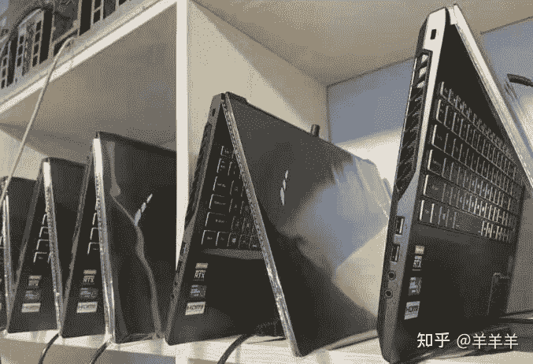

笔记本挖矿的话，选择这款3060起步的机械师笔记本。注意一定要挑选满血版的笔记本，也就是3060为130W，3070为140W，如果想要更好的游戏体验，可以选择带有“独显直连”功能的笔记本。目前炒的比较火热的就是蛟龙7 机械革命T58 和联想的R9000P

R9000P的做工，可以在某音搜索，确实是良心作品，但是在3060的版本当中只有16存的，对于我这种喜欢大本的人来说确实是有一些不适应，而且联想这个牌子以前给我留下了不好的印象，所以没有选择联想， 最终购买了蛟龙7。但是有一说一，R9000P是一款不错的产品。

我自己最终购买的，是蛟龙7系列的3060满血版笔记本。

如果想买满血版笔记本可以参考如下链接。

如此疯狂的行为之下，到底隐藏着什么样的秘密。我们在这里揭开面纱。

以下是我使用收益计算，算出目前主流显卡的**年收益**。币价有波动，仅作参考。

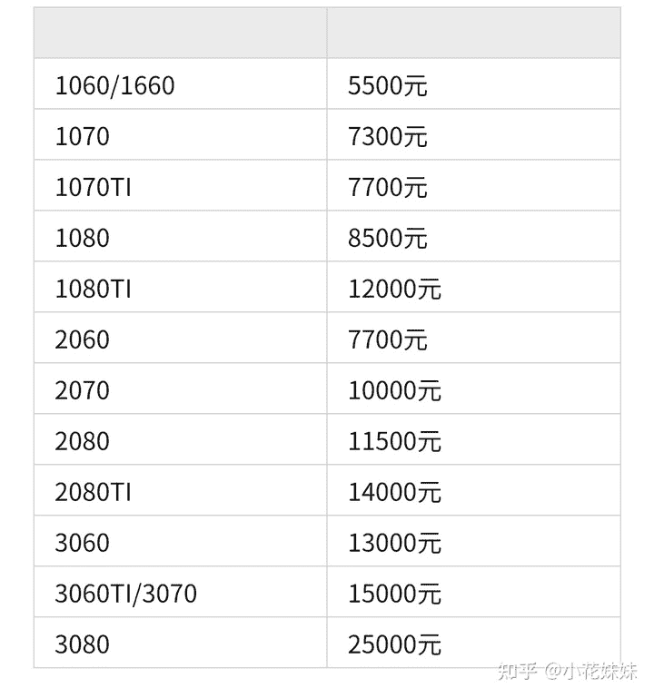

以本人2070的显卡为例，最高时候可以爆到如下数字。

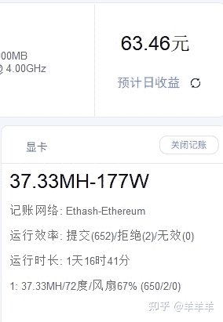

如此操作的理由：我们需要的是**提高显存频率**提高收益，而降低核显的原因是第一降低显卡的**温度**，同事可以**限制功耗**，降低日常的**电费**。以2070为例，日常用电量基本是不到7度电左右。还在说不够电费的小伙伴，请更新自己的知识库 。

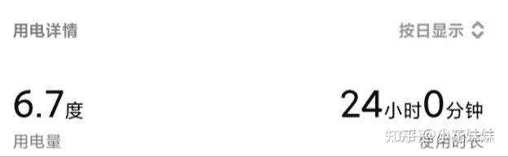

在如此收益面前，每天几块钱的电费可以承受。统计电量使用使用小米插座查询。一定要买我推荐的这一款，还有另外一款是无法统计电量的。

## 挖矿的准备

目前我们的选择有很多，可以是台式机，也可以是笔记本。

最好是自己家里有现成的电脑，无成本投入。

台式机个人选择使用3060或者3070起步的显卡主机。

机器不贵，主要还是需要一张好显卡，最好是家里没有电脑自用的人，权当给自己买的礼物。

各个级别的显卡算力，可以参考下图

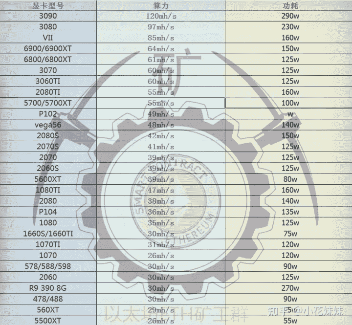

## 软件的选择

**第一小节**

可以挖矿的软件，选择有很多。比如Bminer，guiminer，长沙矿工N卡挖矿软件，NiceHash Miner

对于散户而言，我们只有一台电脑。快捷简单的设置和提取收益，是我们最优的选择。所以[哈希宝](https://link.zhihu.com/?target=http%3A//app.behash.com/reg/invite/O14BJF6q)就应运而生了。很多软件设置的是有最低提币限额，单台机器可能一个月都不能提取一次，非常头疼。目前新兴的挖矿软件有很多，我们选择对新手最友好，操作最简单的一款。原理都是借用你的算力的软件。

## ★挖矿流程

一共只有三步。

1.  注册登录[哈希宝](https://link.zhihu.com/?target=http%3A//hxbao.com/reg/invite/O14BJF6q)
2.  去首页下载左边的那个V1.95，会下载到一个RAR的解压包。
3.  打开软件点击开始记账，就可以了。看到behash的这个文件，打开就可以了。

这个软件就是需要敲黑板，让你关注的**重点**了。

界面简单实用，一键开启记账模式。左边的**CPU记账**需要看你的CPU性能，可以对比一下开启和关闭状态下的日收益差距。因为我的差距不大，又比较费电，所以只开启了显卡记账。

对我来说最重要的一点，是它收益直接打到某宝上，**杜绝了需要验证银行卡等敏感信息的收集。**

## **怎么超频设置**

首先打开软件以后，在界面左侧可以找到“超频设置”。在弹出的界面当中可以看到如下数据

根据你的显卡型号，输入相应的超频数据就可以了。需要注意的是一定要打开“超频开关”然后点击保存设置，最后重新点击开始记账就可以了。

## **至于手续费问题，在文章下方有解释**

收益的话基本上是以小时为单位结算。

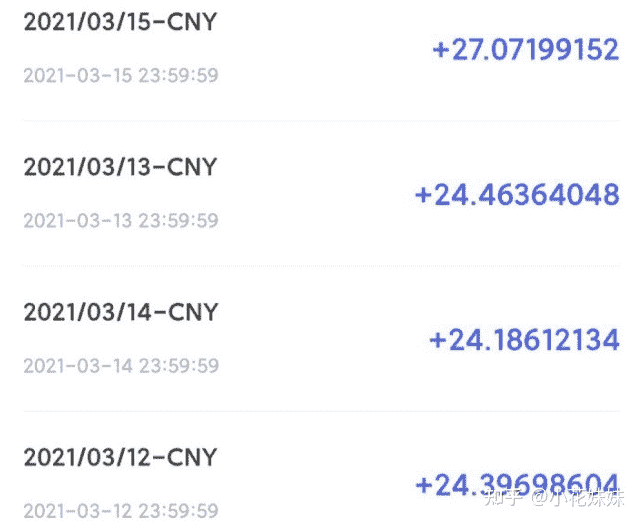

**第二小节**

第二款，比较主流多为机器比较多的大老板使用：**轻松矿工**

使用起来需要的专业性比较大。需要研究透彻。

主页的使用介绍在这里

**界面如下**

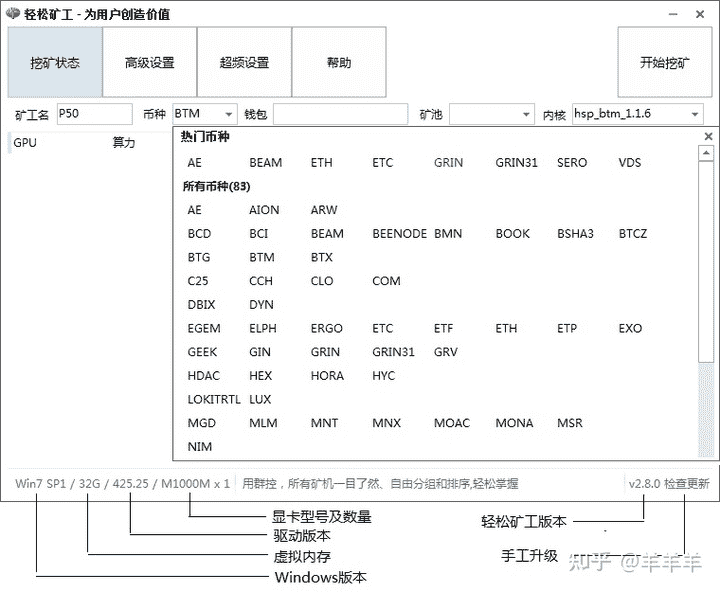

如果选择使用轻松矿工，那么首先我们需要的就是注册一个**钱包。**

我们使用的是ETH的官方网站注册钱包。然后将钱包的地址，一串代码填入到钱包的地址中去。

* * *

在如今显卡价格横行的日子，很多的主机DIY爱好者成为了**等等党**。哪怕我也是本来想着2070作为日常使用和大型单机，再抗战两年也不成问题的想法，没有乘上30系挖矿的这波特快列车，很是懊恼。

个人认为，在如此收益之下，基本1060以上的显卡，都可以一战。毕竟是没有付出就可以的收获，何乐而不为呢？

根据[哈希宝](https://link.zhihu.com/?target=http%3A//app.behash.com/reg/invite/O14BJF6q)推荐的超频设置超频以后的算力

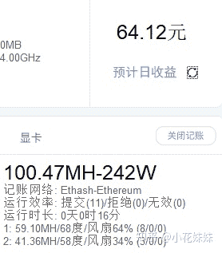

更新一下手续费的问题，小额初次体验不建议进行提取，只适合初次试验能否正常到账。

个人操作为每半个与至**一个月提取一次**。

如果是轻松矿工等软件，实测你需要提取币到钱包，然后转到币币账户，再卖成USDT法币，再转换成CN币，手续费并不比我这款软件低。

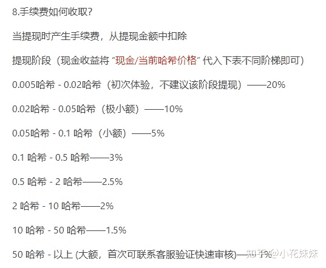

**挖矿专场**丨[挖矿教程](https://zhuanlan.zhihu.com/p/355955385)丨 [笔本挖矿](https://zhuanlan.zhihu.com/p/360451565)丨[挖矿毁显卡吗](https://zhuanlan.zhihu.com/p/358944242)丨[矿卡也质保](https://zhuanlan.zhihu.com/p/386391253)丨

**锁算专场**丨[锁算卡挖矿](https://zhuanlan.zhihu.com/p/398651881)丨[RVN和ERGO教程](https://zhuanlan.zhihu.com/p/402971584)丨[锁算卡挑选](https://zhuanlan.zhihu.com/p/374342633)丨[挖矿知识点合集](https://www.zhihu.com/question/461044682/answer/1994951468)

**笔记本专场**丨[满血版笔记本怎么挑](https://zhuanlan.zhihu.com/p/374748213)丨[买3060还是70本](https://www.zhihu.com/question/447817962/answer/1909204347)丨[蛟龙7测评](https://zhuanlan.zhihu.com/p/369226521)丨