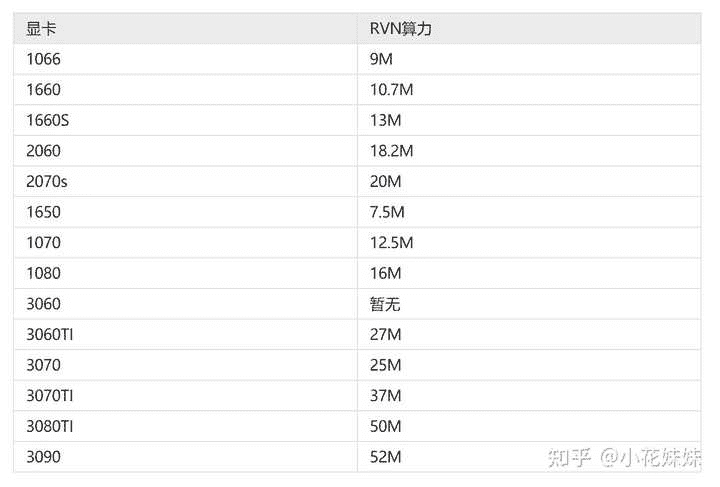

<!--yml
category: 挖矿
date: 2022-06-26 00:00:00
-->

# 显卡是否越来越和普通人脱节?

> 原文：[https://www.zhihu.com/question/480449923/answer/2066991635](https://www.zhihu.com/question/480449923/answer/2066991635)

 ### 脱节的只是价格，并不是性能。

价格来说，目前的30系列锁算力显卡已经公布了破解方案。即挖ETH的时候拥有**70%的算力**，所以导致了目前的显卡价格疯涨。

ETH主要还是影响的未锁算力显卡，目前一张未锁算力的3070显卡（二手矿卡）已经干到了8000元了，心疼我5600出的3070，反正这来来回回的显卡价格是整的我真不会了。

截止到目前8.17日，显卡的价格统计。

| 显卡型号 | 目前价格 | 原算力 | 解锁算力 | 解锁日收益 |
| 3060 | 4300 | 48 | 33 | 16 |
| 3060TI | 5200 | 60 | 42 | 21 |
| 3070 | 6200 | 60 | 42 | 21 |
| 3070TI | 7500 | 80 | 56 | 28 |
| 3080 | 8200 | 100 | 70 | 35 |
| 3080TI | 9999 | 120 | 84 | 42 |

以上的日收益，只是ETH的粗略估算，而丧心病狂的矿工怎么可能止步于此？于是就研究出了新的RVN，彻底让锁算力显卡撒了欢。

目前的价格让矿工们炒到了1算力1元的收益，我通过链接评论区凑出了大部分显卡的算力，约等于日收益。**我认为这才是真正让锁算力显卡价格炸锅的原因。**

目前来说，锁算力显卡挖矿方面综合功耗，比较具有性价比的还是3060TI。未锁算力显卡同样也是3060TI出厂即灰烬，很少有这个型号的显卡落入玩家手中，真的是太惨了。

游戏性能方面：3060TI也是完全碾压3060级别的显卡（只看性能，以下价格懒得更新）

作为入门级别的3060显卡，游戏性能在目前主流的2K分辨率下显得比较拉胯。通吃还是需要3060TI来作为顶梁柱。鉴于目前显卡上涨的趋势，还是只能等一等。

在半个月以前，3060还能2999大街遍地都是，随便买的时候。再看看现在的价格，真的是后悔的拍大腿，一张显卡的价格比一般人整个主机的价格都高出不少，这谁受得了？

如果作为打游戏的游戏党来说，只能继续用YYDS来继续对抗矿潮了。

**挖矿专场**丨[挖矿教程](https://zhuanlan.zhihu.com/p/355955385)丨 [笔本挖矿](https://zhuanlan.zhihu.com/p/360451565)丨[挖矿毁显卡吗](https://zhuanlan.zhihu.com/p/358944242)丨[矿卡也质保](https://zhuanlan.zhihu.com/p/386391253)丨

**锁算专场**丨[锁算卡挖矿](https://zhuanlan.zhihu.com/p/398651881)丨[RVN和ERGO教程](https://zhuanlan.zhihu.com/p/402971584)丨[锁算卡挑选](https://zhuanlan.zhihu.com/p/374342633)丨[挖矿知识点合集](https://www.zhihu.com/question/461044682/answer/1994951468)

**笔记本专场**丨[满血版笔记本怎么挑](https://zhuanlan.zhihu.com/p/374748213)丨[买3060还是70本](https://www.zhihu.com/question/447817962/answer/1909204347)丨[蛟龙7测评](https://zhuanlan.zhihu.com/p/369226521)丨