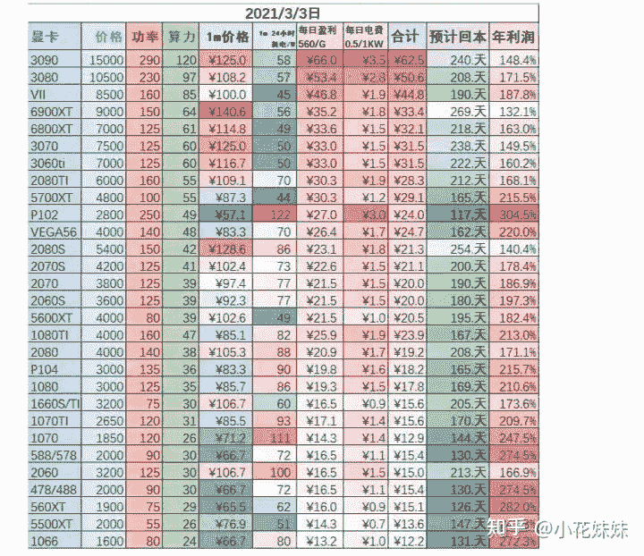
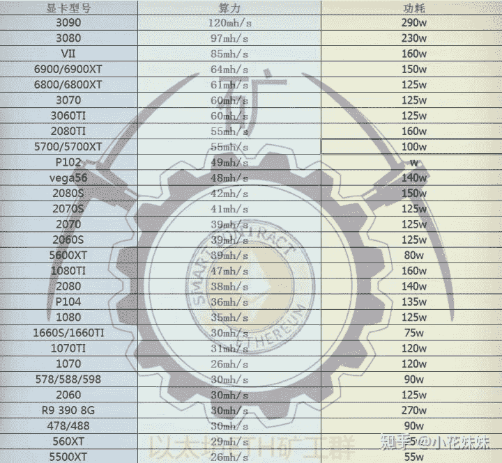
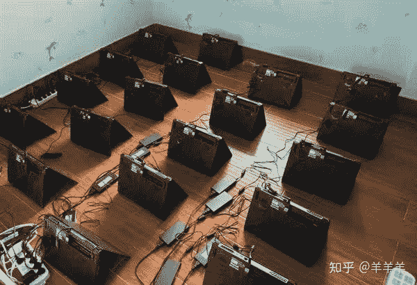
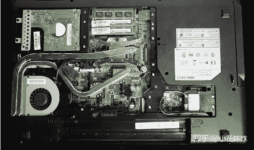
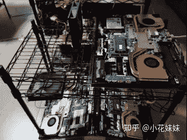

<!--yml
category: 挖矿
date: 2022-06-26 00:00:00
-->

# 显卡溢价高？笔记本白嫖挖矿

> 原文：[https://zhuanlan.zhihu.com/p/360451565](https://zhuanlan.zhihu.com/p/360451565)

## 笔记本挖矿，十天就能回本。笔记本差价一般在500元，挖回差价只需要15天左右。

前两篇，我们已经学习了怎么利用以太坊回血，和了解了台式机显卡挖矿是否对硬件有损伤的问题。

链接如下：

本篇， 我们提出了更具有**性价比**的方案，使用笔记本搭配[哈希宝](https://link.zhihu.com/?target=http%3A//app.hxbao.com/reg/invite/O14BJF6q)来进行操作。

因为以太坊的原因，造成了今日的全民挖矿时代的来临。目前显卡的价格，不看品牌不看做工不看用料，所有的定价都只有一个依据：**算力**。

首先参考一张显卡的总体统计图。基本的回本周期在200天左右。

## 下面我们再来看看笔记本的情况

### 一、硬件

而笔记本，因为其独特的整体性。并没有太大的价格浮动。3060显卡笔记本的价格基本维持在8000-9000左右这个区间。

如果考虑想买满血版笔记本，可以参考一下这里。

而3070笔记本，基本维持在1.2万左右的区间，正价幅度可以接受。

3060和3070笔记本的日收益差距，基本可以达到每天10元。如果按纯回本周期大约300天来算的情况下，基本上3070可以将差价赚回。但是和显卡不同的是，笔记本的残值问题是完美优于显卡的，就算是矿难，笔记本的残值价格依旧可以做到非常的坚挺。目前我可以给出两个比较有性价比的方案。

1、自己目前有笔记本，买3060或者3070进行更新换代，并且用挖矿来提高性价比。也就是**自用+挖矿**，是最具有性价比的。基本上两三个月的持续运行，就可以做到相当于5000元购买的3060笔记本。

2、购买笔记本以后**保留好箱说**，因为挖矿基本只需要开机并且持续运行，并不存在使用痕迹。只有运行时间比较长。所以在某鱼出二手的时候，基本可以保留80%甚至90%以上的成本价格。操作的好，基本属于**白嫖**。新机器和二手的差价，基本上1-2个月就可以抹平，所以回本周期就可以直接算作为2个月。

### 二、软件

选择操作简单，没有复杂**矿池**和**钱包**操作的软件。

比如这款，就是专门挖**以太坊**的。

安装之后点击“开始”就可以了，操作简单。收益直接打到某宝，杜绝了输入卡号等敏感信息。

目前的主流是挖**以太坊**，因为算法的不同于比特币。以太坊的算法是需要高频率的显存的。所以我们的超频设置基本上是需要强制降低核心的频率来减少功耗和散热。一般核心频率都会-50和-400的区间进行选择。显卡的温度基本不会超过60度。

### 三、散热问题

散热问题，一般是挖矿选手需要解决的主要问题。基本的方法有几步，可以有选择的进行降温。

首先，需要“三角形”放置，如下图。

如果温度仍然不能满足你的需求。可以考虑拆掉部分的背板来提高散热。

更进一步可以购买散热风扇，直接扣在拆掉背板的部分。更优动手能力强的人，可以直接纯拆出主板来进行散热。出某鱼的时候，再组装回去。

降低显卡核心搭配物理散热，基本可以杜绝笔记本显卡过热的问题。

**挖矿专场**丨[锁算力卡挖矿](https://zhuanlan.zhihu.com/p/399409039)丨[未锁卡挖矿教程](https://zhuanlan.zhihu.com/p/355955385)丨[笔记本挖矿](https://zhuanlan.zhihu.com/p/360451565)丨[锁算显卡怎么挑](https://zhuanlan.zhihu.com/p/374342633)丨[挖矿毁显卡吗](https://zhuanlan.zhihu.com/p/358944242)丨

**猴山专场**丨[猴山解密3080TI](https://zhuanlan.zhihu.com/p/379179943)丨[猴山解密3070TI](https://zhuanlan.zhihu.com/p/379428935)丨[买70TI还是80TI](https://zhuanlan.zhihu.com/p/379846007)丨[猴山冲4K](https://zhuanlan.zhihu.com/p/380129626)丨

**笔记本专场**丨[满血版笔记本怎么挑](https://zhuanlan.zhihu.com/p/374748213)丨[买3060还是70本](https://www.zhihu.com/question/447817962/answer/1909204347)丨[3050本评价](https://www.zhihu.com/question/462045112/answer/1913547325)丨[蛟龙7测评](https://zhuanlan.zhihu.com/p/369226521)丨