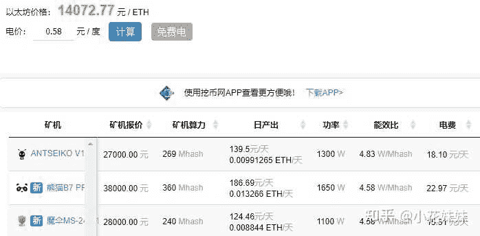
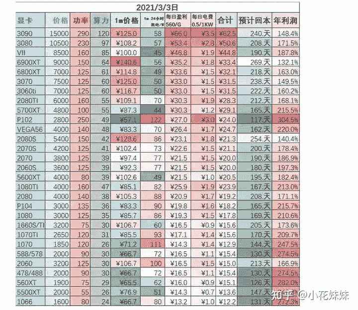
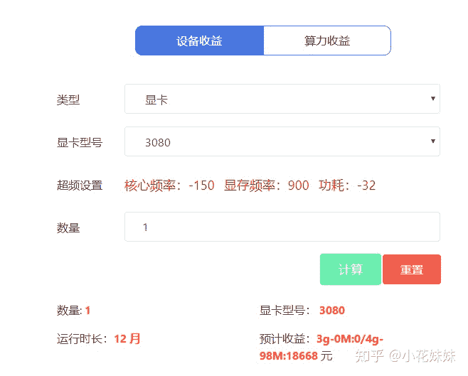

<!--yml
category: 挖矿
date: 2022-06-26 00:00:00
-->

# 有专业矿机，为啥矿工还要买RTX3080？

> 原文：[https://www.zhihu.com/question/446249496/answer/1830340889](https://www.zhihu.com/question/446249496/answer/1830340889)

 ## 因为3080的残值够你再挖100天，矿卡没人要？收的人一堆！只不过是不够便宜而已。

首先，我们来看一张图，我只截图了目前排名前三比较火的矿机型号。

而他们的回本周期，一般都在230天左右。而这里的回本周期，是不包括残值的。也就是净收益达到你的投资，即为回本。

而显卡的回本周期，目前只有3.3总结的一张。显卡价格还是有差距，但是可以作为参考。回本周期也是基本达到200多天以上。

作为投资方，你肯定会考虑残值问题。矿机如果不挖矿，那就是一堆废铁。而显卡作为游戏主机的必备设备，哪怕知道你挖过矿，只要价格合适还是有人会收的。

并且大部分人，并不是只靠挖矿谋生，大部分人还是选择自用（更新显卡）+通过挖矿提高设备性价比的方式来进行，所以就用户量和投资量而言，肯定是游戏显卡占据了大半壁江山。

至于3080和其他显卡的收益，自己去网站算一下就可以。截图来自[哈希宝](https://link.zhihu.com/?target=http%3A//hxbao.com/reg/invite/O14BJF6q)。

目前来说，最有热度的显卡还是3070和3060TI显卡。因为其超强的算力和极低的功耗，深受广大矿老板和散户的追捧。

或者是满血版的3060笔记本，最近也是水涨船高。

**挖矿专场**丨[挖矿教程](https://zhuanlan.zhihu.com/p/355955385)丨 [笔本挖矿](https://zhuanlan.zhihu.com/p/360451565)丨[挖矿毁显卡吗](https://zhuanlan.zhihu.com/p/358944242)丨[矿卡也质保](https://zhuanlan.zhihu.com/p/386391253)丨

**锁算专场**丨[锁算卡挖矿](https://zhuanlan.zhihu.com/p/398651881)丨[RVN和ERGO教程](https://zhuanlan.zhihu.com/p/402971584)丨[锁算卡挑选](https://zhuanlan.zhihu.com/p/374342633)丨[挖矿知识点合集](https://www.zhihu.com/question/461044682/answer/1994951468)

**笔记本专场**丨[满血版笔记本怎么挑](https://zhuanlan.zhihu.com/p/374748213)丨[买3060还是70本](https://www.zhihu.com/question/447817962/answer/1909204347)丨[蛟龙7测评](https://zhuanlan.zhihu.com/p/369226521)丨