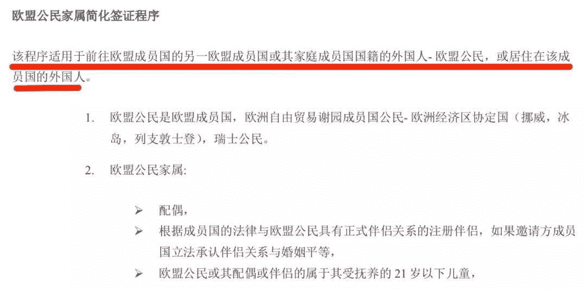
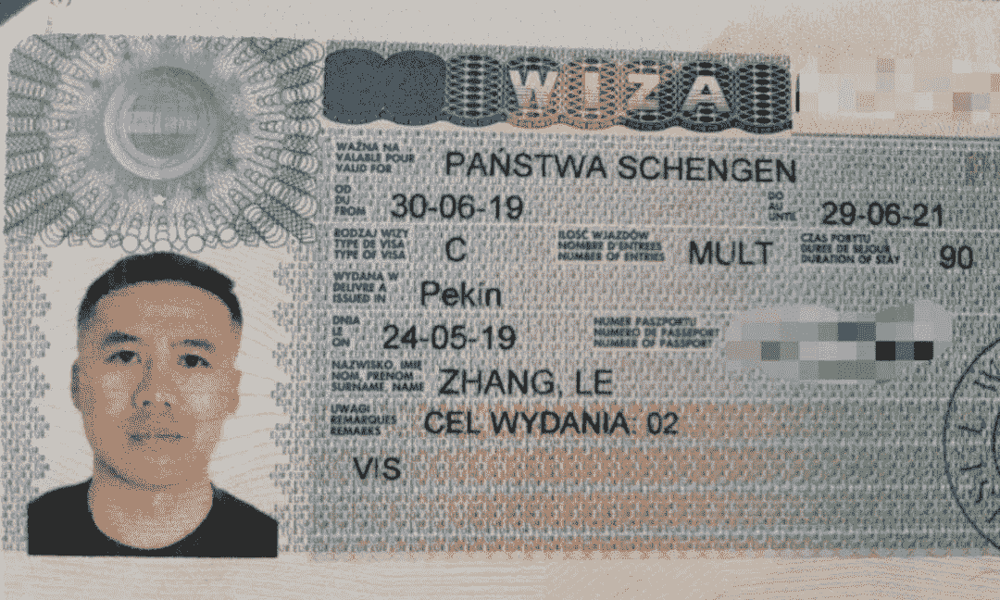

<!--yml
category: 未分类
date: 2022-06-26 00:00:00
-->

# 欧盟公民配偶申根签证终极指南

> 原文：[https://jarodise.com/schengen-visa-for-chinese-eu-citizen-spouse-and-family-members](https://jarodise.com/schengen-visa-for-chinese-eu-citizen-spouse-and-family-members)

我之前曾经在[数字游民长期签证攻略](http://mp.weixin.qq.com/s?__biz=MzIyMjAwNzAzNg==&mid=2650207620&idx=1&sn=6d7850f94e53fc6ea7da2fd8baa56b07&chksm=f0364e17c741c701d3c197a9d971688553be4c44a98379199be7dce2a14902d16329790475de&scene=21#wechat_redirect)里面提到过，通过婚姻关系获得长期签证，其实是很多数字游民得以在多个国家得以长居的优选策略之一。当然，我的意思并不是鼓励大家去为了签证便利而去结婚，而是说，当你有了国际婚姻关系后，你完全可以适时地把它当做自己的优势，为自己的旅行和旅居获得最大化的签证便利。

今天这篇文章，我想详细聊聊作为一名持有中国普通因私护照持有者，如何合法地借助与欧盟公民的婚姻关系简化申根签证的申请流程。写这篇文章的初衷始于我在本次签证申请过程中遇到的一些细小的问题。自始至终，我都未能在中文互联网上找到一篇比较权威细致的，能够清晰地解释整个申请流程的攻略。因此，希望我的这篇文章能够为后续有相似需求的朋友们提供一个比较细致的申请指南，让大家少走一些弯路。

首先，如果你是欧盟公民的直系亲属，那么恭喜你，**根据欧盟议会Directive 2004/38/EC，当你和的欧盟家属一同前往欧洲旅行或者当你计划去欧洲拜访TA时，你是享有跟欧盟公民一样的出入欧盟成员国的权利的。**这个规定也构成了欧盟公民家属简化申请申根签证程序的最基本法律基础。

要享受这项权利，最关键的一点就是，你需要能够向欧盟成员国大使馆证明你的确是欧盟公民的直系亲属。对于配偶来说，不言而喻，就是要提供婚姻关系证明了。

经常关注我的朋友应该都知道，我太太是波兰人，我们俩于2017年底在北京东城区民政局登记注册，领取了结婚证书。**对于像我们这样的涉外婚姻，在领取结婚证的时候通常有三种可能：1.在中国登记 2.在配偶祖国登记 3.在第三国登记。**

这三种选择区别不大。但是需要注意的是，**因为中国并不属于海牙公约的成员国，在我国领取的结婚证在办理签证等涉外事宜时，是不受国外大使馆及其它政府机构认可的。**所以如果你的结婚证跟我一样是在国内注册申领的，就会涉及到一个非常关键的步骤：**结婚证双认证，即对结婚证在中国外交部和波兰驻华大使馆的双重认证程序。**

这也是我本人在本次申请过程中走的第一个弯路，因为我压根不知道这个结婚证的双认证到底应该怎么办，去哪里办。我一度错误地认为办理结婚证双认证需要将两本结婚证都翻译成波兰语并做公证，还好我被北京方圆公证处1500元一本的翻译费给吓跑了。后来又跑了北京的另外一个公证处，他们更是连波兰语翻译都找不到。

最后还是万能的淘宝拯救了我。一天，我抱着试试看地心思在淘宝上搜索“双认证”这个关键词，结果就出现了很多家办理相关业务的淘宝店。我随便找了一个询问了一下才知道，通过淘宝中介办理结婚证双认证，完全不需要证件原件，只需要提供高清扫描件，交一定的服务费，其余的事情都由他们来搞定，一般来说5-7周就能完成公证+双认证的流程。当然，如果你当初的结婚证是在欧洲或者其它海牙公约成员国领的，就没必要走这个流程了。

双认证拿到手后，接下来就是申请签证了。这里我遇到了我这次申请签证过程中的第二个迷惑点，因为根据根据欧盟议会Directive 2004/38/EC，申请人和其欧盟亲属只有在前往其欧盟家属祖国之外的另外一个欧盟国家时候，才能行使所谓的欧盟公民free movement权利。换句话说，假如你的欧盟亲属是波兰人，你跟你的家属一起回波兰，这时候死抠法律条款，欧盟的法律可能并不适用，因为这里并不涉及你和你的亲属在欧盟成员国之间的移动，这种情况下你的权利就只能使用波兰本国的出入境管理法规进行解释了。例如，波兰签证中心的官网上对于欧盟公民家属简化签证程序是这么写的，请注意划红线的部分，是不是特别绕？

这个问题困扰了我很久，在网上搜了好久都没有找到确切的答案。我曾经一度考虑过直接去阿塞拜疆巴库的德国大使馆去申请德国签证（我们今年夏天回欧洲的路上会经过巴库），因为这样的话就符合所谓的欧盟家属祖国外的第三国了，但是我依然不是很想冒这个险，因为一旦稍有差池，就可能有被迫遣返或者无法登机的危险，那样就比较被动了，因此我还是决定尝试在国内申请波兰签证。

最后，我给VFS波兰签证中心打了一通电话，打消了心中的顾虑。VFS的工作人员跟我确定，像我这样的情况，是完全符合申请波兰申根签证的简化程序的，我只需要准备结婚证双认证，家属说明信（说明你们两个人会一起结伴到欧盟旅行），还有能够覆盖我全程的符合申根签证要求（不低于30万的医疗）的旅行保险即可。

另外根据欧盟规定，这类签证是完全免费的，而且可以直接前往使馆送签，无需预约。但是由于我本人不在北京居住，而且使馆通常没有快递返回业务，因此我还是选择去VFS波兰签证递送了我的签证材料。签证中心收取了150元服务费外加75元快递费，共计225元的费用。 下面给大家罗列一下我本次送签的完整材料列表，按照这个列表准备可以最大程度节省你在签证中心审材料的时间：

**1.护照原件+复印件。 2.护照上所有过往申根签证的复印件。 3.结婚证原件+复印件。 4.户口本原件+复印件。 5.欧盟配偶出具的说明信一封（附机票行程单一份，无需出票）。 6.结婚证双认证原件+整本复印件。 7.欧盟配偶的护照和身份证复印件。 8.申根签证旅游保险保单。**

VFS签证中心的工作人员逐一检查材料的真实性，并将除护照外所有材料原件退还给你，只保留查验盖章后的复印件，如果你选择快递服务，他们会直接给你一张EMS的快递单，并在收据上给你一个查询编号，这样你就可以通过VFS的网站查询整个签证申请进度了。工作人员告诉我通常一周内会返回，实际情况是我本人是周四送签，第二周的周一就拿到了快递，波兰使馆给了两年多次往返的签证，效率还是蛮高的。

经过本次的签证申请流程，可以确定欧盟家属的简化申请程序在国内的欧盟国家大使馆是被认可的，但是我依然建议申请前致电大使馆或者签证中心进行确认。目前尚无法确定的是，如果申请非配偶祖国的第三国签证是否会遇到阻力，例如，配偶是波兰人，但是申请法国签证这样的情况。此外，我也暂时无法确定能否在中国之外的其它国家申请这个签证，也许等我这次的签证过期后，以后可以有机会去别的国家进行验证。

最后，希望我的这篇文章能够从一定程度上消除欧盟家属申请申根签证时候的各种困惑和误区。也衷心希望未来欧盟能让中国申请人申请申根签证变得更加简单便利。

**本文系Jarod Zhang原创，如需转载请联系作者授权。坚持原创不易，你的打赏和转发是我继续创作的最大动力。**

数字游民部落致力于推广目前在全世界日益流行的数字游民（Digital Nomad）生活方式，和Lifestyle Design的方法和理念。

数字游民知识星球是目前华文圈最权威的数字游民（Digital Nomad）生活方式设计主题社群，最大的数字游民/远程办公/环球旅行中文资源库，云集环球旅行，远程办公，自由职业等各路达人大V。 长按下方二维码加入数字游民知识星球，开启你的生活方式设计之旅。

 数字游民部落官网：[JARODISE.COM](http://JARODISE.COM)

微信公众号：数字游民

> 原文始发于微信公众号（数字游民部落）：[欧盟公民配偶申根签证终极指南](http://mp.weixin.qq.com/s?__biz=MzIyMjAwNzAzNg==&tempkey=MTAxMV92S2JvQW9GZmJoYXV2S1k0ZllQZ1ZjelBXN2MyYlBfUm5fcmE2bi1OVzNfU0RqY003ZS1ZWVY3NDEwcVN0VU5vcW9fU3dVS01XN1R4MG9RaktlZGcxd25OYUt0ZnIzaW0wMTJZc0VleXJHNmhhTGFuUk9JbHU4Vzc5Zk5TRkdBeEhuSGtnVVhKQkEyMnhvQ05Zdk5WTzNYNzRTRE9ua2xMa2JMVWhRfn4%3D&chksm=70364d834741c4956cad63609056873b82d107a294db61353b03c2bfb88707d5c741f565d73b#rd)