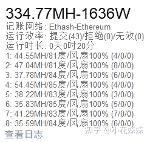
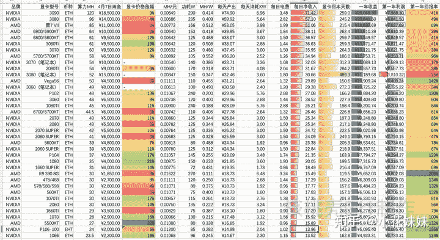
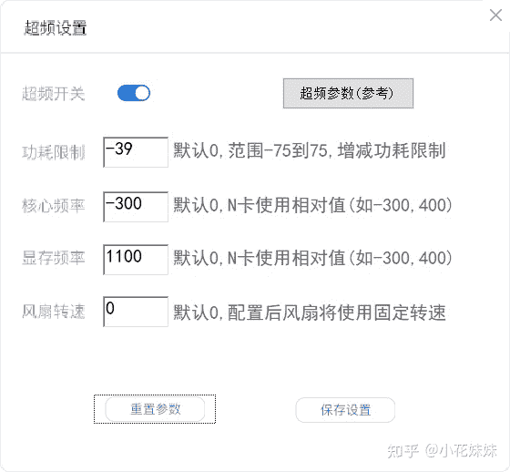
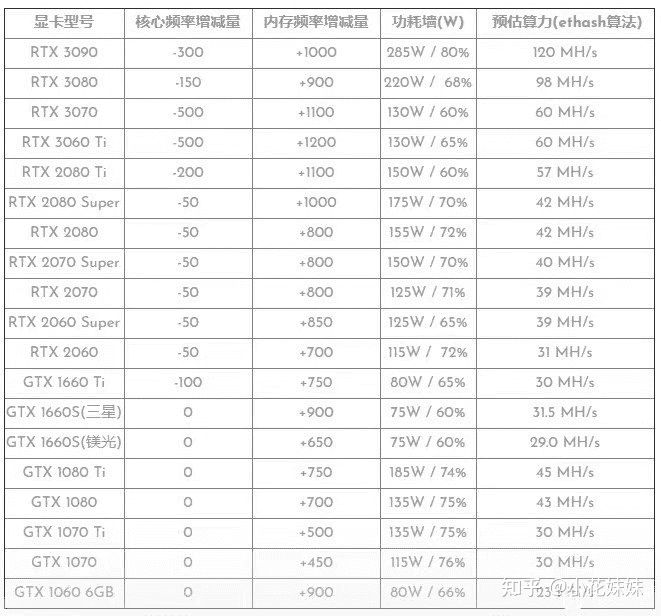

<!--yml
category: 挖矿
date: 2022-06-26 00:00:00
-->

# 比特币下跌后解析30系显卡算力和超频设置

> 原文：[https://zhuanlan.zhihu.com/p/366535305](https://zhuanlan.zhihu.com/p/366535305)

## 超频和不超频的显卡，一天能差距10-20元

前几篇文章，我们已经介绍了以太坊的使用方法，和笔记本入坑的攻略。在4.18比特币市场做出了调成以后，又一次上了热搜。同时NV的新卡马上发布，对我们的手中二手显卡的价值也产生了影响。所以今天我们来进行总结分析。

没有入坑的初学者可以考虑参考一下

## 一、最近发生了矿场调整

因为最近偏远地区，出现了矿场的调整（原因不多说明）造成了全网总算力的大幅波动，所以就目前的市场而言，经常会达到**日收益1MH达到一元**的高价。

以太坊，仍旧作为目前的主流显卡货币。

算力是什么概念呢？根据图片，我们来举例。

如果你目前手中有一张3070显卡，他的正常算力根据图片可以知道达到了60MH/S，在连续工作24小时以后，可以预计得到约等于60元的货币。这就是**日收益1MH达到一元。**

**截图来自软件**[哈希宝](https://link.zhihu.com/?target=http%3A//app.hxbao.com/reg/invite/O14BJF6q)

而功耗和电费的问题。我们的功率为125W，每天的耗电量约为3度电（单显卡耗电）成本约每天不到2元。

当然显卡的溢价，也成为了广大DIY爱好者关注的重要参数。目前来说，马上要发布的显卡并不能确定是否会影响算力。

据小道消息称：可能会通过硬件只限制**多卡算力**，并不会影响单台计算机显卡的算力。

但是这并不影响目前显卡有小幅度的下调。

| 热门显卡价格 | 二手价格 | 下跌幅度 |
| 3060 | 6000 | -700 |
| 3060TI | 8800 | -700 |
| 3070 | 9200 | -800 |
| 3080 | 14000 | -1200 |
| 3090 | 19000 | -2000 |
| 750 | 380 | -70 |
| 9602G/4G | 650/800 | -100 |
| 970 4G | 950 | -150 |
| 980 | 1200 | -200 |
| 980TI 6G | 1500 | -600 |
| 1060 3G/6G | 1100/2000 | -100 |
| 1070 | 2400 | -300 |
| 1070TI | 2800 | -300 |
| 1080 | 3400 | -400 |
| 1080TI | 4300 | -700 |

用一句话总结目前的市场，就是算力单价上升，而且显卡成本幅度性降低。

目前我比较推崇的显卡型号：3060TI 被称之为**虚空神卡**

其原因是和3070具有同等能力的算力，并且实际使用的时候功耗和发热都小的多。

## 二、回本周期的计算

目前主要的回本周期算法，都是不算残值的。也就是说截止到投入了8000元，收益8000元的日期，算作回本周期。而目前的游戏显卡残值都是一笔不小的数字。

以3070显卡为例，目前的主流价格在9000元左右，除去电费的日收益我们按55元计算。回本周期约155天。显卡的发售价格为3899元。算上折损，我们按2500的残值计算，回本周期约为118天，也就是四个月左右。也就是说，收益的提升和显卡的降价，其实**大幅缩短**了目前我们入市的**回本周期**。

当然币价和收益都是有波动的，所以大家自行计算回本周期。

**笔记本**方面，目前据我了解最火热的是这一款，经常可以看见批量购买的用户。满血版的3060显卡，温度控制到70-80度就可以长期的运行。并且算力相差无几。

目前的海鲜市场价格，大约在6500元左右，所以约等于**一个月回本**？

## 三、常见问题解惑

**软件**

很多人在入坑的时候都在苦恼的纠结**偷算力**和**手续费**的问题。我做出如下**总结**。

大部分人都是单卡提高性价比的用户，使用轻松XX等软件学习成本和操作成本非常的高。需要将挖的币提到钱包、去交易平台转成法币USTD、将USTD卖出。层层的交易手续费交下来，其实和集成式软件没有什么差距。尤其是**钱包地址**等方面如果出现问题，那么一个月的电费就可能白交了。

而集成式软件的操作步骤就只有两步：下软件、点开始。

**温度**

很多人在我的评论区都会留言问一下自己的显卡温度多少度，可不可以等问题。这里做一下总结。

目前显卡最主要容易出现的问题是因为温度过高，导致显存接触不良和虚焊。超频设置是需要根据自己温度微调的，个人保守观点是显卡核心温度维持到70度以下，就可以长时间运行。目前小半年没有出现任何问题，包括笔记本。

所以只要你的核心温度在70度以下，就可以放心大胆的再多超一点。

如果温度超标，那么我们有循序渐进的几步操作可以选择。

1、更换导硅脂垫

2、增加散热贴片

3、显卡散热风扇

## **如何超频设置？**

使用的软件是这一款，只要根据你的显卡型号，点击“超频设置”输入相应的数据就可以了。

需要注意的是，一定要打开“超频开关”然后点击保存设置。最后重新点击“开始记账”就可以了

**什么样的显卡可以一战**

这个问题的判定标准非常简单，目前以太坊基本是只看显存的，只要显存有**4GB**以上，那么都可以一战。

**对显卡有损伤吗？**

结论很简单：没有。 从上图的超频设置中可以看出，我们的核心频率都是降频的和限制总功耗的。也就是说，我们虽然运行的时间长，但是完全不会满载。工作负载方面，比你玩3A大作的强度都小。在不满载的工况下长时间运行，不会产生损伤。

至于寿命方面，我认为就和SSD一样，虽然硬件都有寿命，但是那都是十年老显卡需要考虑的事情。

**挖矿专场**丨[锁算力卡挖矿](https://zhuanlan.zhihu.com/p/399409039)丨[未锁卡挖矿教程](https://zhuanlan.zhihu.com/p/355955385)丨[笔记本挖矿](https://zhuanlan.zhihu.com/p/360451565)丨[锁算显卡怎么挑](https://zhuanlan.zhihu.com/p/374342633)丨[挖矿毁显卡吗](https://zhuanlan.zhihu.com/p/358944242)丨

**猴山专场**丨[猴山解密3080TI](https://zhuanlan.zhihu.com/p/379179943)丨[猴山解密3070TI](https://zhuanlan.zhihu.com/p/379428935)丨[买70TI还是80TI](https://zhuanlan.zhihu.com/p/379846007)丨[猴山冲4K](https://zhuanlan.zhihu.com/p/380129626)丨

**笔记本专场**丨[满血版笔记本怎么挑](https://zhuanlan.zhihu.com/p/374748213)丨[买3060还是70本](https://www.zhihu.com/question/447817962/answer/1909204347)丨[3050本评价](https://www.zhihu.com/question/462045112/answer/1913547325)丨[蛟龙7测评](https://zhuanlan.zhihu.com/p/369226521)丨