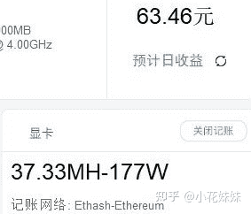

<!--yml
category: 挖矿
date: 2022-06-26 00:00:00
-->

# 比特币今年大牛市能持续到几月份 ?

> 原文：[https://www.zhihu.com/question/446635602/answer/1793376698](https://www.zhihu.com/question/446635602/answer/1793376698)

 个人观点，持续的时间**越长越好**。

因为作为虚拟货币的龙头大哥，他的涨跌是带动整个币圈的，而对于散户，或者广大的个体显卡小矿工，影响收入的是**以太坊**。

大部分人对于比特币的观点就是看热闹，并没有真正的购入。

对我我们这些打工仔来说，玩虚拟货币风险太高，想蹭蹭热度就只能靠着以太坊，每天多挣一顿麦当劳。

## 教程参考这里：[以太坊，让十年老电脑依旧可以回血教程](https://zhuanlan.zhihu.com/p/355955385)

对于币价的观点，我认为今年的比特币已经几创新高，目前来来回回在6万左右波动。而且已经吸引了广泛的关注，想再创新高可能就引起政策层面的手段了。所以还是持保守态度，请入市谨慎，做好散户的姿态。

**挖矿专场**丨[锁算力卡挖矿](https://zhuanlan.zhihu.com/p/399409039)丨[未锁卡挖矿教程](https://zhuanlan.zhihu.com/p/355955385)丨[笔记本挖矿](https://zhuanlan.zhihu.com/p/360451565)丨[锁算显卡怎么挑](https://zhuanlan.zhihu.com/p/374342633)丨[挖矿毁显卡吗](https://zhuanlan.zhihu.com/p/358944242)丨

**猴山专场**丨[猴山解密3080TI](https://zhuanlan.zhihu.com/p/379179943)丨[猴山解密3070TI](https://zhuanlan.zhihu.com/p/379428935)丨[买70TI还是80TI](https://zhuanlan.zhihu.com/p/379846007)丨[猴山冲4K](https://zhuanlan.zhihu.com/p/380129626)丨

**笔记本专场**丨[满血版笔记本怎么挑](https://zhuanlan.zhihu.com/p/374748213)丨[买3060还是70本](https://www.zhihu.com/question/447817962/answer/1909204347)丨[3050本评价](https://www.zhihu.com/question/462045112/answer/1913547325)丨[蛟龙7测评](https://zhuanlan.zhihu.com/p/369226521)丨