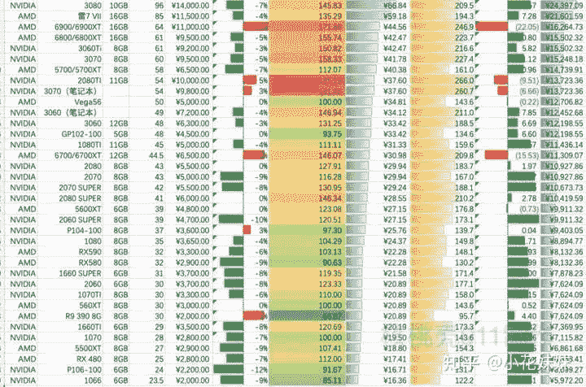

<!--yml
category: 挖矿
date: 2022-06-26 00:00:00
-->

# 没有专业矿机，笔记本电脑可以挖矿吗？

> 原文：[https://www.zhihu.com/question/275013341/answer/1888856921](https://www.zhihu.com/question/275013341/answer/1888856921)

 ## 先上结论。显卡算力甚至高于台式机算力。而且不需要买满血版。

## 很多矿老板直接批量购买神州矿机。

我认为笔记本，对于目前显卡溢价高的市场来说，是可以考虑的。详情可以参考文章链接，这里只是粗略的谈一谈。简单来说，笔记本的优势就是在显卡溢价高的时候，笔记本的残值率非常高。哪怕显卡因为矿难跌价，**笔记本仍就可以维持比较高的残值**。

一台满血版的3060笔记本，我自用的是机械革命 蛟龙7 3060 130W满血版。日常算力维持在46左右，温度维持在62度，比较健康。

同时搭配的就是笔记本散热支架，风扇起到的作用不大，主要是抬高底面。

同款推荐比较火的，就是联想的R9000P笔记本，做工确实是优秀。同样是130W满血版带独显直连。散热方面也是优于蛟龙7，当然价格也是高出了不少。

以目前的ETH来计算，基本可以达到1.5M/1元/日。也就是45的算力可以打到1.5*45约60左右的日收益。和台式机的3060算力相比较，可以说相差无几（我没有超频过猛）

我自己的超频设置为功耗-39 核心-300 显存+1100

至于个体户或者单卡想参与的办法，基本有两种。

一、使用操作简单的一体式程序，或有2-3%的手续费。好处就是操作简单，简单的设置超频以后点击“开始记账”就可以了。程序自动转换成相对应的价格，直接打到你的某宝账户里面。

具体操作可以看一下这里。

二、使用矿工等一类的软件，这类软件是只能把相应的币种存到你的钱包里面，你需要再交易所进行买卖，转换成USDT，然后进行卖出操作。其中的交易也会有相应的手续费，并不一定比一体式程序少，我也具体没算过。可以自行选择。

## 当然，无论是笔记本还是独立显卡，对于普通家庭而言都是不小的支出，所以请谨慎考虑

**挖矿专场**丨[挖矿教程](https://zhuanlan.zhihu.com/p/355955385)丨 [笔本挖矿](https://zhuanlan.zhihu.com/p/360451565)丨[挖矿毁显卡吗](https://zhuanlan.zhihu.com/p/358944242)丨[矿卡也质保](https://zhuanlan.zhihu.com/p/386391253)丨[自造矿机教程](https://zhuanlan.zhihu.com/p/410470347)

**锁算专场**丨[锁算卡挖矿](https://zhuanlan.zhihu.com/p/398651881)丨[RVN和ERGO教程](https://zhuanlan.zhihu.com/p/402971584)丨[锁算卡挑选](https://zhuanlan.zhihu.com/p/374342633)丨[挖矿知识点合集](https://www.zhihu.com/question/461044682/answer/1994951468)

**笔记本专场**丨[满血版笔记本怎么挑](https://zhuanlan.zhihu.com/p/374748213)丨[买3060还是70本](https://www.zhihu.com/question/447817962/answer/1909204347)丨[蛟龙7测评](https://zhuanlan.zhihu.com/p/369226521)丨