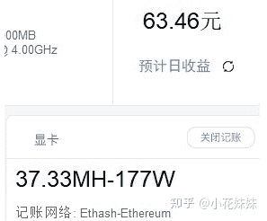

<!--yml
category: 挖矿
date: 2022-06-26 00:00:00
-->

# 浪费这么多资源，去挖一个根本不存在的比特币，难道就我一个人很讨厌这东西吗？

> 原文：[https://www.zhihu.com/question/445164512/answer/1791434820](https://www.zhihu.com/question/445164512/answer/1791434820)

 你讨厌这个东西，是因为利益没有落到你的手里。

如果每天都有人送你一顿麦当劳的钱，你觉得香不香？

这就是比特币走高，带高了 以太坊，一张显卡就可以给你创造的利益。

所以如果你问我，喜欢比特币吗？喜欢。希望比特币涨吗，随意。

只要不要影响了我的金主：以太坊的币价就可以。

一台电脑，开机就有收入，这难道不是打工人的梦想吗？

**收入**和**回本周期**表格我做在文章里了：[小花妹妹：以太坊，让十年老电脑依旧可以回血教程](https://zhuanlan.zhihu.com/p/355955385)

如果说讨厌，我认为含有一定的仇富心理。

要我我也烦，兢兢业业一辈子吗，不如人家几年前买点比特币挣的多？这不是来搞我心态的吗？

当然也不能只看贼吃肉不看贼挨打，人家承担的风险是我们接受不了。

所以真的谈不上喜欢和讨厌，人家吃肉我们百姓喝汤。放平心态就好。

## 相关阅读

[以太坊，让十年老电脑依旧可以回血教程](https://zhuanlan.zhihu.com/p/355955385)

[你挖或者不挖，都被沦为了“矿卡”](https://zhuanlan.zhihu.com/p/358944242)

[你们有哪些事是买了车以后才知道的？](https://www.zhihu.com/question/31086102/answer/1776117309)