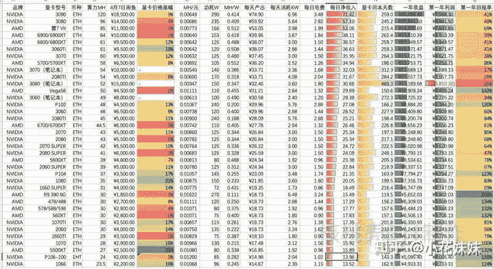

<!--yml
category: 挖矿
date: 2022-06-26 00:00:00
-->

# 游戏玩家是怎么看待最近显卡涨价的事情？

> 原文：[https://www.zhihu.com/question/458069212/answer/1877890526](https://www.zhihu.com/question/458069212/answer/1877890526)

 ## 这一波矿潮，基本上可以算作玩家的“福利局”。

其实这句话也不准确，因为不管你用什么姿势，无论是抢卡**“被黄牛“，“锻炼“，或者是低买高卖**，总归是可以赢一波的。

目前最新的动态是虽然难度增加，每天的产出的量减少。但是因为价格上涨了两倍，所以每天的产出还是可以稳得住。

图片来自文章

我们可以分析一下如下的图片。

目前来说，回本天数比较快的显卡都属于AMD系列，但是其实这么说是不准确的。

因为这里计算的“回本周期”是已你的投入来计算的，并没有计算显卡的残值。越高端的显卡残值的价格也越高，所以到回本的那一天开始算，你手里的卡就是你“耐心”所得的价值。

目前来说最具有性价比的显卡仍旧是我们的“虚空神卡”3060TI，拥有着和3070同样的算力而且功耗比较低。单卡24小时运行的电费大约维持在4块钱左右。算力可以打到60M/H，以目前的波动来看，基本上每天可以打到70R左右。

同样，笔记本也是如此。如果算上残值的价格，那么回本的周期会非常的可观。保护好成色和箱说，二手的残值非常的高。我自己入的是是蛟龙7 130W的3060笔记本，主要还是自己想自用，趁着币价还可以，提高一下性价比。

在如此的市场之下，甚至你都不需要懂这些。只需要在抢购的时候拥有年轻十岁的手速，抢到就是“被黄牛”

目前来说原价卡基本上没有了，在2月份左右，京东自营还出过几次抢购的原价卡。那个时候3060的价格基本2999就可以抢到，当时的3060价格基本在7-8K左右。网上口诛笔伐“黄牛”的人不过是没抢到而已，作为平民老百姓的我们，又有几个人能**忍心自用**？

目前来说币价和市场，谁也不敢说什么时候崩盘。**入市需谨慎**并不是一句空话。

我个人认为最好的观点就是：买的东西自用，通过手法来提高**性价比**，仅此而已。

如果指望着这个养家糊口，回本周期略长，市场不稳定，并不能成为**长远打算**的计划。

如果是纯心态的游戏玩家，那么可以考虑耐心等待跳水的3050TI等显卡，锁算力值得拥有。

**挖矿专场**丨[锁算力卡挖矿](https://zhuanlan.zhihu.com/p/399409039)丨[未锁卡挖矿教程](https://zhuanlan.zhihu.com/p/355955385)丨[笔记本挖矿](https://zhuanlan.zhihu.com/p/360451565)丨[锁算显卡怎么挑](https://zhuanlan.zhihu.com/p/374342633)丨[挖矿毁显卡吗](https://zhuanlan.zhihu.com/p/358944242)丨

**猴山专场**丨[猴山解密3080TI](https://zhuanlan.zhihu.com/p/379179943)丨[猴山解密3070TI](https://zhuanlan.zhihu.com/p/379428935)丨[买70TI还是80TI](https://zhuanlan.zhihu.com/p/379846007)丨[猴山冲4K](https://zhuanlan.zhihu.com/p/380129626)丨

**笔记本专场**丨[满血版笔记本怎么挑](https://zhuanlan.zhihu.com/p/374748213)丨[买3060还是70本](https://www.zhihu.com/question/447817962/answer/1909204347)丨[3050本评价](https://www.zhihu.com/question/462045112/answer/1913547325)丨[蛟龙7测评](https://zhuanlan.zhihu.com/p/369226521)丨