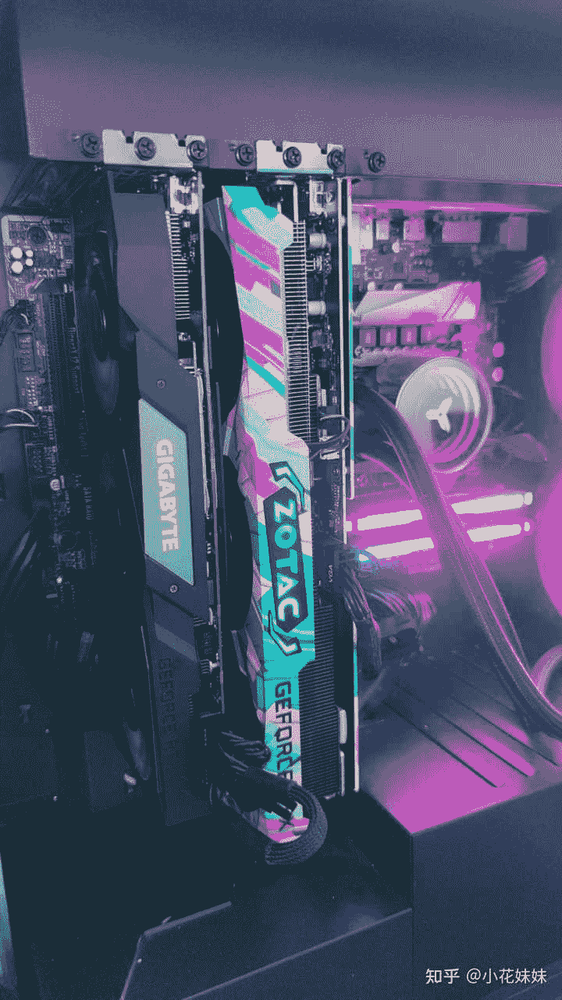
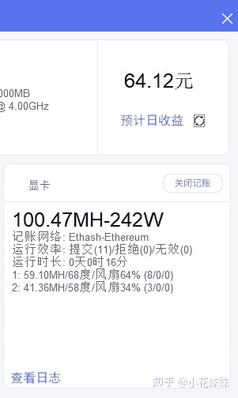

<!--yml
category: 挖矿
date: 2022-06-26 00:00:00
-->

# 炒币风险高，挖矿风险怎么样？

> 原文：[https://www.zhihu.com/question/449816670/answer/1822637982](https://www.zhihu.com/question/449816670/answer/1822637982)

 稳赚不赔，下一题。

今天刚加了张3060TI，发现躺着赚钱的姿势确实是香。先挖一阵再考虑出自己的2070。

至于说不够电费的，请根据功率自行计算电费，对比每天的收益。

截图来自[哈希宝](https://link.zhihu.com/?target=http%3A//app.behash.com/reg/invite/O14BJF6q)

如果想问自己的显卡能不能入坑，很简单。

看看显存够不够4G就可以了。

教程可以参考

散热方面，如果不到70度还感觉担心，那么你需要

**挖矿专场**丨[锁算力卡挖矿](https://zhuanlan.zhihu.com/p/399409039)丨[未锁卡挖矿教程](https://zhuanlan.zhihu.com/p/355955385)丨[笔记本挖矿](https://zhuanlan.zhihu.com/p/360451565)丨[锁算显卡怎么挑](https://zhuanlan.zhihu.com/p/374342633)丨[挖矿毁显卡吗](https://zhuanlan.zhihu.com/p/358944242)丨

**猴山专场**丨[猴山解密3080TI](https://zhuanlan.zhihu.com/p/379179943)丨[猴山解密3070TI](https://zhuanlan.zhihu.com/p/379428935)丨[买70TI还是80TI](https://zhuanlan.zhihu.com/p/379846007)丨[猴山冲4K](https://zhuanlan.zhihu.com/p/380129626)丨

**笔记本专场**丨[满血版笔记本怎么挑](https://zhuanlan.zhihu.com/p/374748213)丨[买3060还是70本](https://www.zhihu.com/question/447817962/answer/1909204347)丨[3050本评价](https://www.zhihu.com/question/462045112/answer/1913547325)丨[蛟龙7测评](https://zhuanlan.zhihu.com/p/369226521)丨