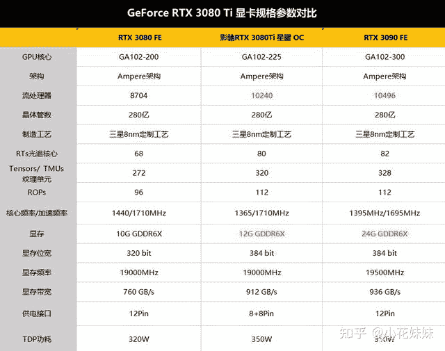
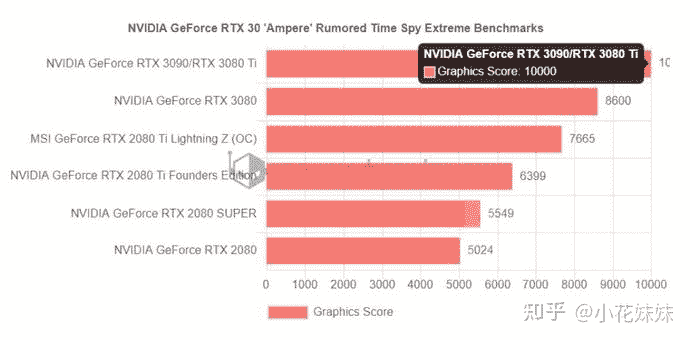
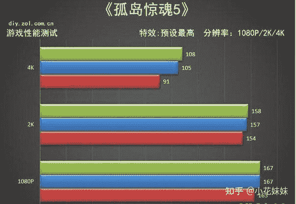
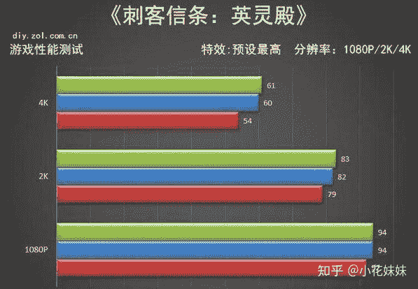
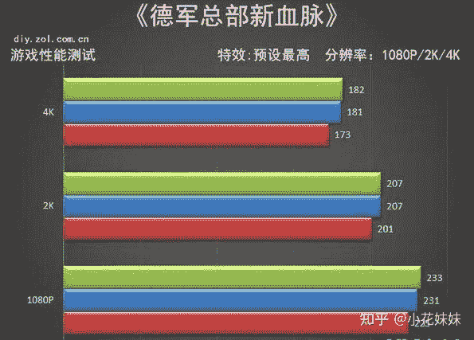

<!--yml
category: 挖矿
date: 2022-06-26 00:00:00
-->

# 猴山解密：3080TI和3080、3090差距有多少

> 原文：[https://zhuanlan.zhihu.com/p/379179943](https://zhuanlan.zhihu.com/p/379179943)

3080TI已经发售多日，包括目前京东也是都处于有货的状态。但是价格方面，就不多说了，基本上维持在1.15万-1.3万元左右区间。而海鲜市场方面价格基本维持在1.25万元左右。至于这张显卡是否值这个价格，那就需要自己去评判了。不过英伟达的耍猴之夜也确实让不少人下了猴山。8999的价格抢到3080TI，转手海鲜市场就可以挣到2500元起步的差价。

## 那么高端显卡的差距到底有多少呢？

3080Ti 采用的是12GB GDDR6X规格的显存，搭载了12-pin供电，TGP功率为350W。规格方面近乎可以媲美3090，可以比作“**显存减半的3090**”显卡。但是和3080相比，有近乎15%-20%的硬件差距。当然这都是理论的差距，体现在游戏帧数上并不会有天壤地别的夸张程度。

在跑分方面，基本可以验证硬件的差距。3090和3080TI的跑分数据按10000分为基准，而3080跑到了8600分。**理论的性能分数差距为14%**。这个级别的显卡，**在玩2K分辨率的游戏基本上都可以轻松的应对**。但是上升到4K分辨率的时候，可能就会体现出部分差距。毕竟3080显卡的10G显存很可能成为“瓶颈”而3080TI的12G显存可以从容很多。

### 所以单从理论硬件和分数上可以得出结论：

### 3080TI约等于3090（5%差距），等于1.15倍性能的3080

那么游戏方面的差距有多少呢？提现到帧数上的差距不会达到15%的夸张程度。所以我们基本测试出4K的性能差距。毕竟这肯定是几年以后的趋势。

### **绿色3090、蓝色3080TI、红色3080**

孤岛惊魂5在2K分辨率的情况下，基本只有1-3帧的差距基本可以忽略。而4K分辨率下就开始出现比较明显的差距。3080和3080TI就开始有15%的帧数差距。**所以基本上4K分辨率成为了目前高端显卡的试金石。**

英灵殿这个游戏比较明显的就是吃显存。1080P画质全高就吃到了5.8GB的显存。2K画质下，3080和3080TI有了3帧的差距，基本可以忽略。但是需要注意的是，这是维持在80帧左右。

而4K分辨率下，54帧和60帧的差距就比较明显了。游戏体验方面如果在复杂场景下，40-60帧左右每高一帧都具有非常高的意义。所以**4K分辨率下54和60帧的差距是非常有含金量的。**

德军总部方面，基本上可以忽略差距。因为170帧和200帧虽然有30帧的差距。但是游戏体验来说，根本没有任何差距。

**所以在4K分辨率的3A大作面前，选择3080TI的15%性能还是非常有必要的。**

### 目前的定价方面

3080TI首发价为8999，当然很多猴子都在等这个价格下山。而目前的价格基本是海鲜市场1.15万元，京东全新为1.3万元左右。

而3080犹豫挖矿的原因，每天可以做到日收益40元左右。所以价格仍旧居高不下。虽然性能差距低了15%但是全新价格仍旧1.3万元左右。和3080TI持平。二手显卡的价格也不算便宜，基本维持在1.25万左右，如果我的话还是选择京东自营，自挖也有保障。

挖矿方面的问题可以参考一下这里。

3090的价格毕竟对得起**卡皇**的位置。稳居2万元左右。24GB的内存可以在未来的3-5年可以轻松的应对4K分辨率下高材质的内存占用。如果是追求高画质的发烧友DIY玩家，并且已经配备了4K显示，那么24GB的内存还是值得拥有 。

**挖矿专场**丨[锁算力卡挖矿](https://zhuanlan.zhihu.com/p/399409039)丨[未锁卡挖矿教程](https://zhuanlan.zhihu.com/p/355955385)丨[笔记本挖矿](https://zhuanlan.zhihu.com/p/360451565)丨[锁算显卡怎么挑](https://zhuanlan.zhihu.com/p/374342633)丨[挖矿毁显卡吗](https://zhuanlan.zhihu.com/p/358944242)丨

**猴山专场**丨[猴山解密3080TI](https://zhuanlan.zhihu.com/p/379179943)丨[猴山解密3070TI](https://zhuanlan.zhihu.com/p/379428935)丨[买70TI还是80TI](https://zhuanlan.zhihu.com/p/379846007)丨[猴山冲4K](https://zhuanlan.zhihu.com/p/380129626)丨

**笔记本专场**丨[满血版笔记本怎么挑](https://zhuanlan.zhihu.com/p/374748213)丨[买3060还是70本](https://www.zhihu.com/question/447817962/answer/1909204347)丨[3050本评价](https://www.zhihu.com/question/462045112/answer/1913547325)丨[蛟龙7测评](https://zhuanlan.zhihu.com/p/369226521)丨