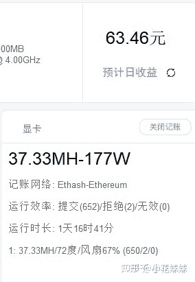
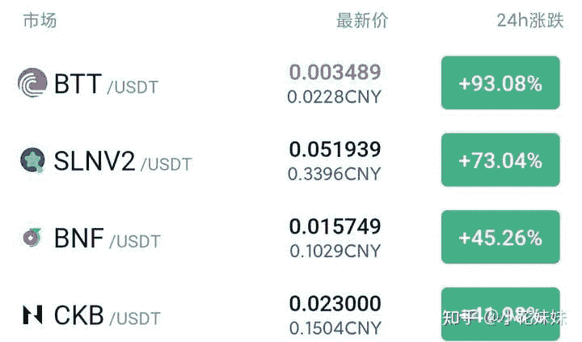

<!--yml
category: 挖矿
date: 2022-06-26 00:00:00
-->

# 王思聪说傻子才买比特币，你怎么看？

> 原文：[https://www.zhihu.com/question/425743358/answer/1788102068](https://www.zhihu.com/question/425743358/answer/1788102068)

 如果这是前半句，我表示赞同。我替他补全后半句：**以太坊，才是全民矿潮的元凶**。

明明**一张显卡**+每天三块钱的**电费**，可以稳赚不赔的每天一顿**麦当劳**。

2070显卡，根据文章链接推荐超频，已经稳定运行小半年，像[哈希宝](https://link.zhihu.com/?target=http%3A//app.hxbao.com/reg/invite/O14BJF6q)这种软件，可以直接看显卡温度，非常方便。

登录以后可以查询各个软件的算力

显卡是不会坏的，原因下面解释。

为什么非要去追求可能随时让你连本带利亏到没有的比特币？

**超频，挖矿，收益，怎么操作**等问题都总结在文章里：

如果想测电量，需要购买小米的智能插座

比特币能买吗？能。比特币可以赚钱吗？可以。

可是这玩意儿和股票像，又不像。

股票有法律保护，有监管。比特币这玩意儿可没有。

比特币还算是稳定的，十几二十个百分点，新闻媒体就铺天盖地了。

你再去看看**非主流币**，真的是千倍币。是涨是跌你看着都觉得刺激。

亲身亏过几辆五菱宏光的人告诉大家：不要碰。

有显卡的香一香每天的麦当劳，就可以了。没有显卡的看看热闹，**人生何其美好**。

再说一下**硬件**问题：很多人担心挖矿会损耗显卡寿命。

其实挖以太坊的时候，工作强度比你玩3A大作都小，只不过工作时间长。

因为你的超频设置是强制限制**核心频率**，核心不会满载。比较保守的人甚至是设置限制到满载的60%工作。

这也导致了一系列的问题，就是显卡不会“黄屁股”。二手显卡你分不出是不是矿卡。

所以，目前的市场，你挖，或者不挖。等你出二手的时候，一律按矿卡处理。

详细解释可以参考这里

[挖矿到底会不会损耗显卡解惑](https://zhuanlan.zhihu.com/p/358944242)

尤其是20和30系显卡，已经被强行上车了。

**挖矿专场**丨[锁算力卡挖矿](https://zhuanlan.zhihu.com/p/399409039)丨[未锁卡挖矿教程](https://zhuanlan.zhihu.com/p/355955385)丨[笔记本挖矿](https://zhuanlan.zhihu.com/p/360451565)丨[锁算显卡怎么挑](https://zhuanlan.zhihu.com/p/374342633)丨[挖矿毁显卡吗](https://zhuanlan.zhihu.com/p/358944242)丨

**猴山专场**丨[猴山解密3080TI](https://zhuanlan.zhihu.com/p/379179943)丨[猴山解密3070TI](https://zhuanlan.zhihu.com/p/379428935)丨[买70TI还是80TI](https://zhuanlan.zhihu.com/p/379846007)丨[猴山冲4K](https://zhuanlan.zhihu.com/p/380129626)丨

**笔记本专场**丨[满血版笔记本怎么挑](https://zhuanlan.zhihu.com/p/374748213)丨[买3060还是70本](https://www.zhihu.com/question/447817962/answer/1909204347)丨[3050本评价](https://www.zhihu.com/question/462045112/answer/1913547325)丨[蛟龙7测评](https://zhuanlan.zhihu.com/p/369226521)丨