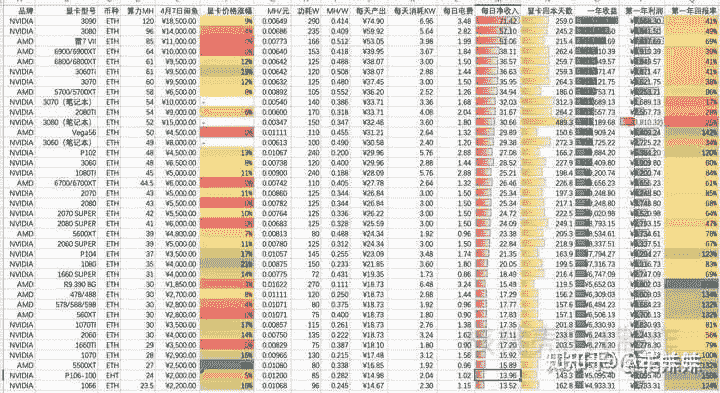

<!--yml
category: 挖矿
date: 2022-06-26 00:00:00
-->

# 现在花3w买两张3080挖矿合适吗？

> 原文：[https://www.zhihu.com/question/459489537/answer/1890526016](https://www.zhihu.com/question/459489537/answer/1890526016)

 没有合适不合适，只能说看市场。

个人的观点，很值。全新卡需要近2万元左右，而3万可以拿到两张，这个价格我认为很合适。而且现在的显卡都有质保，所以用起来也放心。

3080的算力，在95左右，算上系数大约每天可以日收益95*2*0.8约为一天150元左右

收入当然是有涨有跌，前几天的收益180算力可以达到每天500元，一天就抵两天半。

出币量和收入其实是不单看币价的，主要看交易量。所以这个东西一般人搞不懂行情，很迷幻。所以矿工基本不看币价涨跌，只求币价波动。只要有波动，就会大大加入你的回本周期。

也就是说纯回本不算残值的情况下需要200天。但是不要忽略一个问题，3080的残值是比较高的，首发价格为5500元，我们按残值约为6500元算，那么大约仅需要4个月回本。

以目前的市场来说，锁算力的显卡已经临近发布，而且已经明确说明有限供给网吧等经营性企业，所以个人咱俩仍旧处于求卡不得的状态，溢价成为了不可阻挡的趋势。

四个月的时间说长也长，说短也很快。虽然虚拟货币这种东西存在风险，但是个人观点还是:稳得住

既然楼主已经入坑，那么就不要考虑这些了。

**挖矿专场**丨[锁算力卡挖矿](https://zhuanlan.zhihu.com/p/399409039)丨[未锁卡挖矿教程](https://zhuanlan.zhihu.com/p/355955385)丨[笔记本挖矿](https://zhuanlan.zhihu.com/p/360451565)丨[锁算显卡怎么挑](https://zhuanlan.zhihu.com/p/374342633)丨[挖矿毁显卡吗](https://zhuanlan.zhihu.com/p/358944242)丨

**猴山专场**丨[猴山解密3080TI](https://zhuanlan.zhihu.com/p/379179943)丨[猴山解密3070TI](https://zhuanlan.zhihu.com/p/379428935)丨[买70TI还是80TI](https://zhuanlan.zhihu.com/p/379846007)丨[猴山冲4K](https://zhuanlan.zhihu.com/p/380129626)丨

**笔记本专场**丨[满血版笔记本怎么挑](https://zhuanlan.zhihu.com/p/374748213)丨[买3060还是70本](https://www.zhihu.com/question/447817962/answer/1909204347)丨[3050本评价](https://www.zhihu.com/question/462045112/answer/1913547325)丨[蛟龙7测评](https://zhuanlan.zhihu.com/p/369226521)丨