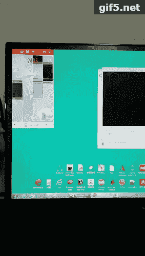

<!--yml
category: 游戏
date: 2023-09-17 14:57:41
-->

# 用Opencv做的一个针对“别踩白块”游戏的自动点击简单工具 - 代码先锋网

> 来源：[https://codeleading.com/article/24382980393/](https://codeleading.com/article/24382980393/)

原理：使用Opencv截屏提取取ROI区域，并定位黑块的的位置并计算中心坐标，同时将坐标传递给鼠标，实现自动快速点击黑块，速度最高跑到了15到16之间，世界最快是17.9

效果如下：



```
#define _CRT_SECURE_NO_WARNINGS
#define _AFXDLL
#include<iostream>  
#include<conio.h>  
#include <opencv2/opencv.hpp>
#include <stdio.h>
#include <afxwin.h>

using namespace cv;
using namespace std;

#define KEY_DOWN(VK_NONAME) ((GetAsyncKeyState(VK_NONAME) & 0x8000) ? 1:0) 

void Screen();
BOOL HBitmapToMat(HBITMAP& _hBmp, Mat& _mat);
HBITMAP	hBmp;
HBITMAP	hOld;
int g_nWidth = 0;
int g_nHeight = 0;
bool isFirst = true;
//抓取当前屏幕函数
void Screen()
{
	//创建画板
	HDC hScreen = CreateDC("DISPLAY", NULL, NULL, NULL);
	HDC	hCompDC = CreateCompatibleDC(hScreen);
	//取屏幕宽度和高度
	/*g_nWidth = GetSystemMetrics(SM_CXSCREEN);
	g_nHeight = GetSystemMetrics(SM_CYSCREEN);*/
	g_nWidth = 310;
	g_nHeight = 550;
	//创建Bitmap对象
	hBmp = CreateCompatibleBitmap(hScreen, g_nWidth, g_nHeight);
	hOld = (HBITMAP)SelectObject(hCompDC, hBmp);
	BitBlt(hCompDC, 0, 0, g_nWidth, g_nHeight, hScreen, 0, 0, SRCCOPY);
	SelectObject(hCompDC, hOld);
	//释放对象
	DeleteDC(hScreen);
	DeleteDC(hCompDC);
}

//把HBITMAP型转成Mat型
BOOL HBitmapToMat(HBITMAP& _hBmp, Mat& _mat)
{
	//BITMAP操作
	BITMAP bmp;
	GetObject(_hBmp, sizeof(BITMAP), &bmp);
	int nChannels = bmp.bmBitsPixel == 1 ? 1 : bmp.bmBitsPixel / 8;
	int depth = bmp.bmBitsPixel == 1 ? IPL_DEPTH_1U : IPL_DEPTH_8U;
	//mat操作
	Mat v_mat;
	v_mat.create(cvSize(bmp.bmWidth, bmp.bmHeight), CV_MAKETYPE(CV_8U, nChannels));
	GetBitmapBits(_hBmp, bmp.bmHeight*bmp.bmWidth*nChannels, v_mat.data);
	_mat = v_mat;
	return TRUE;
}

void MouseEvent(int x, int y)
{
	SetCursorPos(x, y);
	mouse_event(MOUSEEVENTF_LEFTDOWN, 0, 0, 0, 0);
	Sleep(10);//要留给某些应用的反应时间   
	mouse_event(MOUSEEVENTF_LEFTUP, 0, 0, 0, 0);
}

void BeginDetection(Mat &src)
{
	Mat Green;
	Green = src(Rect(0, 0, 310, 420));
	threshold(Green, Green, 240, 255, 0);
	Mat element = getStructuringElement(MORPH_RECT, Size(3, 3), Point(-1, -1));
	dilate(Green, Green, element);
	vector<vector<Point>> contours;
	findContours(Green, contours, CV_RETR_LIST, CV_CHAIN_APPROX_NONE);
	Mat image_binary = Mat::zeros(Green.size(), CV_8UC1);
	drawContours(image_binary, contours, -1, Scalar::all(255), 0);
	vector<vector<Point>>::iterator itr = contours.begin();
	int num = 0;
	while (itr != contours.end())
	{
		double area = itr->size();
		if (area < 110 || area > 200)
		{
			itr = contours.erase(itr);
		}
		else
		{
			itr++;
		}
		num++;
	}
	Mat image_binary2 = Mat::zeros(Green.size(), CV_8UC1);
	drawContours(image_binary2, contours, -1, Scalar::all(255), CV_FILLED);
	//imwrite("..\\public\\TestImages\\111.jpg", image_binary2);
	vector<vector<Point>>::iterator itr2 = contours.begin();
	int x[3] = { 0 };
	int y[3] = { 0 };
	for (int i = 0; i < contours.size(); i++)
	{
		RotatedRect rect = minAreaRect(contours[i]);
		x[i] = rect.center.x;
		y[i] = rect.center.y;
	}
	/*int m_x = (x[1] + x[2]) / 2;
	int m_y = (y[1] + y[2]) / 2;*/
	int m_x = x[0];
	int m_y = y[0];
	cout << "m_x：" << m_x << endl;
	cout << "m_y：" << m_y << endl;
	if (m_x != 0)
	{
		MouseEvent(m_x, m_y);
		isFirst = false;
	}
}

//模拟器分辨率要求：300*500
void main()
{
	Sleep(5000);
	//cout << "开始" << endl;
	int iCount = 0;
	while (iCount < 100000)
	{
		Mat src, dst;
		//屏幕截图
		Screen();
		//类型转换
		HBitmapToMat(hBmp, src);
		resize(src, dst, cvSize(g_nWidth*1, g_nHeight*1), 0, 0);
		//算法部分
		Mat channels[4];
		split(dst, channels);
		if (isFirst)
		{
			BeginDetection(channels[1]);
		}
		//cout << "下一步" << endl;
		cvtColor(dst, dst, CV_BGR2GRAY);
		threshold(dst, dst, 10, 255, 1);
		Mat element = getStructuringElement(MORPH_RECT, Size(10, 10), Point(-1, -1));
		erode(dst, dst, element);
		vector<vector<Point>> contours;
		findContours(dst, contours, CV_RETR_EXTERNAL, CV_CHAIN_APPROX_NONE);
		Mat image_binary = Mat::zeros(dst.size(), CV_8UC1);
		drawContours(image_binary, contours, -1, Scalar::all(255), CV_FILLED);
		//cout << "轮廓数：" << contours.size() << endl;
		vector<vector<Point>>::iterator itr = contours.begin();
		int num = 0;
		while (itr != contours.end())
		{
			double area = itr->size();
			if (area < 250)
			{
				itr = contours.erase(itr);
			}
			else
			{
				itr++;
			}
			num++;
		}
		Mat image_binary2 = Mat::zeros(dst.size(), CV_8UC1);
		drawContours(image_binary2, contours, -1, Scalar::all(255), CV_FILLED);
		vector<vector<Point>>::iterator itr2 = contours.begin();
		for (int i = 0; i < contours.size(); i++)
		{
			Sleep(20);
			RotatedRect rect = minAreaRect(contours[i]);
			MouseEvent(rect.center.x, rect.center.y);
		}
		if (KEY_DOWN('Q'))
		{//退出
			return;
		}
		//char *file = new char[100];
		//sprintf(file, "..\\public\\images\\%d.jpg", iCount);
		//cout << file << endl;
		//imwrite(file, src);
		//waitKey(0);
		//imwrite("..\\public\\TestImages\\111.jpg", image_binary2);
		DeleteObject(hBmp);
		iCount++;
		Sleep(5);
	}
} 
```

参考链接：

https://blog.csdn.net/qq_18984151/article/details/79231953

https://blog.csdn.net/qq_35409640/article/details/75212236