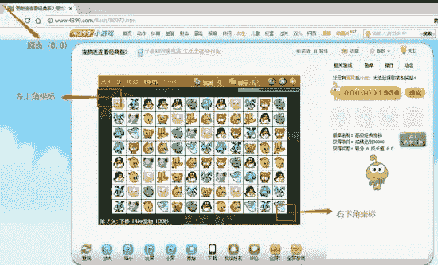
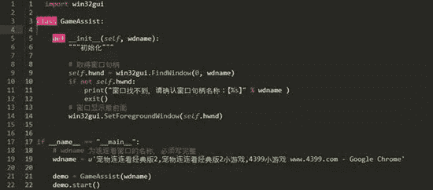
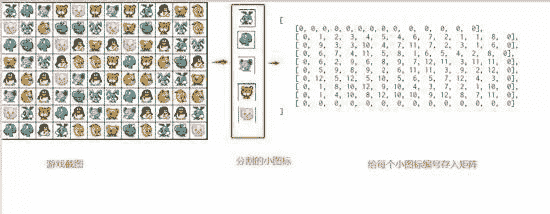
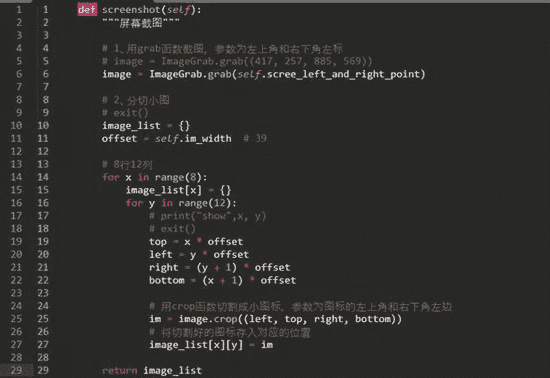
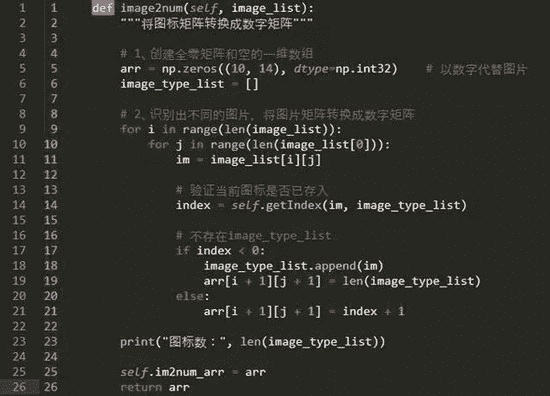
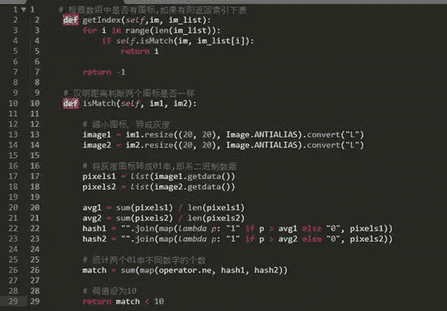
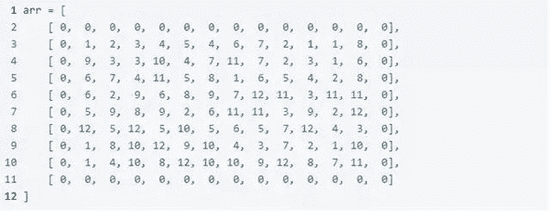
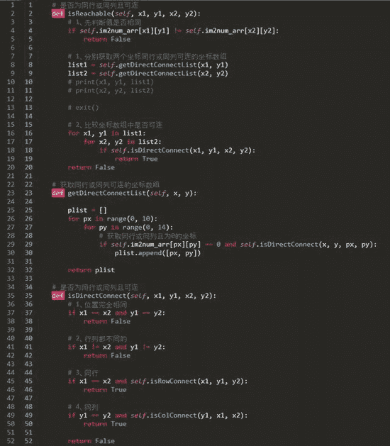
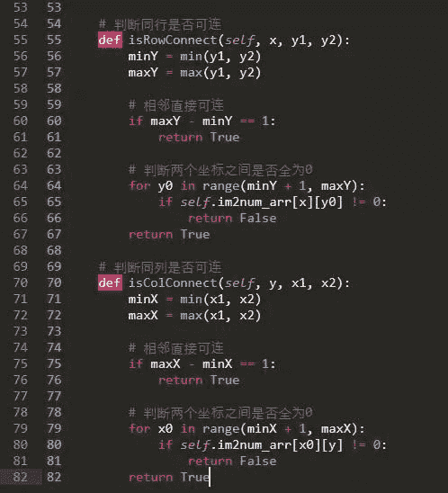

<!--yml
category: 游戏
date: 2022-05-04 19:36:43
-->

# 用Python做一个连连看游戏辅助脚本，完整编程思路分享_165845132的博客-CSDN博客_python 连连看

> 来源：[https://blog.csdn.net/m0_64728691/article/details/122216364](https://blog.csdn.net/m0_64728691/article/details/122216364)

一、说明

简述：本文将以4399小游戏《 宠物连连看经典版2 》作为测试案例，通过识别小图标，模拟鼠标点击，快速完成配对。对于有兴趣学习游戏脚本的同学有一定的帮助。

运行环境：Win10/Python3.5。

主要模块：win32gui（识别窗口、窗口置顶等操作）、PIL（屏幕截图）、numpy（创建矩阵）、operator（比较值）、pymouse（模拟鼠标点击）。

注意点：

1、如果安装pymouse不成功或者运行报错，可以考虑先通过whl 安装pyHook、然后再通过pip安装pyuserinput。

2、如果报错 [ImportError: No module named ‘windows’ ]，可以修改__init__.py相应的行 为 windows => pymouse.windows。

二、开发前景（随便唠叨一哈，可跳过）

游戏辅助脚本在当前环境也算是比较流行了，对于经常玩游戏人来说，适当的游戏辅助还是很有帮助的，让计算机做一些繁琐乏味的操作。当然还有更加高大上的其他操作，这里就不赘述了。对于游戏辅助脚本，能想到基本有以下两种：一是读取游戏在内存中的数据，理想的话可以做到更改游戏一些基本属性，原理和很多的外挂或破解游戏类似；二是模拟用户用户行为，模拟鼠标点击、键盘操作等。当然，由于本人从未涉及游戏辅助脚本这一领域，出于个人兴趣，学习研究一下，本文例子则是第二种，主要还是模拟用户行为，让程序代替用户操作。

三、开发流程

浏览器打开游戏窗口（单个一个窗口），游戏界面如下图所示，游戏主要界面截图需要两个坐标（左上角坐标和右下角坐标）来确定，原点一般是屏幕左上角，不确定坐标点值的同学，可以全屏截图，用编辑图片软件查看坐标值。获取窗口句柄，这里就是浏览器标题栏的标题了（右键-查看源代码-title，加上软件名）比如：“宠物连连看经典2,宠物连连看经典版2小游戏,4399小游戏 “。

总体开发思路：截取游戏主图 —> 分割成小图 —> 对比每个小图，对比图片相识度，编号存入矩阵 —> 对矩阵进行可连计算 —> 模拟点击。

3.1 获取窗口句柄，把窗口置顶

python可以使用win32gui模块调用Windows API实现对窗口的操作，使用FindWindow()方法可以获取窗口的句柄（handle），需要传入两个参数，第一个为父窗口句柄（这里填0即可），第二个参数是窗口的名称（标签title - Google Chrome）。获取句柄之后然后通过SetForegroundWindows() 设置窗口在前面，这里传入游戏窗口的举报即可，代码如下：

3\. 2 截取游戏界面，分割图标，图片比较

这里需要花费一些时间来校验程序，如果截取的图片不好，则会影响后续操作，所以比较主要的是确认游戏左上角和右下角这两个坐标值，以及每个小图标的宽高。如下图所示，先截取整个游戏界面图，然后分割小图标，接着对每个图标进行比较，然后以编号代替图标存入矩阵（这里的编号矩阵和游戏图不一致，原理一样）。

根据初始化设定的左上角和右下角两个坐标，使用ImageGrab.grab()方法进行截图，传入一个元组即可，然后对这个大图进行分割，切割成一个个小图标存入到images_list数组中。

通过上面代码切割的小图标，转成数字矩阵，如果图标已经存入image_type_list则返回这个索引，如果不存在，则在追加进去，然后当前长度就是这个新加入图标的编号，代码如下所示：

上面的getIndex就是对比图片，判断图标是否出现过（是否已存在image_type_list中，没出现则追加进去），这里使用汉明距离判断两个图片的相识度，设置阀值10，当小于阀值则认为是同一个图片，具体代码如下：

四、程序核心-图标连接算法（路径寻找）

这里仅对算法代码进行简单分析，如果对程序不好理解，可以留言，后续可以图文分析。

通过上面的开发流程，基本获取如下这样的矩阵，只要比较两个编号相同的值进行可连路径寻找，如果找到即进行模拟点击操作。这里简单介绍下游戏规则：8行乘12列游戏图标区域，外围的0其实表示寻找路径的时候可以通过，例如坐标（1, 1）可以与（1,10）进行连接、（7, 1）和（7,2）进行连接。

算法的思路：路径的寻找首先是寻找一个坐标的横向竖向可以直接相连的坐标集合，比如坐标p1（1,1）这样的集合有[ （0,1）, （1,0） ]，另外一个坐标p2（1,10）的可连集合为[ （0,10） ]，然后再对p1和p2的可连坐标集合进行比较，如果集合中坐标也有可连，则表示p1和p2可连，很明显，（0,1）和（0,10）为同一行且可连，这样就表示p1和p2两点存在可连路径了，代码如下所示：

简单分析下代码实现过程：在isReachable()传入两个需要比较的坐标值，然后分别获取两个点横竖向（isRowConnect()、isColConnect()）可以连接的坐标集合，最后再对集合进行遍历比较是否存在可连的，如果存在则表示传入的两个坐标是可以连接的。

五、开发总结

学习这样一个游戏辅助脚本，对于个人培养编程兴趣也是有很多帮助的，在工作之余不失为一个好的消遣方式，以后会多向这些方向研究学习。本案例仅仅是截图、比较图片和模拟鼠标点击，我觉得还可以更加强大，而且还不局限于游戏这样一个领域，相信大家应该见过自动发QQ消息的软件吧，我觉得这完全可以做。还有很多模拟操作可以实现：鼠标滚轮，左右键、键盘输入等。

六、附件-源码

源代码和更多好玩有趣的游戏源码分享：

