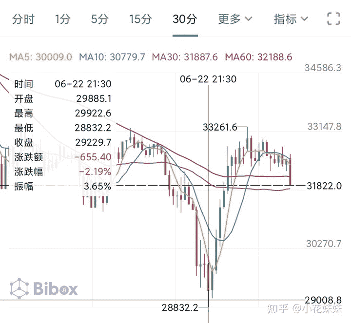
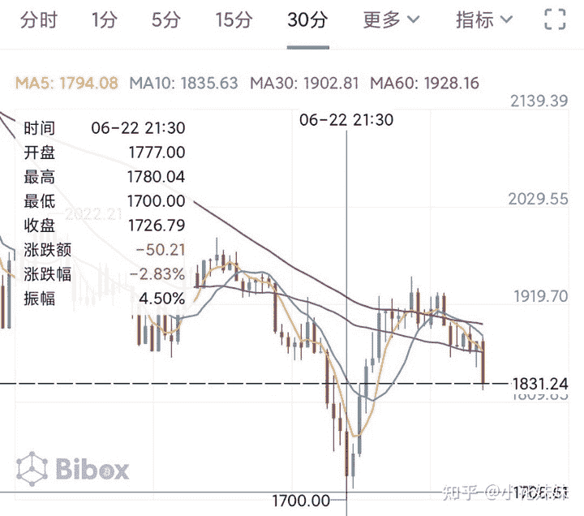
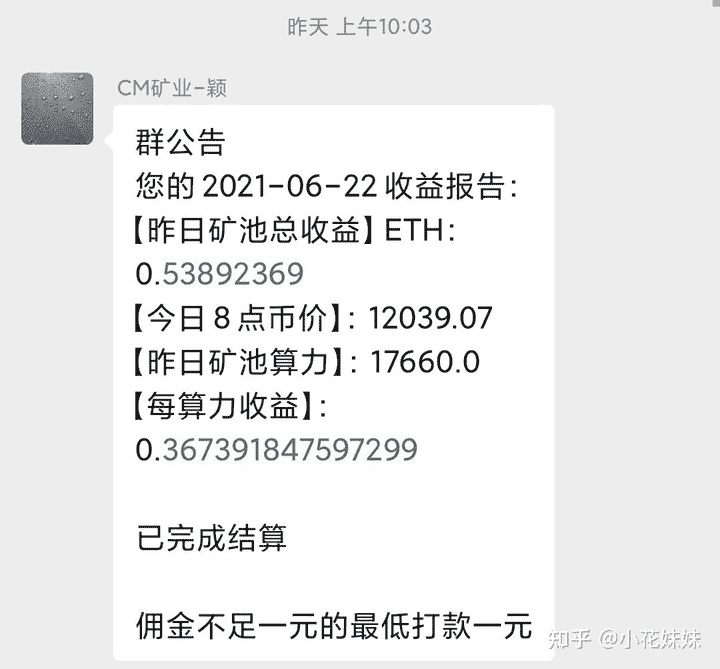

<!--yml
category: 挖矿
date: 2022-06-26 00:00:00
-->

# 真正的矿难终于来了:JS翻车，猴儿们下山

> 原文：[https://zhuanlan.zhihu.com/p/383105905](https://zhuanlan.zhihu.com/p/383105905)

截止今天6.23日，从5.19日BTC跌破2.9万USDT以后。在6.21号再次触底2.88万USDT。

当然，挖过矿的人都知道，我们的收益主要还是看ETH的价格。BTC是整个行情的风向标，作为虚拟货币行情的参考意义。ETH的行情基本紧随BTC变动，目前维持在1万元作为的价格。

其实在5.19号触底的时候就有矿难初期的迹象。因为在5.19的时候以太坊随着BTC大跌。从2万左右一枚一直触底1818 USDT这都算是正常行情。但是细心的人可以发现，BTC后续重新拉升到4万多USDT以上，但是ETH并没有跟着大幅度拉升，一直横盘1.5万元人民币左右。这个价位的币价，已经让挖矿的人很难受了。大有强弩之末的态势，拉不动了。

而1.5万元人民币的价格就已经让各种散户比较难受了。价格基本维持在每算力0.4元日收益的价格。而这两天一度突破0.4降到了0.36元左右的价格。也就是一张40算力的3060目前日收益大约为15元左右

## 显卡方面

我5.19以后看着态势不太对就开始跑路了。个人体量不大，只有一张2070，一张3060TI和一台3060笔记本

现在个人玩家想下山，就只能选择锁算力显卡。

**锁算力显卡型号**

**3060、3060Ti、3070TI、3080TI**

**未锁算力显卡型号**

**3060、3060TI、3070、3080、3090**

**其中3060和3060TI购买需要区分确认好是否锁算力。尤其是二手，**一定要确认盒子上的SN码和显卡是否一致。如果给发票，同样样确认发票标注的SN码是否一致。

## 下山建议

目前主流的性价比显卡是3070TI，海鲜价格基本可以维持在6000-6500价格区间。这个价格已经基本接近3070TI旗舰卡的原价。个人6250入的影驰金属大师，原价5999，溢价可以接受。

同样溢价不多的型号有原价6499的星耀，5699的超龙X都可以考虑小加几百下山。

**挖矿专场**丨[锁算力卡挖矿](https://zhuanlan.zhihu.com/p/399409039)丨[未锁卡挖矿教程](https://zhuanlan.zhihu.com/p/355955385)丨[笔记本挖矿](https://zhuanlan.zhihu.com/p/360451565)丨[锁算显卡怎么挑](https://zhuanlan.zhihu.com/p/374342633)丨[挖矿毁显卡吗](https://zhuanlan.zhihu.com/p/358944242)丨

**猴山专场**丨[猴山解密3080TI](https://zhuanlan.zhihu.com/p/379179943)丨[猴山解密3070TI](https://zhuanlan.zhihu.com/p/379428935)丨[买70TI还是80TI](https://zhuanlan.zhihu.com/p/379846007)丨[猴山冲4K](https://zhuanlan.zhihu.com/p/380129626)丨

**笔记本专场**丨[满血版笔记本怎么挑](https://zhuanlan.zhihu.com/p/374748213)丨[买3060还是70本](https://www.zhihu.com/question/447817962/answer/1909204347)丨[3050本评价](https://www.zhihu.com/question/462045112/answer/1913547325)丨[蛟龙7测评](https://zhuanlan.zhihu.com/p/369226521)丨