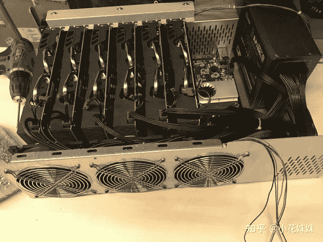
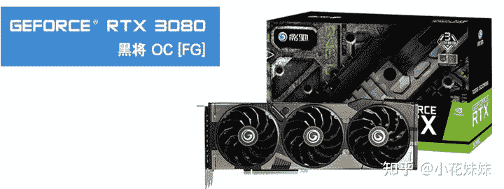
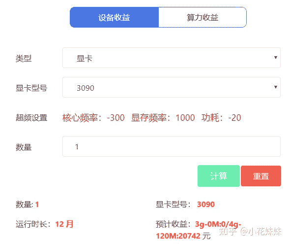
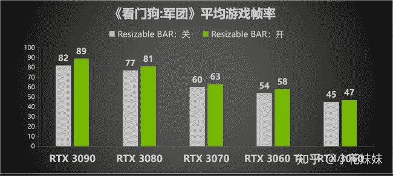

<!--yml
category: 挖矿
date: 2022-06-26 00:00:00
-->

# 矿难来临，新显卡发布：锁算力显卡怎么选？

> 原文：[https://zhuanlan.zhihu.com/p/374342633](https://zhuanlan.zhihu.com/p/374342633)

目前市场，3060的锁算力显卡已经开始陆续放货。那么锁算力的显卡**值不值得买**就成为了很多人心中的疑问。以目前的显卡市场来说，算力是显卡定价的唯一凭证，这也导致了3060TI和3070无锁版本同为60M/S的算力，3060TI的功耗更定，成为了哪怕某鱼都不好找货的**虚空神卡**。而剩下的，基本都是听都没听说过的牌子。

至于还不了解什么是挖矿，算力是什么东西的小伙伴，可以看这里学习一下。

显卡锁算力，以目前的测评来看基本上达到了对半砍的程度。比如3060显卡，优化超频后基本上可以达到48-49的算力。而锁算力版本基本上超频后可以勉强达到25左右的算力。

新发布的锁算力显卡，都会有FG的标识以区别是否为锁算力显卡，不会造成市场已售显卡市场的混乱。

而新发布的显卡型号，基本上包含3050TI、3060FG、3070FG、3080FG、3080TI FG等版本。市场预估的价格如下。3060作为能用的入门级显卡，从目前的市场价格6000左右，锁算力以后变为3999的价格。确实可以显示出老黄的锁算力决心初有成效。但是性能方面个人认为仍然不值这个价格。

注意一下，这里的算力，是单指挖**以太坊**的算力。可以通过这里查询你目前拥有显卡的算力

选择你的显卡型号，就可以查询当前根据实时币价的算力收益。

目前已经有很多人开始预测新显卡锁算力版本的价格，整理了一下。只有3060FG的价格是非常明确的。已经有人爆料非丐版三风扇的版本，**进货价为3750元**。

| 显卡型号 | 预估市场价格 |
| 3050TI | 2000 |
| 3060FG | 3999 |
| 3070FG | 5500+ |
| 3070TI FG | 6500 |
| 3080FG | 7500 |
| 3080TI | 8000+ |

锁算力方面，目前已经有的消息是3080TI FG仍然拥有接近120M/S的算力。如果算力属实，那么以目前的市场来看，定价不会低于两万元。

可以已经可以证实的算力，总结如下。

我们根据目前的3070二手显卡价格为9000左右，算力为60计算。可以得出目前每M的算力大约价值140-150元之间，我们按140元计算，即140M/元。可以得出下表。可以看出3060的溢价还是比较明显，如果3060FG的价格定位到3500元左右，那么仍然逃脱不了矿老板的魔爪，所以500的加价，基本上属于为了：能**让你买到显卡**。

| 显卡型号 | 锁算力后算力 | 根据算力定价 |
| 3060FG | 23 | 3300 |
| 3070FG | 25 | 3500 |
| 3080FG | 43 | 6000 |
| 3080TI FG | 120 | 16800 |

个人总结，目前来说入门级3050TI的显卡性能，个人认为还是有点拘谨。并不能满足广大DIY和游戏爱好者的画质要求，所以并不推荐。

3060显卡方面，性能还算达标。分为无锁和FG的有锁版本。无锁版本目前的新卡价格为7500元左右。以截止今日的币价来计算，48的算力基本日收益平均30-35元左右，夜间可以冲击一下45元，和无锁版本的差价为3500元618价格可能会有回落。回差价的周期为不到一百天左右。所以选择入无锁版本的3060显卡，需要兼顾以太坊和游戏。并且是属于有耐心的有长期投资意向的玩家。

而有锁版本在后期的残值方面，肯定是不如3060无锁版。并且虽然号称游戏性能毫无影响，还有待考证。适合纯在家，游戏至上的至纯玩家。

性价比之选，我认为还是3060或者3060FG作为大作入门，是足够抗战几年的。

3070方面，尤其是3070FG在游戏性能方面和3070的对比，并非有质的飞跃。而不小的差价并不是很具有性价比的选择。但是非常适合**追求最高画质**的玩家们选择。而FG版本目前只有5500+起步的预计估价，但是我认为对比3060FG作为4000的价格，我认为3070大约价格维持在5999左右就差不多了。

**挖矿专场**丨[挖矿教程](https://zhuanlan.zhihu.com/p/355955385)丨[笔记本挖矿](https://zhuanlan.zhihu.com/p/360451565)丨[锁算显卡怎么挑](https://zhuanlan.zhihu.com/p/374342633)丨[挖矿毁显卡吗](https://zhuanlan.zhihu.com/p/358944242)丨[矿卡也质保](https://zhuanlan.zhihu.com/p/386391253)丨

**猴山专场**丨[猴山解密3080TI](https://zhuanlan.zhihu.com/p/379179943)丨[猴山解密3070TI](https://zhuanlan.zhihu.com/p/379428935)丨[买70TI还是80TI](https://zhuanlan.zhihu.com/p/379846007)丨[猴山冲4K](https://zhuanlan.zhihu.com/p/380129626)丨

**笔记本专场**丨[满血版笔记本怎么挑](https://zhuanlan.zhihu.com/p/374748213)丨[买3060还是70本](https://www.zhihu.com/question/447817962/answer/1909204347)丨[3050本评价](https://www.zhihu.com/question/462045112/answer/1913547325)丨[蛟龙7测评](https://zhuanlan.zhihu.com/p/369226521)丨