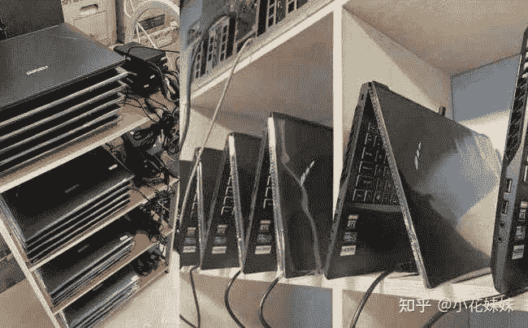
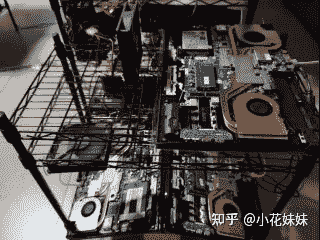

<!--yml
category: 挖矿
date: 2022-06-26 00:00:00
-->

# 笔记本偶然挖矿损伤大吗?

> 原文：[https://www.zhihu.com/question/446114579/answer/1814694204](https://www.zhihu.com/question/446114579/answer/1814694204)

 ## 先上结论，不要浪费时间，一定要24小时开启。关一小时就亏一小时的钱，你这又是何必呢？（教程在文末）

台式机每天电费3元，说不够电费的请更新一下自己的知识库。

温度对于笔记本挖矿比较重要，特意设计出了显卡温度，可以让你实时监控，非常方便。

知识点：残血版和满血版的算力是一样的，并且笔记本没有锁算力版本可以放心购买。

## 成本计算

对于笔记本来说不需要在乎是否是满血版还是残血版。唯一需要计算的就是设备成本。目前来说残血版的3060笔记本基本可以做到6500左右的价格。如果算上残值，那么回本周期非常的划算。

选择方面，基本上有两种选择。第一种直接冲神州矿机，直接拆外壳开干的那种。这种选择基本上是有庞大资金的大老板。对于个人来说还是推荐自己有一台笔记本，通过这种方式提高性价比。

笔记本挖矿，最重要的原因就是溢价小。3060每个月大约可以挖600-700元左右。基本上一个月的时间，就可以把新机器和二手机器的差价赚回。如果二手价格比较稳定，那么就可以约等于“回本了”。对于机器想自用的玩家，我推荐还是增加预算上**3060满血版**的笔记本。可以同时兼顾游戏自用和锻炼等多种用途。毕竟作为个人，我们的目标不过是提高性价比而已。

电量方面，和台式机一样可以考虑买一个小米的只能插座。用来测量每天的耗电量。便于计算成本。正常情况下，笔记本的功率也就是150-160瓦左右。每天的电费应该不会超过3块钱。

## 解决散热的方法

1，倒立放置

2，背板扣上散热风扇

3，拆掉背板或者所有外壳

## 挖矿会不会损害设备

这个问题也是困扰大家很难搞懂的问题。完善的超频可以有效降低整机的温度，因为我们会强制限制核心和功耗，超频的只有显存。设置好后的温度基本会维持在60度左右，使用强度不会超过你玩3A大作的强度，唯一诟病的就是使用时间长而已。

**挖矿专场**丨[挖矿教程](https://zhuanlan.zhihu.com/p/355955385)丨[笔记本挖矿](https://zhuanlan.zhihu.com/p/360451565)丨[锁算显卡怎么挑](https://zhuanlan.zhihu.com/p/374342633)丨[挖矿毁显卡吗](https://zhuanlan.zhihu.com/p/358944242)丨

**猴山专场**丨[猴山解密3080TI](https://zhuanlan.zhihu.com/p/379179943)丨[猴山解密3070TI](https://zhuanlan.zhihu.com/p/379428935)丨[买70TI还是80TI](https://zhuanlan.zhihu.com/p/379846007)丨[猴山冲4K](https://zhuanlan.zhihu.com/p/380129626)丨

**笔记本专场**丨[满血版笔记本怎么挑](https://zhuanlan.zhihu.com/p/374748213)丨[买3060还是70本](https://www.zhihu.com/question/447817962/answer/1909204347)丨[3050本评价](https://www.zhihu.com/question/462045112/answer/1913547325)丨[蛟龙7测评](https://zhuanlan.zhihu.com/p/369226521)丨