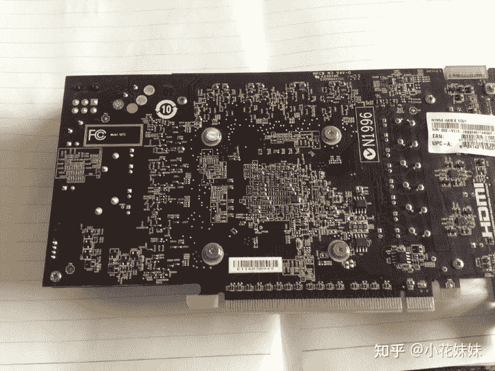
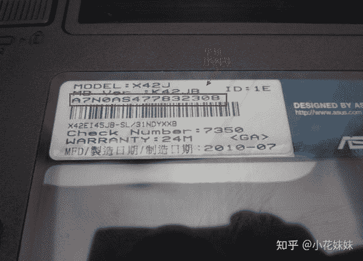
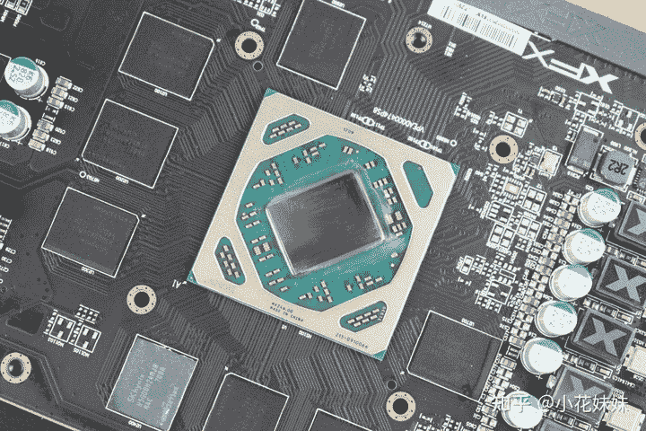
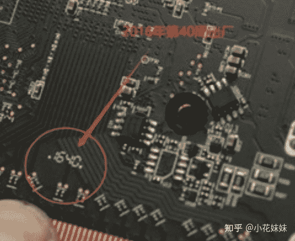
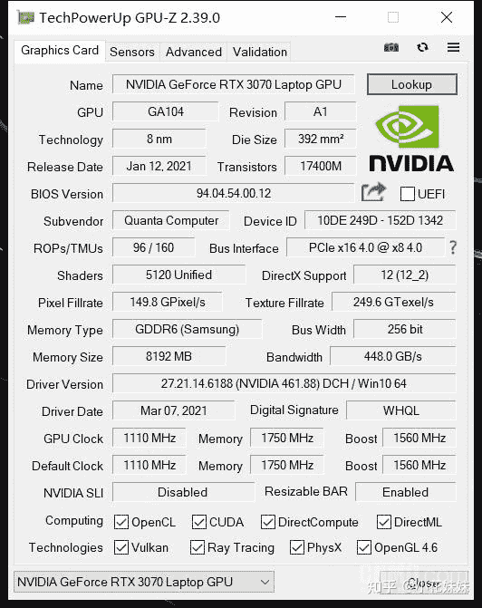
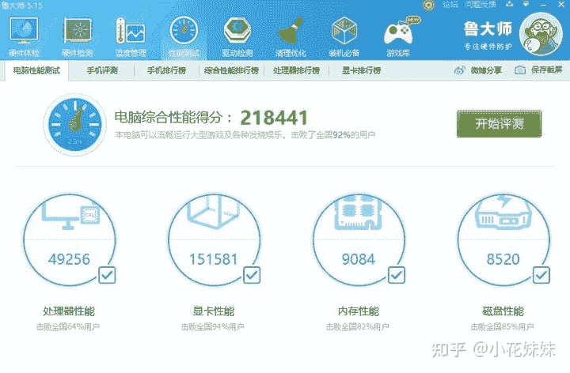
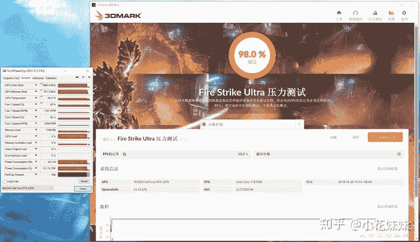
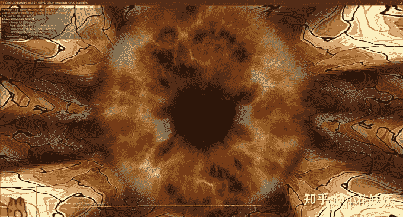

<!--yml
category: 挖矿
date: 2022-06-26 00:00:00
-->

# 荒年饿不死手艺人：“矿卡”到底能不能买？

> 原文：[https://zhuanlan.zhihu.com/p/378074608](https://zhuanlan.zhihu.com/p/378074608)

## 学会矿卡质检，行走江湖都不怕

### 黑白通吃，学习挖矿在这里：

## 矿潮的区别

首先我们需要了解的是，以前的矿潮挖的是BTC，而现在的矿潮挖的是ETH。两者来说区别还是比较大的

挖BTC需要显卡核心，也就是GPU。因为超频和巨大的发热导致显卡背面会“黄屁股”这就是**以前区分矿卡最简单的方式。**

如今的矿潮，挖的是ETH，因为算法的原因需要高频率的显存才能有算力。所以GPU核心的频率是被强制限制的，为了降低**功耗**和**发热**。

**所以挖ETH的小伙伴一定要完善好超频设置，超频是可以明显降低显卡整体温度和耗电量的。**

正是因为它需要的是显存，所以不会“黄屁股”并且没有显而易见的方法来确认是否是矿卡，给很多小白造成了困扰。今天我们就分享一下综合分析矿卡的方法。

## 如何鉴定矿卡

最**简单粗暴**的方法就是：

> 目前30系列显卡，只要是二手即默认矿卡。

如果还是头铁，想冲一下二手显卡，那么就需要一些手段综合判断了。

*   首先我们要确认显卡的“SN码”是否可以三码合一（外包装、保修卡、显卡本身）及零售购物小票的显卡，如不能则视为矿卡；
*   到手后观察默认超频设置：GPU时钟频率偏低、显存频率偏高的显卡，视为矿卡；
*   GPU和供电部分、尤其是显存颗粒有明显高温痕迹的，视为矿卡；
*   被撕掉、涂抹、毁坏产品型号、识别码、SN码贴纸或者是风扇LOGO等标识贴纸的显卡，视为矿卡；
*   同型号打包成批销售的号称工作室、网吧淘汰的显卡，视为矿卡；
*   咸鱼上的各种自用显卡（单卡无箱说），但是个人简介里面出售各种型号显卡的人，视为矿卡。

所以为了尽量避免矿卡，我们需要注意的事项是比较多的。

1.  一定要购买可以查到购买渠道的显卡，并且可以确认售后凭证。
2.  查询BIOS痕迹，但凡是超显存、降核心和功耗的，必然是ETH矿卡。
3.  刷BIOS改装卡，是否有显存重新焊接痕迹或者修改显卡信息的卡，一定不要买。

### 丧心病狂的“魔改卡”

这种重新焊接显存的矿卡，我们一般称之为“魔改卡”例如1050TI因为只有4G显存，无法达到挖ETH的标准（需要5G或以上显存）很多人就拿着**1050TI重新焊接6G或者8G显存**，然后重新刷BIOS，义无反顾的冲进了ETH的矿池，这种卡我们就称之为“魔改卡”

## 如何鉴别RX580是不是RX470刷BIOS的伪装卡

作为经历了两三次矿潮的RX580，作为挖矿市场的元老级的标杆。RX580为我们付出了太多的心血。

RX580（2048SP）是不是RX470是因为他们采用了同样的主板设计和外观设计。并且在GPU方面没有标注核心型号。所以很多黑心的商家会采用RX470刷BIOS伪装成RX580来卖，来赚取黑心差价。怎么区分是不是“伪装卡”成为了一门学问。

其方法就是根据PCB生产日期反推GPU型号。这里的PCB板上写着“1640”即代表2016年第40周生产。

PCB的出厂日期，一般是早于显卡的发售日期。PCB时间会早于显示卡发售日1~3个月的时间。所以根据日期差距来推算，是可以从根本上判定是否为“伪装卡”其他版本的显卡也可以采用这种方法验证。

*   **RX480**：2016年6月29日发售；
*   **RX470**：2016年8月4日发售；
*   **RX470D**：2016年10月28日发售；
*   **RX570/580**：2017年4月18日发售；
*   **RX580（2048SP）**：2018年9月1日发售；
*   **RX590GME**：2020年3月9日发售。

## 二手矿卡的检测、烤机、稳定性判断

二手卡无疑是性价比无敌的存在，所以引得无数头铁少侠总忍不住想赌一把。这也是为什么，摆明了告诉你是矿卡，只要价格合适总有人要的现状。“矿卡没人买”这种笑话，大家就看个乐呵就行了。在硬件市场，只有价格说话，永远都会有接盘侠。

**那么怎么确认自己二手显卡的稳定性，成为了确认收货以前重要的指标。**

那么如何测试呢？简单来说，就是从GPU-Z、娱乐鲁大师、3DMark、以及Furmark甜甜圈压力测试全家桶，都来一遍。

如果全程毫无问题，包括温度、功耗、频率、噪音等方面。那么这张显卡有非常大的几率还能再抗战几年。

### GPU-Z

通过程序查看SP管线数量、核心和显存的频率、TDP功耗的范围、ASIC的质量，在游戏或测试后台常驻（不关闭GPU-Z进行测试），可以查验显卡测试期间的各项参数峰值表现，着重观察功耗、频率、温度。

### 娱乐大师

主要是为了查看DX11基础3D环境下的温度、频率变化的表现，鲁大师的得分方面基本上是个笑话。因此不作为实际性能标准。所以省略这一步也可以。

### **3DMark**

查实显卡的实际性能输出性能，其中分为两个系列：Fire Strike系列是三项DX11测试，而Time Spy的两项的DX12测试。这两项测试都会顶格的占用显卡，以测试极限输出性能。在这5项测试中你能了解到这张显卡目前的3A级游戏性能 、功耗和温度的表现。

**Stress Test测试**

3DMark测试中有一项是**Stress Test稳定性测试。**

是测试矿卡体质的核心项目。绝大多数有暗病的、体质有瑕疵的，维修的矿卡，都无法顺利通过Stress Test的测试。稳定性测试建议选择Time Spy或者Time Spy Extreme，进行DX12的20轮循环进行测试，可以实测出显卡体质。

判断标准为：优秀分数均为99%以上，超过98%体质的视为合格，低于97%体质的直接选择退货；

**Furmark测试**

主要测试显卡的极限温度是多少。如果以上测试均通过。并且没有噪音闪屏等问题，那么这张矿卡基本上可以满足你的日常需求，并且稳定的抗战几年是不成问题的。但是凡事无绝对，购买带有稳定保修的显卡是你最后的保障。

### 总结

电脑因为是很多硬件组装而成的平台，所以并不一定能确定如果出现任何不稳定的情况就怪罪于“矿卡”以下是几点经常注意的事项。

*   如果经常出现蓝屏、死机、重启等问题，可能是硬件没有插牢固，或者主板、CPU等硬件有瑕疵。
*   电源老化，电压不稳定，出现蓝屏死机等现象。
*   因HDMI、DP线材故障、接口版本兼容性不好、相关接口触点故障，导致矿卡出现花屏、缺色、无输出等问题。

出现这种事情，大家肯定首先想到的是矿卡的问题，其实在正常使用的过程中，任何产品都会有瑕疵的次品率。正常的挖矿一般不会严重的损坏显卡。这也是RX580经久不衰的原因。很多表面上因“挖矿而坏”的显卡，很可能是出厂的时候就带着瑕疵，经过了挖矿的放大，才成为了“阶下囚”所以真正了解硬件的人，并不会“谈矿色变”这也是为什么矿卡仍旧不怕没有市场的原因。

**挖矿专场**丨[锁算力卡挖矿](https://zhuanlan.zhihu.com/p/399409039)丨[未锁卡挖矿教程](https://zhuanlan.zhihu.com/p/355955385)丨[笔记本挖矿](https://zhuanlan.zhihu.com/p/360451565)丨[锁算显卡怎么挑](https://zhuanlan.zhihu.com/p/374342633)丨[挖矿毁显卡吗](https://zhuanlan.zhihu.com/p/358944242)丨

**猴山专场**丨[猴山解密3080TI](https://zhuanlan.zhihu.com/p/379179943)丨[猴山解密3070TI](https://zhuanlan.zhihu.com/p/379428935)丨[买70TI还是80TI](https://zhuanlan.zhihu.com/p/379846007)丨[猴山冲4K](https://zhuanlan.zhihu.com/p/380129626)丨

**笔记本专场**丨[满血版笔记本怎么挑](https://zhuanlan.zhihu.com/p/374748213)丨[买3060还是70本](https://www.zhihu.com/question/447817962/answer/1909204347)丨[3050本评价](https://www.zhihu.com/question/462045112/answer/1913547325)丨[蛟龙7测评](https://zhuanlan.zhihu.com/p/369226521)丨