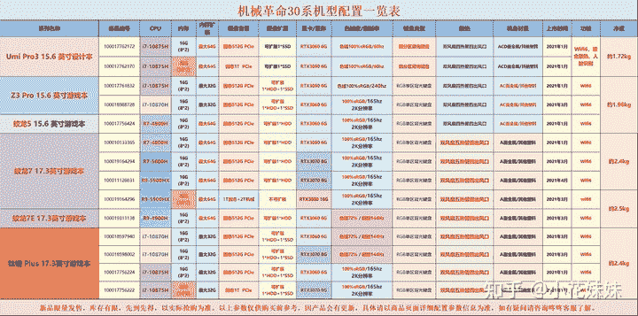
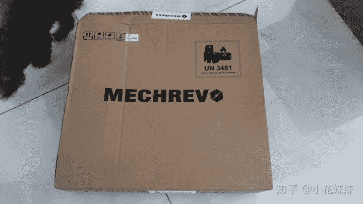
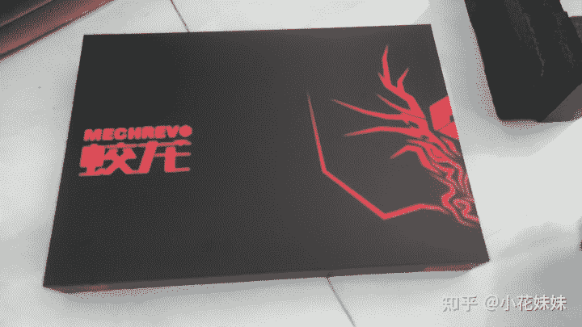
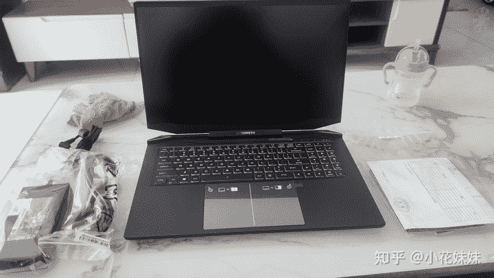
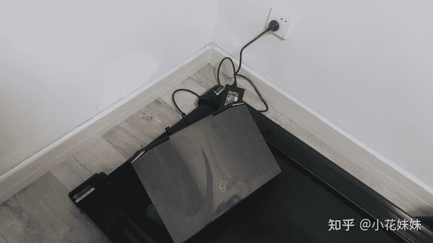
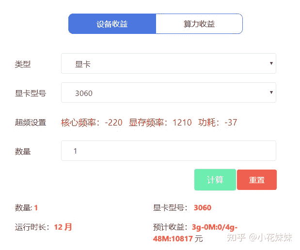
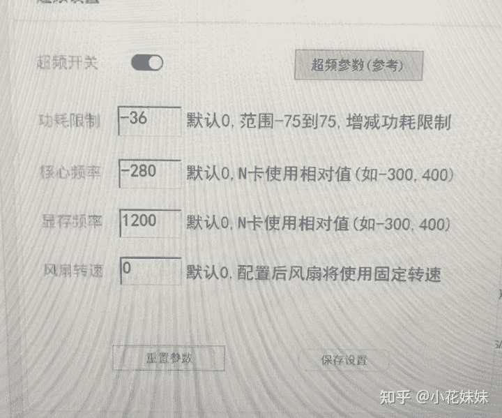
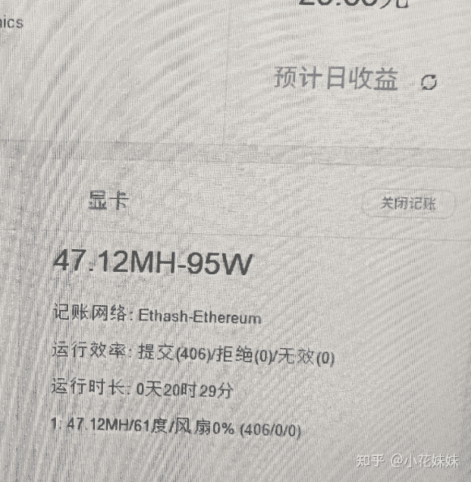
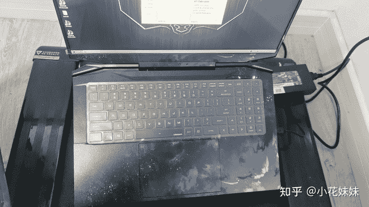

<!--yml
category: 挖矿
date: 2022-06-26 00:00:00
-->

# 蛟龙7笔记本开箱+超频后挖矿算力实测

> 原文：[https://zhuanlan.zhihu.com/p/369226521](https://zhuanlan.zhihu.com/p/369226521)

## 蛟龙7满血版，算力可达51，超越台式机算力。

经历了4.23左右比特币大跌最低跌到4.7W美金，最近又有所回温，想着自己一直想有一台笔记本，所以终于开始实施。

自己本来拥有的**技嘉2070gaming OC**的显卡，就被我4600忍痛赚了一千块的出掉了，算上锻炼的两个月算是回了大口血。

显卡的出售加上这个月挖矿的收入基本可以不添钱平换一台17.3的3060蛟龙7，当然为了**回血提高性价比**，自然是要选择130W满血版。如果你想买3070的版本，那么需要购买140W的满血版。

话不多说我们看一下到货的样子，这是外包装

打开盒子以后就是我们的主角，蛟龙7 3060笔记本

我这台蛟龙7具体参数为 RTX3060 130W满血版 R7-4800H 16G内存 512G PCIe

没有买大硬盘的版本，准备后期自己加装。

第一次开箱没经验，拿到笔记本以后再里面找了半天的电源线，没有找到，原来是在第一张图的盒子底端，并没有一并包装到这个盒子里面。

这就是8000+买来的所有东西，一台笔记本+一捆线+几张说明书。

后面就话不多说，我们开始找好它安家的地方开始实测我们的主要数据：算力。

为了体现名副其实的“**锻炼**”我把它安置在了跑步机上。

底盘散热比较重要，所以我们入了一个不贵的，能支撑起来透点风就行。

想多降温度多超频一点，就需要上预算了。

使用的软件我们不过多讲述，自己参考这里。

## 不要直接运行程序

温度会直接逼近70-80度之间。因为显卡是全负载运转，功耗和温度都大幅上升。必须要经过超频的完善，才可以让笔记本在合适的温度长时间的运转。

## 超频后运转

查询后，3060显卡推荐的超频设置为核心-220 显存+1210 功耗-37

预计收益有波动，不具有太大的参考价值。

我没有准备往死里超，所以显存设置稳定在了+1200 核心多减了一点-280，为了多降低一点温度。

后续运行一段时间，观察温度\拒绝\无效

拒绝表示网络信号延迟太大，无效表示显存超的太狠了，需要降低一点。

目前来说稳定在算力47左右，和公布的48算力有忽略不计的差距。但是温度方面，可以稳定在60度左右，虽然这是核心温度，同样可以表示显存最多也就是70度左右，个人认为比较理想。

后续贴了一张膜，无论自己用或者出二手都会有比较好的成色和保障。

## 常见问题和个人意见

挖矿是否会损伤显卡？

请参见：[挖矿到底会不会损耗显卡解惑](https://zhuanlan.zhihu.com/p/358944242)

显卡温度多少度合适？

个人目前的了解（包括群里各位大佬），目前来说80度以下不关机运行都是可以的，大部分都可以在正确的超频设置下稳定在50-60度之间，所以个人建议想办法压到70度以下，就可以放心使用。我的安全裕度都是比较高，毕竟自己的东西，爱惜着点用。

我有XX万资金想投资，怎么分配资金合适？

个人认为，最优的解决方式是自己需要的通过挖矿来**提高性价比**。比如我目前留有台式机显卡3060TI和一台3060笔记本。不再有继续投资的想法。大手笔投入适合的时候只有在去年12月份，那个时候的显卡并没有目前如此疯狂的溢价。

比如我的3060TI，朋友入手的价格为3800元左右，出给我手里的时候已经是8600元了。而且这还是友情价格，闲鱼瞬秒的价格。3月份的3060TI基本上要9500元左右。

想通过这种方式养家糊口，容易翻车。

笔记本怎么确认是否为满血版？

目前的解决办法只有问客服，然后在百度搜索确认。如果出现算力不达标的问题，那么真的很尴尬。

蛟龙7息屏降算力的事情怎么解决？

刚开始我也出现了这个问题，息屏以后算力会降到40左右。通过卸载机械革命的竞技控制台解决，同样会导致一键切换“狂暴模式”的按键和灯光控制失效。

当然，在利益面前这都是浮云。需要的时候再安装就可以了。

**相关阅读**

[挖矿教程](https://zhuanlan.zhihu.com/p/355955385)丨[挖矿毁显卡吗](https://zhuanlan.zhihu.com/p/358944242)丨[笔记本挖矿](https://zhuanlan.zhihu.com/p/360451565)丨[如何识别矿卡](https://zhuanlan.zhihu.com/p/378074608)丨[超频设置](https://zhuanlan.zhihu.com/p/366535305)丨[技嘉事件](https://zhuanlan.zhihu.com/p/371398017)丨[矿难了吗](https://zhuanlan.zhihu.com/p/375027179)丨

**618专场**

[306070差距](https://www.zhihu.com/question/447817962/answer/1909204347)丨[满血版笔记本](https://zhuanlan.zhihu.com/p/374748213)丨[小米11 VS Mate40](https://zhuanlan.zhihu.com/p/374601975)丨[锁算力显卡](https://zhuanlan.zhihu.com/p/374342633)丨[养车专场](https://zhuanlan.zhihu.com/p/374702239)丨