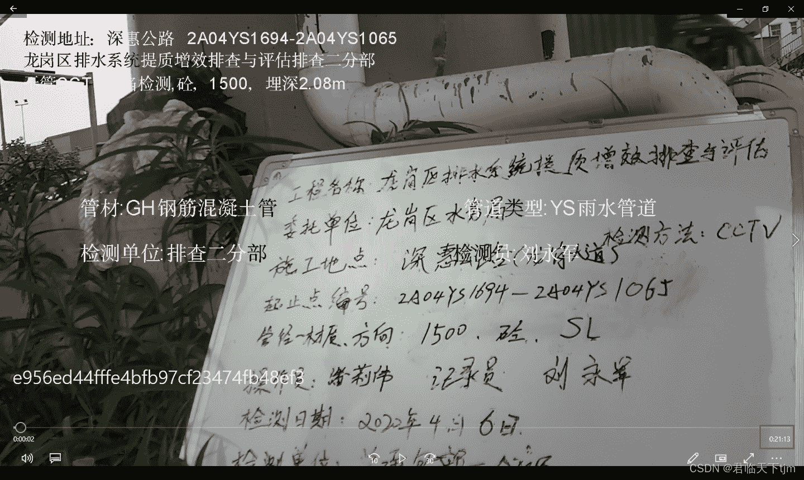
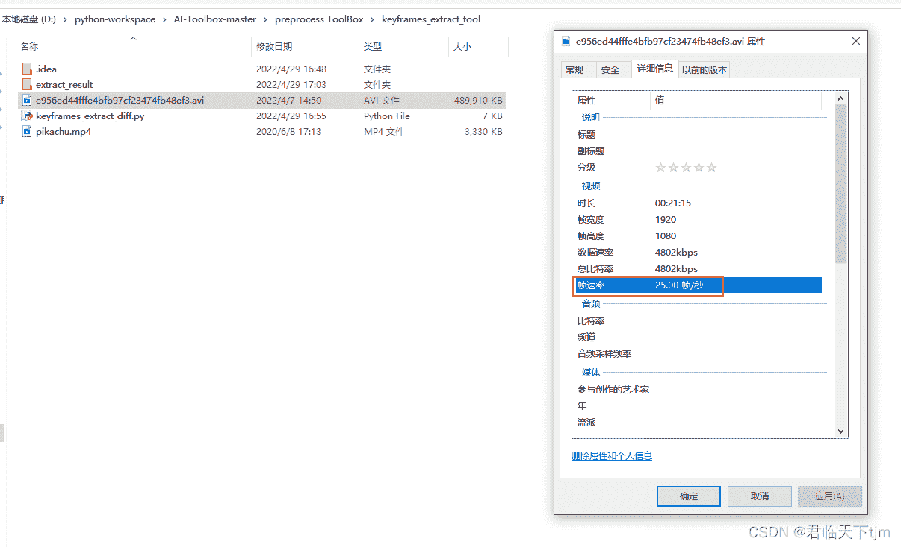
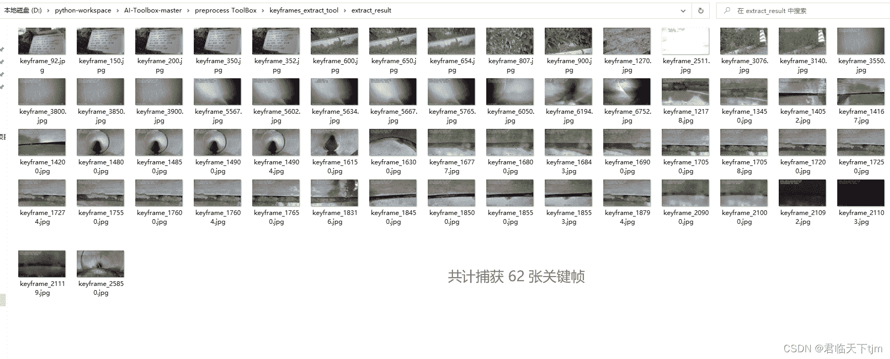

<!--yml
category: 视频
date: 2022-05-04 19:45:05
-->

# 视频提取关键帧的三种方式【已调通】_君临天下tjm的博客-CSDN博客

> 来源：[https://blog.csdn.net/shanxiderenheni/article/details/124499862](https://blog.csdn.net/shanxiderenheni/article/details/124499862)

**同步之前的另一种视频提取关键帧的方法：**

[使用python处理视频文件，提取关键帧并保存【已调通】https://blog.csdn.net/shanxiderenheni/article/details/121079396](https://blog.csdn.net/shanxiderenheni/article/details/121079396 "使用python处理视频文件，提取关键帧并保存【已调通】")


关键代码如下：

```
# -*- coding: utf-8 -*-

"""
this key frame extract algorithm is based on interframe difference.

The principle is very simple
First, we load the video and compute the interframe difference between each frames

Then, we can choose one of these three methods to extract keyframes, which are 
all based on the difference method:

1\. use the difference order
    The first few frames with the largest average interframe difference 
    are considered to be key frames.
2\. use the difference threshold
    The frames which the average interframe difference are large than the 
    threshold are considered to be key frames.
3\. use local maximum
    The frames which the average interframe difference are local maximum are 
    considered to be key frames.
    It should be noted that smoothing the average difference value before 
    calculating the local maximum can effectively remove noise to avoid 
    repeated extraction of frames of similar scenes.

After a few experiment, the third method has a better key frame extraction effect.

"""
import cv2
import operator
import numpy as np
import matplotlib.pyplot as plt
import sys
from scipy.signal import argrelextrema

def smooth(x, window_len=13, window='hanning'):
    """smooth the data using a window with requested size.

    This method is based on the convolution of a scaled window with the signal.
    The signal is prepared by introducing reflected copies of the signal 
    (with the window size) in both ends so that transient parts are minimized
    in the begining and end part of the output signal.

    input:
        x: the input signal 
        window_len: the dimension of the smoothing window
        window: the type of window from 'flat', 'hanning', 'hamming', 'bartlett', 'blackman'
            flat window will produce a moving average smoothing.
    output:
        the smoothed signal

    example:
    import numpy as np    
    t = np.linspace(-2,2,0.1)
    x = np.sin(t)+np.random.randn(len(t))*0.1
    y = smooth(x)

    see also: 

    numpy.hanning, numpy.hamming, numpy.bartlett, numpy.blackman, numpy.convolve
    scipy.signal.lfilter

    TODO: the window parameter could be the window itself if an array instead of a string   
    """
    print(len(x), window_len)
    # if x.ndim != 1:
    #     raise ValueError, "smooth only accepts 1 dimension arrays."
    #
    # if x.size < window_len:
    #     raise ValueError, "Input vector needs to be bigger than window size."
    #
    # if window_len < 3:
    #     return x
    #
    # if not window in ['flat', 'hanning', 'hamming', 'bartlett', 'blackman']:
    #     raise ValueError, "Window is on of 'flat', 'hanning', 'hamming', 'bartlett', 'blackman'"

    s = np.r_[2 * x[0] - x[window_len:1:-1],
              x, 2 * x[-1] - x[-1:-window_len:-1]]
    # print(len(s))

    if window == 'flat':  # moving average
        w = np.ones(window_len, 'd')
    else:
        w = getattr(np, window)(window_len)
    y = np.convolve(w / w.sum(), s, mode='same')
    return y[window_len - 1:-window_len + 1]

class Frame:
    """class to hold information about each frame

    """

    def __init__(self, id, diff):
        self.id = id
        self.diff = diff

    def __lt__(self, other):
        if self.id == other.id:
            return self.id < other.id
        return self.id < other.id

    def __gt__(self, other):
        return other.__lt__(self)

    def __eq__(self, other):
        return self.id == other.id and self.id == other.id

    def __ne__(self, other):
        return not self.__eq__(other)

def rel_change(a, b):
    x = (b - a) / max(a, b)
    print(x)
    return x

if __name__ == "__main__":
    print(sys.executable)
    # Setting fixed threshold criteria
    USE_THRESH = True
    # fixed threshold value
    THRESH = 0.87
    # Setting fixed threshold criteria
    USE_TOP_ORDER = False
    # Number of top sorted frames
    NUM_TOP_FRAMES = 50
    # Setting local maxima criteria
    USE_LOCAL_MAXIMA = False

    # Video path of the source file
    # videopath = 'pikachu.mp4'
    videopath = 'e956ed44fffe4bfb97cf23474fb48ef3.avi'
    # Directory to store the processed frames
    dir = './extract_result/'
    # smoothing window size
    len_window = int(50)

    print("target video :" + videopath)
    print("frame save directory: " + dir)
    # load video and compute diff between frames
    cap = cv2.VideoCapture(str(videopath))
    curr_frame = None
    prev_frame = None
    frame_diffs = []
    frames = []
    success, frame = cap.read()
    i = 0
    while (success):
        luv = cv2.cvtColor(frame, cv2.COLOR_BGR2LUV)
        curr_frame = luv
        if curr_frame is not None and prev_frame is not None:
            # logic here
            diff = cv2.absdiff(curr_frame, prev_frame)
            diff_sum = np.sum(diff)
            diff_sum_mean = diff_sum / (diff.shape[0] * diff.shape[1])
            frame_diffs.append(diff_sum_mean)
            frame = Frame(i, diff_sum_mean)
            frames.append(frame)
        prev_frame = curr_frame
        i = i + 1
        success, frame = cap.read()
    cap.release()

    # compute keyframe
    keyframe_id_set = set()
    if USE_TOP_ORDER:
        # sort the list in descending order
        frames.sort(key=operator.attrgetter("diff"), reverse=True)
        for keyframe in frames[:NUM_TOP_FRAMES]:
            keyframe_id_set.add(keyframe.id)
    if USE_THRESH:
        print("Using Threshold")
        for i in range(1, len(frames)):
            if (rel_change(np.float(frames[i - 1].diff), np.float(frames[i].diff)) >= THRESH):
                keyframe_id_set.add(frames[i].id)
    if USE_LOCAL_MAXIMA:
        print("Using Local Maxima")
        diff_array = np.array(frame_diffs)
        sm_diff_array = smooth(diff_array, len_window)
        frame_indexes = np.asarray(argrelextrema(sm_diff_array, np.greater))[0]
        for i in frame_indexes:
            keyframe_id_set.add(frames[i - 1].id)

        plt.figure(figsize=(40, 20))
        plt.locator_params(numticks=100)
        plt.stem(sm_diff_array)
        plt.savefig(dir + 'plot.png')

    # save all keyframes as image
    cap = cv2.VideoCapture(str(videopath))
    curr_frame = None
    keyframes = []
    success, frame = cap.read()
    idx = 0
    while (success):
        if idx in keyframe_id_set:
            name = "keyframe_" + str(idx) + ".jpg"
            cv2.imwrite(dir + name, frame)
            keyframe_id_set.remove(idx)
        idx = idx + 1
        success, frame = cap.read()
    cap.release() 
```

运行结果如下：

本地测试后，通过设定阈值，效果比较好，

```
THRESH越大，保留的关键帧越少，否则，越多。
```





 关键帧提取后，约为原视频全部帧的500分支一。