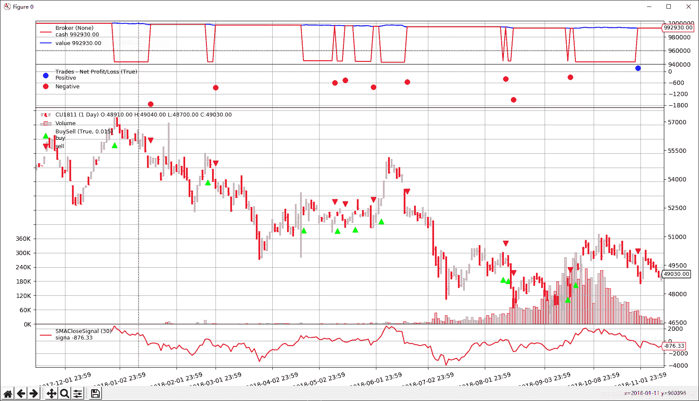
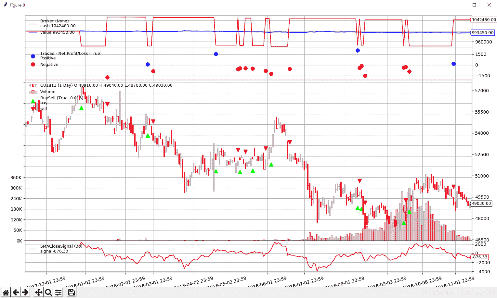
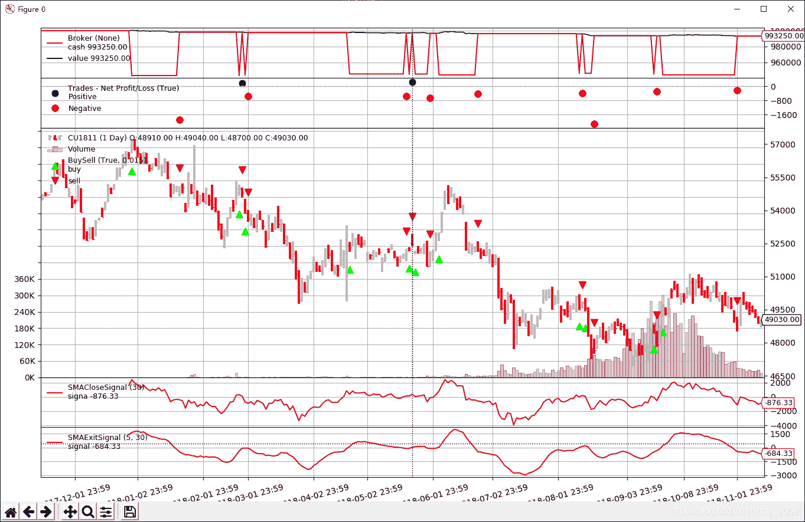

<!--yml
category: 交易
date: 2023-09-17 19:51:39
-->

# 量化回测框架BackTrader【5】-信号策略（附：介绍如何使用Tushare下载期货数据）

> 来源：[https://blog.csdn.net/xmy_2002/article/details/116310468](https://blog.csdn.net/xmy_2002/article/details/116310468)

**目录**

[0，序](#0%EF%BC%8C%E5%BA%8F)

[1，如何定义信号指标](#1%EF%BC%8C%E5%A6%82%E4%BD%95%E5%AE%9A%E4%B9%89%E4%BF%A1%E5%8F%B7%E6%8C%87%E6%A0%87)

[2，信号机制](#2%EF%BC%8C%E4%BF%A1%E5%8F%B7%E6%9C%BA%E5%88%B6)

[3，信号注册](#3%EF%BC%8C%E4%BF%A1%E5%8F%B7%E6%B3%A8%E5%86%8C)

[4，信号类型](#4%EF%BC%8C%E4%BF%A1%E5%8F%B7%E7%B1%BB%E5%9E%8B)

[5，累积和订单并发](#5%EF%BC%8C%E7%B4%AF%E7%A7%AF%E5%92%8C%E8%AE%A2%E5%8D%95%E5%B9%B6%E5%8F%91)

[6，示例](#6%EF%BC%8C%E7%A4%BA%E4%BE%8B)

[例1：](#%E4%BE%8B1%EF%BC%9A)

[例2：](#%E4%BE%8B2%EF%BC%9A)

[例3：](#%E4%BE%8B3%EF%BC%9A)

* * *

# 0，序

在介绍如何开发普通策略前，我想先介绍BackTrader支持的一种相对简单的策略开发方式，信号策略。开发这种策略的好处就是可以避免开发通常的Strategy类，更容易上手，用来实现一些逻辑简单的策略还是很合适的。

由于信号策略特别适合开发期货这类支持多空操作的金融产品，所以这次我们也以期货数据作为数据源。数据的来源还是Tushare，先来介绍一下如何从Tushare获取期货数据。先上代码:

```
import tushare as ts
import pandas as pd
pro = ts.pro_api(token='your token id')

df = pro.fut_daily(ts_code='CU1811.SHF', start_date='20171116', end_date='20181113').iloc[::-1]
df.to_csv('CU1811.csv', index=False)
```

代码的前3句和最后一句和第二讲获取股票数据的一样，就不解释了，重点是第四句。pro.fut_daily()是Tushare用来获取期货日线的接口函数。参数ts_code代表需要获取的期货合约代码。Tushare对于期货合约的命名规则是这样的，

| 主力合约 | 连续合约 | 普通合约 |
| --- | --- | --- |
| XX | XXL | XXMMDD |
| 例如：CU.SHF | 例如：CUL.SHF | 例如：CU1811.SHF |

后面的参数start_date,end_date就是请求数据的起止日期。除了日线数据，Tushare还提供期货合约信息、期货交易日历、期货日线行情、每日持仓排名、仓单日报、每日结算参数、南华期货指数行情、期货主力与连续合约、期货主要品种交易周报等，具体内容可参考官网[https://tushare.pro/document/2?doc_id=134](https://tushare.pro/document/2?doc_id=134)

欢迎大家通过我的链接进行注册，谢谢！[https://tushare.pro/register?reg=427104](https://tushare.pro/register?reg=427104)

成功运行上面的代码的话应该会在本地生成一个名为“CU1811.csv”的包含期货合约CU1811的数据，如果你没有下到的话也可以从我的网盘进行下载，链接：[CU1811.csv](https://pan.baidu.com/s/10zXLWxe_7ChyGtfVje7TVg) 提取码：qsdb

做好准备工作后就可以进入正题了

# 1，如何定义信号指标

信号的定义与指标很相似都是继承自指标基类，可以把信号看成特殊的指标，两者最大的不同在于注册到BackTrader中枢-Cerebro中的方式，注册方式的不同，导致Cerebro处理两者的方式不同，从而让信号可以直接成为策略

下面是一个典型的信号指标定义，

```
class MySignal(bt.Indicator):
    lines = ('signal',)
    params = (('period', 30),)

    def __init__(self):
        self.lines.signal = self.data - bt.indicators.SMA(period=self.p.period)
```

该例创建了一个以close值和close移动平均值的差值作为输出的信号

在具体实现上，MySignal首先定义了一条名为“signal”的line用来保存具体的信号值，以及名为“period”的参数用来接收对移动平均值时间跨度的定义。

在__init__(self)中进行了信号值的计算以及保存，该函数会在该信号实例化的时候运行，可见信号值在信号指标实例化的时候都已经计算好了，而不是在运行时计算的

这里顺便提一下“self.data”，这个成员就是引用的close值，跟“self.data.close.”是一样的。如果在datafeed里面没有声明close数据，那么self.data会用“nullvalue”参数填充（忘了nullvalue的同学可以复习一下第二讲）。同样的，后面的“bt.indicators.SMA”并没有指明对那个line操作，说明也是对close进行的操作。从这点可以看出在BackTrader中“close”才是数据中的主角。

# 2，信号机制

那信号值是如何转化为策略的呢，Cerebro会将注册的信号指标直接变成多空信号，转换关系如下：

*   信号指标值> 0   -> 发出多头信号
*   信号指标值< 0   -> 发出空头信号
*   信号指标值== 0 -> 不发出信号

还是以上例作说明，当close值大于移动均值时，信号为多头信号，相反当close值小于移动平均值时，信号为空头信号。

# 3，信号注册

在第一节中说了，信号指标和普通指标的区别就在于注册到Cerebro的方式，信号指标注册方式如下

```
cerebro.add_signal(signal type, signal class, args)
```

第一个参数是注册信号的类型，第二个是信号指标类本身（这个跟注册指标一样是传递类而不是实例），后面的参数都是该信号类所需的参数

# 4，信号类型

BackTrader提供了两类，共5种信号类型

开仓类：

*   `bt.SIGNAL_LONGSHORT`: 该信号的多头空头信号都会作为开仓信号而采用

*   `bt.SIGNAL_LONG`:

    *   只接收多头信号作为开仓信号

    *   空头信号被用来关闭多头头寸. 但是:

    *   如果系统中存在LONGEXIT（见下文）信号，该信号将用于退出多头

    *   如果系统存在SHORT信号，而没有LONGEXIT，该信号将被用来在开空仓之前关闭多头头寸。

*   `bt.SIGNAL_SHORT`:

    *   只接收空头信号作为开仓信号

    *   多头信号被用来关闭空头头寸. 但是:

    *   如果系统中存在SHORTEXIT（见下文）信号，该信号将用于退出空头

    *   如果系统存在LONG信号，而没有SHORTEXIT，该信号将被用来在开多仓之前关闭空头头寸。

平仓类：

这类信号会覆盖其他的退出信号，作为唯一退出指示

*   `bt.SIGNAL_LONGEXIT`: 接收空头信号退出多头

*   `bt.SIGNAL_SHORTEXIT`: 接收多头信号退出空头

# 5，累积和订单并发

由于信号会持续发出多头和空头指示，这将导致连续生成订单，从而产生两种情况：

*   积累：即使已经在市场中，信号也会发出新的订单
*   并发：发出新订单，而无需等待其他订单的执行

为避免这种情况，默认行为是：

*   不累积
*   不允许并发

如果希望这允许两种行为，可以通过以下方式来控制：

cerebro.signal_accumulate（True）（或为False以重新禁用它）

cerebro.signal_concurrency（True）（或为False以重新禁用它）

信号介绍到此为止，接下来请看一些例子

# 6，示例

### 例1：

```
import backtrader as bt

class SMACloseSignal(bt.Indicator):
    lines = ('signa',)
    params = (('period', 30),)

    def __init__(self):
        self.lines.signa = self.data - bt.indicators.SMA(period=self.p.period)

cerebro = bt.Cerebro()
data = bt.feeds.GenericCSVData(
    dataname='CU1811.csv',
    nullvalue=0.0,
    dtformat=('%Y%m%d'),
    datetime=1,
    open=4,
    high=5,
    low=6,    
    close=7,
    volume=11,
    openinterest=-1
)

cerebro.adddata(data)
cerebro.broker.set_cash(1000000)
cerebro.add_signal(bt.SIGNAL_LONG, SMACloseSignal, period=30)

cerebro.run()
cerebro.plot(style='bar',iplot=False)
```

该例中创建的信号就是第一节中的例子，数据就是我们从Tushare下载的期货数据。细心的朋友可能看到多了这句代码

```
cerebro.broker.set_cash(1000000)
```

它的作用是设置系统最初的现金总数，该值的默认值是10000，由于我们的目标合约的单价超过了10000，如果不修改这个值的话就无法交易了

接下来我们看一下运行结果



可以看出当SMACloseSignal（最下面的曲线）大于0时，发出多头信号并在下一个bar执行了多头开仓操作（绿色三角箭头），当该信号小于0时，发出空头信号并在下一个bar执行了平仓操作（红色三角箭头）。SMACloseSignal前面那段缺失的数据是因为信号指标设置了30天移动平均值，而这个数值在前29天都是没有的。

### 例2：

在例1的基础上我们稍做一些修改，将

```
cerebro.add_signal(bt.SIGNAL_LONG, SMACloseSignal, period=30)
```

替换为

```
cerebro.add_signal(bt.SIGNAL_LONGSHORT, SMACloseSignal, period=30)
```

把只做多的信号改为同时接受多头空头开仓信号，让我们看看结果



通过对比两个结果可以看出，例2在所有例1退出多头的地方同时开仓做空了，在做多的地方，先把空仓平了再开多仓。

### 例3：

这次让我们添加退出信号

```
import backtrader as bt

class SMACloseSignal(bt.Indicator):
    lines = ('signa',)
    params = (('period', 30),)

    def __init__(self):
        self.lines.signa = self.data - bt.indicators.SMA(period=self.p.period)

class SMAExitSignal(bt.Indicator):
    lines = ('signal',)
    params = (('p1', 5), ('p2', 30),)

    def __init__(self):
        sma1 = bt.indicators.SMA(period=self.p.p1)
        sma2 = bt.indicators.SMA(period=self.p.p2)
        self.lines.signal = sma1 - sma2

cerebro = bt.Cerebro()
data = bt.feeds.GenericCSVData(
    dataname='CU1811.csv',
    nullvalue=0.0,
    dtformat=('%Y%m%d'),
    datetime=1,
    open=4,
    high=5,
    low=6,    
    close=7,
    volume=11,
    openinterest=-1
)

cerebro.adddata(data)
cerebro.broker.set_cash(1000000)
cerebro.add_signal(bt.SIGNAL_LONG, SMACloseSignal, period=30)
cerebro.add_signal(bt.SIGNAL_LONGEXIT, SMAExitSignal,p1=5,p2=30)                           

cerebro.run()
cerebro.plot(style='bar',iplot=False)
```

在例1的基础上添加了SMAExitSignal作为多头退出信号，看一下结果



通过和例1的对比可以看出，这回只有在SMAExitSignal（最下面的曲线）发出空头信号的时候，系统才会退出多头仓位。