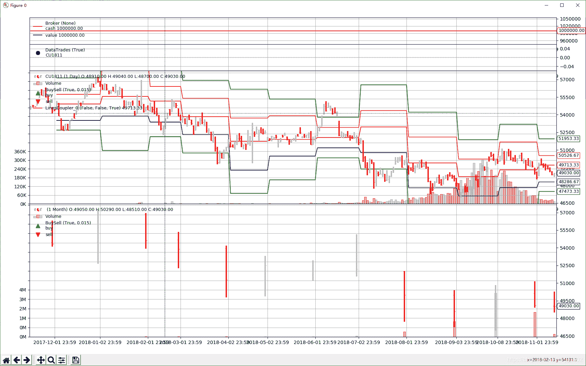

<!--yml
category: 交易
date: 2023-09-17 19:51:20
-->

# 量化回测框架BackTrader【7】-开发指标

> 来源：[https://blog.csdn.net/xmy_2002/article/details/116399787](https://blog.csdn.net/xmy_2002/article/details/116399787)

**目录**

[0，序](#0%EF%BC%8C%E5%BA%8F)

[1，BackTrader指标特性](#1%EF%BC%8CBackTrader%E6%8C%87%E6%A0%87%E7%89%B9%E6%80%A7)

[2，指标的绘制](#2%EF%BC%8C%E6%8C%87%E6%A0%87%E7%9A%84%E7%BB%98%E5%88%B6)

[3，指标开发](#3%EF%BC%8C%E6%8C%87%E6%A0%87%E5%BC%80%E5%8F%91)

[4，耦合不同时间单位的数据](#4%EF%BC%8C%E8%80%A6%E5%90%88%E4%B8%8D%E5%90%8C%E6%97%B6%E9%97%B4%E5%8D%95%E4%BD%8D%E7%9A%84%E6%95%B0%E6%8D%AE)

* * *

# 0，序

指标可以说是对原始数据的预处理，从原始数据无法发现的特征，现象；往往通过对数据进行一定的处理产生一些特别的指标才能显现出来。比如移动均值，MACD，RSI，布林带等等。绝大部分的策略都会用到一些特定的指标，特别是一些核心指标对于策略来说是至关重要。BackTrader有一套特有的指标开发方式，开发起来很方便，运行效率也很高。

# 1，BackTrader指标特性

由于指标是服务于策略的，所以指标一般都是声明在策略内部。

指标主要存在于BackTrader策略的两个函数内，__init__()和next()。

在__init__()内，指标会被预计算成line，并且所有对指标的计算都会产生一条新的line。

在next()内，指标以line的形式被访问使用，并且对指标的计算不会产生line，而是产生普通的数值。

```
hilo_diff = self.data.high - self.data.low
```

```
sma = bt.SimpleMovingAverage(self.data.close)
close_sma_diff = self.data.close - sma
```

```
close_over_sma = self.data.close > sma
```

以上三个例子都运行在__init__()中，hilo_diff，close_sma_diff，close_over_sma都是指标，并且是line形式的

相应地，在next()中运行如下代码

```
close_over_sma = self.data.close > self.sma
```

close_over_sma就只是一个布尔数值

这么设计的一个好处是，节省了next运行期间的运算压力。可以看如下的例子

```
class MyStrategy(bt.Strategy):

    def __init__(self):

        sma1 = btind.SimpleMovingAverage(self.data)
        ema1 = btind.ExponentialMovingAverage()

        close_over_sma = self.data.close > sma1
        close_over_ema = self.data.close > ema1
        sma_ema_diff = sma1 - ema1

        buy_sig = bt.And(close_over_sma, close_over_ema, sma_ema_diff > 0)

    def next(self):

        if buy_sig:
            self.buy()
```

购买的信号也在__init__()中预计算完成，在next()只做判断。这样显著提高了整个回测的运行效率。

# 2，指标的绘制

默认的情况下BackTrader会把指标显示在cerebro.plot ()输出图像上，除了布尔型的指标。如果希望显示布尔型的指标，可以如下操作

```
close_over_sma = self.data.close > self.sma
LinePlotterIndicator(close_over_sma, name='Close_over_SMA')
```

当通过继承Indicator开发指标子类时，可以声明plotinfo用于控制指标图像。plotinfo接受元祖的元祖或字典的方式传参。

```
class MyIndicator(bt.Indicator):

    ....
    plotinfo = dict(subplot=False)
    ....
```

```
“subplot ”可以通过如下方式进行设置
```

```
myind = MyIndicator(self.data, someparam=value)
myind.plotinfo.subplot = True
```

```
myind = MyIndicator(self.data, someparams=value, subplot=True)
```

plotinfo支持以下参数：

*   plot (default: True)：指标是否需要绘制
*   subplot (default: True)：是否在其他窗口中绘制指标。
*   plotname (default: '')：设置要在绘图上显示的绘图名称。空值表示将使用指标的规范名称（class .__ name__）。
*   plotabove (default: False)：指标通常在其操作的数据下方绘制（带有subplot = True的指标）。该设置为True将使指标绘制在数据上方。
*   plotlinelabels (default: False)：标签显示生成该指标的源指标。
*   plotymargin（默认值：0.0）：顶部和底部的留空
*   plotyticks (default: [])：y轴刻度
*   plothlines (default: [])：绘制水平线
*   plotyhlines (default: [])：同时控制plotyticks和plothlines

# 3，指标开发

开发一个自己的指标基本流程如下：

1.  从Indicator基类（或它的子类）进行继承
2.  定义需要的lines
3.  一个指标类至少包含一条line，如果被继承的指标已经有line则可省略
4.  （可选）定义可修改的参数
5.  （可选）定义一些参数修改指标的默认绘制
6.  在__init__()中提供一个操作，并绑定到指标的line，或者提供next()或once()方法

下面就第6点的三种方式，举例说明：

```
class DummyInd(bt.Indicator):
    lines = ('dummyline',)

    params = (('value', 5),)

    def __init__(self):
        self.lines.dummyline = bt.Max(0.0, self.params.value)
```

指标数据的生成在__init__函数内

```
class DummyInd(bt.Indicator):
    lines = ('dummyline',)

    params = (('value', 5),)

    def next(self):
        self.lines.dummyline[0] = max(0.0, self.params.value)
```

这个例子的效果跟上面那个一样，只是数据的生成放在了next()函数内，每次对line的0下标（即当前值）进行赋值

```
class DummyInd(bt.Indicator):
    lines = ('dummyline',)

    params = (('value', 5),)

    def next(self):
        self.lines.dummyline[0] = max(0.0, self.params.value)

    def once(self, start, end):
       dummy_array = self.lines.dummyline.array

       for i in xrange(start, end):
           dummy_array[i] = max(0.0, self.params.value)
```

额外的once()可以优化计算。

# 4，耦合不同时间单位的数据

当指标需要操作两个不同时间单位的数据，比如日线和月线，如果直接按照通常的方法操作的话会报错。

```
pivotpoint = btind.PivotPoint(self.data1)
sellsignal = self.data0.close < pivotpoint.s1
```

其中“data1”是月线数据，“data0”是日线数据，运行时会报错

> ```
> return self.array[self.idx + ago]
> IndexError: array index out of range
> ```

BackTrader提供了一个解决方案来应对这种需求,就是在“s1”后面添加()

```
pivotpoint = btind.PivotPoint(self.data1)
sellsignal = self.data0.close < pivotpoint.s1()
```

pivotpoint.s1()会返回一个内部LinesCoupler对象，它会用最近的s1月线值来进行填充空缺的日线值。

如果要使这个方法生效，必须在创建cerebro时，添加一个参数“runonce=False”，类似这样

```
cerebro = bt.Cerebro(runonce=False)
```

或

```
cerebro.run(runonce=False)
```

区别于只对s1生效，另一种写法是这样

```
pp1 = pp()
self.sellsignal = self.data0.close < pp1.s1
```

如果pp含有多条lines，那个所有的lines都会进行耦合。

一个完整的示例：

```
import backtrader as bt
import backtrader.indicators as btind
import inspect

class St(bt.Strategy):
    params = dict(multi=True)

    def __init__(self):
        self.pp = pp = btind.PivotPoint(self.data1)
        pp.plotinfo.plot = False  # deactivate plotting

        if self.p.multi:
            pp1 = pp()  # couple the entire indicators
            self.sellsignal = self.data0.close < pp1.s1
        else:
            self.sellsignal = self.data0.close < pp.s1()

    def next(self):
        txt = ','.join(
            ['%04d' % len(self),
             '%04d' % len(self.data0),
             '%04d' % len(self.data1),
             self.data.datetime.date(0).isoformat(),
             '%.2f' % self.data0.close[0],
             '%.2f' % self.pp.s1[0],
             '%.2f' % self.sellsignal[0]])

        print(txt)

cerebro = bt.Cerebro()
data = bt.feeds.GenericCSVData(
    dataname='CU1811.csv',
    nullvalue=0.0,
    dtformat=('%Y%m%d'),
    datetime=1,
    open=4,
    high=5,
    low=6,    
    close=7,
    volume=11,
    openinterest=-1
)

cerebro.adddata(data)
cerebro.resampledata(data, timeframe=bt.TimeFrame.Months)
cerebro.broker.set_cash(1000000)
cerebro.addstrategy(St, multi=False)

cerebro.run()
cerebro.plot(style='bar',iplot=False)
```

> ```
> 0012,0012,0001,2017-12-01,54460.00,53516.67,0.00
> 0013,0013,0001,2017-12-04,55060.00,53516.67,0.00
> 0014,0014,0001,2017-12-05,53910.00,53516.67,0.00
> 0015,0015,0001,2017-12-06,52800.00,53516.67,1.00
> 0016,0016,0001,2017-12-07,52630.00,53516.67,1.00
> 0017,0017,0001,2017-12-08,53240.00,53516.67,1.00
> 0018,0018,0001,2017-12-11,52680.00,53516.67,1.00
> 0019,0019,0001,2017-12-12,53460.00,53516.67,1.00
> 0020,0020,0001,2017-12-13,53630.00,53516.67,0.00
> 0021,0021,0001,2017-12-14,53700.00,53516.67,0.00
> 0022,0022,0001,2017-12-15,54320.00,53516.67,0.00
> 0023,0023,0001,2017-12-18,54910.00,53516.67,0.00
> 0024,0024,0001,2017-12-19,54800.00,53516.67,0.00
> 0025,0025,0001,2017-12-20,55150.00,53516.67,0.00
> 0026,0026,0001,2017-12-21,55700.00,53516.67,0.00
> 0027,0027,0001,2017-12-22,55940.00,53516.67,0.00
> 0028,0028,0001,2017-12-25,56090.00,53516.67,0.00
> 0029,0029,0001,2017-12-26,56680.00,53516.67,0.00
> 0030,0030,0001,2017-12-27,56340.00,53516.67,0.00
> 0031,0031,0001,2017-12-28,57230.00,53516.67,0.00
> 0032,0032,0001,2017-12-29,56820.00,53516.67,0.00
> 0033,0033,0002,2018-01-02,56610.00,53890.00,0.00
> 0034,0034,0002,2018-01-03,56200.00,53890.00,0.00
> 0035,0035,0002,2018-01-04,56650.00,53890.00,0.00
> ```

从输出可以看出s1值一个月才会变化。

