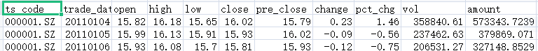
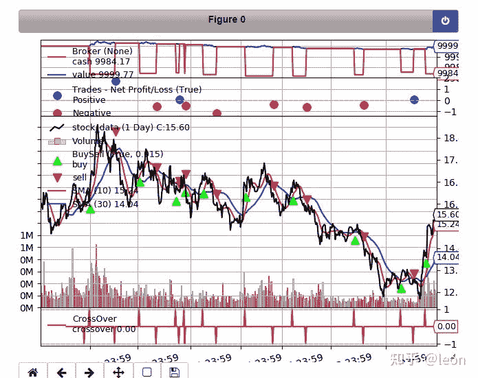

<!--yml
category: 交易
date: 2023-09-17 19:52:08
-->

# 量化回测框架Backtrader【2】-数据导入（附：Tushare介绍）

> 来源：[https://blog.csdn.net/xmy_2002/article/details/116309269](https://blog.csdn.net/xmy_2002/article/details/116309269)

**目录**

[一，通用参数](#%E4%B8%80%EF%BC%8C%E9%80%9A%E7%94%A8%E5%8F%82%E6%95%B0)

[二，通用CSV格式数据导入](#%E4%BA%8C%EF%BC%8C%E9%80%9A%E7%94%A8CSV%E6%A0%BC%E5%BC%8F%E6%95%B0%E6%8D%AE%E5%AF%BC%E5%85%A5)

[三，panda数据导入](#%E4%B8%89%EF%BC%8Cpanda%E6%95%B0%E6%8D%AE%E5%AF%BC%E5%85%A5)

[四，导入扩展数据类别](#%E5%9B%9B%EF%BC%8C%E5%AF%BC%E5%85%A5%E6%89%A9%E5%B1%95%E6%95%B0%E6%8D%AE%E7%B1%BB%E5%88%AB)

* * *

量化回测的第一步就是导入数据，Backtrader中称这个为data feeds，支持多种数据导入方式

*   通用CSV格式
*   panda数据
*   Backtrader CSV Backtrader 为测试自创的格式，
*   一系列的第三方数据包括（yahoo等）

由于后面两种方式暂时还不会用到，所以只介绍前面两种方式。

## 一，通用参数

由于所有的数据导入类都派生于同一个基类，所以所有的数据导入类都支持通用参数。

*   *dataname *(默认值: 无) 必须提供
    含义随数据类型（文件位置，代码，…）而异。
*   *name* (默认值: ‘’)
    用于绘图。 如果未指定，则会从数据名派生（例如：文件路径的最后一部分）
*   *fromdate *(默认值: 最早的时间)
    Python datetime对象，忽略最早时间之前的任何时间
*   *todate *(默认值: 最晚的时间)
    Python datetime对象，忽略最晚时间之后的任何时间
*   *timeframe *(默认值: TimeFrame.Days)
    时间间隔，可选值: `Ticks`, `Seconds`, `Minutes`, `Days`, `Weeks`, `Months` and `Years`
*   *compression* (默认值: 1)
    每个bar里面实际包含的bar数量（bar是时间的颗粒度，相当于k线图上的一个柱子），仅在数据重采样/回放中有效。
*   *sessionstart *(默认值: None)
    指示数据的会话开始时间。 可能被类用于诸如重采样之类的目的
*   *sessionend *(默认值: None)
    指示数据的会话结束时间。 可能被类用于诸如重采样之类的目的

## 二，通用CSV格式数据导入

函数名：GenericCSVData

独有参数：

*   *dataname *数据文件名
*   *datetime* (默认值: 0) 日期数据所在列
*   *time *(默认值: -1) 时间数据所在列（-1代表没有）
*   *open* (默认值: 1) , *high *(默认值: 2), *low *(默认值: 3), *close *(默认值: 4), *volume *(默认值: 5), *openinterest *(默认值: 6)
    分别表示开盘，最高价，最低价，收盘价，交易量，持仓量所在列（-1代表没有）
*   *nullvalue *(默认值: float(‘NaN’))
    用来替换缺失值的值
*   *dtformat *(默认值: %Y-%m-%d %H:%M:%S)
    日期格式
*   *tmformat *(默认值: %H:%M:%S)
    时间格式

再举例子前先介绍一个可以获取股票行情数据的平台，tushare。

> **Tushare是一个免费、开源的python财经数据接口包。**主要实现对股票等金融数据从 **数据采集**、 **清洗加工**到 **数据存储**的过程，能够为金融分析人员提供快速、整洁、和多样的便于分析的数据，为他们在数据获取方面极大地减轻工作量，使他们更加专注于策略和模型的研究与实现上。考虑到Python pandas包在金融量化分析中体现出的优势，Tushare返回的绝大部分的数据格式都是pandas DataFrame类型，非常便于用pandas/NumPy/Matplotlib进行数据分析和可视化。当然，如果您习惯了用Excel或者关系型数据库做分析，您也可以通过Tushare的数据存储功能，将数据全部保存到本地后进行分析。应一些用户的请求，从0.2.5版本开始，Tushare同时兼容Python 2.x和Python 3.x，对部分代码进行了重构，并优化了一些算法，确保数据获取的高效和稳定。

我对比了一下网上其他的数据源，相对来说这个平台的数据还是比较齐全的，日线数据是免费的，对于入门级的基础研究也够用了，高级一点的数据可能就需要去赚积分了。具体可以看他们的官网

[https://tushare.pro/](https://tushare.pro/)

欢迎大家通过我的推荐去注册，谢谢！[https://tushare.pro/register?reg=427104](https://tushare.pro/register?reg=427104)

下面举个从tushare获取日线数据的例子：

```
import tushare as ts
import pandas as pd

pro = ts.pro_api(token='your token id')
df = pro.daily(ts_code='000001.SZ', start_date='20110101', end_date='20210101').iloc[::-1]
df.to_csv('stock_data.csv', index=False )
```

tushare的pro版本是需要注册使用的，注册成功以后会获得一个token id，用你申请到的token id替换代码中的‘your token id’。

获取日线数据的api是pro.daily(), 参数：

*   *ts_code*：股票代码
*   *start_date*：数据开始日期
*   *end_date*：数据结束日期

返回的是一个pandas的dataframe。由于tushare返回的数据是时间反序的，即最新的日期在最前面，这跟BackTrader对数据的要求正好相反，所以用‘iloc[::-1]’使它颠倒一下顺序。最后一行代码就是调用pandas的转存为csv的接口保存为csv文件供以后使用。

最终应该可以在notebook的根目录（如果运行在jupyter上）下生成名为‘stock_data.csv’的中国平安（股票代码：000001.SZ）从20110101到20210101的日线数据文件。

接下来我们就可以用这个数据文件测试BackTrader的数据导入接口。

```
from datetime import datetime
import backtrader as bt
import backtrader.feeds as btfeeds

class SmaCross(bt.SignalStrategy):
    def __init__(self):
        sma1, sma2 = bt.ind.SMA(period=10), bt.ind.SMA(period=30)
        crossover = bt.ind.CrossOver(sma1, sma2)
        self.signal_add(bt.SIGNAL_LONG, crossover)

cerebro = bt.Cerebro()
cerebro.addstrategy(SmaCross)

data = btfeeds.GenericCSVData(
    dataname='stock_data.csv',
    fromdate=datetime(2011, 1, 1),
    todate=datetime(2012, 12, 31),
    nullvalue=0.0,
    dtformat=('%Y%m%d'),
    datetime=1,
    open=2,
    high=3,
    low=4,    
    close=5,
    volume=9,
    openinterest=-1
)

cerebro.adddata(data)

cerebro.run()
cerebro.plot(iplot=False)
```

在上一讲的代码的基础上修改了数据导入的接口



上图显示了我们从tushare下载到的数据，

日期格式是‘年月日’且没有分割，所以dtformat为'%Y%m%d'

‘datetime’，‘open’，‘high’，‘low’,‘close’，‘volume’分别是对应的列序（第一列的列序为0）

如果运行没有问题的话应该会输出如下的图表



## 三，panda数据导入

独有参数:

*   *nocase* (默认值:True) 匹配列名时不区分大小写

参数*dataname *传入Pandas DataFrame变量

*参数datetime*，*open* , *high *, *low *, *close *, *volume*, *openinterest *用列名或列序指定

如果索引列是日期，则参数*datetime*可以不提供

例子如下：

```
from datetime import datetime
import backtrader as bt
import backtrader.feeds as btfeeds
import tushare as ts
import pandas as pd

class SmaCross(bt.SignalStrategy):
    def __init__(self):
        sma1, sma2 = bt.ind.SMA(period=10), bt.ind.SMA(period=30)
        crossover = bt.ind.CrossOver(sma1, sma2)
        self.signal_add(bt.SIGNAL_LONG, crossover)

cerebro = bt.Cerebro()
cerebro.addstrategy(SmaCross)

pro = ts.pro_api(token='936d1029be68a59a3e77eeb9e4eb1ea3c36502bd4b4bf9e1aae91bd8')
df = pro.daily(ts_code='000001.SZ', start_date='20110101', end_date='20210101').iloc[::-1]
df.trade_date=pd.to_datetime(df.trade_date) #由于trade_date是字符串，BackTrader无法识别，需要转一下
data = btfeeds.PandasData(
    dataname=df,
    fromdate=datetime(2011, 1, 1),
    todate=datetime(2012, 12, 31),
    datetime='trade_date',
    open='open',
    high='high',
    low='low',    
    close='close',
    volume='vol',
    openinterest=-1
)

cerebro.adddata(data)

cerebro.run()
cerebro.plot(iplot=False)
```

由于tushare返回的就是pandas的dataframe，所以这里可以直接使用，只是trade_date列需要转成datatime格式，输出跟上个例子一样就不重复贴了。

## 四，导入扩展数据类别

BackTrader的data feeds默认导入的数据类别是*datetime*，*open* , *high *, *low *, *close *, *volume*, *openinterest*。除了这些基本的数据，我们可能会使用其他的数据类别作为策略的依据，BackTrader也支持数据类别的扩展，方法如下：

```
from backtrader.feeds import GenericCSVData

class GenericCSV_extend(GenericCSVData):

    # 添加change数据
    lines = ('change',)

    # 添加参数，由于openinterest默认是index 7 所以我们默认index 8
    params = (('change', 8),)
```

从GenericCSVData类继承创建新类，新类里添加lines（下一讲会介绍这个**lines**），再为这个数据类别添加新的参数。使用这个新创的类就可以导入新的数据了，示例如下：

```
from datetime import datetime
import backtrader as bt
from backtrader.feeds import GenericCSVData
import backtrader.indicators as btind

class GenericCSV_extend(GenericCSVData):

    # 添加change数据
    lines = ('change',)

    # 添加参数，由于openinterest默认是index 7 所以我们默认index 8
    params = (('change', 8),)

class SmaCross(bt.SignalStrategy):
    def __init__(self):
        sma1, sma2 = bt.ind.SMA(period=10), bt.ind.SMA(period=30)        
        crossover = bt.ind.CrossOver(sma1, sma2)
        self.signal_add(bt.SIGNAL_LONG, crossover)

        #为了显示新加的change添加一个change的移动均值
        btind.SMA(self.data.change, period=1, subplot=True)

cerebro = bt.Cerebro()
cerebro.addstrategy(SmaCross)

data = GenericCSV_extend(
    dataname='stock_data.csv',

    fromdate=datetime(2011, 1, 1),
    todate=datetime(2012, 12, 31),

    nullvalue=0.0,

    dtformat=('%Y%m%d'),

    datetime=1,
    open=2,
    high=3,
    low=4,    
    close=5,   
    change=7, #新导入数据change
    volume=9,
    openinterest=-1
)

cerebro.adddata(data)

cerebro.run()
cerebro.plot(iplot=False)
```

依然是基于上面的例子，我们添加了原本没有被导入的每日价格涨跌数据，另外添加了显示新数据的代码，输出应该是这样的


通过比较可以看到新的数据显示在了最下面。