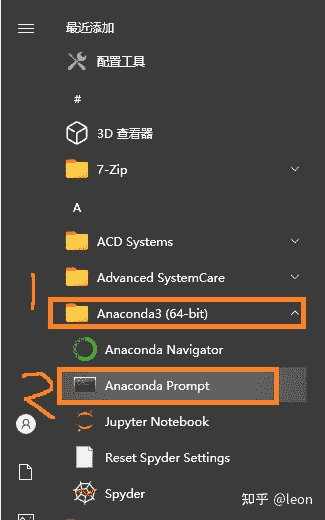
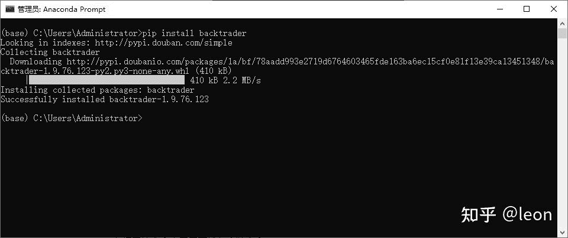
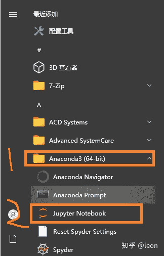
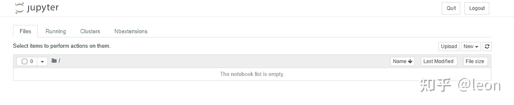
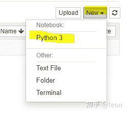
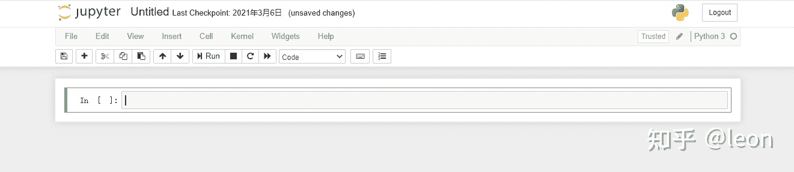
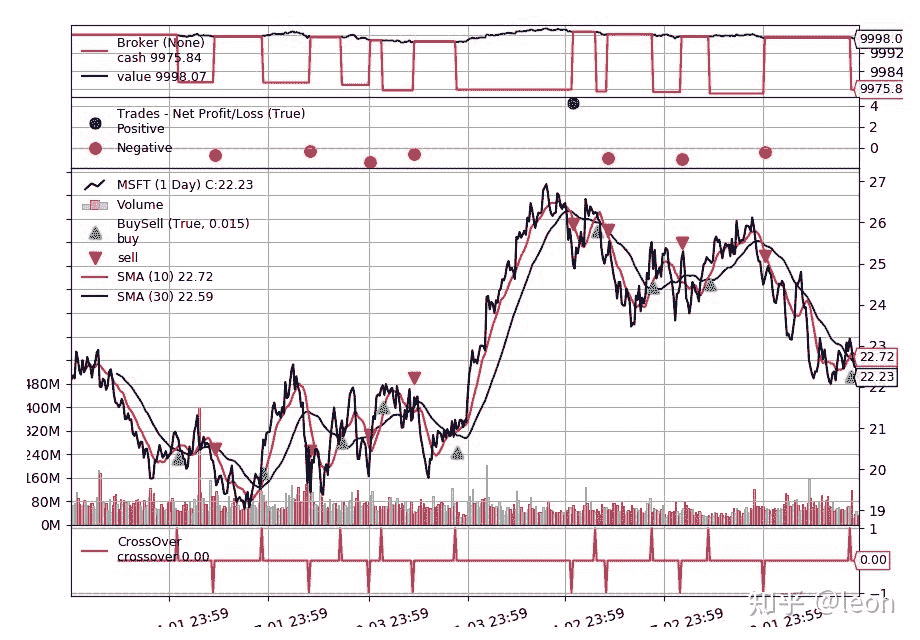

<!--yml
category: 交易
date: 2023-09-17 19:52:21
-->

# 量化回测框架Backtrader【1】-环境安装(windows)

> 来源：[https://blog.csdn.net/xmy_2002/article/details/116306873](https://blog.csdn.net/xmy_2002/article/details/116306873)

**目录**

[零，序言](#%E9%9B%B6%EF%BC%8C%E5%BA%8F%E8%A8%80)

[一，安装Python（anaconda）](#%E4%B8%80%EF%BC%8C%E5%AE%89%E8%A3%85Python%EF%BC%88anaconda%EF%BC%89)

[二，安装backtrader](#%E4%BA%8C%EF%BC%8C%E5%AE%89%E8%A3%85backtrader)

[三，测试](#%E4%B8%89%EF%BC%8C%E6%B5%8B%E8%AF%95)

* * *

## **零，序言**

学习量化交易就要先找个合适的回测平台或框架可以测试自己的策略，网上倒是搜到了不少知名的量化平台，普遍都是要钱的，当然有免费的服务，但执行速度就不提了，大家都懂，另外策略在别人的平台上运行也有泄露的风险。本来想干脆自己开发个回测框架算了，但转念一想，伟大的github上应该有开源的，本着不重复造轮子的精神（其实是懒），搜了一下还真找到几个开源框架，看了下评价，貌似backtrader是功能最强大的，其他方面好像也都不差。就决定先试着学学看。

网上已经有一些backtrader的教程了，我另外再写其实就是想记录一下自己学习的过程，同时也激励一下自己能坚持学下去吧。

废话不多说了，下面进入正题。

Backtrader是一个用python语言开发的开源量化交易回测框架。他的github以及官网地址如下：

[https://github.com/mementum/backtrader​github.com](https://link.zhihu.com/?target=https%3A//github.com/mementum/backtrader)

[https://www.backtrader.com/](https://www.backtrader.com/)

## **一，安装Python（anaconda）**

安装backtrader之前先要安装python，推荐安装anaconda，因为只安装python的话之后还会需要安装一堆的其他库，而anaconda包含了很多常用的库，一步到位了。anaconda可以去官网下载

[https://www.anaconda.com/products/individual](https://www.anaconda.com/products/individual)

但速度有点慢，推荐去清华的镜像下载会快很多

[https://mirrors.tuna.tsinghua.edu.cn/anaconda/archive/](https://mirrors.tuna.tsinghua.edu.cn/anaconda/archive/)

安装的话没什么难度，一路next就好了，也可以参考这篇文章

[https://blog.csdn.net/program_developer/article/details/79677557](https://blog.csdn.net/program_developer/article/details/79677557)

安装完后最好添加一下中国的镜像，需要下载包的时候可以节省不是时间，方法在上面链接里“(5)修改镜像地址”有讲到

## 二，安装backtrader

根据官方的说法总共有三种安装方式，分别是pypi，源码安装以及在类unix系统下的安装。应该说第一种是最简单的，我也是用的第一种方法。

安装完anaconda后，从开始菜单打开anaconda的命令窗口，这个命令窗口会激活anaconda的环境



在打开的命令窗口里面输入安装命令

```
pip install backtrader
```



这样就算安装成功了，安装命令也可以是下面这条

```
pip install backtrader[plotting]
```

跟前面那条的不同点在于，第二条会另外安装*matplotlib*这个画图库，如果你还没有安装过*matplotlib，*建议使用第二条命令。

这样环境基本上算安装好了，接下来简单测试一下

## 三，测试

anaconda自带了两个python的编辑运行方式，spyder和jupyter。spyder跟通常开发程序方式一样，先把代码全部敲完然后一次性运行，而jupyter是一个交互式的开发方式，代码可以写一段运行一段。由于工作的关系，一直使用jupyter比较多，所以这里我也以jupyter来运行测试代码。

运行jupyter之前建议先修改一下根目录：

[https://jingyan.baidu.com/article/cdddd41cd22e8d53cb00e13d.html](https://jingyan.baidu.com/article/cdddd41cd22e8d53cb00e13d.html)

然后从开始菜单那里打开jupyter，



如果你设置的默认路径是个空文件夹的话，界面应该是这样的



然后从右边的“New”下拉菜单新建一个notebook



新建的notebook是这样的



在下面的方框中就可以输入代码了

```
from datetime import datetime
import backtrader as bt

class SmaCross(bt.SignalStrategy):
    def __init__(self):
        sma1, sma2 = bt.ind.SMA(period=10), bt.ind.SMA(period=30)
        crossover = bt.ind.CrossOver(sma1, sma2)
        self.signal_add(bt.SIGNAL_LONG, crossover)

cerebro = bt.Cerebro()
cerebro.addstrategy(SmaCross)

data0 = bt.feeds.YahooFinanceData(dataname='MSFT', fromdate=datetime(2011, 1, 1),
                                  todate=datetime(2012, 12, 31))
cerebro.adddata(data0)

cerebro.run()
cerebro.plot(iplot=False)
```

*注：这个例子本来是从官方文档里搬来的，但最后一句添加了“iplot=False”，因为我的运行环境是jupyter，这个不加的话会报警告，而且重复运行会不出结果。*

运行代码可以点击那个“Run”按钮，也可以使用快捷键Shift+Enter，如果成功运行的话就可以看到结果了



关于jupyter的具体使用方法可以参考

[https://blog.csdn.net/zhusongziye/article/details/80370143](https://blog.csdn.net/zhusongziye/article/details/80370143)

接下来我应该会跟着backtrader官方文档进行学习，也会尽量把重要的章节写成文章发在这里。