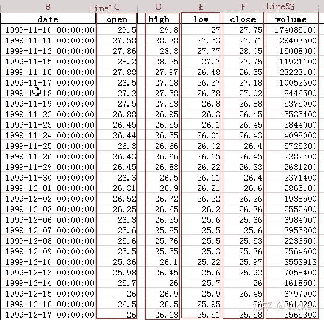
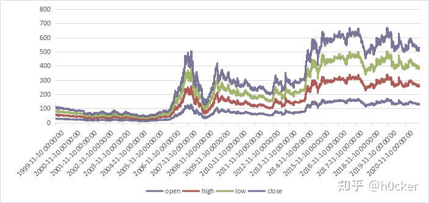
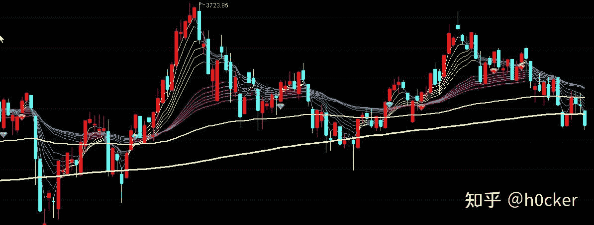
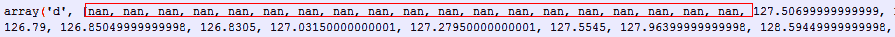
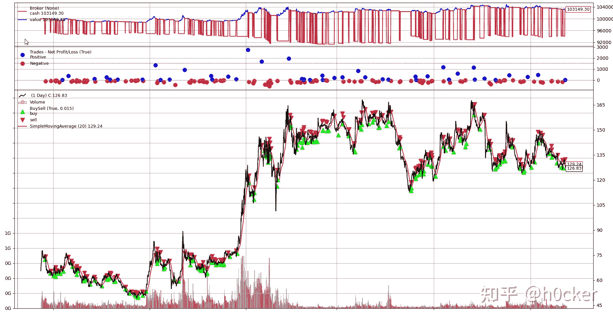
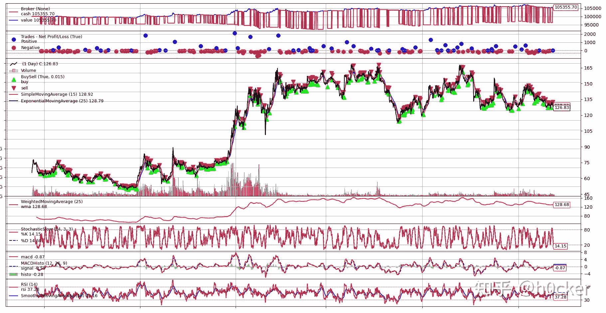

<!--yml
category: 交易
date: 2023-09-17 19:46:37
-->

# 量化投资之工具篇：Backtrader从入门到精通（1）手把手教你零基础实现一个策略案例 - 知乎

> 来源：[https://zhuanlan.zhihu.com/p/461000174](https://zhuanlan.zhihu.com/p/461000174)

量化投资是一个非常大的课题，从这边文章开始，我会从如下几个方面构建量化投资的这个框架：

1.  工欲善其事，必先利其器。我们先学习一个量化投资回测利器backtrader，通过这个工具，我们可以将量化策略在经过回测之后，付诸实用。
2.  我们学习一些常用的以及大师们实用量化策略，了解它的原理，选择合适的标的资产，为己所用。
3.  开发自己的策略。老实说，公开的策略使用的人众多，往往会失效，那么如果构造开发自己的策略显得尤其重要。这一块，我们会介绍投资、数据挖掘，预测等关键技术，及其如何应用在构建自己投资策略上。

4.  最后我们会构造一个完整的实用系统，该系统上，可以查看关键投资指标、定制量化策略。

下面我们开始介绍Backtrader，内容主要基于Backtrader的网站指导文档以及示例。

## 简介

Backtrader的特点，就是两点：

1.  易于使用；
2.  参见第1条。

那么如何使用Backtrader呢？比把大象装进冰箱复杂点，一共4步：

1.  创建一个Cerebro引擎：
2.  加入一个Strategy。
3.  加载数据。
4.  执行：cerebro.run()。

就是这么简单！

这么简单如何执行那么多复杂的量化策略，关键就是Backtrader作为一个平台，具有极高的可配置性，也就是可以根据需要进行不同的配置，完成不同的量化策略回测，后续将进行详细描述。

## 安装

一般是通过Python安装：

> pip install backtrader

需要注意的是，和backtrader适配的matplotlib版本不能太高，测试可用的版本是3.2.2。如果高于此版本，可以通过如下命令降级：

> pip uninstall matplotlib
> pip install matplotlib==3.2.2

## 手把手教你实现一个例子

## 首先需要理解的几个关键概念

### Line

Line在Backtrader系统中，是最重要的对象。

Line的本意就是一连串可以连接在一起的点，所有可以在坐标上形成一条线的数据，就称为Line。在量化投资的领域，这个Line通常指的是证券的open(开盘价）、high（最高价）、low（最低价）、close（收盘价）、volume（成交量）。例如如下我们下载的某股票的数据：



Excle中画个图：



可以看出，每一列均可形成一个Line，这个Line就是需要进行处理的数据，对于证券数据，我们通常对close（收盘价）进行处理。

除了数据本身可以形成Line之外，对数据进行处理后形成的数据也可以作为Line，比如计算close列的移动平均线，也可以形成一个Line。

### Index为0的含义

Backtrader系统中，对Line的数据是逐行处理的，如下：

系统处理顺序从上至下，当处理到26.5的时候，对应的Index为0.如果要访问之前的数据，就是-1，-2.之后的数据，就是1,2.

特别值得注意的是-1在python中用于访问一个列表的最后一个数据，而在backtrader中，-1指的是最后已经处理过得数据，在当前处理数据之前 ，值会随着系统的处理而不断变化。

如果系统在创建Strategy的时候，系统初始化了一个移动平均线：

```
self.sma = SimpleMovingAverage(.....)
```

访问移动平均线当前值的简单易用的方法是：

这种方法的好处就是无需知道已经处理了多少行（在Backtrader中，统一将行称之为Bar），也无需知道还有多少Bar需要处理，因为0唯一确定了系统正在处理的数据（Bar）。

为什么要叫做bar，这里要说明下，基本上所有软件对股票价格显示为柱状（蜡烛），英语中就是Bar，这个柱状反应的是一定时间(比如日线就是一天，月线就是一个月）的价格信息，包括开盘价（Open），最高价（High），最低价（Low）以及收盘价（Close)，所以一天内的相关信息均在Bar内体现，而Backtrader模拟真实世界，一个一个Bar的进行数据处理，所有以后描述一个Bar，就是指特定时间点的所有信息。



## 从0到100：一步一步实现一个例子

掌握一项技术最好的方法就是亲手写一个程序，下面采用不断迭代的方法，一步一步，从简单到复杂实现咱们的第一个量化回测程序。

### 创建第一个程序

```
from __future__ import (absolute_import, division, print_function,
                        unicode_literals)
import backtrader as bt

if __name__ == '__main__':
    cerebro = bt.Cerebro()
    print('Starting Portfolio Value: %.2f' % cerebro.broker.getvalue())
    cerebro.run()
    print('Final Portfolio Value: %.2f' % cerebro.broker.getvalue())
```

执行下，看看啥结果：

> Starting Portfolio Value: 10000.00
> Final Portfolio Value: 10000.00

这个程序做了啥？

*   将Backtrader引入到咱们程序中，命名为bt。第3行代码。
*   创建了一个机器人大脑（Cerebro），同时隐含创建了一个borker（券商）。第6行代码
*   让机器人大脑开始运行。第8行代码。
*   显示了机器人在券商那里存有多少钱。7行和8行代码。

等等，为啥只有10000元，失败啊，太少了，没事，咱可以多存点钱到券商。

```
cerebro = bt.Cerebro()

cerebro.broker.setcash(100000.0)#加到100000元，咱们也富裕了。
```

再执行看看，果然富裕了：

> Starting Portfolio Value: 100000.00
> Final Portfolio Value: 100000.00

不对，为啥钱没变啊，这个机器人没给我挣钱啊。因为这个机器人大脑只是初始化，还没发育好，脑子一片空白，啥也做不了，自然挣不了钱。咱们先给机器人点股票数据看看，让他先看看股票数据，说不定能学习点啥。

### 给空白的大脑加载数据

```
import backtrader as bt
import pandas as pd
from datetime import datetime
if __name__ == '__main__':
    cerebro = bt.Cerebro()
    #获取数据
    stock_hfq_df = pd.read_excel("./data/sh600000.xlsx",index_col='date',parse_dates=True)
    start_date = datetime(2010, 9, 30)  # 回测开始时间
    end_date = datetime(2021, 9, 30)  # 回测结束时间
    data = bt.feeds.PandasData(dataname=stock_hfq_df, fromdate=start_date, todate=end_date)  # 加载数据
    cerebro.adddata(data)  # 将数据传入回测系统

    cerebro.broker.setcash(100000.0)
    print('Starting Portfolio Value: %.2f' % cerebro.broker.getvalue())
    cerebro.run()
    print('Final Portfolio Value: %.2f' % cerebro.broker.getvalue())
```

再执行看看：

> Starting Portfolio Value: 100000.00
> Final Portfolio Value: 100000.00

大脑开始发育了，起码做到了：

能接受股票的数据了。（这里提供的是下载浦发银行（sh6000000）的历史数据作为示例，如何获取数据后续专门讨论）也能对datetime进行处理，根据需要看具体特定时期的数据了。

但是咱们钱还是没增加了，大脑大脑快快成长吧，快快给俺挣钱啊

### 给大脑第一个策略

钱有了（在broker券商），股票数据也有了，似乎马上就可以进行有风险的投资了。要投资，就得有一个有投资策略。而投资策略，针对的通常是数据的收盘价（close），也就是根据收盘价决定如何投资。

毕竟股市太凶险，机器人新加的策略是先看看股票的收盘价。

```
import backtrader as bt
import pandas as pd
from datetime import datetime

# 创建一个策略
class TestStrategy(bt.Strategy):

    def log(self, txt, dt=None):
        ''' 提供记录功能'''
        dt = dt or self.datas[0].datetime.date(0)
        print('%s, %s' % (dt.isoformat(), txt))

    def __init__(self):
        # 引用到输入数据的close价格
        self.dataclose = self.datas[0].close

    def next(self):
        # 目前的策略就是简单显示下收盘价。
        self.log('Close, %.2f' % self.dataclose[0])

if __name__ == '__main__':
    cerebro = bt.Cerebro()

    # 增加一个策略
    cerebro.addstrategy(TestStrategy)

    #获取数据
    stock_hfq_df = pd.read_excel("./data/sh600000.xlsx",index_col='date',parse_dates=True)
    start_date = datetime(2010, 9, 30)  # 回测开始时间
    end_date = datetime(2021, 9, 30)  # 回测结束时间
    data = bt.feeds.PandasData(dataname=stock_hfq_df, fromdate=start_date, todate=end_date)  # 加载数据
    cerebro.adddata(data)  # 将数据传入回测系统

    cerebro.broker.setcash(100000.0)
    print('Starting Portfolio Value: %.2f' % cerebro.broker.getvalue())

    cerebro.run()

    print('Final Portfolio Value: %.2f' % cerebro.broker.getvalue())
```

执行后结果：

> Starting Portfolio Value: 100000.00
> 2020-09-30, Close, 125.97
> ...(省略n行）
> 2021-09-27, Close, 127.11
> 2021-09-28, Close, 127.26
> 2021-09-29, Close, 127.11
> 2021-09-30, Close, 126.83
> Final Portfolio Value: 100000.00

看起来还好，没赔钱，股票市场似乎没那么凶险。

关于这个策略（Strategy），需要重点关注：

*   Strategy初始化的时候，将大脑加载的数据更新到dataclose属性中（注意，这是一个容器，保存股票回测开始时间到结束时间的所有close数据）。 self.datas[0]指向的是大脑通过cerebro.adddata函数加载的第一个数据，本例中指加载浦发银行的股票数据。

*   self.dataclose = self.datas[0].close指向的是close （收盘价）line

*   strategy 的next方法针对self.dataclose（也就是收盘价Line）的每一行（也就是Bar）进行处理。在本例中，只是打印了下close的值。next方法是Strategy最重要的的方法，具体策略的实现都在这个函数中，后续还会详细介绍。

这个策略还是没能挣钱，没买卖咋挣钱？大胆点，咱们开始买！

### 加入买的逻辑到Strategy中

没买卖就没收入，咱们开始买，啥时候买？妈妈说，买东西要便宜，那就如果价格连续降2天，咱就买入，试试看！

```
import backtrader as bt
import pandas as pd
from datetime import datetime

# 创建一个测试策略
class TestStrategy(bt.Strategy):

    def log(self, txt, dt=None):
        ''' 记录策略信息'''
        dt = dt or self.datas[0].datetime.date(0)
        print('%s, %s' % (dt.isoformat(), txt))

    def __init__(self):
        # 应用第一个数据源的收盘价
        self.dataclose = self.datas[0].close

    def next(self):
        # 打印每日的收盘价
        self.log('Close, %.2f' % self.dataclose[0])

        if self.dataclose[0] < self.dataclose[-1]:
            # 当前的价格比上一次价格（也就是昨天的价格低）

            if self.dataclose[-1] < self.dataclose[-2]:
                # 上一次的价格（昨天）比上上一次的价格（前天的价格）低

                # 开始买！！
                self.log('BUY CREATE, %.2f' % self.dataclose[0])
                self.buy()
```

执行结果如下：

> Starting Portfolio Value: 100000.00
> ...(省略n行）
> 2021-09-28, Close, 127.26
> 2021-09-29, Close, 127.11
> 2021-09-30, Close, 126.83 2021-09-30,
> BUY CREATE, 126.83
> Final Portfolio Value: 110441.06

挣钱了耶，居然挣了1万多块钱。从打印可以看出，在收盘价连续2天价格下跌的时候，strategy就执行买入。虽然咱们挣了钱，订单（order）好像创建了，但是不知道是否执行了以及何时以什么价格执行了。后面我们会展示如何监听订单执行的状态。

也许你要问了，咱们买了多少股票（称之为资产asset）？买了啥股票？订单是咋执行的？后续会回答这些问题，在当前示例中：

*   self.datas[0] 就是我们购买了的股票。本例中没有输入其他数据，如果输入了其他数据，购买的股票就不一定是啥了，这个要看具体的策略执行情况。

*   买了多少股本（stake）的股票？这个通过机器人大脑的position sizer属性来记录，缺省值为1，就是缺省咱们每一次操作只买卖1股。

*   当前order执行的时候，采用的价格是第二天的开盘价。

*   当前order执行的时候，没有收佣金。佣金如何设置后续还会说明。

### 不仅要买，还要卖

一次完整的交易，不仅要买，还要卖。啥时候卖？咱们简单点，就是处理了5个bar数据之后。值得注意的是，这里使用了bar这个概念，没有包含任何时间的概念，也就是一个bar，可以是1分钟，1个小时，也可以是一天，一个月，这些基于你输入的数据，如果你输入的股票每小时（分时）数据，那么一个bar就是一分钟，如果提供是周K数据，一个bar就是一周。本例中，我们获取的数据基于每天，那么一个bar就是一天。

特别之一，这里代码使用了len这个函数，在python中，len通常返回的一个列表中数据的多少，而在backtrader中，重写了len函数，返回的是已经处理过数据行（也就是Bar）。

注意，如果我们不在市场内，就不能卖。什么叫不在市场内，就是你不拥有任何股票头寸，也就是没有买入资产。在策略中，通过 position 属性来记录。

本次代码中，我们将要增加如下：

*   访问postion获取是否在市场内

*   会创建买和卖的订单（order）

*   订单状态的改变会通过notify方法通知到strategy。

```
# 创建一个策略
class TestStrategy(bt.Strategy):

    def log(self, txt, dt=None):
        ''' 记录功能'''
        dt = dt or self.datas[0].datetime.date(0)
        print('%s, %s' % (dt.isoformat(), txt))

    def __init__(self):
        # 引用到数据的close Line
        self.dataclose = self.datas[0].close

        # 跟踪订单
        self.order = None

    def notify_order(self, order):
        if order.status in [order.Submitted, order.Accepted]:
            # 订单提交和成交当前不做处理
            return

        # 检查订单是否成交
        # 注意，如果现金不够的话，订单会被拒接
        if order.status in [order.Completed]:
            if order.isbuy():
                self.log('BUY EXECUTED, %.2f' % order.executed.price)
            elif order.issell():
                self.log('SELL EXECUTED, %.2f' % order.executed.price)

            self.bar_executed = len(self)

        elif order.status in [order.Canceled, order.Margin, order.Rejected]:
            self.log('Order Canceled/Margin/Rejected')

        # 记录没有挂起的订单
        self.order = None

    def next(self):
        #记录close的价格
        self.log('Close, %.2f' % self.dataclose[0])

        # 检查是否有挂起的订单，如果有的话，不能再发起一个订单
        if self.order:
            return

        # 检查是否在市场（有持仓）
        if not self.position:

            # 不在，那么连续3天价格下跌就买点
            if self.dataclose[0] < self.dataclose[-1]:
                    # 当前价格比上一次低

                    if self.dataclose[-1] < self.dataclose[-2]:
                        # 上一次的价格比上上次低

                        # 买入!!! 
                        self.log('BUY CREATE, %.2f' % self.dataclose[0])

                        # Keep track of the created order to avoid a 2nd order
                        self.order = self.buy()

        else:

            # 已经在市场，5天后就卖掉。
            if len(self) >= (self.bar_executed + 5):#这里注意，Len(self)返回的是当前执行的bar数量，每次next会加1.而Self.bar_executed记录的最后一次交易执行时的bar位置。
                # SELL, SELL, SELL!!! (with all possible default parameters)
                self.log('SELL CREATE, %.2f' % self.dataclose[0])

                # Keep track of the created order to avoid a 2nd order
                self.order = self.sell()
```

执行结果：

> Starting Portfolio Value: 100000.00
> ...(省略n行）
> 2021-09-14, BUY CREATE, 129.79
> 2021-09-15, BUY EXECUTED, 129.79
> 2021-09-15, Close, 129.51
> 2021-09-16, Close, 128.52
> 2021-09-17, Close, 128.38
> 2021-09-22, Close, 127.26
> 2021-09-23, Close, 127.26
> 2021-09-24, Close, 127.11
> 2021-09-24, SELL CREATE, 127.11
> 2021-09-27, SELL EXECUTED, 127.11
> 2021-09-27, Close, 127.11
> 2021-09-28, Close, 127.26
> 2021-09-29, Close, 127.11
> 2021-09-30, Close, 126.83
> 2021-09-30, BUY CREATE, 126.83
> Final Portfolio Value: 100042.80

从结果看，买了股票5天就卖了。啥，只赚了42块钱，会买的是徒弟，会卖的才是师父，看来真的不能瞎卖啊！

### 券商说，俺的钱呢？

券商说，你这里又买又卖的，我的佣金在哪儿？好的，咱们加上佣金，就0.1%吧，一行代码的事情：

```
# 0.1% ... 除以100去掉%号。
cerebro.broker.setcommission(commission=0.001)
```

下面我们看看佣金对收益的影响（策略不变）。

```
if __name__ == '__main__':
    cerebro = bt.Cerebro()

    # 增加一个策略
    cerebro.addstrategy(TestStrategy)

    #获取数据
    stock_hfq_df = pd.read_excel("./data/sh600000.xlsx",index_col='date',parse_dates=True)
    start_date = datetime(2010, 9, 30)  # 回测开始时间
    end_date = datetime(2021, 9, 30)  # 回测结束时间
    data = bt.feeds.PandasData(dataname=stock_hfq_df, fromdate=start_date, todate=end_date)  # 加载数据
    cerebro.adddata(data)  # 将数据传入回测系统

    cerebro.broker.setcash(100000.0)
    # 设置佣金0.1% ... 除以100去掉%号。
    cerebro.broker.setcommission(commission=0.001)
    print('Starting Portfolio Value: %.2f' % cerebro.broker.getvalue())
    cerebro.run()
    print('Final Portfolio Value: %.2f' % cerebro.broker.getvalue())
```

结果如下：

> Starting Portfolio Value: 100000.00 ...(省略n行）
> 2021-09-14, BUY CREATE, 129.79
> 2021-09-15, BUY EXECUTED, Price: 129.79, Cost: 129.79, Comm 0.13
> 2021-09-15, Close, 129.51
> 2021-09-16, Close, 128.52
> 2021-09-17, Close, 128.38
> 2021-09-22, Close, 127.26
> 2021-09-23, Close, 127.26
> 2021-09-24, Close, 127.11
> 2021-09-24, SELL CREATE, 127.11
> 2021-09-27, SELL EXECUTED, Price: 127.11, Cost: 129.79, Comm 0.13
> 2021-09-27, OPERATION PROFIT, GROSS -2.68, NET -2.94
> 2021-09-27, Close, 127.11 2021-09-28, Close, 127.26 2021-09-29, Close, 127.11
> 2021-09-30, Close, 126.83
> 2021-09-30, BUY CREATE, 126.83
> Final Portfolio Value: 99992.00

晕菜，亏了，挣的钱都给券商了，所以啊，一定不要频繁交易。

同时，我们注意到，每次订单执行，都有一个操作盈利记录（Gross：毛利；Net:净利）：

> 2021-09-27, OPERATION PROFIT, GROSS -2.68, NET -2.94

### 如何给策略Strategy传递参数

策略这个东西，是高度可配置的，大脑想调整下策略，可以通过配置参数来设定，免得大量硬编码数据，后续难以修改。比如策略之前是过5天就卖，现在想改为过7天再卖，通过修改参数就可以做到。参数如何传递呢？也很简单：

```
params = (('myparam', 27), ('exitbars', 5),)
```

就是典型的python元组数据。

我们在创建策略的时候，大脑通过如下方法传递给策略实例：

```
# 加一个策略
cerebro.addstrategy(TestStrategy, myparam=20, exitbars=7)
```

那么卖出的 逻辑可以修改为：

```
if len(self) >= (self.bar_executed + self.params.exitbars):
```

之前我们每次只买1股，太少了，咱们中国一手最少100股，那咋整？可以通过如下代码设置(由于钱不够，先设置70股试试看：

```
cerebro.addsizer(bt.sizers.FixedSize, stake=70)
```

修改这两处之后，咱们再执行下看看（这个修改较简单，就不贴代码了）。

> Starting Portfolio Value: 100000.00 ...(省略n行）
> 2021-09-27, SELL EXECUTED, Price: 127.11, Cost: 9085.30, Comm 8.90
> 2021-09-27, OPERATION PROFIT, GROSS -187.60, NET -205.58
> 2021-09-27, Close, 127.11 2021-09-28, Close, 127.26
> 2021-09-29, Close, 127.11 2021-09-30, Close, 126.83
> 2021-09-30, BUY CREATE, 126.83 Final Portfolio Value: 99440.16

看如下，每次买了70股吧。

> SELL EXECUTED, Price: 127.11, Cost: 9085.30, Comm 8.90

### 加一个指标（indicator）

大家投资的时候，经常听说这指标那指标的，没听说？那均线总听说过吧？咱们加个均线指标来指导我们的策略，毕竟连续两天下跌这个指标太土了，咱们要使用高大上的移动均线指标：

*   如果当前价格大于均线，就买买买。

*   如果低于均线，就卖卖卖。怎么听起来像追涨杀跌啊，看起来咱们的机器人像个韭菜。

*   为了简单起见，同时只能存在一次买卖。

修改也不大，在策略（Strategy）的初始化的时候，引用一个简单的移动平均指标，如下代码：

Strategy代码如下，同时主程序暂时将佣金设置为0\. 为了减少数据，对比查看sma的数据，说明一个重要的概念，暂时将回测时间修改为2020-9-30日。

```
#创建一个策略
class TestStrategy(bt.Strategy):
    params = (
        ('maperiod', 20),
    )
 #记录功能
    def log(self, txt, dt=None):
        ''' Logging function fot this strategy'''
        dt = dt or self.datas[0].datetime.date(0)
        print('%s, %s' % (dt.isoformat(), txt))

    def __init__(self):
        # 引用到close line
        self.dataclose = self.datas[0].close

        # 跟踪订单状态以及买卖价格和佣金
        self.order = None
        self.buyprice = None
        self.buycomm = None

        # 增加移动均线
        self.sma = bt.indicators.SimpleMovingAverage(
            self.datas[0], period=self.params.maperiod)

    def notify_order(self, order):
        if order.status in [order.Submitted, order.Accepted]:
            # 订单状态为提交和接受，不做处理
            return

        # 检查订单是否成交
        # 注意，没有足够现金的话，订单会被拒绝。
        if order.status in [order.Completed]:
            if order.isbuy():
                self.log(
                    'BUY EXECUTED, Price: %.2f, Cost: %.2f, Comm %.2f' %
                    (order.executed.price,
                     order.executed.value,
                     order.executed.comm))

                self.buyprice = order.executed.price
                self.buycomm = order.executed.comm
            else:  # Sell
                self.log('SELL EXECUTED, Price: %.2f, Cost: %.2f, Comm %.2f' %
                         (order.executed.price,
                          order.executed.value,
                          order.executed.comm))

            self.bar_executed = len(self)

        elif order.status in [order.Canceled, order.Margin, order.Rejected]:
            self.log('Order Canceled/Margin/Rejected')

        self.order = None

    def notify_trade(self, trade):
        if not trade.isclosed:
            return

        self.log('OPERATION PROFIT, GROSS %.2f, NET %.2f' %
                 (trade.pnl, trade.pnlcomm))

    def next(self):
        # 记录当前处理的close值
        self.log('Close, %.2f' % self.dataclose[0])

        # 订单是否
        if self.order:
            return

        # Check if we are in the market
        if not self.position:

            # 大于均线就买
            if self.dataclose[0] > self.sma[0]:

                # BUY, BUY, BUY!!! (with all possible default parameters)
                self.log('BUY CREATE, %.2f' % self.dataclose[0])

                # Keep track of the created order to avoid a 2nd order
                self.order = self.buy()

        else:

            if self.dataclose[0] < self.sma[0]:
                # 小于均线卖卖卖！
                self.log('SELL CREATE, %.2f' % self.dataclose[0])

                # Keep track of the created order to avoid a 2nd order
                self.order = self.sell()

if __name__ == '__main__':
    cerebro = bt.Cerebro()

    # 增加一个策略
    cerebro.addstrategy(TestStrategy)

    #获取数据
    stock_hfq_df = pd.read_excel("./data/sh600000.xlsx",index_col='date',parse_dates=True)
    start_date = datetime(2020, 9, 30)  # 回测开始时间
    end_date = datetime(2021, 9, 30)  # 回测结束时间
    data = bt.feeds.PandasData(dataname=stock_hfq_df, fromdate=start_date, todate=end_date)  # 加载数据
    cerebro.adddata(data)  # 将数据传入回测系统

    cerebro.broker.setcash(100000.0)
    # Set the commission - 0.1% ... divide by 100 to remove the %
    cerebro.broker.setcommission(commission=0)
     # Add a FixedSize sizer according to the stake 每次买卖的股数量
    cerebro.addsizer(bt.sizers.FixedSize, stake=70)

    print('Starting Portfolio Value: %.2f' % cerebro.broker.getvalue())

    cerebro.run()

    print('Final Portfolio Value: %.2f' % cerebro.broker.getvalue())
```

执行下，看看：

> Starting Portfolio Value: 100000.00 2020-11-04, Close, 125.30
> 2020-11-05, Close, 125.57
> 2020-11-06, Close, 125.97
> 2020-11-09, Close, 126.51
> 2020-11-10, Close, 126.91
> 2020-11-11, Close, 128.25
> 2020-11-11, BUY CREATE, 128.25
> 2020-11-12, BUY EXECUTED, Price: 127.71, Cost: 8939.70, Comm 0.00
> ...(省略n行）
> 2021-09-29, Close, 127.11
> 2021-09-30, Close, 126.83
> Final Portfolio Value: 99648.60

哎，亏了，还不如追涨杀跌呢！不过，咱们是学习如何使用Backtrader来验证策略，重要是学习，亏就亏了吧。

眼尖的你可能看到了，咱们回测时间是2020-9-30日，为啥系统从2020-11-04开始测试？这就涉及到最小周期的问题。

这是因为sma（移动平均）的参数为20，也就是要20bar（本例中一个bar就是一天）的数据才能计算，1到19天没数据，可以看下sma的数据：



从第20天开始（20个工作日之后就是11月14日）才有数据，而strategy的next在所有line（本例中，有两个line，一个是open价格，一个是sma）都有有效的时候，才会进行策略的处理。这个例子中，只有一个指标（indicator），实际上可以加随便多少个，来实现复杂的策略，后续再详细讨论。

另外，注意一点，backtrader中对数据的处理是向下取两位小数。

### 可视化-画图

前面执行程序，每一步都输出文字描述，这个看起来实在不友好，于是Backtrader提供了画图功能。

画图使用的是matplotlib库，前面描述过，必须安装特定版本，不然就有问题。

实现画图，也很简单，加一行代码：

放到cerebro.run()之后就可以了，这里不贴代码了，执行试试看：



神奇不？一张图可以看出所有：

*   收盘价和移动平均线。

*   盈利图；

*   买卖点；

*   买卖盈利还是亏损。

*   成交量。

你以为只能这么点，为了展示咱们强大的画图能力，再加点指标来自动画图显示：

*   指数移动平均线

*   权重移动平均线

*   随机指标

*   MACD

*   RSI

*   RSI的简单移动平均

*   ATR。这个不画图，展示如何控制Line是否参与画图。

这些指标先自行百度，以后涉及到咱们的策略的时候再介绍。

实现的时候，就是在Strategy初始化的时候，加上如下代码：

```
# 新加指标用于画图
bt.indicators.ExponentialMovingAverage(self.datas[0], period=25)
bt.indicators.WeightedMovingAverage(self.datas[0], period=25).subplot = True
bt.indicators.StochasticSlow(self.datas[0])
bt.indicators.MACDHisto(self.datas[0])
rsi = bt.indicators.RSI(self.datas[0])
bt.indicators.SmoothedMovingAverage(rsi, period=10)
bt.indicators.ATR(self.datas[0]).plot = False
```

看看效果：



看起来还不错。不过实话说，整个图还是挺丑的，后面优化下。

### 再来点优化

也许你要问了，为啥咱们用20天的移动平均呢？用15天行不行？其实对于同的股票，这个值还可能不同。backtrader的神奇来了，咱们可以对策略进行对比。

具体的实现方法：

首先在大脑（cerebro）调用addstrategy的时候只传入一个策略，而是调用optstrategy传入多个参数。参见如下主代码，策略不变：

```
if __name__ == '__main__':
    cerebro = bt.Cerebro()

    # 增加多参数的策略
    strats = cerebro.optstrategy(
        TestStrategy,
        maperiod=range(10, 31))

    #获取数据
    stock_hfq_df = pd.read_excel("./data/sh600000.xlsx",index_col='date',parse_dates=True)
    start_date = datetime(2020, 9, 30)  # 回测开始时间
    end_date = datetime(2021, 9, 30)  # 回测结束时间
    data = bt.feeds.PandasData(dataname=stock_hfq_df, fromdate=start_date, todate=end_date)  # 加载数据
    cerebro.adddata(data)  # 将数据传入回测系统

    cerebro.broker.setcash(100000.0)
    # Set the commission - 0.1% ... divide by 100 to remove the %
    cerebro.broker.setcommission(commission=0)
     # Add a FixedSize sizer according to the stake 每次买卖的股数量
    cerebro.addsizer(bt.sizers.FixedSize, stake=70)

    print('Starting Portfolio Value: %.2f' % cerebro.broker.getvalue())

    cerebro.run()

    print('Final Portfolio Value: %.2f' % cerebro.broker.getvalue())
```

其次，在Strategy增加stop方法，该方法在每个strategy完成之后调用，也就是在所有数据处理完成之后再调用。该函数会打印每次策略执行后最终还剩多少钱。

```
def stop(self):
    self.log('(MA Period %2d) Ending Value %.2f' %
            (self.params.maperiod, self.broker.getvalue()))
```

最终结果为：

> 2021-09-30, (MA Period 10) Ending Value 99330.80
> 2021-09-30, (MA Period 12) Ending Value 103441.20
> 2021-09-30, (MA Period 11) Ending Value 100841.40
> 2021-09-30, (MA Period 13) Ending Value 102013.20
> 2021-09-30, (MA Period 14) Ending Value 103860.50
> 2021-09-30, (MA Period 17) Ending Value 103322.20
> 2021-09-30, (MA Period 15) Ending Value 105178.60
> 2021-09-30, (MA Period 16) Ending Value 104009.60
> 2021-09-30, (MA Period 20) Ending Value 103149.30
> 2021-09-30, (MA Period 19) Ending Value 104309.20
> 2021-09-30, (MA Period 18) Ending Value 103423.00
> 2021-09-30, (MA Period 21) Ending Value 102899.40
> 2021-09-30, (MA Period 24) Ending Value 104294.50
> 2021-09-30, (MA Period 22) Ending Value 103868.20
> 2021-09-30, (MA Period 25) Ending Value 103544.80
> 2021-09-30, (MA Period 23) Ending Value 103264.10
> 2021-09-30, (MA Period 26) Ending Value 102888.20
> 2021-09-30, (MA Period 27) Ending Value 102410.10
> 2021-09-30, (MA Period 28) Ending Value 101978.20
> 2021-09-30, (MA Period 29) Ending Value 102212.70
> 2021-09-30, (MA Period 30) Ending Value 101871.10

从以上图中可以看出：

除了10天平均，其他都是盈利的。其中15天平均值，盈利最多。这些信息都可以作为策略的参数调优使用。

## 总结

咱们一步一步从最原始的啥也不能做的机器人大脑，慢慢进化成能根据输入的股票数据，采用不同的策略来挣钱的成熟大脑，还能把执行过程可视化，实在是一个合格的投资者了。

后面咱们还可以：

*   自定义的指标

*   更好地管理资金；

*   详细的投资收益信息

*   ...

所有这一切，都需要我们取挖掘，后续我们一起继续学习，掌握好Backtrader之后，就可以实现咱们自己的投资策略。