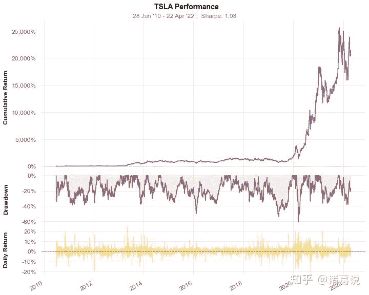
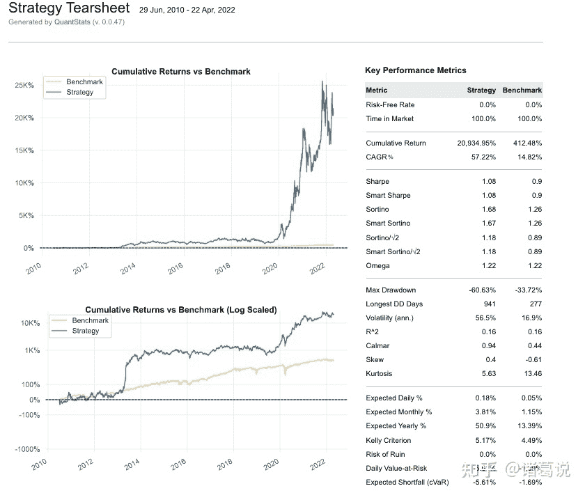
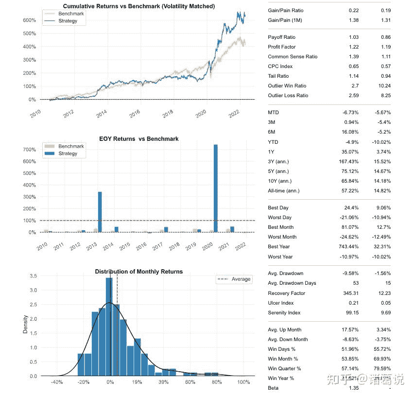
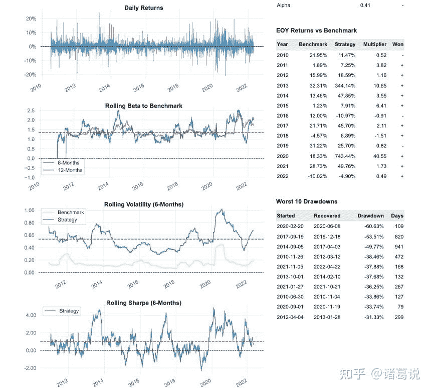
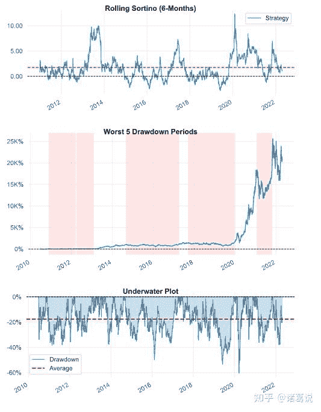
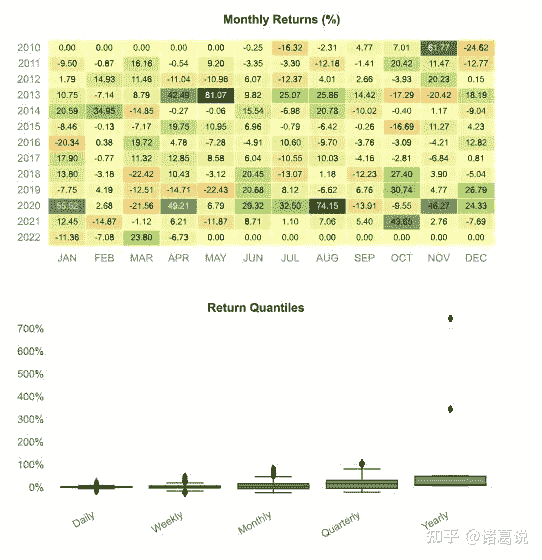

<!--yml
category: 交易
date: 2023-09-17 20:13:01
-->

# 量化投资分析工具quantstats介绍及其在backtrader量化框架中使用 - 知乎

> 来源：[https://zhuanlan.zhihu.com/p/507760842](https://zhuanlan.zhihu.com/p/507760842)

## **简介**

**[quantstats](https://link.zhihu.com/?target=https%3A//github.com/ranaroussi/quantstats)** -- 衡量策略绩效指标的python lib库，用于投资组合分析。主要由3部分组成：

*   quantstats.stats：用于计算多种性能指标，如夏普比率、胜率等
*   quantstats.plots：用于性能、下降趋势、月度回报等绩效指标的可视化
*   quantstats.reports：用于生成度量报告，可保存为html文件

## **安装&使用**

*   安装：`pip install` quantstats
*   使用方法：

1.  使用quantstats.stats计算多种性能指标，如夏普比率、胜率等

```
import quantstats as qs
qs.extend_pandas()
stock = qs.utils.download_returns('TSLA')
stock
Date
2010-06-29         NaN
2010-06-30   -0.002512
2010-07-01   -0.078472
2010-07-02   -0.125683
2010-07-06   -0.160938
                ...   
2022-04-18    0.019584
2022-04-19    0.023758
2022-04-20   -0.049555
2022-04-21    0.032317
2022-04-22   -0.003698
Name: Close, Length: 2976, dtype: float64
qs.stats.sharpe(stock)
1.0828146689088534
stock.sharpe()
1.0828146689088534 
```

支持的完整指标：

```
[f for f in dir(qs.stats) if f[0] != '_']

['adjusted_sortino',
 'autocorr_penalty',
 'avg_loss',
 'avg_return',
 'avg_win',
 'best',
 'cagr',
 'calmar',
 'common_sense_ratio',
 'comp',
 'compare',
 'compsum',
 'conditional_value_at_risk',
 'consecutive_losses',
 'consecutive_wins',
 'cpc_index',
 'cvar',
 'distribution',
 'drawdown_details',
 'expected_return',
 'expected_shortfall',
 'exposure',
 'gain_to_pain_ratio',
 'geometric_mean',
 'ghpr',
 'greeks',
 'implied_volatility',
 'information_ratio',
 'kelly_criterion',
 'kurtosis',
 'max_drawdown',
 'monthly_returns',
 'omega',
 'outlier_loss_ratio',
 'outlier_win_ratio',
 'outliers',
 'payoff_ratio',
 'pct_rank',
 'profit_factor',
 'profit_ratio',
 'r2',
 'r_squared',
 'rar',
 'recovery_factor',
 'remove_outliers',
 'risk_of_ruin',
 'risk_return_ratio',
 'rolling_greeks',
 'rolling_sharpe',
 'rolling_sortino',
 'rolling_volatility',
 'ror',
 'serenity_index',
 'sharpe',
 'skew',
 'smart_sharpe',
 'smart_sortino',
 'sortino',
 'tail_ratio',
 'to_drawdown_series',
 'ulcer_index',
 'ulcer_performance_index',
 'upi',
 'value_at_risk',
 'var',
 'volatility',
 'warn',
 'win_loss_ratio',
 'win_rate',
 'worst'] 
```

2\. 使用quantstats.plots以图形的形式输出绩效指标

```
qs.plots.snapshot(stock, title="TSLA Performance') 
```



支持的全部绘图函数：

```
[f for f in dir(qs.plots) if f[0] != '_']

['daily_returns',
 'distribution',
 'drawdown',
 'drawdowns_periods',
 'earnings',
 'histogram',
 'log_returns',
 'monthly_heatmap',
 'monthly_returns',
 'plotly',
 'returns',
 'rolling_beta',
 'rolling_sharpe',
 'rolling_sortino',
 'rolling_volatility',
 'snapshot',
 'to_plotly',
 'warnings',
 'yearly_returns'] 
```

3\. 使用quantstats.reports生成综合报表，可保存为html文件

`qs.reports.html(stock, "SPY")`

支持输出7种不同的报告:

1.  `qs.reports.metrics(mode='basic|full", ...)` - 展现基础/所有指标
2.  `qs.reports.plots(mode='basic|full", ...)` - 展现基础/所有绘图
3.  `qs.reports.basic(...)` - 展现基础指标和绘图
4.  `qs.reports.full(...)` - 展现所有指标和绘图
5.  `qs.reports.html(...)` - 生成html完整报告

```
[f for f in dir(qs.reports) if f[0] != '_'] 
```

`['basic', 'full', 'html', 'iDisplay', 'iHTML', 'metrics', 'plots']`

quantstats输出的html报表如下，可以看到左边是可视化绩效指标，右边是文字绩效指标。

************

## **在backtrader中使用quantstats**

策略绩效评价是量化交易很重要的一环，backtrader提供多种分析者对象analyzer，可以输出各项策略绩效指标，但输出结果是字典方式的数据，没有可视化的绩效报表，而且还缺少一些重要指标，比如索提诺比率（sortino ratio），使用起来不友好。quantstats可以输出html报表，包括各项绩效指标和图表，且可以非常方便地与backtrader集成。

backtrader使用quantstats示例代码**欢迎关注**微信公众号查看&交流。

关注微信公众号：诸葛说talk，获取更多内容。同时还能获取邀请加入量化投资研讨微信群， 与众多量化从业者&爱好者交流、切磋，不错过最新行业发展&技术进展。

更多文章参考：[量化小站诸葛说talk](https://link.zhihu.com/?target=https%3A//www.zhugetalk.cn)