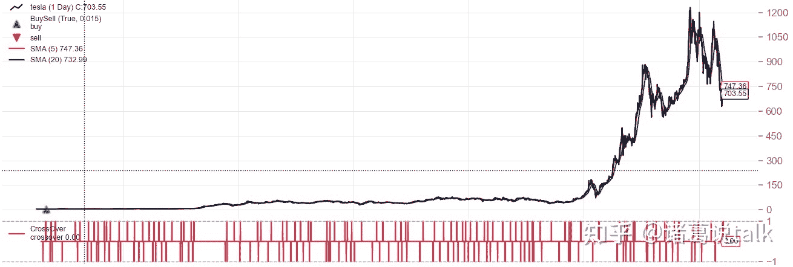

<!--yml
category: 交易
date: 2023-09-17 20:12:13
-->

# 量化框架backtrader之一文读懂Indicator指标 - 知乎

> 来源：[https://zhuanlan.zhihu.com/p/545214807](https://zhuanlan.zhihu.com/p/545214807)

## **简介**

前面系列文章已经介绍了SMA、EMA、MACD、KDJ、RSI、BOLL等技术指标的原理和应用场景，还没看过的，建议关注公众号查看。

Backtrader框架内置了一百多个技术分析指标，封装在backtrader.indicators包中，可以极大减少开发成本，提升策略迭代速度。

## **使用方法**

Indicators指标可以用在2个地方：一个是在策略中使用；另外一个是在其他指标中使用。

backtrader中使用内置指标非常容易，只需：

*   在策略的__init__方法中实例化对应的指标
*   在next方法中使用或检查对应的指标值或其衍生值

下面是SMA简单移动平均指标的使用示例。

```
import backtrader as bt

class MyStrategy(bt.Strategy):
    params = (('period', 20),)

    def __init__(self):
        self.sma = bt.indicators.SMA(self.data, period=self.p.period)
        ...

    def next(self):
       if self.sma[0] > self.data.close[0]:
           self.buy() 
```

需要说明的是：

*   __init__方法中声明的任何指标都会在next方法调用之前进行计算
*   在__init__方法中针对lines对象的任何操作都会生成其他line对象(python操作符重载overriding)， 而在next方法会生成常规的python类型，如floats或bools
*   __init__方法运算速度更快，同时可以使得next方法的逻辑更简单
*   __init__方法不支持部分python操作符，需要使用bt内置函数来处理，如bt.And, bt.Or, bt.All, bt.Any。除了这些，backtrader还提供了bt.Cmp, bt.If, bt.Max, bt.Min, bt.Sum, bt.DivByZero等函数

backtrader支持的原生指标列表可以查看官网：**[https://www.backtrader.com/docu/indautoref/](https://link.zhihu.com/?target=https%3A//www.backtrader.com/docu/indautoref/)**

需要注意的是backtrader还支持指标别名， 如SMA也可以写成MovingAverageSimple或SimpleMovingAverage

```
MovingAverageSimple
Alias:

SMA, SimpleMovingAverage
Non-weighted average of the last n periods

Formula:

movav = Sum(data, period) / period 
```

## **使用TA-Lib**

虽然backtrader自带了很多指标，新增指标也比较容易。但由于TA-lib广泛使用，大家对其都比较信任，backtrader也集成了TA-Lib。

```
import backtrader as bt

class MyStrategy(bt.Strategy):
    params = (('period', 20),)

    def __init__(self):
        self.sma = bt.talib.SMA(self.data, timeperiod=self.p.period)
        ...
... 
```

上面是backtrader中使用talib中的SMA示例，可以看出来使用方法区别不大。

通过 `print(bt.talib.SMA.__doc__)` 可以查看帮助文档。

```
>>> print(bt.talib.SMA.__doc__)
SMA([input_arrays], [timeperiod=30])

Simple Moving Average (Overlap Studies)

Inputs:
    price: (any ndarray)
Parameters:
    timeperiod: 30
Outputs:
    real 
```

backtrader支持的talib指标列表可以查看官网：**[https://www.backtrader.com/docu/talibindautoref/](https://link.zhihu.com/?target=https%3A//www.backtrader.com/docu/talibindautoref/)**

## **自定义指标**

```
# 继承自bt.Indicator或其他已存在的指标类
class DummyInd(bt.Indicator):
    # 定义持有的lines，至少需要1个line
    lines = ('dummyline',)

    # params参数可选
    params = (('value', 5),)

    # plotinfo可选，用来控制绘图行为
    plotinfo = dict(subplot=False)

    # __init__方法或next方法必选
    def __init__(self):
        self.lines.dummyline = bt.Max(0.0, self.params.value) 
```

示例代码中这个指标将输出0.0，或者是self.params.value，取决于self.params.value是否大于0.0。

除了在__init__方法中实现，也可以在next方法中来实现指标计算，如下所示。

```
 def next(self):
        self.lines.dummyline[0] = max(0.0, self.params.value) 
```

除了效率、可读性外，当涉及peroid最小周期时，next方法需要自己处理，__init__方法则不需要特殊处理。因此最好的办法还是在__init__方法中来实现，如果无法实现，才考虑在next方法中来实现。还可以通过*once方法来对runonce 模式进行计算优化。*

## **指标可视化**



如果程序调用了cerebro.plot，那么

*   声明的所有指标会自动绘图
*   操作生成的lines对象不会被绘制，如`close_over_sma = self.data.close > self.sma`
*   如果想要绘制操作生成的lines对象，可以使用`LinePlotterIndicator` 类，name参数是该指标持有的line名字

```
close_over_sma = self.data.close > self.sma
LinePlotterIndicator(close_over_sma, name='Close_over_SMA') 
```

可以通过plotinfo 声明来控制指标的绘图。plotinfo可以是tuple、dict或OrderedDict。

```
class MyIndicator(bt.Indicator):

    ....
    plotinfo = dict(subplot=False)
    ....

# 可以实例化后单独设置
myind = MyIndicator(self.data, someparam=value)
myind.plotinfo.subplot = True

# 也可以实例化时设置
myind = MyIndicator(self.data, someparams=value, subplot=True) 
```

plotinfo的参数列表有：plot(是否绘图，默认为True)，subplot(是否单独窗口绘图，默认为True，MA类指标该参数为False)，plotname(指标图名，默认为指标类名)，plotabove(绘图位置在数据上方，默认为False)，plotlinelabels， plotymargin， plotyticks，plothlines， plotyhlines， plotforce。

## **结论 & 交流**

关注微信公众号：诸葛说talk，获取更多内容。同时还能获取邀请加入量化投资研讨群， 与众多从业者、技术大牛一起交流、切磋，名额有限，不要错过。

写文章不易，觉得本文对你有帮助的话，帮忙点赞转发赞赏，让笔者有坚持写好文章的动力。

## **参考**