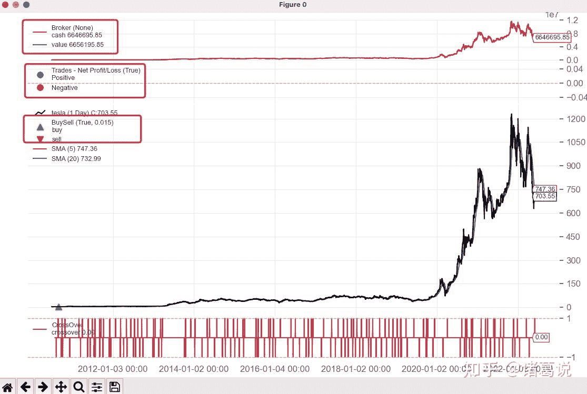

<!--yml
category: 交易
date: 2023-09-17 20:12:31
-->

# 量化框架backtrader之一文读懂observer观测器 - 知乎

> 来源：[https://zhuanlan.zhihu.com/p/533595932](https://zhuanlan.zhihu.com/p/533595932)

## **简介**

Backtrader observer观测器主要用于观察策略运行过程中的各个状态指标，如资金、买卖点等，在调用cerebro.plot()后可以方便地可视化状态指标的变化情况，如下图展示的Broker、Trades和BuySell 3个observer观测器可以用来查看现金和市值、交易盈亏以及买卖点在回测过程中的变化情况。



## **使用方法**

1.  通过cerebro.addobserver() 添加observer观测器

```
import backtrader as bt
# 查看收益序列
cerebro.addobserver(bt.observers.TimeReturn)
# 查看回撤序列
cerebro.addobserver(bt.observers.DrawDown) 
```

*   addobserver(obscls, *args, **kwargs)：参数obscls 对应 observer观测器，*args, **kwargs 对应观测器支持的参数

```
cerebro = bt.Cerebro(stdstats=False)
cerebro.addobserver(bt.observers.Broker)
cerebro.addobserver(bt.observers.Trades)
cerebro.addobserver(bt.observers.BuySell) 
```

*   cerebro会默认添加Broker(Cash & Value)、Trades、BuySell 3个观测器(stdstats=True)，可以在实例化cerebro时，通过 bt.Cerebro(stdstats=False) 来控制不默认展示

1.  observers观测器执行时间： observers观测器是在所有指标以及策略的next 方法运行后才运行并统计数据的，因此在策略next方法里面读到的observer最新数据 [0] 相对于next 的当前时刻是晚一个bar的
2.  如何读取observer观测器中的数据

*   observers观测器属于lines对象，存储了历史回测数据，可以像行情lines对象一样操作。可以通过策略属性self.stats来访问observers观测器

```
class MyStrategy(bt.Strategy):
    def next(self):
        # 当前时点的前一天的可用现金
        self.stats.broker.cash[0]
        self.stats.broker.value[0]
        # 获取当前时刻前一天的收益
        self.stats.timereturn.line[0] 
```

1.  如何保存observer观测器中的数据

backtrader目前没有直接保存observer观测器数据到文件的机制，需要我们自己来实现。backtrader推荐的实现方法是：

*   在策略的start方法中打开文件
*   在策略的next、stop方法中写入对应的值

以DrawDown观察者模式为例，示例代码如下：

```
class MyStrategy(bt.Strategy):

    def start(self):

        self.mystats = open('mystats.csv', 'wb')
        self.mystats.write('datetime,drawdown, maxdrawdown\n')

    def next(self):
        self.mystats.write(self.data.datetime.date(-1).strftime('%Y-%m-%d'))
        self.mystats.write(',%.2f' % self.stats.drawdown.drawdown[0])
        self.mystats.write(',%.2f' % self.stats.drawdown.maxdrawdown[0])
        self.mystats.write('\n')

    def stop(self):
        self.mystats.write(self.data.datetime.date(0).strftime('%Y-%m-%d'))
        self.mystats.write(',%.2f' % self.stats.drawdown.drawdown[0])
        self.mystats.write(',%.2f' % self.stats.drawdown.maxdrawdown[0])
        self.mystats.write('\n') 
```

## **backtrader自带的observer观测器**

自带的observers观测器有：

*   **Benchmark：**记录了业绩基准的收益序列，业绩基准的数据必须事先通过 adddata、resampledata、replaydata等添加函数添加进cerebro，可视化时会同时绘制策略本身的收益序列和业绩基准的收益曲线
*   **Broker、Cash、Value：** Broker观测器记录了经纪商 broker 中各时间点的可用资金和总资产，可视化时会同时展示 cash 和 values 曲线；如果想各自单独展示 cash 和 values，可以分别调用 backtrader.observers.Cash和backtrader.observers.Value
*   **BuySell：**记录了回测过程中的买入和卖出信号，可视化时会在价格曲线上标注买卖点
*   **DrawDown：**记录了回测过程的回撤序列，可视化时绘制回撤曲线
*   **TimeReturn：** 记录了回测过程中的收益序列，可视化时会绘制 TimeReturn 收益曲线
*   **Trades：** 记录了回测过程中每次交易的盈亏，可视化时会绘制盈亏点
*   **LogReturns：**记录了策略的log回报
*   **LogReturns2：**扩展了LogReturns支持2个数据，data0和data1
*   **FundValue：**记录了回测过程中的fund值
*   **FundShares：**记录了回测过程中的fund份额

其中，常用的observers观测器有：Broker、BuySell、Trades、TimeReturn、DrawDown、Benchmark等。

## **新建observers观测器**

Broker观测器有2个lines对象：cash、value。其实现类似如下：

```
class Broker(Observer):
    alias = ('CashValue',)
    lines = ('cash', 'value')

    plotinfo = dict(plot=True, subplot=True)

    def next(self):
        self.lines.cash[0] = self._owner.broker.getcash()
        self.lines.value[0] = value = self._owner.broker.getvalue() 
```

可以看出，自定义observer观测器步骤如下：

*   自定义 observer观测器继承自bt.observer.Observer；也可以继承自已有其他的观测器
*   声明需要的lines和参数，参数可选。在next方法中存入对应的数据
*   声明plotinfo、plotlines属性，用于cerebro.plot() 可视化展示
*   存在一个自动属性_owner表示持有该observer的策略

进一步，我们可以自定义OrderObserver(参考官网)： 标准的BuySell观测器只关心已经执行的操作，我们可以创建一个observer观测器查看订单创建和过期情况，如下所示。

```
class OrderObserver(bt.observer.Observer):
    lines = ('created', 'expired',)

    plotinfo = dict(plot=True, subplot=True, plotlinelabels=True)

    plotlines = dict(
        created=dict(marker='*', markersize=8.0, color='lime', fillstyle='full'),
        expired=dict(marker='s', markersize=8.0, color='red', fillstyle='full')
    )

    def next(self):
        for order in self._owner._orderspending:
            if order.data is not self.data:
                continue

            if not order.isbuy():
                continue

            # Only interested in "buy" orders, because the sell orders
            # in the strategy are Market orders and will be immediately
            # executed

            if order.status in [bt.Order.Accepted, bt.Order.Submitted]:
                self.lines.created[0] = order.created.price

            elif order.status in [bt.Order.Expired]:
                self.lines.expired[0] = order.created.price 
```

当然，我们也可以从已有其他的观测器继承，参考代码：

```
class MyBuySell(bt.observers.BuySell):
    # 将barplot默认值改为True
    params = (('barplot', True), ('bardist', 0.015))
    # 将三角形改为箭头
    plotlines = dict(
        buy=dict(marker=r'$\Uparrow$', markersize=8.0, color='#d62728' ),
        sell=dict(marker=r'$\Downarrow$', markersize=8.0, color='red')
    ) 
```

## **结论 & 交流**

关注微信公众号：诸葛说talk，获取更多内容。同时还能获取邀请加入投资交流群、量化投资研讨群， 与众多投资爱好者、量化从业者、技术大牛一起交流、切磋，快速提升自己的投资水平。

写文章不易，觉得本文对你有帮助的话，帮忙点个在看吧。

## **参考**